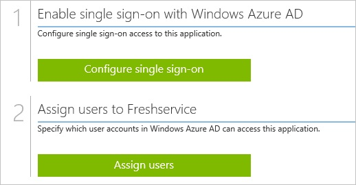
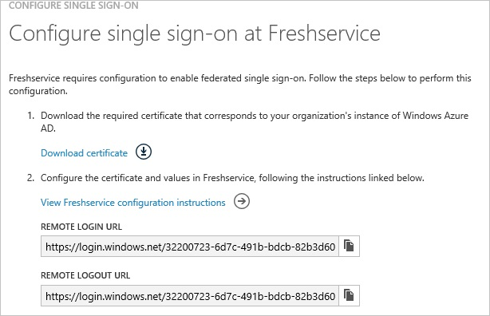
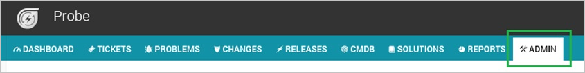
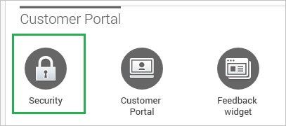
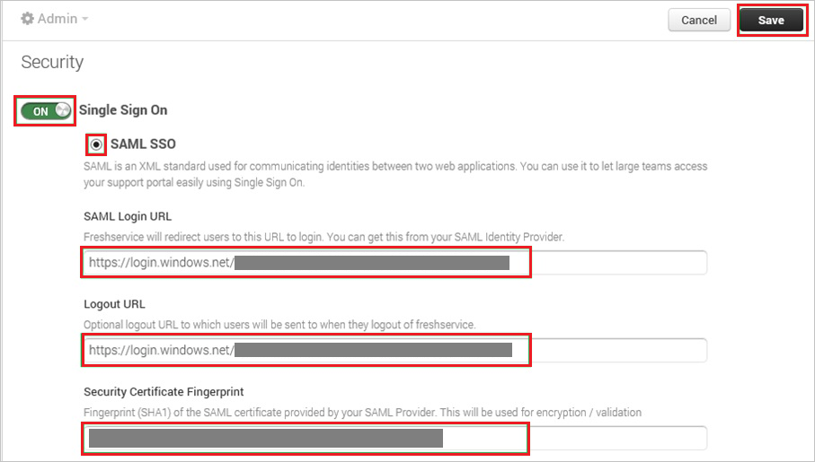
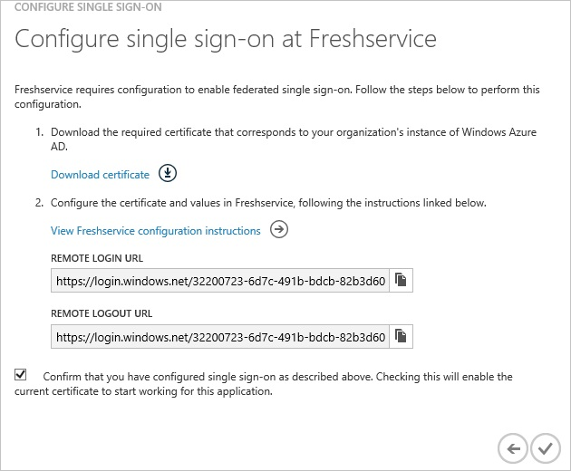
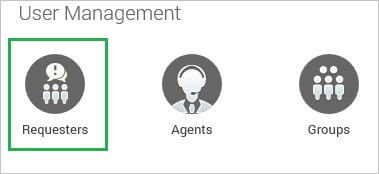
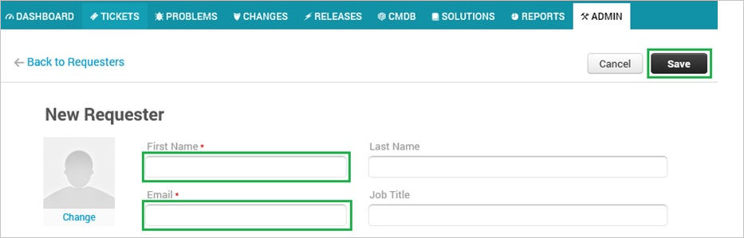
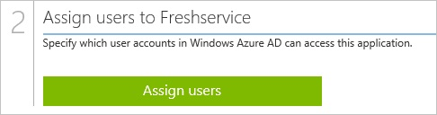

<properties 
    pageTitle="Tutorial: Azure Active Directory integration with FreshService | Microsoft Azure" 
    description="Learn how to use FreshService with Azure Active Directory to enable single sign-on, automated provisioning, and more!" 
    services="active-directory" 
    authors="jeevansd"  
    documentationCenter="na" 
    manager="femila"/>
<tags 
    ms.service="active-directory" 
    ms.devlang="na" 
    ms.topic="article" 
    ms.tgt_pltfrm="na" 
    ms.workload="identity" 
    ms.date="07/09/2016" 
    ms.author="jeedes" />

#Tutorial: Azure Active Directory integration with FreshService
  
The objective of this tutorial is to show the integration of Azure and FreshService.  
The scenario outlined in this tutorial assumes that you already have the following items:

-   A valid Azure subscription
-   A FreshService single sign-on enabled subscription
  
After completing this tutorial, the Azure AD users you have assigned to FreshService will be able to single sign into the application using the [Introduction to the Access Panel](active-directory-saas-access-panel-introduction.md).
  
The scenario outlined in this tutorial consists of the following building blocks:

1.  Enabling the application integration for FreshService
2.  Configuring single sign-on
3.  Configuring user provisioning
4.  Assigning users

##Enabling the application integration for FreshService
  
The objective of this section is to outline how to enable the application integration for FreshService.

###To enable the application integration for FreshService, perform the following steps:

1.  In the Azure classic portal, on the left navigation pane, click **Active Directory**.

    

2.  From the **Directory** list, select the directory for which you want to enable directory integration.

3.  To open the applications view, in the directory view, click **Applications** in the top menu.

    

4.  Click **Add** at the bottom of the page.

    

5.  On the **What do you want to do** dialog, click **Add an application from the gallery**.

    

6.  In the **search box**, type **FreshService**.

    

7.  In the results pane, select **FreshService**, and then click **Complete** to add the application.

    
##Configuring single sign-on
  
The objective of this section is to outline how to enable users to authenticate to FreshService with their account in Azure AD using federation based on the SAML protocol.  
Configuring single sign-on for FreshService requires you to retrieve a thumbprint value from a certificate.  
If you are not familiar with this procedure, see [How to retrieve a certificate's thumbprint value](http://youtu.be/YKQF266SAxI).

###To configure single sign-on, perform the following steps:

1.  In the Azure classic portal, on the **FreshService** application integration page, click **Configure single sign-on** to open the **Configure Single Sign On ** dialog.

    

2.  On the **How would you like users to sign on to FreshService** page, select **Microsoft Azure AD Single Sign-On**, and then click **Next**.

    

3.  On the **Configure App URL** page, in the **FreshService Sign On URL** textbox, type your URL used by your users to sign on to your Freshdesk application (e.g.: "*http://democompany.freshservice.com/*"), and then click **Next**.

    

4.  On the **Configure single sign-on at FreshService** page, to download your certificate, click **Download certificate**, and then save the certificate file locally on your computer.

    

5.  In a different web browser window, log into your FreshService company site as an administrator.

6.  In the menu on the top, click **Admin**.

    

7.  In the **Customer Portal**, click **Security**.

    

8.  In the **Security** section, perform the following steps:

    

    1.  Switch **Single Sign OnON**.
    2.  Select **SAML SSO**.
    3.  In the Azure classic portal, on the **Configure single sign-on at FreshService** dialog page, copy the **Remote Login URL** value, and then paste it into the **SAML Login URL** textbox.
    4.  In the Azure classic portal, on the **Configure single sign-on at FreshService** dialog page, copy the **Remote Logout URL** value, and then paste it into the **Logout URL** textbox.
    5.  Copy the **Thumbprint** value from the exported certificate, and then paste it into the **Security Certificate Fingerprint** textbox.
    
        >[AZURE.TIP]For more details, see [How to retrieve a certificate's thumbprint value](http://youtu.be/YKQF266SAxI)

9.  On the Azure classic portal, select the single sign-on configuration confirmation, and then click **Complete** to close the **Configure Single Sign On** dialog.

    
##Configuring user provisioning
  
In order to enable Azure AD users to log into FreshService, they must be provisioned into FreshService.  
In the case of FreshService, provisioning is a manual task.

###To provision a user accounts, perform the following steps:

1.  Log in to your **FreshService** company site as an administrator.

2.  In the menu on the top, click **Admin**.

    

3.  In the **User Management** section, click **Requesters**.

    

4.  Click **New Requester**.

    

5.  In the **New Requester** section, perform the following steps:

    

    1.  Enter the **First Name** and **Email** attributes of a valid Azure Active Directory account you want to provision into the related textboxes.
    2.  Click **Save**.

    >[AZURE.NOTE] The Azure Active Directory account holder will get an email including a link to confirm the account before it becomes active

>[AZURE.NOTE] You can use any other FreshService user account creation tools or APIs provided by FreshService to provision AAD user accounts.

##Assigning users
  
To test your configuration, you need to grant the Azure AD users you want to allow using your application access to it by assigning them.

###To assign users to FreshService, perform the following steps:

1.  In the Azure classic portal, create a test account.

2.  On the **FreshService **application integration page, click **Assign users**.

    

3.  Select your test user, click **Assign**, and then click **Yes** to confirm your assignment.

    
  
If you want to test your single sign-on settings, open the Access Panel. For more details about the Access Panel, see [Introduction to the Access Panel](active-directory-saas-access-panel-introduction.md).