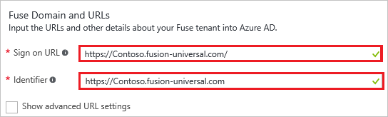
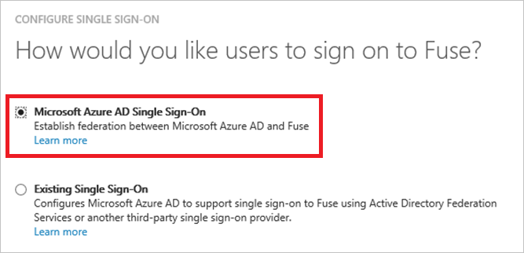
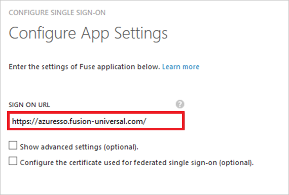
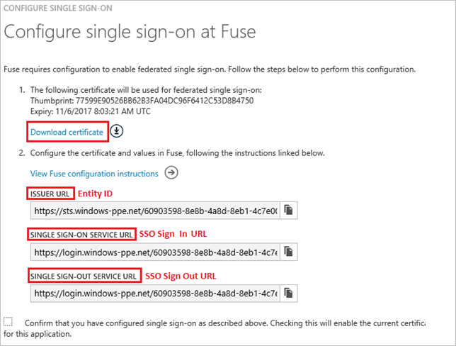
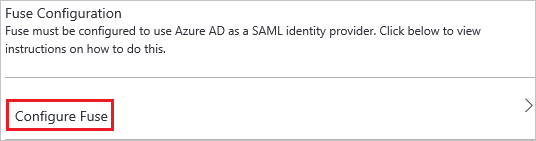
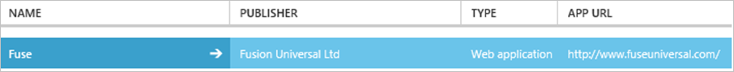

# Tutorial: Azure Active Directory integration with Fuse

In this tutorial, you learn how to integrate Fuse with Azure Active Directory (Azure AD).

Integrating Fuse with Azure AD provides you with the following benefits:

- You can control in Azure AD who has access to Fuse
- You can enable your users to automatically get signed-on to Fuse (Single Sign-On) with their Azure AD accounts
- You can manage your accounts in one central location - the Azure Management portal

If you want to know more details about SaaS app integration with Azure AD, see [What is application access and single sign-on with Azure Active Directory](active-directory-appssoaccess-whatis.md).

## Prerequisites

To configure Azure AD integration with Fuse, you need the following items:

- An Azure AD subscription
- A Fuse single-sign on (SSO) enabled subscription

>[!NOTE]
>To test the steps in this tutorial, we do not recommend using a production environment.
>
>

To test the steps in this tutorial, you should follow these recommendations:

- You should not use your production environment, unless this is necessary.
- If you don't have an Azure AD trial environment, you can get a [one-month trial](https://azure.microsoft.com/pricing/free-trial/).

## Scenario description
In this tutorial, you test Azure AD SSO in a test environment. 
The scenario outlined in this tutorial consists of two main building blocks:

1. Adding Fuse from the gallery
2. Configuring and testing Azure AD SSO

## Add Fuse from the gallery
To configure the integration of Fuse into Azure AD, you need to add Fuse from the gallery to your list of managed SaaS apps.

**To add Fuse from the gallery, perform the following steps:**

1. In the **[Azure Management Portal](https://portal.azure.com)**, on the left navigation panel, click **Azure Active Directory** icon. 

	![Active Directory][1]

2. Navigate to **Enterprise applications**. Then go to **All applications**.

	![Applications][2]
	
3. Click **Add** button on the top of the dialog.

	![Applications][3]

4. In the search box, type **Fuse**.

	

5. In the results panel, select **Fuse**, and then click **Add** button to add the application.

	

##  Configure and test Azure AD single sign-on
In this section, you configure and test Azure AD SSO with Fuse based on a test user called "Britta Simon".

For SSO to work, Azure AD needs to know what the counterpart user in Fuse is to a user in Azure AD. In other words, a link relationship between an Azure AD user and the related user in Fuse needs to be established.

This link relationship is established by assigning the value of the **user name** in Azure AD as the value of the **Username** in Fuse.

To configure and test Azure AD SSO with Fuse, you need to complete the following building blocks:

1. **[Configuring Azure AD single sign-on](#configuring-azure-ad-single-sign-on)** - to enable your users to use this feature.
2. **[Creating an Azure AD test user](#creating-an-azure-ad-test-user)** - to test Azure AD single sign-on with Britta Simon.
3. **[Creating a Fuse test user](#creating-a-fuse-test-user)** - to have a counterpart of Britta Simon in Fuse that is linked to the Azure AD representation of her.
4. **[Assigning the Azure AD test user](#assigning-the-azure-ad-test-user)** - to enable Britta Simon to use Azure AD single sign-on.
5. **[Testing single sign-on](#testing-single-sign-on)** - to verify whether the configuration works.

### Configure Azure AD single sign-on

In this section, you enable Azure AD SSO in the Azure Management portal and configure SSO in your Fuse application.

**To configure Azure AD SSO with Fuse, perform the following steps:**

1. In the Azure Management portal, on the **Fuse** application integration page, click **Single sign-on**.

	![Configure Single Sign-On][4]

2. On the **Single sign-on** dialog, as **Mode** select **SAML-based Sign-on** to enable single sign on.
 
	

3. On the **Fuse Domain and URLs** section, perform the following steps:

	
  1. In the **Sign On URL** textbox, type a URL using the following pattern: `https://<tenant name>.fusion-universal.com/`
  2. In the **Identifier** textbox, type a URL using the following pattern: `https://<tenant name>.fusion-universal.com`

      >[!NOTE] 
      >These are not the real values. You have to update these values with the actual Sign On URL and Identifier. Contact [Fuse support team](mailto:support@fusion-universal.com) to get these values. 
      >
      >

4. On the **SAML Signing Certificate** section, click **Create new certificate**.

	 	

5. On the **Create New Certificate** dialog, click the calendar icon and select an **expiry date**. Then click **Save** button.

	

6. On the **SAML Signing Certificate** section, select **Make new certificate active** and click **Save** button.

	

7. On the pop-up **Rollover certificate** window, click **OK**.

	

8. On the **SAML Signing Certificate** section, click **Certificate (Raw)** and then save the certificate file on your computer.

	 

9. On the **Fuse Configuration** section, click **Configure Fuse** to open **Configure sign-on** window.

	 

	

10. To get SSO configured for your application, contact [Fuse support team](mailto:support@fusion-universal.com) and provide them with the following: 

	•  The downloaded **Certificate file**
	•  The **SAML Single Sign-On Service URL**
	•  The **SAML Entity ID**
	•  The **Sign-Out URL**
  
### Create an Azure AD test user
The objective of this section is to create a test user in the Azure Management portal called Britta Simon.

![Create Azure AD User][100]

**To create a test user in Azure AD, perform the following steps:**

1. In the **Azure Management portal**, on the left navigation pane, click **Azure Active Directory** icon.

	 

2. Go to **Users and groups** and click **All users** to display the list of users.
	
	 

3. At the top of the dialog click **Add** to open the **User** dialog.
 
	 

4. On the **User** dialog page, perform the following steps:
 
	 
  1. In the **Name** textbox, type **BrittaSimon**.
  2. In the **User name** textbox, type the **email address** of BrittaSimon.
  3. Select **Show Password** and write down the value of the **Password**.
  4. Click **Create**. 

### Create a Fuse test user

In this section, you create a user called Britta Simon in Fuse. Please work with [Fuse support team](mailto:support@fusion-universal.com) to add the users in the Fuse platform.

### Assign the Azure AD test user

In this section, you enable Britta Simon to use Azure single sign-on by granting her access to Fuse.

![Assign User][200] 

**To assign Britta Simon to Fuse, perform the following steps:**

1. In the Azure Management portal, open the applications view, and then navigate to the directory view and go to **Enterprise applications** then click **All applications**.

	![Assign User][201] 

2. In the applications list, select **Fuse**.

	 

3. In the menu on the left, click **Users and groups**.

	![Assign User][202] 

4. Click **Add** button. Then select **Users and groups** on **Add Assignment** dialog.

	![Assign User][203]

5. On **Users and groups** dialog, select **Britta Simon** in the Users list.

6. Click **Select** button on **Users and groups** dialog.

7. Click **Assign** button on **Add Assignment** dialog.
	
### Test single sign-on

In this section, you test your Azure AD SSO configuration using the Access Panel.

When you click the Fuse tile in the Access Panel, you should get automatically signed-on to your Fuse application.

## Additional resources

* [List of Tutorials on How to Integrate SaaS Apps with Azure Active Directory](active-directory-saas-tutorial-list.md)
* [What is application access and single sign-on with Azure Active Directory?](active-directory-appssoaccess-whatis.md)

<!--Image references-->

[1]: ./media/active-directory-saas-fuse-tutorial/tutorial_general_01.png
[2]: ./media/active-directory-saas-fuse-tutorial/tutorial_general_02.png
[3]: ./media/active-directory-saas-fuse-tutorial/tutorial_general_03.png
[4]: ./media/active-directory-saas-fuse-tutorial/tutorial_general_04.png

[100]: ./media/active-directory-saas-fuse-tutorial/tutorial_general_100.png

[200]: ./media/active-directory-saas-fuse-tutorial/tutorial_general_200.png
[201]: ./media/active-directory-saas-fuse-tutorial/tutorial_general_201.png
[202]: ./media/active-directory-saas-fuse-tutorial/tutorial_general_202.png
[203]: ./media/active-directory-saas-fuse-tutorial/tutorial_general_203.png
