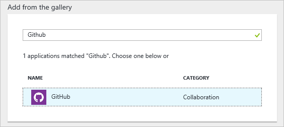
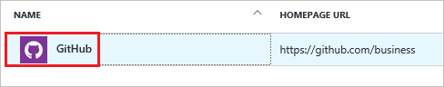
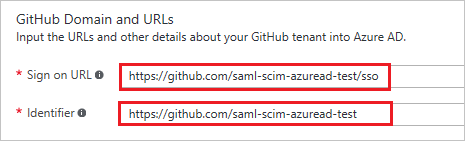
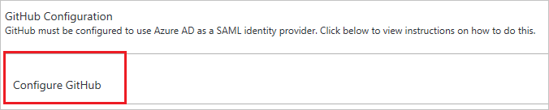
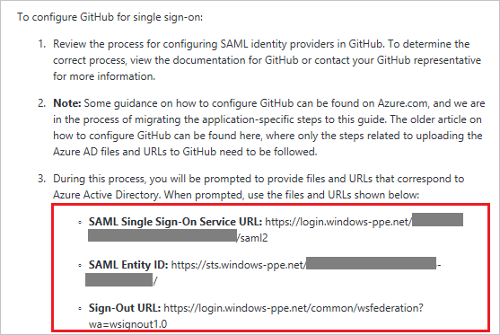
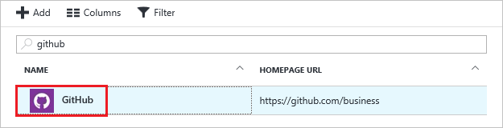
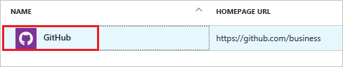

# Tutorial: Azure Active Directory integration with Github

In this tutorial, you learn how to integrate Github with Azure Active Directory (Azure AD).

Integrating Github with Azure AD provides you with the following benefits:

- You can control in Azure AD who has access to Github
- You can enable your users to automatically get signed-on to Github (Single Sign-On) with their Azure AD accounts
- You can manage your accounts in one central location - the Azure Management portal

If you want to know more details about SaaS app integration with Azure AD, see [What is application access and single sign-on with Azure Active Directory](active-directory-appssoaccess-whatis.md).

## Prerequisites

To configure Azure AD integration with Github, you need the following items:

- An Azure AD subscription
- A Github single-sign on enabled subscription

> [!NOTE]
> To test the steps in this tutorial, we do not recommend using a production environment.

To test the steps in this tutorial, you should follow these recommendations:

- You should not use your production environment, unless this is necessary.
- If you don't have an Azure AD trial environment, you can get an one-month trial [here](https://azure.microsoft.com/pricing/free-trial/).

## Scenario description
In this tutorial, you test Azure AD single sign-on in a test environment. 
The scenario outlined in this tutorial consists of two main building blocks:

1. Adding Github from the gallery
2. Configuring and testing Azure AD single sign-on

## Adding Github from the gallery
To configure the integration of Github into Azure AD, you need to add Github from the gallery to your list of managed SaaS apps.

**To add Github from the gallery, perform the following steps:**

1. In the **[Azure Management Portal](https://portal.azure.com)**, on the left navigation panel, click **Azure Active Directory** icon. 

	![Active Directory][1]

2. Navigate to **Enterprise applications**. Then go to **All applications**.

	![Applications][2]
	
3. Click **Add** button on the top of the dialog.

	![Applications][3]

4. In the search box, type **Github**.

	

5. In the results panel, select **Github**, and then click **Add** button to add the application.

	

##  Configuring and testing Azure AD single sign-on
In this section, you configure and test Azure AD single sign-on with Github based on a test user called "Britta Simon".

For single sign-on to work, Azure AD needs to know what the counterpart user in Github is to a user in Azure AD. In other words, a link relationship between an Azure AD user and the related user in Github needs to be established.

This link relationship is established by assigning the value of the **user name** in Azure AD as the value of the **Username** in Github.

To configure and test Azure AD single sign-on with Github, you need to complete the following building blocks:

1. **[Configuring Azure AD Single Sign-On](#configuring-azure-ad-single-sign-on)** - to enable your users to use this feature.
2. **[Creating an Azure AD test user](#creating-an-azure-ad-test-user)** - to test Azure AD single sign-on with Britta Simon.
3. **[Creating a Github test user](#creating-a-Github-test-user)** - to have a counterpart of Britta Simon in Github that is linked to the Azure AD representation of her.
4. **[Assigning the Azure AD test user](#assigning-the-azure-ad-test-user)** - to enable Britta Simon to use Azure AD single sign-on.
5. **[Testing Single Sign-On](#testing-single-sign-on)** - to verify whether the configuration works.

### Configuring Azure AD single sign-on

In this section, you enable Azure AD single sign-on in the Azure Management portal and configure single sign-on in your Github application.

**To configure Azure AD single sign-on with Github, perform the following steps:**

1. In the Azure Management portal, on the **Github** application integration page, click **Single sign-on**.

	![Configure Single Sign-On][4]

2. On the **Single sign-on** dialog, as **Mode** select **SAML-based Sign-on** to enable single sign on.
 
	

3. On the **Github Domain and URLs** section, perform the following steps:

	

    a. In the **Identifier** textbox, type the value as: `https://github.com/<entity-id>`

	b. In the **Reply URL** textbox, type a URL using the following pattern: `https://github.com/<entity-id>/saml/consume`

	> [!NOTE] 
	> Please note that these are not the real values. You have to update these values with the actual Identifier and Reply URL. Here we suggest you to use the unique value of string in the Identifier. Contact [Github support team](https://success.Github.com/hc/en-us/requests/new) to get these values. 

4. On the **SAML Signing Certificate** section, click **Create new certificate**.

	 	

5. On the **Create New Certificate** dialog, click the calendar icon and select an **expiry date**. Then click **Save** button.

	

6. On the **SAML Signing Certificate** section, select **Make new certificate active** and click **Save** button.

	

7. On the pop-up **Rollover certificate** window, click **OK**.

	

8. On the **SAML Signing Certificate** section, click **Certificate (Base64)** and then save the certificate file on your computer.

	 

9. On the **Github Configuration** section, click **Configure Github** to open **Configure sign-on** window.

	 

	

<!--10. In a different web browser window, log into your Github company site as an administrator.

11. Click your user name, and then click **Settings**.

	

12. Click the **Global Settings** tab, and then, next to **Federated Authentication**, click **edit**.

	

13. On the **Federated Authentication** dialog, perform the following steps:

	

	a. Select **Enable Federated Authentication**.

	b. Click **Upload** to upload your downloaded certificate.

	c. In the **Sign-in URL** textbox, put the value of **SAML Single Sign-On Service URL** from Azure AD application configuration window.

	d. In the **Sign-out URL** textbox, put the value of **Sign-Out URL** from Azure AD application configuration window.

	e. Select **Use POST**.

	f. Click **Save**.-->

  

### Creating an Azure AD test user
The objective of this section is to create a test user in the Azure Management portal called Britta Simon.

![Create Azure AD User][100]

**To create a test user in Azure AD, perform the following steps:**

1. In the **Azure Management portal**, on the left navigation pane, click **Azure Active Directory** icon.

	 

2. Go to **Users and groups** and click **All users** to display the list of users.
	
	 

3. At the top of the dialog click **Add** to open the **User** dialog.
 
	 

4. On the **User** dialog page, perform the following steps:
 
	 

    a. In the **Name** textbox, type **BrittaSimon**.

    b. In the **User name** textbox, type the **email address** of BrittaSimon.

	c. Select **Show Password** and write down the value of the **Password**.

    d. Click **Create**. 

<!--### Creating a Github test user

In order to enable Azure AD users to log into Github, they must be provisioned into Github.  
In the case of Github, provisioning is a manual task.

### To provision a user accounts, perform the following steps:

1. Log in to your Github company site as an administrator.

2. Click **People**.

    

3. Click **Invite User**.

	

4. On the **Invite People** dialog page, perform the following steps:

	

	a. In the **Email** textbox, type the email address of Britta Simon account.
	
    b. Click **Invite**.

	> [!NOTE]
    > The Azure Active Directory account holder will receive an email and follow a link to confirm their account before it becomes active.

### Assigning the Azure AD test user

In this section, you enable Britta Simon to use Azure single sign-on by granting her access to Github.

![Assign User][200] 

**To assign Britta Simon to Github, perform the following steps:**

1. In the Azure Management portal, open the applications view, and then navigate to the directory view and go to **Enterprise applications** then click **All applications**.

	![Assign User][201] 

2. In the applications list, select **Github**.

	 

3. In the menu on the left, click **Users and groups**.

	![Assign User][202] 

4. Click **Add** button. Then select **Users and groups** on **Add Assignment** dialog.

	![Assign User][203]

5. On **Users and groups** dialog, select **Britta Simon** in the Users list.

6. Click **Select** button on **Users and groups** dialog.

7. Click **Assign** button on **Add Assignment** dialog.
	

### Testing single sign-on

In this section, you test your Azure AD single sign-on configuration using the Access Panel.

When you click the Github tile in the Access Panel, you should get automatically signed-on to your Github application.

## Additional resources

* [List of Tutorials on How to Integrate SaaS Apps with Azure Active Directory](active-directory-saas-tutorial-list.md)
* [What is application access and single sign-on with Azure Active Directory?](active-directory-appssoaccess-whatis.md)

<!--Image references-->

[1]: ./media/active-directory-saas-github-tutorial/tutorial_general_01.png
[2]: ./media/active-directory-saas-github-tutorial/tutorial_general_02.png
[3]: ./media/active-directory-saas-github-tutorial/tutorial_general_03.png
[4]: ./media/active-directory-saas-github-tutorial/tutorial_general_04.png

[100]: ./media/active-directory-saas-github-tutorial/tutorial_general_100.png

[200]: ./media/active-directory-saas-github-tutorial/tutorial_general_200.png
[201]: ./media/active-directory-saas-github-tutorial/tutorial_general_201.png
[202]: ./media/active-directory-saas-github-tutorial/tutorial_general_202.png
[203]: ./media/active-directory-saas-github-tutorial/tutorial_general_203.png