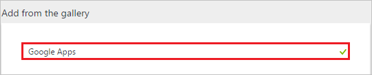
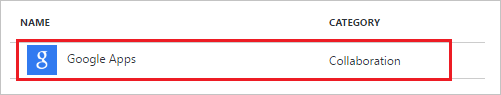
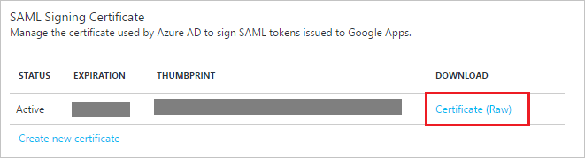
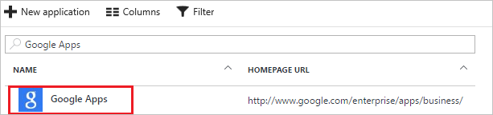

# Tutorial: Azure Active Directory integration with Google Apps

In this tutorial, you learn how to integrate Google Apps with Azure Active Directory (Azure AD).

Integrating Google Apps with Azure AD provides you with the following benefits:

- You can control in Azure AD who has access to Google Apps
- You can enable your users to automatically get signed-on to Google Apps (Single Sign-On) with their Azure AD accounts
- You can manage your accounts in one central location - the Azure portal

If you want to know more information about SaaS app integration with Azure AD, see [what is application access and single sign-on with Azure Active Directory](active-directory-appssoaccess-whatis.md).

## Prerequisites

To configure Azure AD integration with Google Apps, you need the following items:

- An Azure AD subscription
- A Google Apps single sign-on enabled subscription

> [!NOTE]
> To test the steps in this tutorial, we do not recommend using a production environment.

To test the steps in this tutorial, you should follow these recommendations:

- Do not use your production environment, unless it is necessary.
- If you don't have an Azure AD trial environment, you can get a one-month trial here: [Trial offer](https://azure.microsoft.com/pricing/free-trial/).

## Video tutorial
How to Enable Single Sign-On to Google Apps in 2 Minutes:

> [!VIDEO https://channel9.msdn.com/Series/Azure-Active-Directory-Videos-Demos/Enable-single-sign-on-to-Google-Apps-in-2-minutes-with-Azure-AD/player]

## Frequently Asked Questions
1. **Q: Are Chromebooks and other Chrome devices compatible with Azure AD single sign-on?**
   
    A: Yes, users are able to sign into their Chromebook devices using their Azure AD credentials. See this [Google Apps support article](https://support.google.com/chrome/a/answer/6060880) for information on why users may get prompted for credentials twice.

2. **Q: If I enable single sign-on, will users be able to use their Azure AD credentials to sign into any Google product, such as Google Classroom, GMail, Google Drive, YouTube, and so on?**
   
    A: Yes, depending on [which Google apps](https://support.google.com/a/answer/182442?hl=en&ref_topic=1227583) you choose to enable or disable for your organization.

3. **Q: Can I enable single sign-on for only a subset of my Google Apps users?**
   
    A: No, turning on single sign-on immediately requires all your Google Apps users to authenticate with their Azure AD credentials. Because Google Apps doesn't support having multiple identity providers, the identity provider for your Google Apps environment can either be Azure AD or Google -- but not both at the same time.

4. **Q: If a user is signed in through Windows, are they automatically authenticate to Google Apps without getting prompted for a password?**
   
    A: There are two options for enabling this scenario. First, users could sign into Windows 10 devices via [Azure Active Directory Join](active-directory-azureadjoin-overview.md). Alternatively, users could sign into Windows devices that are domain-joined to an on-premises Active Directory that has been enabled for single sign-on to Azure AD via an [Active Directory Federation Services (AD FS)](active-directory-aadconnect-user-signin.md) deployment. Both options require you to perform the steps in the following tutorial to enable single sign-on between Azure AD and Google Apps.

## Scenario description
In this tutorial, you test Azure AD single sign-on in a test environment. 
The scenario outlined in this tutorial consists of two main building blocks:

1. Adding Google Apps from the gallery
2. Configuring and testing Azure AD single sign-on

## Adding Google Apps from the gallery
To configure the integration of Google Apps into Azure AD, you need to add Google Apps from the gallery to your list of managed SaaS apps.

**To add Google Apps from the gallery, perform the following steps:**

1. In the **[Azure portal](https://portal.azure.com)**, on the left navigation panel, click **Azure Active Directory** icon. 

	![Active Directory][1]

2. Navigate to **Enterprise applications**. Then go to **All applications**.

	![Applications][2]
	
3. To add new application, click **New application** button on the top of dialog.

	![Applications][3]

4. In the search box, type **Google Apps**.

	

5. In the results panel, select **Google Apps**, and then click **Add** button to add the application.

	

##  Configuring and testing Azure AD single sign-on
In this section, you configure and test Azure AD single sign-on with Google Apps based on a test user called "Britta Simon."

For single sign-on to work, Azure AD needs to know what the counterpart user in Google Apps is to a user in Azure AD. In other words, a link relationship between an Azure AD user and the related user in Google Apps needs to be established.

This link relationship is established by assigning the value of the **user name** in Azure AD as the value of the **Username** in Google Apps.

To configure and test Azure AD single sign-on with Google Apps, you need to complete the following building blocks:

1. **[Configuring Azure AD Single Sign-On](#configuring-azure-ad-single-sign-on)** - to enable your users to use this feature.
2. **[Creating an Azure AD test user](#creating-an-azure-ad-test-user)** - to test Azure AD single sign-on with Britta Simon.
3. **[Creating a Google Apps test user](#creating-a-google-apps-test-user)** - to have a counterpart of Britta Simon in Google Apps that is linked to the Azure AD representation of user.
4. **[Assigning the Azure AD test user](#assigning-the-azure-ad-test-user)** - to enable Britta Simon to use Azure AD single sign-on.
5. **[Testing Single Sign-On](#testing-single-sign-on)** - to verify whether the configuration works.

### Configuring Azure AD single sign-on

In this section, you enable Azure AD single sign-on in the Azure portal and configure single sign-on in your Google Apps application.

**To configure Azure AD single sign-on with Google Apps, perform the following steps:**

1. In the Azure portal, on the **Google Apps** application integration page, click **Single sign-on**.

	![Configure Single Sign-On][4]

2. On the **Single sign-on** dialog, select **Mode** as	**SAML-based Sign-on** to enable single sign-on.
 
	

3. On the **Google Apps Domain and URLs** section, perform the following steps:

	

    In the **Sign-on URL** textbox, type a URL using the following pattern: `https://mail.google.com/a/<yourdomain>`

    > [!NOTE] 
	> This value is not real. Update the value with the actual Sign-on URL. contact the [Google support team](https://www.google.com/contact/).
 
4. On the **SAML Signing Certificate** section, click **Certificate** and then save the certificate on your computer.

	 

5. Click **Save** button.

	

6. On the **Google Apps Configuration** section, click **Configure Google Apps** to open **Configure sign-on** window. Copy the **Sign-Out URL, SAML Single Sign-On Service URL and Change password URL** from the **Quick Reference section.**

	 

7. Open a new tab in your browser, and sign into the [Google Apps Admin Console](http://admin.google.com/) using your administrator account.

8. Click **Security**. If you don't see the link, it may be hidden under the **More Controls** menu at the bottom of the screen.
   
    ![Click Security.][10]

9. On the **Security** page, click **Set up single sign-on (SSO).**
   
    ![Click SSO.][11]

10. Perform the following configuration changes:
   
    ![Configure SSO][12]
   
    a. Select **Setup SSO with third-party identity provider**.

    b. In the **Sign-in page URL** field in Google Apps, paste the value of **Single Sign-On Service URL**, which you have copied from Azure portal.

    c. In the **Sign-out page URL** field in Google Apps, paste the value of **Sign-Out URL**, which you have copied from Azure portal. 

    d. In the **Change password URL** field in Google Apps, paste the value of **Change password URL**, which you have copied from Azure portal. 

    e. In Google Apps, for the **Verification certificate**, upload the certificate that you have downloaded from Azure portal.

    f. Click **Save Changes**.

> [!TIP]
> You can now read a concise version of these instructions inside the [Azure portal](https://portal.azure.com), while you are setting up the app!  After adding this app from the **Active Directory > Enterprise Applications** section, simply click the **Single Sign-On** tab and access the embedded documentation through the **Configuration** section at the bottom. You can read more about the embedded documentation feature here: [Azure AD embedded documentation]( https://go.microsoft.com/fwlink/?linkid=845985)
 
### Creating an Azure AD test user
The objective of this section is to create a test user in the Azure portal called Britta Simon.

![Create Azure AD User][100]

**To create a test user in Azure AD, perform the following steps:**

1. In the **Azure portal**, on the left navigation pane, click **Azure Active Directory** icon.

	 

2. To display the list of users, go to **Users and groups** and click **All users**.
	
	 

3. To open the **User** dialog, click **Add** on the top of the dialog.
 
	 

4. On the **User** dialog page, perform the following steps:
 
	 

    a. In the **Name** textbox, type **BrittaSimon**.

    b. In the **User name** textbox, type the **email address** of BrittaSimon.

	c. Select **Show Password** and write down the value of the **Password**.

    d. Click **Create**.
 
### Creating a Google Apps test user

The objective of this section is to create a user called Britta Simon in Google Apps Software. Google Apps supports auto provisioning, which is by default enabled. There is no action for you in this section. If a user doesn't already exist in Google Apps Software, a new one is created when you attempt to access Google Apps Software.

>[!NOTE] 
>If you need to create a user manually, contact the [Google support team](https://www.google.com/contact/).

### Assigning the Azure AD test user

In this section, you enable Britta Simon to use Azure single sign-on by granting access to Google Apps.

![Assign User][200] 

**To assign Britta Simon to Google Apps, perform the following steps:**

1. In the Azure portal, open the applications view, and then navigate to the directory view and go to **Enterprise applications** then click **All applications**.

	![Assign User][201] 

2. In the applications list, select **Google Apps**.

	 

3. In the menu on the left, click **Users and groups**.

	![Assign User][202] 

4. Click **Add** button. Then select **Users and groups** on **Add Assignment** dialog.

	![Assign User][203]

5. On **Users and groups** dialog, select **Britta Simon** in the Users list.

6. Click **Select** button on **Users and groups** dialog.

7. Click **Assign** button on **Add Assignment** dialog.
	
### Testing single sign-on

In this section, to test your single sign-on settings, open the Access Panel at [https://myapps.microsoft.com](active-directory-saas-access-panel-introduction.md), then sign into the test account, and click **Google Apps** tile in the Access Panel.

## Additional resources

* [List of Tutorials on How to Integrate SaaS Apps with Azure Active Directory](active-directory-saas-tutorial-list.md)
* [What is application access and single sign-on with Azure Active Directory?](active-directory-appssoaccess-whatis.md)
* [Configure User Provisioning](active-directory-saas-google-apps-provisioning-tutorial.md)

<!--Image references-->

[1]: ./media/active-directory-saas-google-apps-tutorial/tutorial_general_01.png
[2]: ./media/active-directory-saas-google-apps-tutorial/tutorial_general_02.png
[3]: ./media/active-directory-saas-google-apps-tutorial/tutorial_general_03.png
[4]: ./media/active-directory-saas-google-apps-tutorial/tutorial_general_04.png

[100]: ./media/active-directory-saas-google-apps-tutorial/tutorial_general_100.png

[200]: ./media/active-directory-saas-google-apps-tutorial/tutorial_general_200.png
[201]: ./media/active-directory-saas-google-apps-tutorial/tutorial_general_201.png
[202]: ./media/active-directory-saas-google-apps-tutorial/tutorial_general_202.png
[203]: ./media/active-directory-saas-google-apps-tutorial/tutorial_general_203.png

[0]: ./media/active-directory-saas-google-apps-tutorial/azure-active-directory.png

[5]: ./media/active-directory-saas-google-apps-tutorial/gapps-added.png
[6]: ./media/active-directory-saas-google-apps-tutorial/config-sso.png
[7]: ./media/active-directory-saas-google-apps-tutorial/sso-gapps.png
[8]: ./media/active-directory-saas-google-apps-tutorial/sso-url.png
[9]: ./media/active-directory-saas-google-apps-tutorial/download-cert.png
[10]: ./media/active-directory-saas-google-apps-tutorial/gapps-security.png
[11]: ./media/active-directory-saas-google-apps-tutorial/security-gapps.png
[12]: ./media/active-directory-saas-google-apps-tutorial/gapps-sso-config.png
[13]: ./media/active-directory-saas-google-apps-tutorial/gapps-sso-confirm.png
[14]: ./media/active-directory-saas-google-apps-tutorial/gapps-sso-email.png
[15]: ./media/active-directory-saas-google-apps-tutorial/gapps-api.png
[16]: ./media/active-directory-saas-google-apps-tutorial/gapps-api-enabled.png
[17]: ./media/active-directory-saas-google-apps-tutorial/add-custom-domain.png
[18]: ./media/active-directory-saas-google-apps-tutorial/specify-domain.png
[19]: ./media/active-directory-saas-google-apps-tutorial/verify-domain.png
[20]: ./media/active-directory-saas-google-apps-tutorial/gapps-domains.png
[21]: ./media/active-directory-saas-google-apps-tutorial/gapps-add-domain.png
[22]: ./media/active-directory-saas-google-apps-tutorial/gapps-add-another.png
[23]: ./media/active-directory-saas-google-apps-tutorial/apps-gapps.png
[24]: ./media/active-directory-saas-google-apps-tutorial/gapps-provisioning.png
[25]: ./media/active-directory-saas-google-apps-tutorial/gapps-provisioning-auth.png
[26]: ./media/active-directory-saas-google-apps-tutorial/gapps-admin.png
[27]: ./media/active-directory-saas-google-apps-tutorial/gapps-admin-privileges.png
[28]: ./media/active-directory-saas-google-apps-tutorial/gapps-auth.png
[29]: ./media/active-directory-saas-google-apps-tutorial/assign-users.png
[30]: ./media/active-directory-saas-google-apps-tutorial/assign-confirm.png