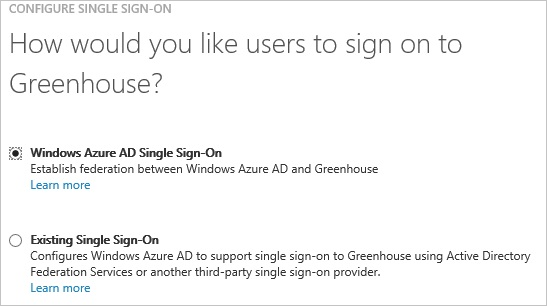
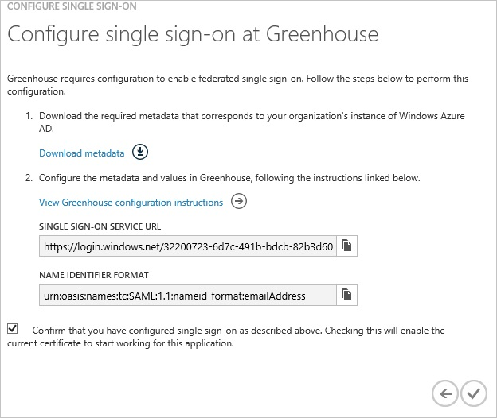
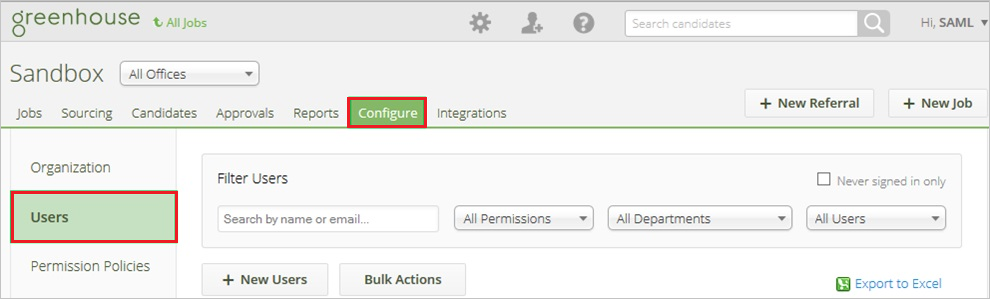
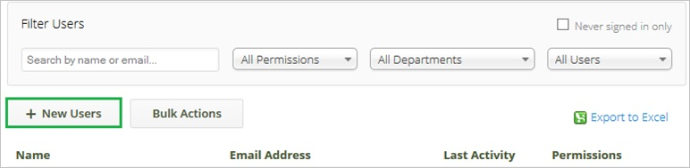
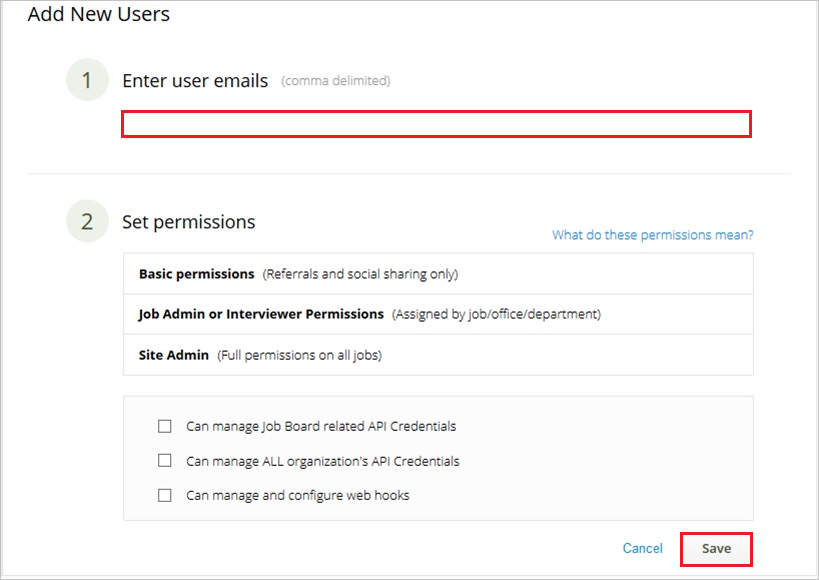

<properties 
    pageTitle="Tutorial: Azure Active Directory integration with Greenhouse | Microsoft Azure" 
    description="Learn how to use Greenhouse with Azure Active Directory to enable single sign-on, automated provisioning, and more!" 
    services="active-directory" 
    authors="jeevansd"  
    documentationCenter="na" 
    manager="femila"/>
<tags 
    ms.service="active-directory" 
    ms.devlang="na" 
    ms.topic="article" 
    ms.tgt_pltfrm="na" 
    ms.workload="identity" 
    ms.date="07/09/2016" 
    ms.author="jeedes" />

#Tutorial: Azure Active Directory integration with Greenhouse
  
The objective of this tutorial is to show the integration of Azure and Greenhouse.  
The scenario outlined in this tutorial assumes that you already have the following items:

-   A valid Azure subscription
-   A Greenhouse single sign-on subscription
  
After completing this tutorial, the Azure AD users you have assigned to Greenhouse will be able to single sign into the application at your Greenhouse company site (service provider initiated sign on), or using the [Introduction to the Access Panel](active-directory-saas-access-panel-introduction.md).
  
The scenario outlined in this tutorial consists of the following building blocks:

1.  Enabling the application integration for Greenhouse
2.  Configuring single sign-on
3.  Configuring user provisioning
4.  Assigning users

##Enabling the application integration for Greenhouse
  
The objective of this section is to outline how to enable the application integration for Greenhouse.

###To enable the application integration for Greenhouse, perform the following steps:

1.  In the Azure classic portal, on the left navigation pane, click **Active Directory**.

    

2.  From the **Directory** list, select the directory for which you want to enable directory integration.

3.  To open the applications view, in the directory view, click **Applications** in the top menu.

    

4.  Click **Add** at the bottom of the page.

    

5.  On the **What do you want to do** dialog, click **Add an application from the gallery**.

    

6.  In the **search box**, type **greenhouse**.

    

7.  In the results pane, select **Greenhouse**, and then click **Complete** to add the application.

    
##Configuring single sign-on
  
The objective of this section is to outline how to enable users to authenticate to Greenhouse with their account in Azure AD using federation based on the SAML protocol.

###To configure single sign-on, perform the following steps:

1.  In the Azure classic portal, on the **Greenhouse** application integration page, click **Configure single sign-on** to open the **Configure Single Sign On ** dialog.

    

2.  On the **How would you like users to sign on to Greenhouse** page, select **Microsoft Azure AD Single Sign-On**, and then click **Next**.

    

3.  On the **Configure App URL** page, in the **Sign On URL** textbox, type your URL using the following pattern "*https://company.greenhouse.io*", and then click **Next**.

    

4.  On the **Configure single sign-on at Greenhouse** page, click **Download metadata**, and then save metadata file locally on your computer.

    

5.  Forward that Metadata file to Greenhouse Support team.

    >[AZURE.NOTE] Single sign-on has to be enabled by the Greenhouse support team.

6.  On the Azure classic portal, select the single sign-on configuration confirmation, and then click **Complete** to close the **Configure Single Sign On** dialog.

    
##Configuring user provisioning
  
In order to enable Azure AD users to log into Greenhouse, they must be provisioned into Greenhouse.  
In the case of Greenhouse, provisioning is a manual task.

###To provision a user accounts, perform the following steps:

1.  Log in to your **Greenhouse** company site as an administrator.

2.  In the menu on the top, click **Configure**, and then click **Users**.

    

3.  Click **New Users**.

    

4.  In the **Add New User** section, perform the following steps:

    

    1.  In the **Enter user emails** textbox, type the email address of a valid Azure Active Directory account you want to provision.
    2.  Click **Save**.
        
		>[AZURE.NOTE] The Azure Active Directory account holders will receive an email including a link to confirm the account before it becomes active.

>[AZURE.NOTE] You can use any other Greenhouse user account creation tools or APIs provided by Greenhouse to provision AAD user accounts.

##Assigning users
  
To test your configuration, you need to grant the Azure AD users you want to allow using your application access to it by assigning them.

###To assign users to Greenhouse, perform the following steps:

1.  In the Azure classic portal, create a test account.

2.  On the **Greenhouse **application integration page, click **Assign users**.

    

3.  Select your test user, click **Assign**, and then click **Yes** to confirm your assignment.

    
  
If you want to test your single sign-on settings, open the Access Panel. For more details about the Access Panel, see [Introduction to the Access Panel](active-directory-saas-access-panel-introduction.md).