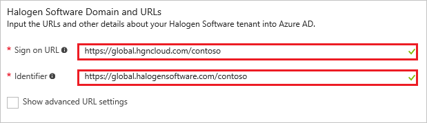

# Tutorial: Azure Active Directory integration with Halogen Software

In this tutorial, you learn how to integrate Halogen Software with Azure Active Directory (Azure AD).

Integrating Halogen Software with Azure AD provides you with the following benefits:

- You can control in Azure AD who has access to Halogen Software
- You can enable your users to automatically get signed-on to Halogen Software (Single Sign-On) with their Azure AD accounts
- You can manage your accounts in one central location - the Azure portal

If you want to know more details about SaaS app integration with Azure AD, see [what is application access and single sign-on with Azure Active Directory](active-directory-appssoaccess-whatis.md).

## Prerequisites

To configure Azure AD integration with Halogen Software, you need the following items:

- An Azure AD subscription
- A Halogen Software single sign-on enabled subscription

> [!NOTE]
> To test the steps in this tutorial, we do not recommend using a production environment.

To test the steps in this tutorial, you should follow these recommendations:

- Do not use your production environment, unless it is necessary.
- If you don't have an Azure AD trial environment, you can get a one-month trial [here](https://azure.microsoft.com/pricing/free-trial/).

## Scenario description

In this tutorial, you test Azure AD single sign-on in a test environment. 
The scenario outlined in this tutorial consists of two main building blocks:

1. Adding Halogen Software from the gallery
2. Configuring and testing Azure AD single sign-on

## Adding Halogen Software from the gallery

To configure the integration of Halogen Software into Azure AD, you need to add Halogen Software from the gallery to your list of managed SaaS apps.

**To add Halogen Software from the gallery, perform the following steps:**

1. In the **[Azure portal](https://portal.azure.com)**, on the left navigation panel, click **Azure Active Directory** icon. 

	![Active Directory][1]

2. Navigate to **Enterprise applications**. Then go to **All applications**.

	![Applications][2]
	
3. To add new application, click **New application** button on the top of dialog.

	![Applications][3]

4. In the search box, type **Halogen Software**.

	

5. In the results panel, select **Halogen Software**, and then click **Add** button to add the application.

	

##  Configuring and testing Azure AD single sign-on
In this section, you configure and test Azure AD single sign-on with Halogen Software based on a test user called "Britta Simon".

For single sign-on to work, Azure AD needs to know what the counterpart user in Halogen Software is to a user in Azure AD. In other words, a link relationship between an Azure AD user and the related user in Halogen Software needs to be established.

In Halogen Software, assign the value of the **user name** in Azure AD as the value of the **Username** to establish the link relationship.

To configure and test Azure AD single sign-on with Halogen Software, you need to complete the following building blocks:

1. **[Configuring Azure AD Single Sign-On](#configuring-azure-ad-single-sign-on)** - to enable your users to use this feature.
2. **[Creating an Azure AD test user](#creating-an-azure-ad-test-user)** - to test Azure AD single sign-on with Britta Simon.
3. **[Creating a Halogen Software test user](#creating-a-halogen-software-test-user)** - to have a counterpart of Britta Simon in Halogen Software that is linked to the Azure AD representation of user.
4. **[Assigning the Azure AD test user](#assigning-the-azure-ad-test-user)** - to enable Britta Simon to use Azure AD single sign-on.
5. **[Testing Single Sign-On](#testing-single-sign-on)** - to verify whether the configuration works.

### Configuring Azure AD single sign-on

In this section, you enable Azure AD single sign-on in the Azure portal and configure single sign-on in your Halogen Software application.

**To configure Azure AD single sign-on with Halogen Software, perform the following steps:**

1. In the Azure portal, on the **Halogen Software** application integration page, click **Single sign-on**.

	![Configure Single Sign-On][4]

2. On the **Single sign-on** dialog, select **Mode** as	**SAML-based Sign-on** to enable single sign-on.
 
	

3. On the **Halogen Software Domain and URLs** section, perform the following steps:

	

    a. In the **Sign-on URL** textbox, type a URL using the following pattern: `https://global.hgncloud.com/<companyname>`

	b. In the **Identifier** textbox, type a URL using the following pattern: `https://global.halogensoftware.com/<companyname>`, `https://global.hgncloud.com/<companyname>`

	> [!NOTE] 
	> These values are not real. Update these values with the actual Sign-On URL and Identifier. Contact [Halogen Software Client support team](https://support.halogensoftware.com/) to get these values. 
 

4. On the **SAML Signing Certificate** section, click **Metadata XML** and then save the metadata file on your computer.

	 

5. Click **Save** button.

	

6. In a different browser window, sign-on to your **Halogen Software** application as an administrator.

7. Click the **Options** tab. 
   
    ![What is Azure AD Connect][12]

8. In the left navigation pane, click **SAML Configuration**. 
   
    ![What is Azure AD Connect][13]

9. On the **SAML Configuration** page, perform the following steps: 

    ![What is Azure AD Connect][14]

     a. As **Unique Identifier**, select **NameID**.

     b. As **Unique Identifier Maps To**, select **Username**.
  
     c. To upload your downloaded metadata file, click **Browse** to select the file, and then **Upload File**.
 
     d. To test the configuration, click **Run Test**. 
    
	>[!NOTE]
    >You need to wait for the message "*The SAML test is complete. Please close this window*". Then, close the opened browser window. The **Enable SAML** checkbox is only enabled if the test has been completed. 
     
	 e. Select **Enable SAML**.
    
	 f. Click **Save Changes**. 

> [!TIP]
> You can now read a concise version of these instructions inside the [Azure portal](https://portal.azure.com), while you are setting up the app!  After adding this app from the **Active Directory > Enterprise Applications** section, simply click the **Single Sign-On** tab and access the embedded documentation through the **Configuration** section at the bottom. You can read more about the embedded documentation feature here: [Azure AD embedded documentation]( https://go.microsoft.com/fwlink/?linkid=845985)

### Creating an Azure AD test user

The objective of this section is to create a test user in the Azure portal called Britta Simon.

![Create Azure AD User][100]

**To create a test user in Azure AD, perform the following steps:**

1. In the **Azure portal**, on the left navigation pane, click **Azure Active Directory** icon.

	 

2. To display the list of users, go to **Users and groups** and click **All users**.
	
	 

3. To open the **User** dialog, click **Add** on the top of the dialog.
 
	 

4. On the **User** dialog page, perform the following steps:
 
	 

    a. In the **Name** textbox, type name as **BrittaSimon**.

    b. In the **User name** textbox, type the **email address** of BrittaSimon.

	c. Select **Show Password** and write down the value of the **Password**.

    d. Click **Create**.
 
### Creating a Halogen Software test user

The objective of this section is to create a user called Britta Simon in Halogen Software.

**To create a user called Britta Simon in Halogen Software, perform the following steps:**

1. Sign on to your **Halogen Software** application as an administrator.

2. Click the **User Center** tab, and then click **Create User**.
   
    ![What is Azure AD Connect][300]  

3. On the **New User** dialog page, perform the following steps:
   
    ![What is Azure AD Connect][301]

    a. In the **First Name** textbox, type first name of the user like **Britta**.
	
    b. In the **Last Name** textbox, type last name of the user like **Simon**. 

    c. In the **Username** textbox, type **Britta Simon**, the user name as in the Azure portal.

    d. In the **Password** textbox, type a password for Britta.
    
	e. Click **Save**.

### Assigning the Azure AD test user

In this section, you enable Britta Simon to use Azure single sign-on by granting access to Halogen Software.

![Assign User][200] 

**To assign Britta Simon to Halogen Software, perform the following steps:**

1. In the Azure portal, open the applications view, and then navigate to the directory view and go to **Enterprise applications** then click **All applications**.

	![Assign User][201] 

2. In the applications list, select **Halogen Software**.

	 

3. In the menu on the left, click **Users and groups**.

	![Assign User][202] 

4. Click **Add** button. Then select **Users and groups** on **Add Assignment** dialog.

	![Assign User][203]

5. On **Users and groups** dialog, select **Britta Simon** in the Users list.

6. Click **Select** button on **Users and groups** dialog.

7. Click **Assign** button on **Add Assignment** dialog.
	
### Testing single sign-on

The objective of this section is to test your Azure AD SSO configuration using the Access Panel.

When you click the Halogen Software tile in the Access Panel, you should get automatically signed-on to your Halogen Software application.

## Additional resources

* [List of Tutorials on How to Integrate SaaS Apps with Azure Active Directory](active-directory-saas-tutorial-list.md)
* [What is application access and single sign-on with Azure Active Directory?](active-directory-appssoaccess-whatis.md)

<!--Image references-->

[1]: ./media/active-directory-saas-halogen-software-tutorial/tutorial_general_01.png
[2]: ./media/active-directory-saas-halogen-software-tutorial/tutorial_general_02.png
[3]: ./media/active-directory-saas-halogen-software-tutorial/tutorial_general_03.png
[4]: ./media/active-directory-saas-halogen-software-tutorial/tutorial_general_04.png

[12]: ./media/active-directory-saas-halogen-software-tutorial/tutorial_halogen_12.png

[13]: ./media/active-directory-saas-halogen-software-tutorial/tutorial_halogen_13.png

[14]: ./media/active-directory-saas-halogen-software-tutorial/tutorial_halogen_14.png

[100]: ./media/active-directory-saas-halogen-software-tutorial/tutorial_general_100.png

[200]: ./media/active-directory-saas-halogen-software-tutorial/tutorial_general_200.png
[201]: ./media/active-directory-saas-halogen-software-tutorial/tutorial_general_201.png
[202]: ./media/active-directory-saas-halogen-software-tutorial/tutorial_general_202.png
[203]: ./media/active-directory-saas-halogen-software-tutorial/tutorial_general_203.png

[300]: ./media/active-directory-saas-halogen-software-tutorial/tutorial_halogen_300.png

[301]: ./media/active-directory-saas-halogen-software-tutorial/tutorial_halogen_301.png
