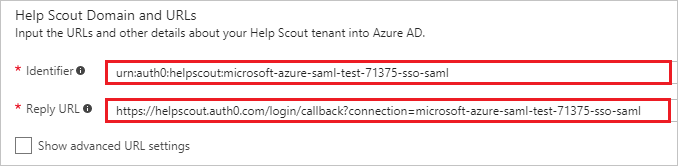
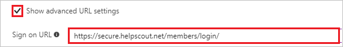
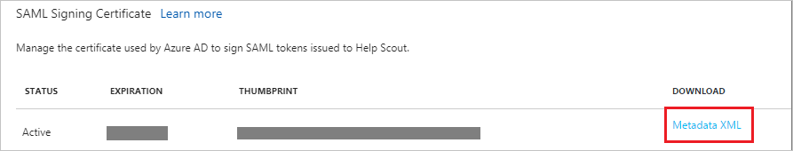

# Tutorial: Azure Active Directory integration with Help Scout

In this tutorial, you learn how to integrate Help Scout with Azure Active Directory (Azure AD).

You get the following benefits from integrating Help Scout with Azure AD:

- In Azure AD, you can control who has access to Help Scout.
- You can automatically sign in your users to Help Scout by using single sign-on and a user's Azure AD account.
- You can manage your accounts in one, central location, the Azure portal.

To learn more about software as a service (SaaS) app integration with Azure AD, see [What is application access and single sign-on with Azure Active Directory?](active-directory-appssoaccess-whatis.md).

## Prerequisites

To set up Azure AD integration with Help Scout, you need the following items:

- An Azure AD subscription
- A Help Scout subscription, with single sign-on turned on 

> [!NOTE]
> If you test the steps in this tutorial, we recommend that you don't test them in a production environment.

Recommendations for testing the steps in this tutorial:

- Do not use your production environment, unless it's necessary.
- If you don't have an Azure AD trial environment, you can [get a one-month free trial](https://azure.microsoft.com/pricing/free-trial/).

## Scenario description
In this tutorial, you test Azure AD single sign-on in a test environment. 

The scenario outlined in this tutorial consists of two main building blocks:

1. Add Help Scout from the gallery.
2. Set up and test Azure AD single sign-on.

## Add Help Scout from the gallery
To set up the integration of Help Scout with Azure AD, in the gallery, add Help Scout to your list of managed SaaS apps.

To add Help Scout from the gallery:

1. In the [Azure portal](https://portal.azure.com), in the left menu, select **Azure Active Directory**. 

	![The Azure Active Directory button][1]

2. Select **Enterprise applications**, and then select **All applications**.

	![The Enterprise applications page][2]
	
3. To add a new application, select **New application**.

	![The New application button][3]

4. In the search box, enter **Help Scout**. In the search results, select **Help Scout**, and then select **Add**.

	

## Set up and test Azure AD single sign-on

In this section, you set up and test Azure AD single sign-on with Help Scout based on a test user named *Britta Simon*.

For single sign-on to work, Azure AD needs to know the Azure AD counterpart user in Help Scout. A link relationship between an Azure AD user and the related user in Help Scout must be established.

To establish the link relationship, in Help Scout, for **Username**, assign the value of the **user name** in Azure AD.

To configure and test Azure AD single sign-on with Help Scout, complete the following tasks:

1. [Set up Azure AD single sign-on](#set-up-azure-ad-single-sign-on). Sets up a user to use this feature.
2. [Create an Azure AD test user](#create-an-azure-ad-test-user). Tests Azure AD single sign-on with the user Britta Simon.
3. [Create a Help Scout test user](#create-a-help-scout-test-user). Creates a counterpart of Britta Simon in Help Scout that is linked to the Azure AD representation of the user.
4. [Assign the Azure AD test user](#assign-the-azure-ad-test-user). Sets up Britta Simon to use Azure AD single sign-on.
5. [Test single sign-on](#test-single-sign-on). Verifies that the configuration works.

### Set up Azure AD single sign-on

In this section, you set up Azure AD single sign-on in the Azure portal. Then, you set up single sign-on in your Help Scout application.

To set up Azure AD single sign-on with Help Scout:

1. In the Azure portal, on the **Help Scout** application integration page, select **Single sign-on**.
 
	![Set up single sign-on link][4]

2. On the **Single sign-on** page, for **Mode**, select **SAML-based Sign-on**.
 
	

3. Under **Help Scout Domain and URLs**, if you want to set up the application in IDP-initiated mode, complete the following steps:

    1. In the **Identifier** box, enter a URL that has the following pattern: `urn:auth0:helpscout:<instancename>`

	2. In the **Reply URL** box, enter a URL that has the following pattern: `https://helpscout.auth0.com/login/callback?connection=<instancename>`

	

4. If you want to set up the application in SP-initiated mode, select the **Show advanced URL settings** check box, and then do the following:

	* In the **Sign on URL** box, enter a URL that has the following format: `https://secure.helpscout.net/members/login/`

	
 
	> [!NOTE] 
	> The values in these URLs are for demonstration only. Update the values with the actual identifier URL and reply URL. To get these values, contact [Help Scout support team](mailto:help@helpscout.com). 

5. Under **SAML Signing Certificate**, select **Metadata XML**, and then save the metadata file on your computer.

	 

6. Select **Save**.

	
	
7. To set up single sign-on on the Help Scout side, send the downloaded metadata XML file to the [Help Scout support team](mailto:help@helpscout.com). The Help Scout support team applies this setting so that the SAML single sign-on connection is set properly on both sides.

> [!TIP]
> You can read a concise version of these instructions in the [Azure portal](https://portal.azure.com), while you are setting up your app! After you add the app by selecting **Active Directory** > **Enterprise Applications**, select the **Single Sign-On** tab. You can access the embedded documentation in the **Configuration** section, at the bottom of the page. For more information, see [Azure AD embedded documentation]( https://go.microsoft.com/fwlink/?linkid=845985).

### Create an Azure AD test user

In this section, in the Azure portal, you create a test user named Britta Simon.

![Create an Azure AD test user][100]

To create a test user in Azure AD:

1. In the Azure portal, in the left menu, select **Azure Active Directory**.

    

2. To display the list of users, select **Users and groups**, and then select **All users**.

    

3. To open the **User** dialog box, at the top of the **All Users** page, select **Add**.

    

4. In the **User** dialog box, complete the following steps:

    1. In the **Name** box, enter **BrittaSimon**.

    2. In the **User name** box, enter the email address of user Britta Simon.

    3. Select the **Show Password** check box, and then write down the value that's displayed in the **Password** box.

    4. Select **Create**.

	    

 
### Create a Help Scout test user

The object of this section is to create a user named Britta Simon in Help Scout. Help Scout supports just-in-time (JIT) provisioning, which is turned on by default.

In this section, there's no action or task to complete. If a user doesn't already exist in Help Scout, a new one is created when you attempt to access Help Scout.

### Assign the Azure AD test user

In this section, you allow the user Britta Simon to use Azure AD single sign-on by granting the user account access to Help Scout.

![Assign the user role][200] 

To assign Britta Simon to Help Scout:

1. In the Azure portal, open the applications view, and then go to the directory view. Select **Enterprise applications**, and then select **All applications**.

	![Assign User][201] 

2. In the applications list, select **Help Scout**.

	  

3. In the left menu, select **Users and groups**.

	![The Users and groups link][202]

4. Select **Add**. Then, on the **Add Assignment** page, select **Users and groups**.

	![The Add Assignment pane][203]

5. On the **Users and groups** page, in the list of users, select **Britta Simon**.

6. On the **Users and groups** page, select **Select**.

7. On the **Add Assignment** page, select **Assign**.
	
### Test single sign-on

In this section, you test your Azure AD single sign-on configuration by using the access panel.

When you select the Help Scout tile in the access panel, you should be automatically signed in to your Help Scout application.

For more information about the access panel, see [Introduction to the access panel](active-directory-saas-access-panel-introduction.md). 

## Additional resources

* [List of tutorials on how to integrate SaaS apps with Azure Active Directory](active-directory-saas-tutorial-list.md)
* [What is application access and single sign-on with Azure Active Directory?](active-directory-appssoaccess-whatis.md)

<!--Image references-->

[1]: ./media/active-directory-saas-helpscout-tutorial/tutorial_general_01.png
[2]: ./media/active-directory-saas-helpscout-tutorial/tutorial_general_02.png
[3]: ./media/active-directory-saas-helpscout-tutorial/tutorial_general_03.png
[4]: ./media/active-directory-saas-helpscout-tutorial/tutorial_general_04.png

[100]: ./media/active-directory-saas-helpscout-tutorial/tutorial_general_100.png

[200]: ./media/active-directory-saas-helpscout-tutorial/tutorial_general_200.png
[201]: ./media/active-directory-saas-helpscout-tutorial/tutorial_general_201.png
[202]: ./media/active-directory-saas-helpscout-tutorial/tutorial_general_202.png
[203]: ./media/active-directory-saas-helpscout-tutorial/tutorial_general_203.png

