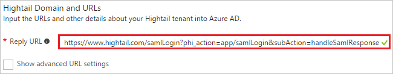
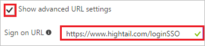
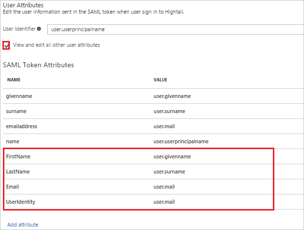
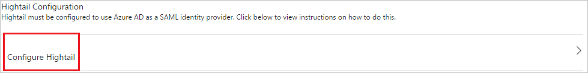
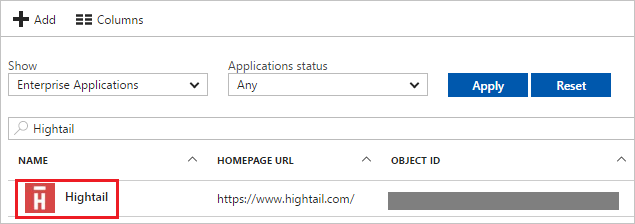

# Tutorial: Azure Active Directory integration with Hightail

In this tutorial, you learn how to integrate Hightail with Azure Active Directory (Azure AD).

Integrating Hightail with Azure AD provides you with the following benefits:

- You can control in Azure AD who has access to Hightail
- You can enable your users to automatically get signed-on to Hightail (Single Sign-On) with their Azure AD accounts
- You can manage your accounts in one central location - the Azure portal

If you want to know more details about SaaS app integration with Azure AD, see [what is application access and single sign-on with Azure Active Directory](active-directory-appssoaccess-whatis.md).

## Prerequisites

To configure Azure AD integration with Hightail, you need the following items:

- An Azure AD subscription
- A Hightail single sign-on enabled subscription

> [!NOTE]
> To test the steps in this tutorial, we do not recommend using a production environment.

To test the steps in this tutorial, you should follow these recommendations:

- Do not use your production environment, unless it is necessary.
- If you don't have an Azure AD trial environment, you can get a one-month trial [here](https://azure.microsoft.com/pricing/free-trial/).

## Scenario description
In this tutorial, you test Azure AD single sign-on in a test environment. 
The scenario outlined in this tutorial consists of two main building blocks:

1. Adding Hightail from the gallery
2. Configuring and testing Azure AD single sign-on

## Adding Hightail from the gallery
To configure the integration of Hightail into Azure AD, you need to add Hightail from the gallery to your list of managed SaaS apps.

**To add Hightail from the gallery, perform the following steps:**

1. In the **[Azure portal](https://portal.azure.com)**, on the left navigation panel, click **Azure Active Directory** icon. 

	![Active Directory][1]

2. Navigate to **Enterprise applications**. Then go to **All applications**.

	![Applications][2]
	
3. To add new application, click **New application** button on the top of dialog.

	![Applications][3]

4. In the search box, type **Hightail**.

	

5. In the results panel, select **Hightail**, and then click **Add** button to add the application.

	

##  Configuring and testing Azure AD single sign-on
In this section, you configure and test Azure AD single sign-on with Hightail based on a test user called "Britta Simon".

For single sign-on to work, Azure AD needs to know what the counterpart user in Hightail is to a user in Azure AD. In other words, a link relationship between an Azure AD user and the related user in Hightail needs to be established.

In Hightail, assign the value of the **user name** in Azure AD as the value of the **Username** to establish the link relationship.

To configure and test Azure AD single sign-on with Hightail, you need to complete the following building blocks:

1. **[Configuring Azure AD Single Sign-On](#configuring-azure-ad-single-sign-on)** - to enable your users to use this feature.
2. **[Creating an Azure AD test user](#creating-an-azure-ad-test-user)** - to test Azure AD single sign-on with Britta Simon.
3. **[Creating a Hightail test user](#creating-a-hightail-test-user)** - to have a counterpart of Britta Simon in Hightail that is linked to the Azure AD representation of user.
4. **[Assigning the Azure AD test user](#assigning-the-azure-ad-test-user)** - to enable Britta Simon to use Azure AD single sign-on.
5. **[Testing Single Sign-On](#testing-single-sign-on)** - to verify whether the configuration works.

### Configuring Azure AD single sign-on

In this section, you enable Azure AD single sign-on in the Azure portal and configure single sign-on in your Hightail application.

**To configure Azure AD single sign-on with Hightail, perform the following steps:**

1. In the Azure portal, on the **Hightail** application integration page, click **Single sign-on**.

	![Configure Single Sign-On][4]

2. On the **Single sign-on** dialog, select **Mode** as	**SAML-based Sign-on** to enable single sign-on.
 
	

3. On the **Hightail Domain and URLs** section, perform the following steps:

	

	 In the **Reply URL** textbox, type the URL as: `https://www.hightail.com/samlLogin?phi_action=app/samlLogin&subAction=handleSamlResponse`

	> [!NOTE] 
	> The preceding value is not real value. You will update the value with the actual Reply URL, which is explained later in the tutorial.
 
4. On the **Hightail Domain and URLs** section, If you wish to configure the application in **SP initiated mode**, perform the following steps:
	
	

	a. Click the **Show advanced URL settings**.

    b. In the **Sign On URL** textbox, type the URL as: `https://www.hightail.com/loginSSO`

4. On the **SAML Signing Certificate** section, click **Certificate (Base64)** and then save the certificate file on your computer.

	 

5. Hightail application expects the SAML assertions in a specific format. Please configure the following claims for this application. You can manage the values of these attributes from the **"Atrribute"** tab of the application. The following screenshot shows an example for this. 

     

6. In the **User Attributes** section on the **Single sign-on** dialog, configure SAML token attribute as shown in the image and perform the following steps:
	
	| Attribute Name | Attribute Value |
	| ------------------- | -------------------- |
	| FirstName | user.givenname |
	| LastName | user.surname |
	| Email | user.mail |    
	| UserIdentity | user.mail |
	
	a. Click **Add attribute** to open the **Add Attribute** dialog.

	

	

	b. In the **Name** textbox, type the attribute name shown for that row.

	c. From the **Value** list, type the attribute value shown for that row.

	d. Leave the **Namespace** blank.
	
	e. Click **Ok**.

7. Click **Save** button.

	

8. On the **Hightail Configuration** section, click **Configure Hightail** to open **Configure sign-on** window. Copy the **SAML Single Sign-On Service URL** from the **Quick Reference section.**

	 

    >[!NOTE] 
    >Before configuring the Single Sign On at Hightail app, please white list your email domain with Hightail team so that all the users who are using this domain can use Single Sign On functionality.

9. To get SSO configured for your application, you need to sign-on to your Hightail tenant as an administrator.
   
    a. In the menu on the top, click the **Account** tab and select **Configure SAML**.
 
     

    b. Select the checkbox of **Enable SAML Authentication**.

     

    c. Open your base-64 encoded certificate in notepad downloaded from Azure portal, copy the content of it into your clipboard, and then paste it to the **SAML Token Signing Certificate** textbox.

     

    d. In the **SAML Authority (Identity Provider)** textbox, paste the value of **SAML Single Sign-On Service URL** copied from Azure portal.

    

    e. If you wish to configure the application in **IDP initiated mode** select **"Identity Provider (IdP) initiated log in"**. If **SP initiated mode** select **"Service Provider (SP) initiated log in"**.

    

    f. Copy the SAML consumer URL for your instance and paste it in **Reply URL** textbox in **Hightail Domain and URLs** section on Azure portal.
    
    g. Click **Save**.

> [!TIP]
> You can now read a concise version of these instructions inside the [Azure portal](https://portal.azure.com), while you are setting up the app!  After adding this app from the **Active Directory > Enterprise Applications** section, simply click the **Single Sign-On** tab and access the embedded documentation through the **Configuration** section at the bottom. You can read more about the embedded documentation feature here: [Azure AD embedded documentation]( https://go.microsoft.com/fwlink/?linkid=845985)
> 

### Creating an Azure AD test user
The objective of this section is to create a test user in the Azure portal called Britta Simon.

![Create Azure AD User][100]

**To create a test user in Azure AD, perform the following steps:**

1. In the **Azure portal**, on the left navigation pane, click **Azure Active Directory** icon.

	 

2. To display the list of users, go to **Users and groups** and click **All users**.
	
	 

3. To open the **User** dialog, click **Add** on the top of the dialog.
 
	 

4. On the **User** dialog page, perform the following steps:
 
	 

    a. In the **Name** textbox, type **BrittaSimon**.

    b. In the **User name** textbox, type the **email address** of BrittaSimon.

	c. Select **Show Password** and write down the value of the **Password**.

    d. Click **Create**.
 
### Creating a Hightail test user

The objective of this section is to create a user called Britta Simon in Hightail. 

There is no action item for you in this section. Hightail supports just-in-time user provisioning based on the custom claims. If you have configured the custom claims as shown in the section **[Configuring Azure AD Single Sign-On](#configuring-azure-ad-single-sign-on)** above, a user is automatically created in the application it doesn't exist yet. 

>[!NOTE]
>If you need to create a user manually, you need to contact the [Hightail support team](mailto:support@hightail.com). 

### Assigning the Azure AD test user

In this section, you enable Britta Simon to use Azure single sign-on by granting access to Hightail.

![Assign User][200] 

**To assign Britta Simon to Hightail, perform the following steps:**

1. In the Azure portal, open the applications view, and then navigate to the directory view and go to **Enterprise applications** then click **All applications**.

	![Assign User][201] 

2. In the applications list, select **Hightail**.

	 

3. In the menu on the left, click **Users and groups**.

	![Assign User][202] 

4. Click **Add** button. Then select **Users and groups** on **Add Assignment** dialog.

	![Assign User][203]

5. On **Users and groups** dialog, select **Britta Simon** in the Users list.

6. Click **Select** button on **Users and groups** dialog.

7. Click **Assign** button on **Add Assignment** dialog.
	
### Testing single sign-on

The objective of this section is to test your Azure AD single sign-on configuration using the Access Panel.

When you click the Hightail tile in the Access Panel, you should get automatically signed-on to your Hightail application.

## Additional resources

* [List of Tutorials on How to Integrate SaaS Apps with Azure Active Directory](active-directory-saas-tutorial-list.md)
* [What is application access and single sign-on with Azure Active Directory?](active-directory-appssoaccess-whatis.md)

<!--Image references-->

[1]: ./media/active-directory-saas-hightail-tutorial/tutorial_general_01.png
[2]: ./media/active-directory-saas-hightail-tutorial/tutorial_general_02.png
[3]: ./media/active-directory-saas-hightail-tutorial/tutorial_general_03.png
[4]: ./media/active-directory-saas-hightail-tutorial/tutorial_general_04.png

[100]: ./media/active-directory-saas-hightail-tutorial/tutorial_general_100.png

[200]: ./media/active-directory-saas-hightail-tutorial/tutorial_general_200.png
[201]: ./media/active-directory-saas-hightail-tutorial/tutorial_general_201.png
[202]: ./media/active-directory-saas-hightail-tutorial/tutorial_general_202.png
[203]: ./media/active-directory-saas-hightail-tutorial/tutorial_general_203.png

