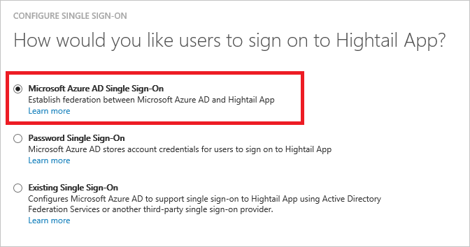
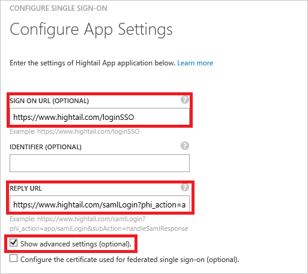
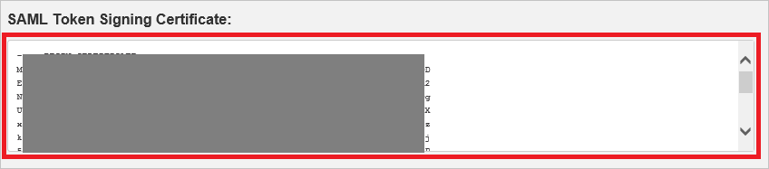
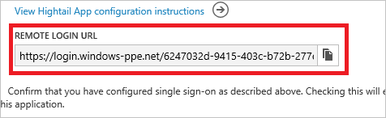
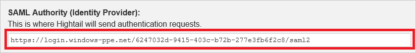
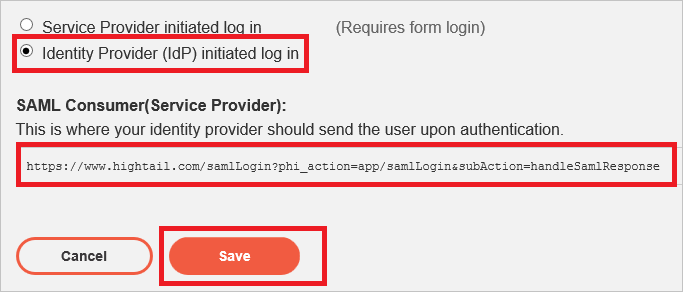
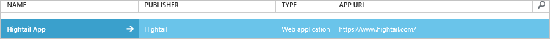

<properties
	pageTitle="Tutorial: Azure Active Directory integration with Hightail | Microsoft Azure"
	description="Learn how to configure single sign-on between Azure Active Directory and Hightail."
	services="active-directory"
	documentationCenter=""
	authors="jeevansd"
	manager="femila"
	editor=""/>

<tags
	ms.service="active-directory"
	ms.workload="identity"
	ms.tgt_pltfrm="na"
	ms.devlang="na"
	ms.topic="article"
	ms.date="07/11/2016"
	ms.author="jeedes"/>

# Tutorial: Azure Active Directory integration with Hightail

The objective of this tutorial is to show you how to integrate Hightail with Azure Active Directory (Azure AD).

Integrating Hightail with Azure AD provides you with the following benefits:

- You can control in Azure AD who has access to Hightail
- You can enable your users to automatically get signed-on to Hightail (Single Sign-On) with their Azure AD accounts
- You can manage your accounts in one central location - the Azure classic portal

If you want to know more details about SaaS app integration with Azure AD, see [What is application access and single sign-on with Azure Active Directory](active-directory-appssoaccess-whatis.md).

## Prerequisites

To configure Azure AD integration with Hightail, you need the following items:

- An Azure AD subscription
- A Hightail single-sign on enabled subscription

> [AZURE.NOTE] To test the steps in this tutorial, we do not recommend using a production environment.

To test the steps in this tutorial, you should follow these recommendations:

- You should not use your production environment, unless this is necessary.
- If you don't have an Azure AD trial environment, you can get a one-month trial [here](https://azure.microsoft.com/pricing/free-trial/).

## Scenario Description
The objective of this tutorial is to enable you to test Azure AD single sign-on in a test environment. 

The scenario outlined in this tutorial consists of two main building blocks:

1. Adding Hightail from the gallery
2. Configuring and testing Azure AD single sign-on

## Adding Hightail from the gallery
To configure the integration of Hightail into Azure AD, you need to add Hightail from the gallery to your list of managed SaaS apps.

**To add Hightail from the gallery, perform the following steps:**

1. In the **Azure classic portal**, on the left navigation pane, click **Active Directory**. 
 
	![Active Directory][1]

2. From the **Directory** list, select the directory for which you want to enable directory integration.

3. To open the applications view, in the directory view, click **Applications** in the top menu.

	![Applications][2]

4. Click **Add** at the bottom of the page.

	![Applications][3]

5. On the **What do you want to do** dialog, click **Add an application from the gallery**.

	![Applications][4]

6. In the search box, type **Hightail**.

	

7. In the results pane, select **Hightail**, and then click **Complete** to add the application.

	

##  Configuring and testing Azure AD single sign-on
The objective of this section is to show you how to configure and test Azure AD single sign-on with Hightail based on a test user called "Britta Simon".

For single sign-on to work, Azure AD needs to know what the counterpart user in Hightail to an user in Azure AD is. In other words, a link relationship between an Azure AD user and the related user in Hightail needs to be established.

This link relationship is established by assigning the value of the **user name** in Azure AD as the value of the **Username** in Hightail.

To configure and test Azure AD single sign-on with Hightail, you need to complete the following building blocks:

1. **[Configuring Azure AD Single Sign-On](#configuring-azure-ad-single-sign-on)** - to enable your users to use this feature.
2. **[Creating an Azure AD test user](#creating-an-azure-ad-test-user)** - to test Azure AD single sign-on with Britta Simon.
4. **[Creating a Hightail test user](#creating-a-hightail-test-user)** - to have a counterpart of Britta Simon in Hightail that is linked to the Azure AD representation of her.
5. **[Assigning the Azure AD test user](#assigning-the-azure-ad-test-user)** - to enable Britta Simon to use Azure AD single sign-on.
5. **[Testing Single Sign-On](#testing-single-sign-on)** - to verify whether the configuration works.

### Configuring Azure AD Single Sign-On

The objective of this section is to enable Azure AD single sign-on in the Azure classic portal and to configure single sign-on in your Hightail application.

Hightail application expects the SAML assertions in a specific format. Please configure the following claims for this application. You can manage the values of these attributes from the **"Atrribute"** tab of the application. The following screenshot shows an example for this. 

 

**To configure Azure AD single sign-on with Hightail, perform the following steps:**

1. In the Azure classic portal, on the **Hightail** application integration page, in the menu on the top, click **Attributes**.

	 

1. On the **SAML token attributes** dialog, for each row shown in the table below, perform the following steps:

	| Attribute Name | Attribute Value |
	| --- | --- |    
	| FirstName	| user.givenname |
    | LastName  | user.surname |
	| Email | user.mail |
	| UserIdentity | user.mail |

	a. Click **add user attribute** to open the **Add User Attribure** dialog.

	 

	b. In the **Attrubute Name** textbox, type the attribute name shown for that row.

    c. From the **Attribute Value** list, selsect the attribute value shown for that row.

    d. Click **Complete**.	
	

1. In the menu on the top, click **Quick Start**.

	  

2. On the **How would you like users to sign on to Hightail** page, select **Azure AD Single Sign-On**, and then click **Next**.

	 

3. On the **Configure App Settings** dialog page, If you wish to configure the application in **IDP initiated mode**, perform the following steps and click **Next**:

	 

    a. In the **Reply URL** textbox, type the URL in the following pattern: **"https://www.hightail.com/samlLogin?phi_action=app/samlLogin&subAction=handleSamlResponse"**

	b. Click **Next**

4. If you wish to configure the application in **SP initiated mode** on the **Configure App Settings** dialog page, then click on the **“Show advanced settings (optional)”** and then enter the **Sign On URL** and click **Next**.

	 

	a. In the Sign On URL textbox, type the URL used by your users to sign-on to your Hightail application using the following pattern: **https://www.hightail.com/loginSSO**. This is the common Login page for all the customers who wish to use SSO.

	b. Click **Next**

5. On the **Configure single sign-on at Hightail** page, perform the following steps and click **Next**:

	 

    a. Click **Download certificate**, and then save the base-64 encoded certificate file on your computer.

    b. Click **Next**.

	> [AZURE.NOTE] Before configuring the Single Sign On at Hightail app, please white list your email domain with Hightail team so that all the users who are using this domain can leverage Single Sign On functionality.

6. To get SSO configured for your application, you need to sign-on to your Hightail tenant as an administrator.

	a. In the menu on the top, click the **Account** tab and select **Configure SAML**.

	 

	b. Select the checkbox of **Enable SAML Authentication**.

	 

	c. Open your base-64 encoded certificate in notepad, copy the content of it into your clipboard, and then paste it to the **SAML Token Signing Certificate** textbox.

	 

	d. Copy Remote Login URL from Azure AD to **SAML Authority (Identity Provider)** in Hightail.

	
	
	

	e. If you wish to configure the application in **IDP initiated mode** select **"Identity Provider (IdP) initiated log in"**. If **SP initiated mode** select **"Service Provider (SP) initiated log in"**.
	
	

	f. Copy the SAML consumer URL for your instance and paste it in **Reply URL** textbox as shown in step 4. 

	g. Click **Save**.

6. In the Azure classic portal, select the single sign-on configuration confirmation, and then click **Next**.

	![Azure AD Single Sign-On][10]

7. On the **Single sign-on confirmation** page, click **Complete**. 
 
	![Azure AD Single Sign-On][11]

### Creating an Azure AD test user
The objective of this section is to create a test user in the Azure classic portal called Britta Simon.

In the Users list, select **Britta Simon**.

![Create Azure AD User][20]

**To create a test user in Azure AD, perform the following steps:**

1. In the **Azure classic portal**, on the left navigation pane, click **Active Directory**.

	 

2. From the **Directory** list, select the directory for which you want to enable directory integration.

3. To display the list of users, in the menu on the top, click **Users**.
 
	 

4. To open the **Add User** dialog, in the toolbar on the bottom, click **Add User**.

	

5. On the **Tell us about this user** dialog page, perform the following steps:

	 

    a. As **Type Of User**, select **New user in your organization**.

    b. In the **User Name** textbox, type **BrittaSimon**.

    c. Click **Next**.

6.  On the **User Profile** dialog page, perform the following steps:

	 

    a. In the **First Name** textbox, type **Britta**.  

    b. In the **Last Name** textbox, type, **Simon**.

    c. In the **Display Name** textbox, type **Britta Simon**.

    d. In the **Role** list, select **User**.

    e. Click **Next**.

7. On the **Get temporary password** dialog page, click **create**.

	 

8. On the **Get temporary password** dialog page, perform the following steps:
 
	 

    a. Write down the value of the **New Password**.

    b. Click **Complete**.   

### Creating a Hightail test user

The objective of this section is to create a user called Britta Simon in Hightail. 

There is no action item for you in this section. Hightail supports just-in-time user provisioning based on the custom claims. If you have configured the custom claims as shown in the section **[Configuring Azure AD Single Sign-On](#configuring-azure-ad-single-sign-on)** above, a user is automatically created in the application it doesn't exist yet. 

> [AZURE.NOTE] If you need to create an user manually, you need to contact the Hightail support team via [support@hightail.com](mailto:support@hightail.com).

### Assigning the Azure AD test user

The objective of this section is to enabling Britta Simon to use Azure single sign-on by granting her access to Hightail.

![Assign User][200] 

**To assign Britta Simon to Hightail, perform the following steps:**

1. On the Azure classic portal, to open the applications view, in the directory view, click **Applications** in the top menu.
 
	![Assign User][201] 

2. In the applications list, select **Hightail**.

	 

1. In the menu on the top, click **Users**.

	![Assign User][203]

1. In the Users list, select **Britta Simon**.

2. In the toolbar on the bottom, click **Assign**.

![Assign User][205]

### Testing Single Sign-On

The objective of this section is to test your Azure AD single sign-on configuration using the Access Panel.

When you click the Hightail tile in the Access Panel, you should get automatically signed-on to your Hightail application.

## Additional Resources

* [List of Tutorials on How to Integrate SaaS Apps with Azure Active Directory](active-directory-saas-tutorial-list.md)
* [What is application access and single sign-on with Azure Active Directory?](active-directory-appssoaccess-whatis.md)

<!--Image references-->

[1]: ./media/active-directory-saas-hightail-tutorial/tutorial_general_01.png
[2]: ./media/active-directory-saas-hightail-tutorial/tutorial_general_02.png
[3]: ./media/active-directory-saas-hightail-tutorial/tutorial_general_03.png
[4]: ./media/active-directory-saas-hightail-tutorial/tutorial_general_04.png

[6]: ./media/active-directory-saas-hightail-tutorial/tutorial_general_05.png
[10]: ./media/active-directory-saas-hightail-tutorial/tutorial_general_06.png
[11]: ./media/active-directory-saas-hightail-tutorial/tutorial_general_07.png
[20]: ./media/active-directory-saas-hightail-tutorial/tutorial_general_100.png

[200]: ./media/active-directory-saas-hightail-tutorial/tutorial_general_200.png
[201]: ./media/active-directory-saas-hightail-tutorial/tutorial_general_201.png
[203]: ./media/active-directory-saas-hightail-tutorial/tutorial_general_203.png
[204]: ./media/active-directory-saas-hightail-tutorial/tutorial_general_204.png
[205]: ./media/active-directory-saas-hightail-tutorial/tutorial_general_205.png
