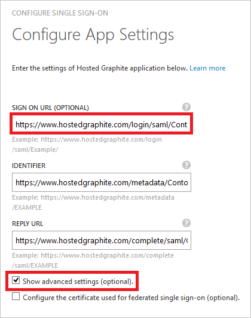
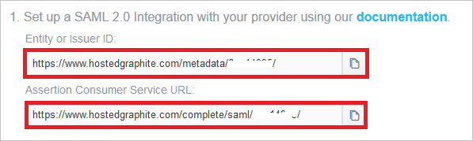
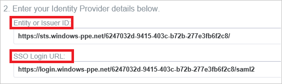
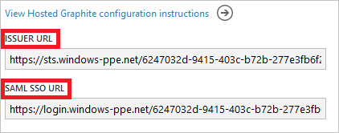
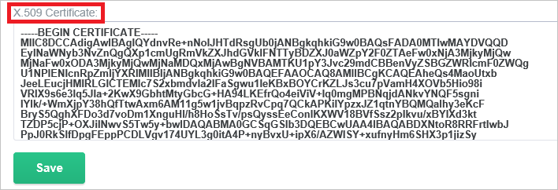

<properties
	pageTitle="Tutorial: Azure Active Directory integration with Hosted Graphite | Microsoft Azure"
	description="Learn how to configure single sign-on between Azure Active Directory and Hosted Graphite."
	services="active-directory"
	documentationCenter=""
	authors="jeevansd"
	manager="femila"
	editor=""/>

<tags
	ms.service="active-directory"
	ms.workload="identity"
	ms.tgt_pltfrm="na"
	ms.devlang="na"
	ms.topic="article"
	ms.date="08/01/2016"
	ms.author="jeedes"/>

# Tutorial: Azure Active Directory integration with Hosted Graphite

The objective of this tutorial is to show you how to integrate Hosted Graphite with Azure Active Directory (Azure AD).

Integrating Hosted Graphite with Azure AD provides you with the following benefits:

- You can control in Azure AD who has access to Hosted Graphite
- You can enable your users to automatically get signed-on to Hosted Graphite (Single Sign-On) with their Azure AD accounts
- You can manage your accounts in one central location - the Azure classic portal

If you want to know more details about SaaS app integration with Azure AD, see [What is application access and single sign-on with Azure Active Directory](active-directory-appssoaccess-whatis.md).

## Prerequisites

To configure Azure AD integration with Hosted Graphite, you need the following items:

- An Azure AD subscription
- A Hosted Graphite single-sign on enabled subscription

> [AZURE.NOTE] To test the steps in this tutorial, we do not recommend using a production environment.

To test the steps in this tutorial, you should follow these recommendations:

- You should not use your production environment, unless this is necessary.
- If you don't have an Azure AD trial environment, you can get a one-month trial [here](https://azure.microsoft.com/pricing/free-trial/).

## Scenario description
The objective of this tutorial is to enable you to test Azure AD single sign-on in a test environment.

The scenario outlined in this tutorial consists of two main building blocks:

1. Adding Hosted Graphite from the gallery
2. Configuring and testing Azure AD single sign-on

## Adding Hosted Graphite from the gallery
To configure the integration of Hosted Graphite into Azure AD, you need to add Hosted Graphite from the gallery to your list of managed SaaS apps.

**To add Hosted Graphite from the gallery, perform the following steps:**

1. In the **Azure classic Portal**, on the left navigation pane, click **Active Directory**. 

	![Active Directory][1]

2. From the **Directory** list, select the directory for which you want to enable directory integration.

3. To open the applications view, in the directory view, click **Applications** in the top menu.
	
	![Applications][2]

4. Click **Add** at the bottom of the page.
	
	![Applications][3]

5. On the **What do you want to do** dialog, click **Add an application from the gallery**.

	![Applications][4]

6. In the search box, type **Hosted Graphite**.

	

7. In the results panel, select **Hosted Graphite**, and then click **Complete** to add the application.

	

##  Configuring and testing Azure AD single sign-on
The objective of this section is to show you how to configure and test Azure AD single sign-on with Hosted Graphite based on a test user called "Britta Simon".

For single sign-on to work, Azure AD needs to know what the counterpart user in Hosted Graphite to an user in Azure AD is. In other words, a link relationship between an Azure AD user and the related user in Hosted Graphite needs to be established.

This link relationship is established by assigning the value of the **user name** in Azure AD as the value of the **Username** in Hosted Graphite.

To configure and test Azure AD single sign-on with Hosted Graphite, you need to complete the following building blocks:

1. **[Configuring Azure AD Single Sign-On](#configuring-azure-ad-single-single-sign-on)** - to enable your users to use this feature.
2. **[Creating an Azure AD test user](#creating-an-azure-ad-test-user)** - to test Azure AD single sign-on with Britta Simon.
3. **[Creating a Hosted Graphite test user](#creating-a-hosted-graphite-test-user)** - to have a counterpart of Britta Simon in Hosted Graphite that is linked to the Azure AD representation of her.
4. **[Assigning the Azure AD test user](#assigning-the-azure-ad-test-user)** - to enable Britta Simon to use Azure AD single sign-on.
5. **[Testing Single Sign-On](#testing-single-sign-on)** - to verify whether the configuration works.

### Configuring Azure AD single sign-on

In this section, you enable Azure AD single sign-on in the classic portal and configure single sign-on in your Hosted Graphite application.

**To configure Azure AD single sign-on with Hosted Graphite, perform the following steps:**

1. In the classic portal, on the **Hosted Graphite** application integration page, click **Configure single sign-on** to open the **Configure Single Sign-On**  dialog.
	 
	![Configure Single Sign-On][6] 

2. On the **How would you like users to sign on to Hosted Graphite** page, select **Azure AD Single Sign-On**, and then click **Next**.
    
	

3. On the **Configure App Settings** dialog page, If you wish to configure the application in **IDP initiated mode**, perform the following steps and click **Next**:

    

	a. In the **Identifier** textbox, type a URL using the following pattern: `https://www.hostedgraphite.com/metadata/<user id>`

    b. In the **Reply URL** textbox, type a URL using the following pattern: `https://www.hostedgraphite.com/complete/saml/<user id>`

	c. Click **Next**

4. If you wish to configure the application in **SP initiated mode** on the **Configure App Settings** dialog page, then click on the **“Show advanced settings (optional)”** and then enter the **Sign On URL** and click **Next**.

	

	a. In the **Sign On URL** textbox, type a URL using the following pattern: `https://www.hostedgraphite.com/login/saml/<user id>/`

	b. Click **Next**

	> [AZURE.NOTE] Please note that these are not the real values. You have to update these values with the actual Sign On URL, Identifier and Reply URL. To get these values, contact Hosted Graphite.

5. On the **Configure single sign-on at Hosted Graphite** page, perform the following steps and click **Next**:

	

    a. Click **Download certificate**, and then save the file on your computer.

    b. Click **Next**.

6. Sign-on to your Hosted Graphite tenant as an administrator.

7. Go to the **SAML Setup page** in the sidebar (**Access -> SAML Setup**).

	

8. Copy **Issuer URL** and **SAML SSO URL** from Azure AD to **Entity or Issuer ID** and **SSO Login URL** in Hosted Graphite.

	

	

9. Select "**Read-only**" as **Default User Role**.

	

10. Copy the content of the downloaded certificate file, and then paste it into the **X.509 Certificate** textbox.

	 

11. Click **Save** button.

12. In the classic portal, select the single sign-on configuration confirmation, and then click **Next**.
    
	![Azure AD Single Sign-On][10]

13. On the **Single sign-on confirmation** page, click **Complete**.  
    
	![Azure AD Single Sign-On][11]

### Creating an Azure AD test user
The objective of this section is to create a test user in the classic portal called Britta Simon.

![Create Azure AD User][20]

**To create a test user in Azure AD, perform the following steps:**

1. In the **Azure classic Portal**, on the left navigation pane, click **Active Directory**.

    

2. From the **Directory** list, select the directory for which you want to enable directory integration.

3. To display the list of users, in the menu on the top, click **Users**.
    
	

4. To open the **Add User** dialog, in the toolbar on the bottom, click **Add User**.

    

5. On the **Tell us about this user** dialog page, perform the following steps:

    

    a. As Type Of User, select New user in your organization.

    b. In the User Name **textbox**, type **BrittaSimon**.

    c. Click **Next**.

6.  On the **User Profile** dialog page, perform the following steps:
    
	

    a. In the **First Name** textbox, type **Britta**.  

    b. In the **Last Name** textbox, type, **Simon**.

    c. In the **Display Name** textbox, type **Britta Simon**.

    d. In the **Role** list, select **User**.

    e. Click **Next**.

7. On the **Get temporary password** dialog page, click **create**.
    
	

8. On the **Get temporary password** dialog page, perform the following steps:
    
	

    a. Write down the value of the **New Password**.

    b. Click **Complete**.   

### Creating a Hosted Graphite test user

The objective of this section is to create a user called Britta Simon in Hosted Graphite. Hosted Graphite supports just-in-time provisioning, which is by default enabled.

There is no action item for you in this section. A new user will be created during an attempt to access Hosted Graphite if it doesn't exist yet.

> [AZURE.NOTE] If you need to create an user manually, you need to contact the Hosted Graphite support team via <mailto:help@hostedgraphite.com>.

### Assigning the Azure AD test user

The objective of this section is to enabling Britta Simon to use Azure single sign-on by granting her access to Hosted Graphite.
	
![Assign User][200]

**To assign Britta Simon to Hosted Graphite, perform the following steps:**

1. On the classic portal, to open the applications view, in the directory view, click **Applications** in the top menu.
    
	![Assign User][201]

2. In the applications list, select **Hosted Graphite**.
    
	

1. In the menu on the top, click **Users**.
    
	![Assign User][203]

1. In the Users list, select **Britta Simon**.

2. In the toolbar on the bottom, click **Assign**.
    
	![Assign User][205]

### Testing single sign-on

The objective of this section is to test your Azure AD single sign-on configuration using the Access Panel.
 
When you click the Hosted Graphite tile in the Access Panel, you should get automatically signed-on to your Hosted Graphite application.

## Additional resources

* [List of Tutorials on How to Integrate SaaS Apps with Azure Active Directory](active-directory-saas-tutorial-list.md)
* [What is application access and single sign-on with Azure Active Directory?](active-directory-appssoaccess-whatis.md)

<!--Image references-->

[1]: ./media/active-directory-saas-hostedgraphite-tutorial/tutorial_general_01.png
[2]: ./media/active-directory-saas-hostedgraphite-tutorial/tutorial_general_02.png
[3]: ./media/active-directory-saas-hostedgraphite-tutorial/tutorial_general_03.png
[4]: ./media/active-directory-saas-hostedgraphite-tutorial/tutorial_general_04.png

[6]: ./media/active-directory-saas-hostedgraphite-tutorial/tutorial_general_05.png
[10]: ./media/active-directory-saas-hostedgraphite-tutorial/tutorial_general_06.png
[11]: ./media/active-directory-saas-hostedgraphite-tutorial/tutorial_general_07.png
[20]: ./media/active-directory-saas-hostedgraphite-tutorial/tutorial_general_100.png

[200]: ./media/active-directory-saas-hostedgraphite-tutorial/tutorial_general_200.png
[201]: ./media/active-directory-saas-hostedgraphite-tutorial/tutorial_general_201.png
[203]: ./media/active-directory-saas-hostedgraphite-tutorial/tutorial_general_203.png
[204]: ./media/active-directory-saas-hostedgraphite-tutorial/tutorial_general_204.png
[205]: ./media/active-directory-saas-hostedgraphite-tutorial/tutorial_general_205.png
