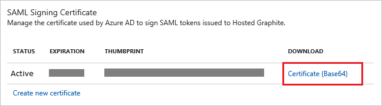

# Tutorial: Azure Active Directory integration with Hosted Graphite

In this tutorial, you learn how to integrate Hosted Graphite with Azure Active Directory (Azure AD).

Integrating Hosted Graphite with Azure AD provides you with the following benefits:

- You can control in Azure AD who has access to Hosted Graphite
- You can enable your users to automatically get signed-on to Hosted Graphite (Single Sign-On) with their Azure AD accounts
- You can manage your accounts in one central location - the Azure portal

If you want to know more details about SaaS app integration with Azure AD, see [what is application access and single sign-on with Azure Active Directory](active-directory-appssoaccess-whatis.md).

## Prerequisites

To configure Azure AD integration with Hosted Graphite, you need the following items:

- An Azure AD subscription
- A Hosted Graphite single sign-on enabled subscription

> [!NOTE]
> To test the steps in this tutorial, we do not recommend using a production environment.

To test the steps in this tutorial, you should follow these recommendations:

- Do not use your production environment, unless it is necessary.
- If you don't have an Azure AD trial environment, you can get a one-month trial [here](https://azure.microsoft.com/pricing/free-trial/).

## Scenario description
In this tutorial, you test Azure AD single sign-on in a test environment. 
The scenario outlined in this tutorial consists of two main building blocks:

1. Adding Hosted Graphite from the gallery
2. Configuring and testing Azure AD single sign-on

## Adding Hosted Graphite from the gallery
To configure the integration of Hosted Graphite into Azure AD, you need to add Hosted Graphite from the gallery to your list of managed SaaS apps.

**To add Hosted Graphite from the gallery, perform the following steps:**

1. In the **[Azure portal](https://portal.azure.com)**, on the left navigation panel, click **Azure Active Directory** icon. 

	![Active Directory][1]

2. Navigate to **Enterprise applications**. Then go to **All applications**.

	![Applications][2]
	
3. To add new application, click **New application** button on the top of dialog.

	![Applications][3]

4. In the search box, type **Hosted Graphite**.

	

5. In the results panel, select **Hosted Graphite**, and then click **Add** button to add the application.

	

##  Configuring and testing Azure AD single sign-on
In this section, you configure and test Azure AD single sign-on with Hosted Graphite based on a test user called "Britta Simon".

For single sign-on to work, Azure AD needs to know what the counterpart user in Hosted Graphite is to a user in Azure AD. In other words, a link relationship between an Azure AD user and the related user in Hosted Graphite needs to be established.

In Hosted Graphite, assign the value of the **user name** in Azure AD as the value of the **Username** to establish the link relationship.

To configure and test Azure AD single sign-on with Hosted Graphite, you need to complete the following building blocks:

1. **[Configuring Azure AD Single Sign-On](#configuring-azure-ad-single-sign-on)** - to enable your users to use this feature.
2. **[Creating an Azure AD test user](#creating-an-azure-ad-test-user)** - to test Azure AD single sign-on with Britta Simon.
3. **[Creating a Hosted Graphite test user](#creating-a-hosted-graphite-test-user)** - to have a counterpart of Britta Simon in Hosted Graphite that is linked to the Azure AD representation of user.
4. **[Assigning the Azure AD test user](#assigning-the-azure-ad-test-user)** - to enable Britta Simon to use Azure AD single sign-on.
5. **[Testing Single Sign-On](#testing-single-sign-on)** - to verify whether the configuration works.

### Configuring Azure AD single sign-on

In this section, you enable Azure AD single sign-on in the Azure portal and configure single sign-on in your Hosted Graphite application.

**To configure Azure AD single sign-on with Hosted Graphite, perform the following steps:**

1. In the Azure portal, on the **Hosted Graphite** application integration page, click **Single sign-on**.

	![Configure Single Sign-On][4]

2. On the **Single sign-on** dialog, select **Mode** as	**SAML-based Sign-on** to enable single sign-on.
 
	

3. On the **Hosted Graphite Domain and URLs** section,If you wish to configure the application in **IDP initiated mode**, perform the following steps:

	

    a. In the **Identifier** textbox, type a URL using the following pattern: 
	`https://www.hostedgraphite.com/metadata/<user id>`

	b. In the **Reply URL** textbox, type a URL using the following pattern: 
    `https://www.hostedgraphite.com/complete/saml/<user id>`

4. On the **Hosted Graphite Domain and URLs** section, If you wish to configure the application in **SP initiated mode**, perform the following steps:
   
    
  
    a. Click on the **Show advanced URL settings** option

    b. In the **Sign On URL** textbox, type a URL using the following pattern: `https://www.hostedgraphite.com/login/saml/<user id>/`	

    > [!NOTE] 
    > Please note that these are not the real values. You have to update these values with the actual Identifier, Reply URL and Sign On URL. To get these values, you can go to Access->SAML setup on your Application side or Contact [Hosted Graphite support team](mailto:help@hostedgraphite.com).
    >
 
5. On the **SAML Signing Certificate** section, click **Certificate(Base64)** and then save the certificate file on your computer.

	 

6. Click **Save** button.

	

7. On the **Hosted Graphite Configuration** section, click **Configure Hosted Graphite** to open **Configure sign-on** window. Copy the **SAML Entity ID, and SAML Single Sign-On Service URL** from the **Quick Reference section.**

	 

8. Sign-on to your Hosted Graphite tenant as an administrator.

9. Go to the **SAML Setup page** in the sidebar (**Access -> SAML Setup**).
   
    

10. Confirm these URls match your configuration done on the **Hosted Graphite Domain and URLs** section of the Azure portal.
   
    

11. In  **Entity or Issuer ID** and **SSO Login URL** textboxes, paste the value of **SAML Entity ID** and **SAML Single Sign-On Service URL** which you have copied from Azure portal. 
   
    
   

12. Select "**Read-only**" as **Default User Role**.
    
    

13. Open your base-64 encoded certificate in notepad downloaded from Azure portal, copy the content of it into your clipboard, and then paste it to the **X.509 Certificate** textbox.
    
    

14. Click **Save** button.

> [!TIP]
> You can now read a concise version of these instructions inside the [Azure portal](https://portal.azure.com), while you are setting up the app!  After adding this app from the **Active Directory > Enterprise Applications** section, simply click the **Single Sign-On** tab and access the embedded documentation through the **Configuration** section at the bottom. You can read more about the embedded documentation feature here: [Azure AD embedded documentation]( https://go.microsoft.com/fwlink/?linkid=845985)
> 

### Creating an Azure AD test user
The objective of this section is to create a test user in the Azure portal called Britta Simon.

![Create Azure AD User][100]

**To create a test user in Azure AD, perform the following steps:**

1. In the **Azure portal**, on the left navigation pane, click **Azure Active Directory** icon.

	 

2. To display the list of users, go to **Users and groups** and click **All users**.
	
	 

3. To open the **User** dialog, click **Add** on the top of the dialog.
 
	 

4. On the **User** dialog page, perform the following steps:
 
	 

    a. In the **Name** textbox, type **BrittaSimon**.

    b. In the **User name** textbox, type the **email address** of BrittaSimon.

	c. Select **Show Password** and write down the value of the **Password**.

    d. Click **Create**.
 
### Creating a Hosted Graphite test user

The objective of this section is to create a user called Britta Simon in Hosted Graphite. Hosted Graphite supports just-in-time provisioning, which is by default enabled.

There is no action item for you in this section. A new user will be created during an attempt to access Hosted Graphite if it doesn't exist yet.

>[!NOTE]
>If you need to create an user manually, you need to contact the Hosted Graphite support team via <mailto:help@hostedgraphite.com>. 

### Assigning the Azure AD test user

In this section, you enable Britta Simon to use Azure single sign-on by granting access to Hosted Graphite.

![Assign User][200] 

**To assign Britta Simon to Hosted Graphite, perform the following steps:**

1. In the Azure portal, open the applications view, and then navigate to the directory view and go to **Enterprise applications** then click **All applications**.

	![Assign User][201] 

2. In the applications list, select **Hosted Graphite**.

	 

3. In the menu on the left, click **Users and groups**.

	![Assign User][202] 

4. Click **Add** button. Then select **Users and groups** on **Add Assignment** dialog.

	![Assign User][203]

5. On **Users and groups** dialog, select **Britta Simon** in the Users list.

6. Click **Select** button on **Users and groups** dialog.

7. Click **Assign** button on **Add Assignment** dialog.
	
### Testing single sign-on

The objective of this section is to test your Azure AD SSO configuration using the Access Panel.

When you click the Hosted Graphite tile in the Access Panel, you should get automatically signed-on to your Hosted Graphite application.

## Additional resources

* [List of Tutorials on How to Integrate SaaS Apps with Azure Active Directory](active-directory-saas-tutorial-list.md)
* [What is application access and single sign-on with Azure Active Directory?](active-directory-appssoaccess-whatis.md)

<!--Image references-->

[1]: ./media/active-directory-saas-hostedgraphite-tutorial/tutorial_general_01.png
[2]: ./media/active-directory-saas-hostedgraphite-tutorial/tutorial_general_02.png
[3]: ./media/active-directory-saas-hostedgraphite-tutorial/tutorial_general_03.png
[4]: ./media/active-directory-saas-hostedgraphite-tutorial/tutorial_general_04.png

[100]: ./media/active-directory-saas-hostedgraphite-tutorial/tutorial_general_100.png

[200]: ./media/active-directory-saas-hostedgraphite-tutorial/tutorial_general_200.png
[201]: ./media/active-directory-saas-hostedgraphite-tutorial/tutorial_general_201.png
[202]: ./media/active-directory-saas-hostedgraphite-tutorial/tutorial_general_202.png
[203]: ./media/active-directory-saas-hostedgraphite-tutorial/tutorial_general_203.png

