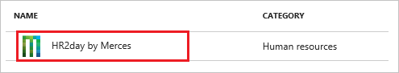
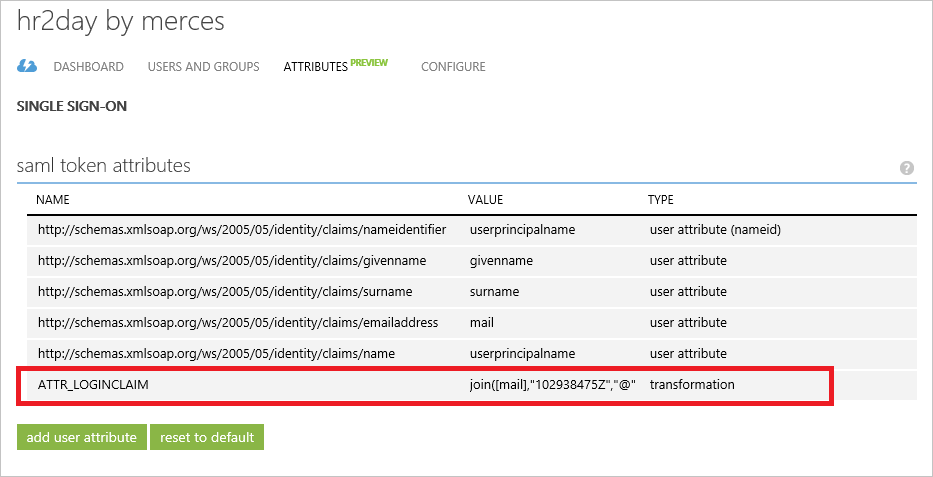
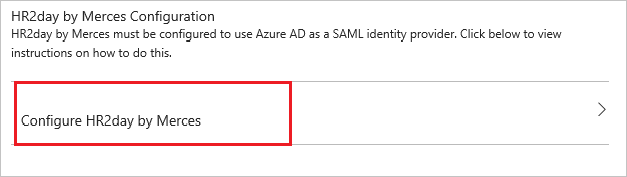

# Tutorial: Azure Active Directory integration with HR2day by Merces

In this tutorial, you learn how to integrate HR2day by Merces with Azure Active Directory (Azure AD).

Integrating HR2day by Merces with Azure AD provides you with the following benefits:

- You can control in Azure AD who has access to HR2day by Merces.
- You can enable your users to automatically get signed-in to HR2day by Merces with their Azure AD accounts.
- You can manage your accounts in one central location--the Azure portal.

For more information about SaaS app integration with Azure AD, see [What is application access and single sign-on with Azure Active Directory](active-directory-appssoaccess-whatis.md).

## Prerequisites

To configure Azure AD integration with HR2day by Merces, you need the following items:

- An Azure AD subscription.
- An HR2day by Merces single sign-on enabled subscription.

> [!NOTE]
> We don't recommend using a production environmentTo test the steps in this tutorial.

To test the steps in this tutorial, follow these recommendations:

- Don't use your production environment unless it's necessary.
- If you don't have an Azure AD trial environment,  get a [one-month trial](https://azure.microsoft.com/pricing/free-trial/).

## Scenario description
In this tutorial, you test Azure AD single sign-on in a test environment. 
The scenario that's outlined in this tutorial consists of two main building blocks:

1. Adding HR2day by Merces from the gallery.
2. Configuring and testing Azure AD single sign-on.

## Add HR2day by Merces from the gallery
To configure the integration of HR2day by Merces into Azure AD, you need to add HR2day by Merces from the gallery to your list of managed SaaS apps.

**To add HR2day by Merces from the gallery, take the following steps:**

1. In the **[Azure portal](https://portal.azure.com)**, on the left navigation pane, select the **Azure Active Directory** icon. 

	![Active Directory][1]

2. Go to **Enterprise applications**. Then go to **All applications**.

	![Applications][2]
	
3. To add new application, select the **New application** button on the top of the dialog box.

	![Applications][3]

4. In the search box, type **HR2day by Merces**.

	

5. In the results panel, select **HR2day by Merces**, and then select the **Add** button to add the application.

	

##  Configure and test Azure AD single sign-on
In this section, you configure and test Azure AD single sign-on with HR2day by Merces based on a test user called "Britta Simon".

For single sign-on to work, Azure AD needs to know who the counterpart user in HR2day by Merces is to a user in Azure AD. In other words, a link needs to be established between an Azure AD user and the related user in HR2day by Merces.

In HR2day by Merces, assign the value of the **user name** in Azure AD as the value of the **Username** to establish the  relationship.

To configure and test Azure AD single sign-on with HR2day by Merces, you need to complete the following building blocks:

1. **[Configuring Azure AD Single Sign-On](#configuring-azure-ad-single-sign-on)**: Enable your users to use this feature.
2. **[Creating an Azure AD test user](#creating-an-azure-ad-test-user)**: Test Azure AD single sign-on with Britta Simon.
3. **[Creating an HR2day by Merces test user](#creating-an-hr2day-by-merces-test-user)**: Create a counterpart of Britta Simon in HR2day by Merces that is linked to the Azure AD representation of user.
4. **[Assigning the Azure AD test user](#assigning-the-azure-ad-test-user)**: Enable Britta Simon to use Azure AD single sign-on.
5. **[Testing Single Sign-On](#testing-single-sign-on)**: Verify whether the configuration works.

### Configure Azure AD single sign-on

In this section, you enable Azure AD single sign-on in the Azure portal and configure single sign-on in your HR2day by Merces application.

**To configure Azure AD single sign-on with HR2day by Merces, take the following steps:**

1. In the Azure portal, on the **HR2day by Merces** application integration page, select **Single sign-on**.

	![Configure single sign-On][4]

2. To enable single sign-on, in the **Single sign-on** dialog box, select **Mode** as **SAML-based Sign-on** .
 
	

3. In the **HR2day by Merces Domain and URLs** section, take the following steps:

	

    a. In the **Sign-on URL** box, type a URL using the following pattern: `https://<tenantname>.force.com/<instancename>`.

	b. In the **Identifier** box, type a URL using the following pattern: `https://hr2day.force.com/<companyname>`.

	> [!NOTE] 
	> These values are not real. Update these values with the actual sign-on URL and identifier. Contact the [HR2day by Merces client support team](mailto:servicedesk@merces.nl) to get these values. 
 

4. On the **SAML Signing Certificate** section, select ick **Certificate(Base64)**, and then save the certificate file on your computer.

	 

5. This section describes how to enable users to authenticate to HR2day by Merces with their account in Azure AD by using federation that's based on the SAML protocol.

    Your HR2day by Merces application expects the SAML assertions in a specific format, which requires you to add custom attribute mappings to your SAML token. The following screenshot shows an example of this. 

    
	
	> [!NOTE] 
    Before you can configure the SAML assertion, you need to contact [HR2day by Merces Client support team](mailto:servicedesk@merces.nl) and request the value of the unique identifier attribute for your tenant. You need this value to complete the steps in the next section.	

6. In the **Single sign-on** dialog box, in the **User Attributes** section, configure SAML token attribute as shown in the image and perform the following steps:
	
      | Attribute Name    |   Attribute Value |  
    | ------------------- | -------------------- |    
	| ATTR_LOGINCLAIM | join([mail],"102938475Z","@" |
	
	  a. To open the **Add Attribute** dialog, select **Add attribute**.

	

	

	b. In the **Name** box, type **“ATTR_LOGINCLAIM”**.

	c. From the **Value** list, select **Join()**.

	d. From the **String1** list, select **user.mail**.

	e. On the **String2** list, type the **unique identifier** provided by your HR2day team.

	f. In the **Separator** box, type **@**.
	
	g. Select **Ok**.

7. Select the **Save** button.

	

8. On the **HR2day by Merces Configuration** section, select **Configure HR2day by Merces** to open the **Configure sign-on** window. Copy the **Sign-Out URL, SAML Entity ID, and SAML Single Sign-On Service URL** from the **Quick Reference section.**

	 

9. To get SSO configured for your application, contact the [HR2day by Merces Client support team](mailTo:servicedesk@merces.nl). Attach the downloaded **Certificate(Base64)** file to your email. Also provide the **Sign-Out URL, SAML Entity ID, and SAML Single Sign-On Service URL** so that they can be configured for SSO integration.

    > [!NOTE]
    >Mention to Merces team that this integration needs the Entity ID to be set with this pattern **https://hr2day.force.com/INSTANCENAME**.
    > 
    > 

> [!TIP]
> You can now read a concise version of these instructions inside the [Azure portal](https://portal.azure.com), while you are setting up the app!  After adding this app from the **Active Directory > Enterprise Applications** section, selectthe **Single Sign-On** tab, and then access the embedded documentation through the **Configuration** section at the bottom. You can read more about the embedded documentation feature here at [Azure AD embedded documentation]( https://go.microsoft.com/fwlink/?linkid=845985).
> 

### Create an Azure AD test user
The objective of this section is to create a test user in the Azure portal called Britta Simon.

![Create Azure AD User][100]

**To create a test user in Azure AD, take the following steps:**

1. In the **Azure portal**, on the left navigation pane, select the **Azure Active Directory** icon.

	 

2. To display the list of users, go to **Users and groups**, and then select **All users**.
	
	 

3. To open the **User** dialog box, select **Add** on the top of the dialog box.
 
	 

4. In the **User** dialog box, take the following steps:
 
	 

    a. In the **Name** box, type **BrittaSimon**.

    b. In the **User name** box, type the **email address** of BrittaSimon.

	c. Select **Show Password**, and then write down the value of the **Password**.

    d. Select **Create**.
 
### Create an HR2day by Merces test user

The objective of this section is to create a user called Britta Simon in HR2day by Merces. To add the users in the HR2day account, work with [HR2day by Merces client support team](mailto:servicedesk@merces.nl). 

> [!NOTE]
> If you need to create an user manually,  
> contact the [HR2day by Merces client support team](mailto:servicedesk@merces.nl).

### Assign the Azure AD test user

In this section, you enable Britta Simon to use Azure single sign-on by granting her access to HR2day by Merces.

![Assign user][200] 

**To assign Britta Simon to HR2day by Merces, take the following steps:**

1. In the Azure portal, open the applications view, go to the directory view, and then go to **Enterprise applications**. Next, select **All applications**.

	![Assign user][201] 

2. In the applications list, select **HR2day by Merces**.

	 

3. In the menu on the left, select **Users and groups**.

	![Assign user][202] 

4. Select the **Add** button. Then, in the **Add Assignment** dialog box, select **Users and groups**.

	![Assign user][203]

5. In the **Users and groups** dialog box, in the **Users** list, select **Britta Simon** .

6. Click the **Select**.

7. In the **Add Assignment** dialog, select **Assign**.
	
### Test single sign-on

The objective of this section is to test your Azure AD single sign-on configuration by using the Access Panel.  

When you select the HR2day by Merces tile in the Access Panel, you should get automatically signed-on to your HR2day by Merces application.

## Additional resources

* [List of Tutorials on how to Integrate SaaS Apps with Azure Active Directory](active-directory-saas-tutorial-list.md)
* [What is application access and single sign-on with Azure Active Directory?](active-directory-appssoaccess-whatis.md)

<!--Image references-->

[1]: ./media/active-directory-saas-hr2day-tutorial/tutorial_general_01.png
[2]: ./media/active-directory-saas-hr2day-tutorial/tutorial_general_02.png
[3]: ./media/active-directory-saas-hr2day-tutorial/tutorial_general_03.png
[4]: ./media/active-directory-saas-hr2day-tutorial/tutorial_general_04.png

[100]: ./media/active-directory-saas-hr2day-tutorial/tutorial_general_100.png

[200]: ./media/active-directory-saas-hr2day-tutorial/tutorial_general_200.png
[201]: ./media/active-directory-saas-hr2day-tutorial/tutorial_general_201.png
[202]: ./media/active-directory-saas-hr2day-tutorial/tutorial_general_202.png
[203]: ./media/active-directory-saas-hr2day-tutorial/tutorial_general_203.png

