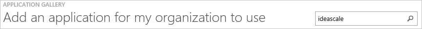
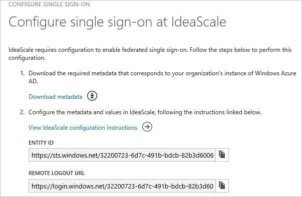
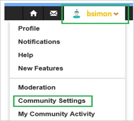
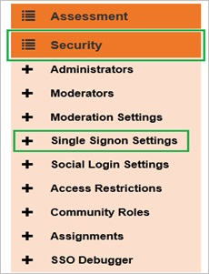
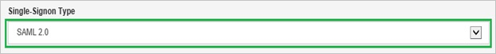
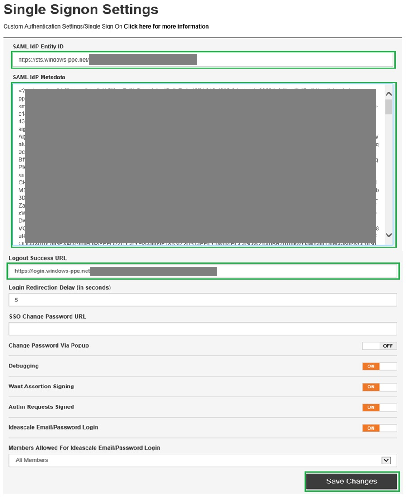
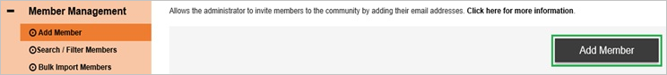
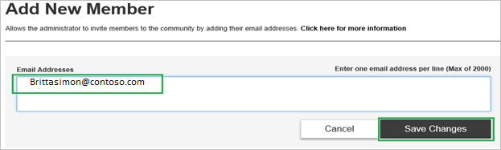

<properties 
    pageTitle="Tutorial: Azure Active Directory integration with IdeaScale | Microsoft Azure" 
    description="Learn how to use IdeaScale with Azure Active Directory to enable single sign-on, automated provisioning, and more!" 
    services="active-directory" 
    authors="jeevansd"  
    documentationCenter="na" 
    manager="femila"/>
<tags 
    ms.service="active-directory" 
    ms.devlang="na" 
    ms.topic="article" 
    ms.tgt_pltfrm="na" 
    ms.workload="identity" 
    ms.date="07/09/2016" 
    ms.author="jeedes" />

#Tutorial: Azure Active Directory integration with IdeaScale
  
The objective of this tutorial is to show the integration of Azure and IdeaScale.  
The scenario outlined in this tutorial assumes that you already have the following items:

-   A valid Azure subscription
-   A IdeaScale single sign-on enabled subscription
  
After completing this tutorial, the Azure AD users you have assigned to IdeaScale will be able to single sign into the application using the [Introduction to the Access Panel](active-directory-saas-access-panel-introduction.md).
  
The scenario outlined in this tutorial consists of the following building blocks:

1.  Enabling the application integration for IdeaScale
2.  Configuring single sign-on
3.  Configuring user provisioning
4.  Assigning users

##Enabling the application integration for IdeaScale
  
The objective of this section is to outline how to enable the application integration for IdeaScale.

###To enable the application integration for IdeaScale, perform the following steps:

1.  In the Azure classic portal, on the left navigation pane, click **Active Directory**.

    

2.  From the **Directory** list, select the directory for which you want to enable directory integration.

3.  To open the applications view, in the directory view, click **Applications** in the top menu.

    

4.  Click **Add** at the bottom of the page.

    

5.  On the **What do you want to do** dialog, click **Add an application from the gallery**.

    

6.  In the **search box**, type **IdeaScale**.

    

7.  In the results pane, select **IdeaScale**, and then click **Complete** to add the application.

    
##Configuring single sign-on
  
The objective of this section is to outline how to enable users to authenticate to IdeaScale with their account in Azure AD using federation based on the SAML protocol.  
Configuring single sign-on for IdeaScale requires you to retrieve a thumbprint value from a certificate.  
If you are not familiar with this procedure, see [How to retrieve a certificate's thumbprint value](http://youtu.be/YKQF266SAxI).

###To configure single sign-on, perform the following steps:

1.  In the Azure classic portal, on the **IdeaScale** application integration page, click **Configure single sign-on** to open the **Configure Single Sign On ** dialog.

    

2.  On the **How would you like users to sign on to IdeaScale** page, select **Microsoft Azure AD Single Sign-On**, and then click **Next**.

    

3.  On the **Configure App URL** page, in the **IdeaScale Sign On URL** textbox, type the URL used by your users to sign on to your IdeaScale application (e.g.: "*https://company.IdeaScale.com*"), and then click **Next**.

    

4.  On the **Configure single sign-on at IdeaScale** page, to download your metadata, click **Download metadata**, and then save the metadata file locally on your computer.

    

5.  In a different web browser window, log into your IdeaScale company site as an administrator.

6.  Go to **Community Settings**.

    

7.  Go to **Security \> Single Signon Settings**.

    

8.  As **Single-Signon Type**, select **SAML 2.0**.

    

9.  On the **Single Signon Settings** dialog, perform the following steps:

    

    1.  In the Azure classic portal, on the **Configure single sign-on at IdeaScale** dialog page, copy the **Entity ID** value, and then paste it into the **SAML IdP Entity ID** textbox.
    2.  Copy the content of your downloaded metadata file, and then paste it into the **SAML IdP Metadata** textbox.
    3.  In the Azure classic portal, on the **Configure single sign-on at IdeaScale** dialog page, copy the **Remote Logout URL** value, and then paste it into the **Logout Success URL** textbox.
    4.  Click **Save Changes**.

10. On the Azure classic portal, select the single sign-on configuration confirmation, and then click **Complete** to close the **Configure Single Sign On** dialog.

    
##Configuring user provisioning
  
In order to enable Azure AD users to log into IdeaScale, they must be provisioned into IdeaScale.  
In the case of IdeaScale, provisioning is a manual task.

###To configure user provisioning, perform the following steps:

1.  Log in to your **IdeaScale** company site as administrator.

2.  Go to **Community Settings**.

    

3.  Go to **Basic Settings \> Member Management**.

4.  Click **Add Member**.

    

5.  In the Add New Member section, perform the following steps:

    

    1.  In the **Email Addresses** textbox, type the email address of a valid AAD account you want to provision.
    2.  Click **Save Changes**.

    >[AZURE.NOTE] The Azure Active Directory account holder will get an email with a link to confirm the account before it becomes active.

>[AZURE.NOTE] You can use any other IdeaScale user account creation tools or APIs provided by IdeaScale to provision AAD user accounts.

##Assigning users
  
To test your configuration, you need to grant the Azure AD users you want to allow using your application access to it by assigning them.

###To assign users to IdeaScale, perform the following steps:

1.  In the Azure classic portal, create a test account.

2.  On the **IdeaScale **application integration page, click **Assign users**.

    

3.  Select your test user, click **Assign**, and then click **Yes** to confirm your assignment.

    
  
If you want to test your single sign-on settings, open the Access Panel. For more details about the Access Panel, see [Introduction to the Access Panel](active-directory-saas-access-panel-introduction.md).