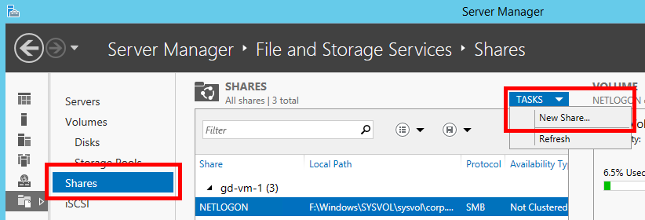
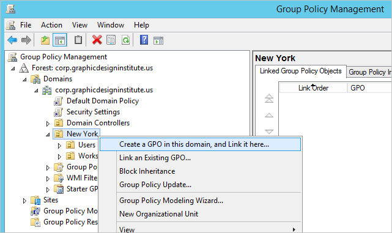
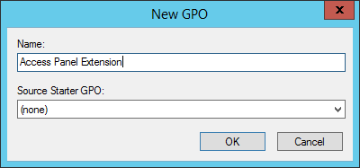

<properties
    pageTitle="How to Deploy the Access Panel Extension for Internet Explorer using Group Policy | Microsoft Azure"
    description="How to use group policy to deploy the Internet Explorer add-on for the My Apps portal."
    services="active-directory"
    documentationCenter=""
    authors="MarkusVi"
    manager="stevenpo"
    editor=""/>
<tags
    ms.service="active-directory"
    ms.devlang="na"
    ms.topic="article"
    ms.tgt_pltfrm="na"
    ms.workload="identity"
    ms.date="05/19/2016"
    ms.author="markvi;liviodlc"/>

#How to Deploy the Access Panel Extension for Internet Explorer using Group Policy

This tutorial shows how to use group policy to remotely install the Access Panel extension for Internet Explorer on your users' machines. This extension is required for Internet Explorer users who need to sign into apps that are configured using [password-based single sign-on](active-directory-appssoaccess-whatis.md#password-based-single-sign-on).

It is recommended that admins automate the deployment of this extension. Otherwise, users will have to download and install the extension themselves, which is prone to user error and requires administrator permissions. This tutorial covers one method of automating software deployments by using group policy. [Learn more about group policy.](https://technet.microsoft.com/windowsserver/bb310732.aspx)

The Access Panel extension is also available for [Chrome](https://go.microsoft.com/fwLink/?LinkID=311859) and [Firefox](https://go.microsoft.com/fwLink/?LinkID=626998), neither of which require administrator permissions to install.

##Prerequisites

- You have set up [Active Directory Domain Services](https://msdn.microsoft.com/library/aa362244%28v=vs.85%29.aspx), and you have joined your users' machines to your domain.
- You must have the "Edit settings" permission in order to edit Group Policy Objects (GPOs). By default, members of the following security groups have this permission: Domain Administrators, Enterprise Administrators, and Group Policy Creator Owners. [Learn more.](https://technet.microsoft.com/library/cc781991%28v=ws.10%29.aspx)

##Step 1: Create the Distribution Point

First, you must place the installer package on a network location that can be accessed from all of the machines that you wish to remotely install the extension on. To do this, follow these steps:

1. Log on to the server as an administrator

2. In the **Server Manager** window, go to **Files and Storage Services**.

	

3. Go to the **Shares** tab. Then click on **Tasks** > **New Share...**

	

4. Complete the **New Share Wizard** and set permissions to ensure that it can be accessed from your users' machines. [Learn more about shares.](https://technet.microsoft.com/library/cc753175.aspx)

5. Download the following Microsoft Windows Installer package (.msi file): [Access Panel Extension.msi](https://account.activedirectory.windowsazure.com/Applications/Installers/x64/Access Panel Extension.msi)

6. Copy the installer package to a desired location on the share.

	

8. Verify that your client machines are able to access the installer package from the share. 

##Step 2: Create the Group Policy Object

1. Log on to the server that hosts your Active Directory Domain Services (AD DS) installation.

2. In the Server Manager, go to **Tools** > **Group Policy Management**.

	

3. In the left pane of the **Group Policy Management** window, view your Organizational Unit (OU) hierarchy and determine at which scope you would like to apply the group policy. For instance, you may decide to pick a small OU to deploy to a few users for testing, or you may pick a top-level OU to deploy to your entire organization.

	> [AZURE.NOTE] If you would like to create or edit your Organization Units (OUs), switch back to the Server Manager and go to **Tools** > **Active Directory Users and Computers**.

4. Once you have selected an OU, right-click on it and select **Create a GPO in this domain, and Link it here...**

	

5. In the **New GPO** prompt, type in a name for the new Group Policy Object.

	

6. Right-click on the Group Policy Object that you just created, and select **Edit**.

	

##Step 3: Assign the Installation Package

1. Determine whether you would like to deploy the extension based on **Computer Configuration** or **User Configuration**. When using [computer configuration](https://technet.microsoft.com/library/cc736413%28v=ws.10%29.aspx), the extension will be installed on the computer regardless of which users log on to it. On the other hand, with [user configuration](https://technet.microsoft.com/library/cc781953%28v=ws.10%29.aspx), users will have the extension installed for them regardless of which computers they log on to.

2. In the left pane of the **Group Policy Management Editor** window, go to either of the following folder paths, depending on which type of configuration you chose:
	- `Computer Configuration/Policies/Software Settings/`
	- `User Configuration/Policies/Software Settings/`

3. Right-click on **Software installation**, then select **New** > **Package...**

	

4. Go to the shared folder that contains the installer package from [Step 1: Create the Distribution Point](#step-1-create-the-distribution-point), select the .msi file, and click **Open**.

	> [AZURE.IMPORTANT] If the share is located on this same server, verify that you are accessing the .msi through the network file path, rather than the local file path.

	

5. In the **Deploy Software** prompt, select **Assigned** for your deployment method. Then click **OK**.

	

The extension is now deployed to the OU that you selected. [Learn more about Group Policy Software Installation.](https://technet.microsoft.com/library/cc738858%28v=ws.10%29.aspx)

##Step 4: Auto-Enable the Extension for Internet Explorer 

In addition to running the installer, every extension for Internet Explorer must be explicitly enabled before it can be used. Follow the steps below to enable the Access Panel Extension using group policy:

1. In the **Group Policy Management Editor** window, go to either of the following paths, depending on which type of configuration you chose in [Step 3: Assign the Installation Package](#step-3-assign-the-installation-package):
	- `Computer Configuration/Policies/Administrative Templates/Windows Components/Internet Explorer/Security Features/Add-on Management`
	- `User Configuration/Policies/Administrative Templates/Windows Components/Internet Explorer/Security Features/Add-on Management`

2. Right-click on **Add-on List**, and select **Edit**.
	

3. In the **Add-on List** window, select **Enabled**. Then, under the **Options** section, click **Show...**.

	

4. In the **Show Contents** window, perform the following steps:

	1. For the first column (the **Value Name** field), copy and paste the following Class ID: `{030E9A3F-7B18-4122-9A60-B87235E4F59E}`

	2. For the second column (the **Value** field), type in the following value: `1`

	3. Click **OK** to close the **Show Contents** window.

	

5. Click **OK** to apply your changes and close the **Add-on List** window.

The extension should now be enabled for the machines in the selected OU. [Learn more about using group policy to enable or disable Internet Explorer add-ons.](https://technet.microsoft.com/library/dn454941.aspx)

##Step 5 (Optional): Disable "Remember Password" Prompt

When users sign-in to websites using the Access Panel Extension, Internet Explorer may show the following prompt asking "Would you like to store your password?"

If you wish to prevent your users from seeing this prompt, then follow the steps below to prevent auto-complete from remembering passwords:

1. In the **Group Policy Management Editor** window, go to the path listed below. Note that this configuration setting is only available under **User Configuration**.
	- `User Configuration/Policies/Administrative Templates/Windows Components/Internet Explorer/`

2. Find the setting named **Turn on the auto-complete feature for user names and passwords on forms**.

	> [AZURE.NOTE] Previous versions of Active Directory may list this setting with the name **Do not allow auto-complete to save passwords**. The configuration for that setting differs from the setting described in this tutorial.

	

3. Right click on the above setting, and select **Edit**.

4. In the window titled **Turn on the auto-complete feature for user names and passwords on forms**, select **Disabled**.

	

5. Click **OK** to apply these changes and close the window.

Users will no longer be able to store their credentials or use auto-complete to access previously stored credentials. However, this policy does allow users to continue to use auto-complete for other types of form fields, such as search fields.

> [AZURE.WARNING] If this policy is enabled after users have chosen to store some credentials, this policy will *not* clear the credentials that have already been stored.

##Step 6: Testing the Deployment

Follow the steps below to verify if the extension deployment was successful:

1. If you deployed using **Computer Configuration**, sign into a client machine that belongs to the OU that you selected in [Step 2: Create the Group Policy Object](#step-2-create-the-group-policy-object). If you deployed using **User Configuration**, make sure to sign in as a user who belongs to that OU.

2. It may take a couple sign ins for the group policy changes to fully update with this machine. To force the update, open a **Command Prompt** window and run the following command: `gpupdate /force`

3. You will need to restart the machine for the installation to take place. Bootup may take significantly more time than usual while the extension installs.

4. After restarting, open **Internet Explorer**. On the upper-right corner of the window, click on **Tools** (the gear icon), and then select **Manage add-ons**.

	

5. In the **Manage Add-ons** window, verify that the **Access Panel Extension** has been installed and that its **Status** has been set to **Enabled**.

	

## Related Articles

- [Article Index for Application Management in Azure Active Directory](active-directory-apps-index.md)
- [Application access and single sign-on with Azure Active Directory](active-directory-appssoaccess-whatis.md)
- [Troubleshooting the Access Panel Extension for Internet Explorer](active-directory-saas-ie-troubleshooting.md)
