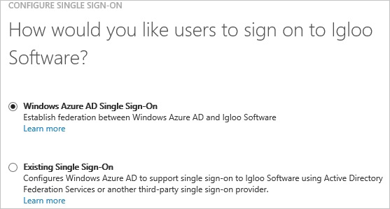
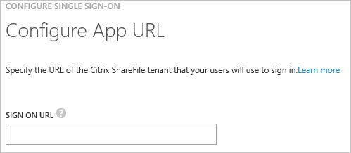
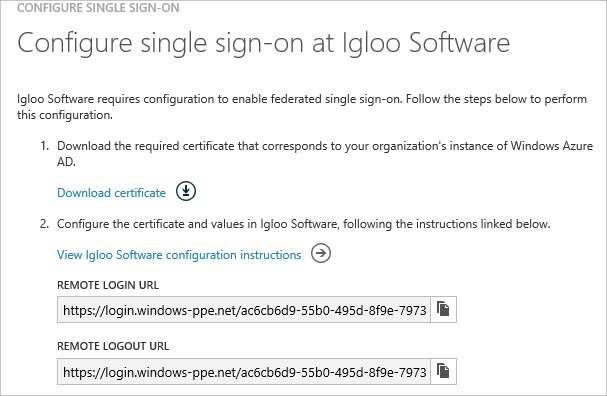
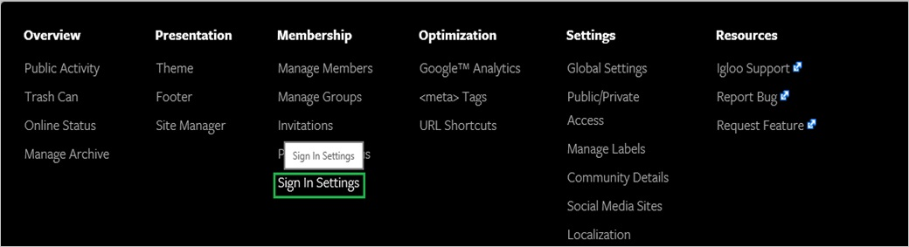
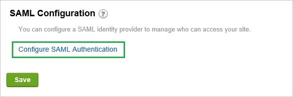
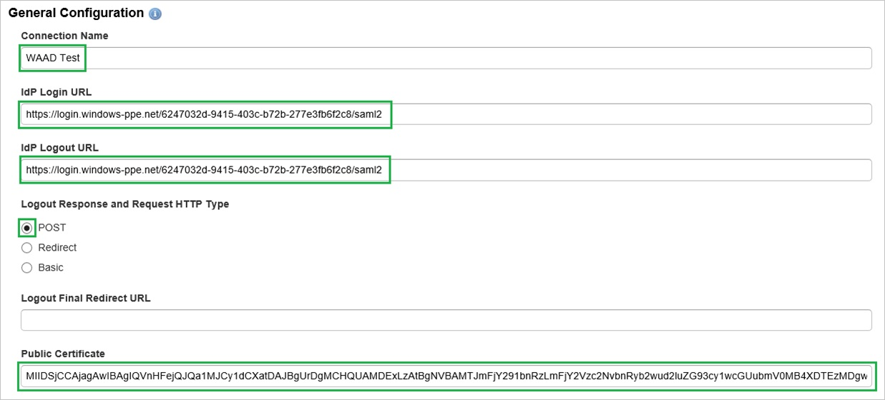
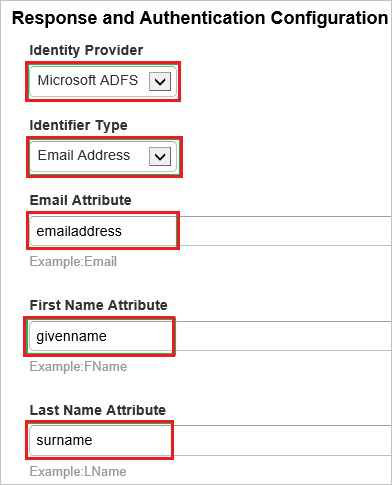
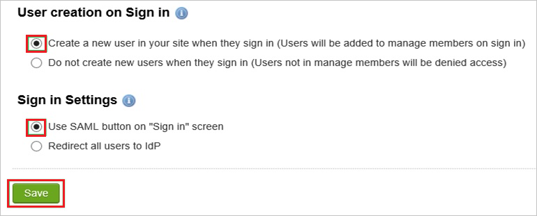
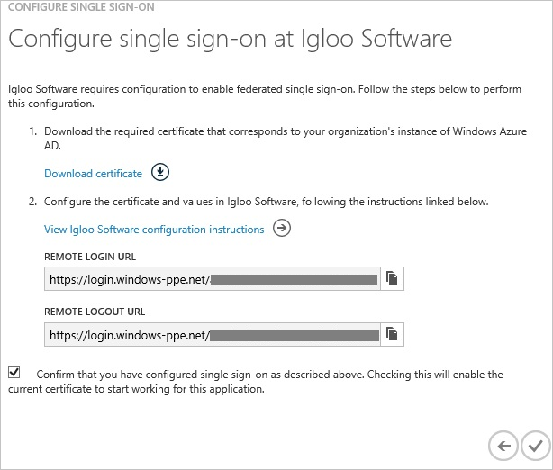
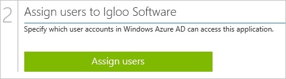

<properties 
    pageTitle="Tutorial: Azure Active Directory integration with Igloo Software | Microsoft Azure" 
    description="Learn how to use Igloo Software with Azure Active Directory to enable single sign-on, automated provisioning, and more!" 
    services="active-directory" 
    authors="jeevansd"  
    documentationCenter="na" 
    manager="stevenpo"/>
<tags 
    ms.service="active-directory" 
    ms.devlang="na" 
    ms.topic="article" 
    ms.tgt_pltfrm="na" 
    ms.workload="identity" 
    ms.date="05/16/2016" 
    ms.author="jeedes" />

#Tutorial: Azure Active Directory integration with Igloo Software
  
The objective of this tutorial is to show the integration of Azure and Igloo Software.  
The scenario outlined in this tutorial assumes that you already have the following items:

-   A valid Azure subscription
-   An [Igloo Software](http://www.igloosoftware.com/) Single sign on enabled subscription
  
After completing this tutorial, the Azure AD users you have assigned to Igloo Software will be able to single sign into the application at your Igloo Software company site (service provider initiated sign on), or using the [Introduction to the Access Panel](active-directory-saas-access-panel-introduction.md).
  
The scenario outlined in this tutorial consists of the following building blocks:

1.  Enabling the application integration for Igloo Software
2.  Configuring single sign-on
3.  Configuring user provisioning
4.  Assigning users

##Enabling the application integration for Igloo Software
  
The objective of this section is to outline how to enable the application integration for Igloo Software.

###To enable the application integration for Igloo Software, perform the following steps:

1.  In the Azure classic portal, on the left navigation pane, click **Active Directory**.

    

2.  From the **Directory** list, select the directory for which you want to enable directory integration.

3.  To open the applications view, in the directory view, click **Applications** in the top menu.

    

4.  Click **Add** at the bottom of the page.

    

5.  On the **What do you want to do** dialog, click **Add an application from the gallery**.

    

6.  In the **search box**, type **Igloo Software**.

    

7.  In the results pane, select **Igloo Software**, and then click **Complete** to add the application.

    
##Configuring single sign-on
  
The objective of this section is to outline how to enable users to authenticate to Igloo Software with their account in Azure AD using federation based on the SAML protocol.  
As part of this procedure, you are required to upload a base-64 encoded certificate to your Central Desktop tenant.  
If you are not familiar with this procedure, see [How to convert a binary certificate into a text file](http://youtu.be/PlgrzUZ-Y1o).

###To configure single sign-on, perform the following steps:

1.  In the Azure classic portal, on the **Igloo Software** application integration page, click **Configure single sign-on** to open the **Configure Single Sign On ** dialog.

    

2.  On the **How would you like users to sign on to Igloo Software** page, select **Microsoft Azure AD Single Sign-On**, and then click **Next**.

    

3.  On the **Configure App URL** page, in the **Igloo Software Sign In URL** textbox, type your URL using the following pattern "*https://company.igloocommunities.com/?signin*", and then click **Next**.

    

4.  On the **Configure single sign-on at Igloo Software** page, to download your certificate, click **Download certificate**, and then save the certificate file locally on your computer.

    

5.  In a different web browser window, log into your Igloo Software company site as an administrator.

6.  Go to the **Control Panel**.

    

7.  In the **Membership** tab, click **Sign In Settings**.

    

8.  In the SAML Configuration section, click **Configure SAML Authentication**.

    

9.  In the **General Configuration** section, perform the following steps:

    

    1.  In the **Connection Name** textbox, type a custom name for your configuration.
    2.  In the Azure classic portal, on the **Configure single sign-on at Igloo Software** dialogue page, copy the **Remote Login URL** value, and then paste it into the **IdP Login URL** textbox.
    3.  In the Azure classic portal, on the **Configure single sign-on at Igloo Software** dialogue page, copy the **Remote Logout URL** value, and then paste it into the **IdP Logout URL** textbox.
    4.  As **Logout Response and Request HTTP Type**, select **POST**.
    5.  Create a text file from the downloaded certificate.
        
		>[AZURE.TIP]For more details, see [How to convert a binary certificate into a text file](http://youtu.be/PlgrzUZ-Y1o)

    6.  Remove the first line and the last line from the text file version of your certificate, copy the remaining certificate text, and then paste it into the **Public Certificate** textbox.

10. In the **Response and Authentication Configuration**, perform the following steps:

    

    1.  As **Identity Provider**, select **Microsoft ADFS**.
    2.  As **Identifier Type**, select **Email Address**.
    3.  In the **Email Attribute** textbox, type **emailaddress**.
    4.  In the **First Name Attribute** textbox, type **givenname**.
    5.  In the **Last Name Attribute** textbox, type **surname**.

11. Preform the following steps to complete the configuration:

    

    1.  As **User creation on Sign in**, select **Create a new user in your site when they sign in**.
    2.  As **Sign in Settings**, select **Use SAML button on “Sign in” screen**.
    3.  Click **Save**.

12. On the Azure classic portal, select the single sign-on configuration confirmation, and then click **Complete** to close the **Configure Single Sign On** dialog.

    
##Configuring user provisioning
  
There is no action item for you to configure user provisioning to Igloo Software.  
When an assigned user tries to log into Igloo Software using the access panel, Igloo Software checks whether the user exists.  
If there is no user account available yet, it is automatically created by Igloo Software.
##Assigning users
  
To test your configuration, you need to grant the Azure AD users you want to allow using your application access to it by assigning them.

###To assign users to Igloo Software, perform the following steps:

1.  In the Azure classic portal, create a test account.

2.  On the **Igloo Software **application integration page, click **Assign users**.

    

3.  Select your test user, click **Assign**, and then click **Yes** to confirm your assignment.

    
  
If you want to test your single sign-on settings, open the Access Panel. For more details about the Access Panel, see [Introduction to the Access Panel](active-directory-saas-access-panel-introduction.md).