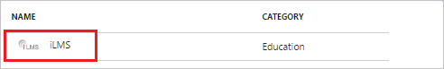
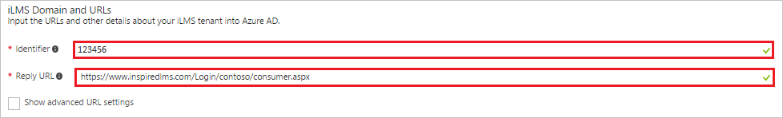
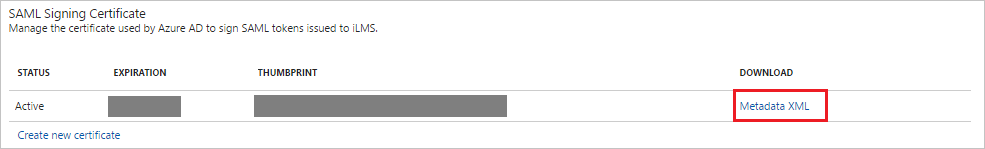
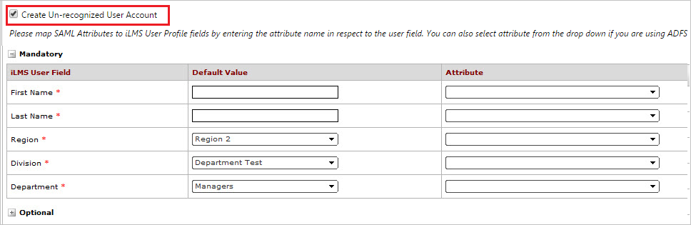
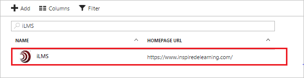

# Tutorial: Azure Active Directory integration with iLMS

In this tutorial, you learn how to integrate iLMS with Azure Active Directory (Azure AD).

Integrating iLMS with Azure AD provides you with the following benefits:

- You can control in Azure AD who has access to iLMS
- You can enable your users to automatically get signed-on to iLMS (Single Sign-On) with their Azure AD accounts
- You can manage your accounts in one central location - the Azure portal

If you want to know more details about SaaS app integration with Azure AD, see [what is application access and single sign-on with Azure Active Directory](active-directory-appssoaccess-whatis.md).

## Prerequisites

To configure Azure AD integration with iLMS, you need the following items:

- An Azure AD subscription
- An iLMS single-sign on enabled subscription

> [!NOTE]
> To test the steps in this tutorial, we do not recommend using a production environment.

To test the steps in this tutorial, you should follow these recommendations:

- You should not use your production environment, unless this is necessary.
- If you don't have an Azure AD trial environment, you can get a one-month trial [here](https://azure.microsoft.com/pricing/free-trial/).

## Scenario description
In this tutorial, you test Azure AD single sign-on in a test environment. 
The scenario outlined in this tutorial consists of two main building blocks:

1. Adding iLMS from the gallery
2. Configuring and testing Azure AD single sign-on

## Adding iLMS from the gallery
To configure the integration of iLMS into Azure AD, you need to add iLMS from the gallery to your list of managed SaaS apps.

**To add iLMS from the gallery, perform the following steps:**

1. In the **[Azure portal](https://portal.azure.com)**, on the left navigation panel, click **Azure Active Directory** icon. 

	![Active Directory][1]

2. Navigate to **Enterprise applications**. Then go to **All applications**.

	![Applications][2]
	
3. To add new application, click **New application** button on the top of the dialog.

	![Applications][3]

4. In the search box, type **iLMS**.

	

5. In the results panel, select **iLMS**, then click **Add** button to add the application.

	

##  Configuring and testing Azure AD single sign-on
In this section, you configure and test Azure AD single sign-on with iLMS based on a test user called "Britta Simon".

For single sign-on to work, Azure AD needs to know what the counterpart user in iLMS is to a user in Azure AD. In other words, a link relationship between an Azure AD user and the related user in iLMS needs to be established.

This link relationship is established by assigning the value of the **user name** in Azure AD as the value of the **Username** in iLMS.

To configure and test Azure AD single sign-on with iLMS, you need to complete the following building blocks:

1. **[Configuring Azure AD Single Sign-On](#configuring-azure-ad-single-sign-on)** - to enable your users to use this feature.
2. **[Creating an Azure AD test user](#creating-an-azure-ad-test-user)** - to test Azure AD single sign-on with Britta Simon.
3. **[Creating an iLMS test user](#creating-an-ilms-test-user)** - to have a counterpart of Britta Simon in iLMS that is linked to the Azure AD representation of her.
4. **[Assigning the Azure AD test user](#assigning-the-azure-ad-test-user)** - to enable Britta Simon to use Azure AD single sign-on.
5. **[Testing Single Sign-On](#testing-single-sign-on)** - to verify whether the configuration works.

### Configuring Azure AD single sign-on

In this section, you enable Azure AD single sign-on in the Azure portal and configure single sign-on in your iLMS application.

**To configure Azure AD single sign-on with iLMS, perform the following steps:**

1. In the Azure portal, on the **iLMS** application integration page, click **Single sign-on**.

	![Configure Single Sign-On][4]

2. On the **Single sign-on** dialog, select **Mode** as	**SAML-based Sign-on** to enable single sign-on.
 
	

3. On the **iLMS Domain and URLs** section, perform the following steps if you wish to configure the application in **IDP** initiated mode:

	

    a. In the **Identifier** textbox, paste the **Identifier** value you copy from **Service Provider** section of SAML settings in iLMS admin portal.

	b. In the **Reply URL** textbox, paste the **Endpoint (URL)** value you copy from **Service Provider** section of SAML settings in iLMS admin portal having the following pattern `https://www.inspiredlms.com/Login/<instanceName>/consumer.aspx`

	>[!Note]
	>This '123456' is an example value of identifier.

4. Check **Show advanced URL settings**, if you wish to configure the application in **SP** initiated mode:

	

    In the **Sign-on URL** textbox, paste the **Endpoint (URL)** value you copy from **Service Provider** section of SAML settings in iLMS admin portal as `https://www.inspiredlms.com/Login/<instanceName>/consumer.aspx`		

5. To enable JIT provisioning, iLMS application expects the SAML assertions in a specific format. Configure the following claims for this application. You can manage the values of these attributes from the **User Attributes** section on application integration page. The following screenshot shows an example for this.
	
	
	
	Create **Department, Region** and **Division** attributes and add the name of these attributes in iLMS. All these attributes shown above are required.	

	> [!NOTE] 
	> You have to enable **Create Un-recognized User Account** in iLMS to map these attributes. Follow the instructions [here](http://support.inspiredelearning.com/customer/portal/articles/2204526) to get an idea on the attributes configuration.

6. In the **User Attributes** section on the **Single sign-on** dialog, configure SAML token attribute as shown in the image above and perform the following steps:
    
	| Attribute Name | Attribute Value |
	| ---------------| --------------- |    
	| division | user.department |
	| region | user.state |
	| department | user.jobtitle |

	a. Click **Add attribute** to open the **Add Attribute** dialog.

	

	
	
	b. In the **Name** textbox, type the attribute name shown for that row.
	
	c. From the **Value** list, type the attribute value shown for that row.
	
	d. Click **Ok**

7. On the **SAML Signing Certificate** section, click **Metadata XML** and then save the XML file on your computer.

	 

8. Click **Save** button.

	

9. In a different web browser window, log in to your **iLMS admin portal** as an administrator.

10. Click **SSO:SAML** under **Settings** tab to open SAML settings and perform the following steps:
    
	 

	a. Expand the **Service Provider** section and copy the **Identifier** and **Endpoint (URL)** value.

	 

	b. Under **Identity Provider** section, click **Import Metadata**.
    
    c. Select the **Metadata** file downloaded from Azure Portal from **SAML Signing Certificate** section.

     

	d. If you want to enable JIT provisioning to create iLMS accounts for un-recognize users, follow below steps:
		
	   - Check **Create Un-recognized User Account**.
	   
	   

	   -  Map the attributes in Azure AD with the attributes in iLMS. In the attribute column, specify the attributes name or the default value.

	e. Go to **Business Rules** tab and perform the following steps: 
		
	   

	   - Check **Create Un-recognized Regions, Divisions and Departments** to create Regions, Divisions, and Departments that do not already exist at the time of Single Sign-on.
		
	   - Check **Update User Profile During Sign-in** to specify whether the user’s profile is updated with each Single Sign-on. 
		
	   - If the **“Update Blank Values for Non Mandatory Fields in User Profile”** option is checked, optional profile fields that are blank upon sign in will also cause the user’s iLMS profile to contain blank values for those fields.
		
	   - Check **Send Error Notification Email** and enter the email of the user where you want to receive the error notification email.

11. Click **Save** button to save the settings.

	

> [!TIP]
> You can now read a concise version of these instructions inside the [Azure portal](https://portal.azure.com), while you are setting up the app!  After adding this app from the **Active Directory > Enterprise Applications** section, simply click the **Single Sign-On** tab and access the embedded documentation through the **Configuration** section at the bottom. You can read more about the embedded documentation feature here: [Azure AD embedded documentation]( https://go.microsoft.com/fwlink/?linkid=845985)
    
### Creating an Azure AD test user
The objective of this section is to create a test user in the Azure portal called Britta Simon.

![Create Azure AD User][100]

**To create a test user in Azure AD, perform the following steps:**

1. In the **Azure portal**, on the left navigation pane, click **Azure Active Directory** icon.

	 

2. Go to **Users and groups** and click **All users** to display the list of users.
	
	 

3. At the top of the dialog click **Add** to open the **User** dialog.
 
	 

4. On the **User** dialog page, perform the following steps:
 
	 

    a. In the **Name** textbox, type **BrittaSimon**.

    b. In the **User name** textbox, type the **email address** of BrittaSimon.

	c. Select **Show Password** and write down the value of the **Password**.

    d. Click **Create**.
 
### Creating an iLMS test user

Application supports Just in time user provisioning and after authentication users are created in the application automatically. JIT will work, if you have clicked the **Create Un-recognized User Account** checkbox during SAML configuration setting at iLMS admin portal.

If you need to create an user manually, then follow below steps :

1. Log in to your iLMS company site as an administrator.

2. Click **“Register User”** under **Users** tab to open **Register User** page. 
   
   

3. On the **“Register User”** page, perform the following steps.

	

	a. In the **First Name** textbox, type the first name Britta.
   
    b. In the **Last Name** textbox, type the last name Simon.

	c. In the **Email ID** textbox, type the email address of Britta Simon account.

	d. In the **Region** dropdown, select the value for region.

	e. In the **Division** dropdown, select the value for division.

	f. In the **Department** dropdown, select the value for department.

    g. Click **Save**.

    > [!NOTE] 
	> You can send registration mail to user by selecting **Send Registration Mail** checkbox.

### Assigning the Azure AD test user

In this section, you enable Britta Simon to use Azure single sign-on by granting her access to iLMS.

![Assign User][200] 

**To assign Britta Simon to iLMS, perform the following steps:**

1. In the Azure portal, open the applications view, and then navigate to the directory view and go to **Enterprise applications** then click **All applications**.

	![Assign User][201] 

2. In the applications list, select **iLMS**.

	 

3. In the menu on the left, click **Users and groups**.

	![Assign User][202] 

4. Click **Add** button. Then select **Users and groups** on **Add Assignment** dialog.

	![Assign User][203]

5. On **Users and groups** dialog, select **Britta Simon** in the Users list.

6. Click **Select** button on **Users and groups** dialog.

7. Click **Assign** button on **Add Assignment** dialog.
	
### Testing single sign-on

In this section, you test your Azure AD single sign-on configuration using the Access Panel.

When you click the iLMS tile in the Access Panel, you should get automatically signed-on to your iLMS application.

## Additional resources

* [List of Tutorials on How to Integrate SaaS Apps with Azure Active Directory](active-directory-saas-tutorial-list.md)
* [What is application access and single sign-on with Azure Active Directory?](active-directory-appssoaccess-whatis.md)

<!--Image references-->

[1]: ./media/active-directory-saas-ilms-tutorial/tutorial_general_01.png
[2]: ./media/active-directory-saas-ilms-tutorial/tutorial_general_02.png
[3]: ./media/active-directory-saas-ilms-tutorial/tutorial_general_03.png
[4]: ./media/active-directory-saas-ilms-tutorial/tutorial_general_04.png

[100]: ./media/active-directory-saas-ilms-tutorial/tutorial_general_100.png

[200]: ./media/active-directory-saas-ilms-tutorial/tutorial_general_200.png
[201]: ./media/active-directory-saas-ilms-tutorial/tutorial_general_201.png
[202]: ./media/active-directory-saas-ilms-tutorial/tutorial_general_202.png
[203]: ./media/active-directory-saas-ilms-tutorial/tutorial_general_203.png

