# Tutorial: Azure Active Directory integration with Image Relay

In this tutorial, you learn how to integrate Image Relay with Azure Active Directory (Azure AD).

Integrating Image Relay with Azure AD provides you with the following benefits:

- You can control in Azure AD who has access to Image Relay
- You can enable your users to automatically get signed-on to Image Relay (Single Sign-On) with their Azure AD accounts
- You can manage your accounts in one central location - the Azure portal

If you want to know more details about SaaS app integration with Azure AD, see [what is application access and single sign-on with Azure Active Directory](active-directory-appssoaccess-whatis.md).

## Prerequisites

To configure Azure AD integration with Image Relay, you need the following items:

- An Azure AD subscription
- An Image Relay single sign-on enabled subscription

> [!NOTE]
> To test the steps in this tutorial, we do not recommend using a production environment.

To test the steps in this tutorial, you should follow these recommendations:

- Do not use your production environment, unless it is necessary.
- If you don't have an Azure AD trial environment, you can get a one-month trial [here](https://azure.microsoft.com/pricing/free-trial/).

## Scenario description
In this tutorial, you test Azure AD single sign-on in a test environment. 
The scenario outlined in this tutorial consists of two main building blocks:

1. Adding Image Relay from the gallery
2. Configuring and testing Azure AD single sign-on

## Adding Image Relay from the gallery
To configure the integration of Image Relay into Azure AD, you need to add Image Relay from the gallery to your list of managed SaaS apps.

**To add Image Relay from the gallery, perform the following steps:**

1. In the **[Azure portal](https://portal.azure.com)**, on the left navigation panel, click **Azure Active Directory** icon. 

	![Active Directory][1]

2. Navigate to **Enterprise applications**. Then go to **All applications**.

	![Applications][2]
	
3. To add new application, click **New application** button on the top of dialog.

	![Applications][3]

4. In the search box, type **Image Relay**.

	

5. In the results panel, select **Image Relay**, and then click **Add** button to add the application.

	

##  Configuring and testing Azure AD single sign-on
In this section, you configure and test Azure AD single sign-on with Image Relay based on a test user called "Britta Simon".

For single sign-on to work, Azure AD needs to know what the counterpart user in Image Relay is to a user in Azure AD. In other words, a link relationship between an Azure AD user and the related user in Image Relay needs to be established.

In Image Relay, assign the value of the **user name** in Azure AD as the value of the **Username** to establish the link relationship.

To configure and test Azure AD single sign-on with Image Relay, you need to complete the following building blocks:

1. **[Configuring Azure AD Single Sign-On](#configuring-azure-ad-single-sign-on)** - to enable your users to use this feature.
2. **[Creating an Azure AD test user](#creating-an-azure-ad-test-user)** - to test Azure AD single sign-on with Britta Simon.
3. **[Creating an Image Relay test user](#creating-an-image-relay-test-user)** - to have a counterpart of Britta Simon in Image Relay that is linked to the Azure AD representation of user.
4. **[Assigning the Azure AD test user](#assigning-the-azure-ad-test-user)** - to enable Britta Simon to use Azure AD single sign-on.
5. **[Testing Single Sign-On](#testing-single-sign-on)** - to verify whether the configuration works.

### Configuring Azure AD single sign-on

In this section, you enable Azure AD single sign-on in the Azure portal and configure single sign-on in your Image Relay application.

**To configure Azure AD single sign-on with Image Relay, perform the following steps:**

1. In the Azure portal, on the **Image Relay** application integration page, click **Single sign-on**.

	![Configure Single Sign-On][4]

2. On the **Single sign-on** dialog, select **Mode** as	**SAML-based Sign-on** to enable single sign-on.
 
	

3. On the **Image Relay Domain and URLs** section, perform the following steps:

	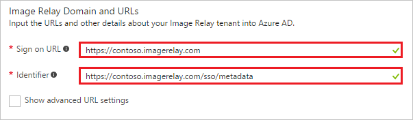

    a. In the **Sign-on URL** textbox, type a URL using the following pattern: `https://<companyname>.imagerelay.com/`

	b. In the **Identifier** textbox, type a URL using the following pattern: `https://<companyname>.imagerelay.com/sso/metadata`

	> [!NOTE] 
	> These values are not real. Update these values with the actual Sign-On URL and Identifier. Contact [Image Relay Client support team](http://support.imagerelay.com/) to get these values. 
 

4. On the **SAML Signing Certificate** section, click **Certificate(Base64)** and then save the certificate file on your computer.

	 

5. Click **Save** button.

	

6. On the **Image Relay Configuration** section, click **Configure Image Relay** to open **Configure sign-on** window. Copy the **Sign-Out Service URL and SAML Single Sign-On Service URL** from the **Quick Reference section.**

	 

7. In another browser window, sign in to your Image Relay company site as an administrator.

8. In the toolbar on the top, click the **Users & Permissions** workload.
   
    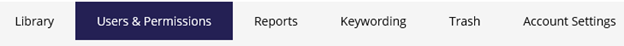 

9. Click **Create New Permission**.
   
    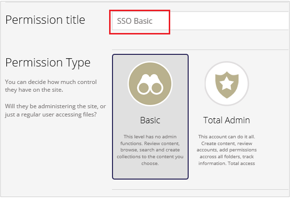

10. In the **Single Sign On Settings** workload, select the **This Group can only sign-in via Single Sign On** check box, and then click **Save**.
   
    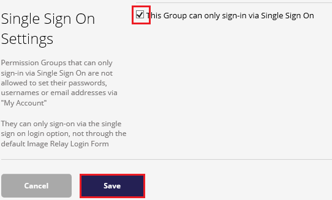 

11. Go to **Account Settings**.
   
    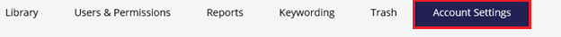 

12. Go to the **Single Sign On Settings** workload.
    
     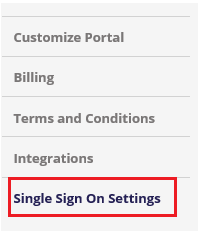

13. On the **SAML Settings** dialog, perform the following steps:
    
	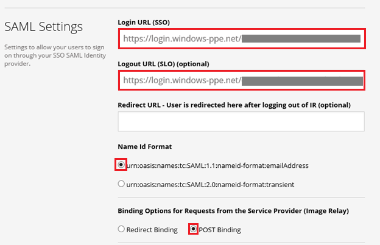
    
    a.In **Login URL** textbox, paste the value of **Single Sign-On Service URL** which you have copied from Azure Portal.

    b.In **Logout URL**  textbox, paste the value of **Single Sign-Out Service URL** which you have copied from Azure Portal.

    c. As **Name Id Format**, select **urn:oasis:names:tc:SAML:1.1:nameid-format:emailAddress**.

    d. As **Binding Options for Requests from the Service Provider (Image Relay)**, select **POST Binding**.

    e. Under **x.509 Certificate**, click **Update Certificate**.

    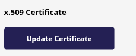

    f. Open the downloaded certificate in notepad, copy the content, and then paste it into the x.509 Certificate textbox.

    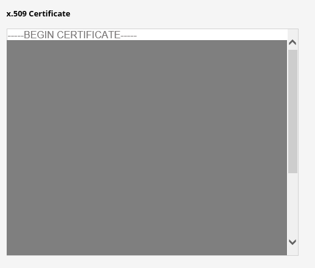

    g. In **Just-In-Time User Provisioning** section, select the **Enable Just-In-Time User Provisioning**.

    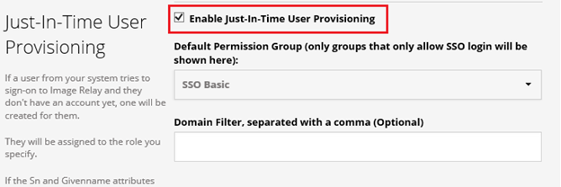

    h. Select the permission group (for example, **SSO Basic**) which is allowed to sign in only through single sign-on.

    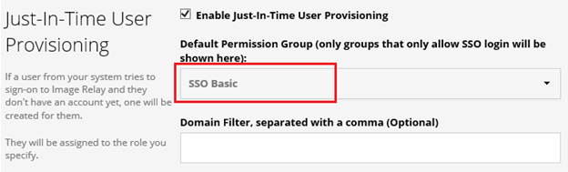

    i. Click **Save**.

> [!TIP]
> You can now read a concise version of these instructions inside the [Azure portal](https://portal.azure.com), while you are setting up the app!  After adding this app from the **Active Directory > Enterprise Applications** section, simply click the **Single Sign-On** tab and access the embedded documentation through the **Configuration** section at the bottom. You can read more about the embedded documentation feature here: [Azure AD embedded documentation]( https://go.microsoft.com/fwlink/?linkid=845985)

### Creating an Azure AD test user
The objective of this section is to create a test user in the Azure portal called Britta Simon.

![Create Azure AD User][100]

**To create a test user in Azure AD, perform the following steps:**

1. In the **Azure portal**, on the left navigation pane, click **Azure Active Directory** icon.

	 

2. To display the list of users, go to **Users and groups** and click **All users**.
	
	 

3. To open the **User** dialog, click **Add** on the top of the dialog.
 
	 

4. On the **User** dialog page, perform the following steps:
 
	 

    a. In the **Name** textbox, type **BrittaSimon**.

    b. In the **User name** textbox, type the **email address** of BrittaSimon.

	c. Select **Show Password** and write down the value of the **Password**.

    d. Click **Create**.
 
### Creating an Image Relay test user

The objective of this section is to create a user called Britta Simon in Image Relay.

**To create a user called Britta Simon in Image Relay, perform the following steps:**

1. Sign-on to your Image Relay company site as an administrator.

2. Go to **Users & Permissions**     and select **Create SSO User**.
   
    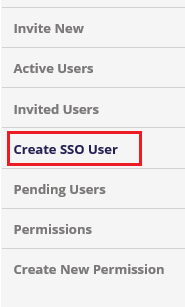 

3. Enter the **Email**, **First Name**, **Last Name**, and **Company** of the user you want to provision and select the permission group (for example, SSO Basic) which is the group that can sign in only through single sign-on.
   
    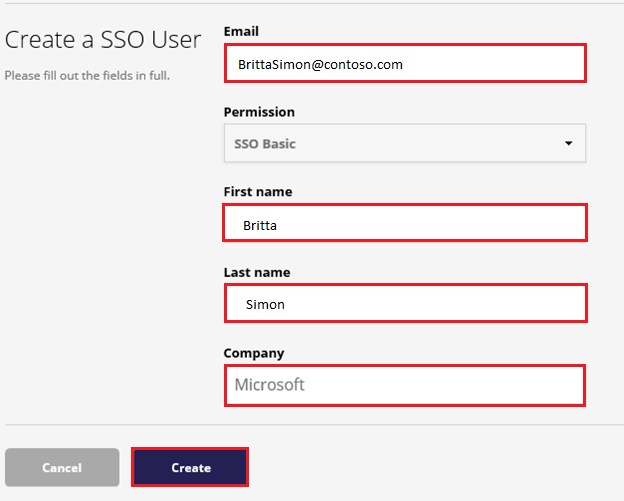 

4. Click **Create**.

### Assigning the Azure AD test user

In this section, you enable Britta Simon to use Azure single sign-on by granting access to Image Relay.

![Assign User][200] 

**To assign Britta Simon to Image Relay, perform the following steps:**

1. In the Azure portal, open the applications view, and then navigate to the directory view and go to **Enterprise applications** then click **All applications**.

	![Assign User][201] 

2. In the applications list, select **Image Relay**.

	 

3. In the menu on the left, click **Users and groups**.

	![Assign User][202] 

4. Click **Add** button. Then select **Users and groups** on **Add Assignment** dialog.

	![Assign User][203]

5. On **Users and groups** dialog, select **Britta Simon** in the Users list.

6. Click **Select** button on **Users and groups** dialog.

7. Click **Assign** button on **Add Assignment** dialog.
	
### Testing single sign-on

The objective of this section is to test your Azure AD single sign-on configuration using the Access Panel.    

When you click the Image Relay tile in the Access Panel, you should get automatically signed-on to your Image Relay application.

## Additional resources

* [List of Tutorials on How to Integrate SaaS Apps with Azure Active Directory](active-directory-saas-tutorial-list.md)
* [What is application access and single sign-on with Azure Active Directory?](active-directory-appssoaccess-whatis.md)

<!--Image references-->

[1]: ./media/active-directory-saas-imagerelay-tutorial/tutorial_general_01.png
[2]: ./media/active-directory-saas-imagerelay-tutorial/tutorial_general_02.png
[3]: ./media/active-directory-saas-imagerelay-tutorial/tutorial_general_03.png
[4]: ./media/active-directory-saas-imagerelay-tutorial/tutorial_general_04.png

[100]: ./media/active-directory-saas-imagerelay-tutorial/tutorial_general_100.png

[200]: ./media/active-directory-saas-imagerelay-tutorial/tutorial_general_200.png
[201]: ./media/active-directory-saas-imagerelay-tutorial/tutorial_general_201.png
[202]: ./media/active-directory-saas-imagerelay-tutorial/tutorial_general_202.png
[203]: ./media/active-directory-saas-imagerelay-tutorial/tutorial_general_203.png

