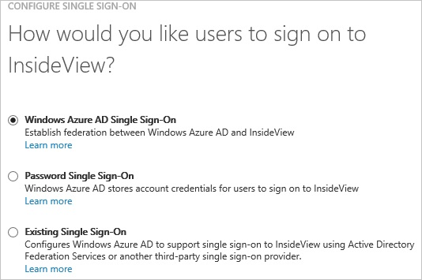
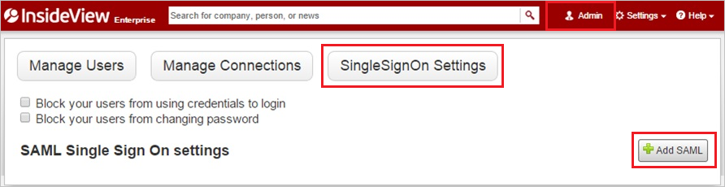
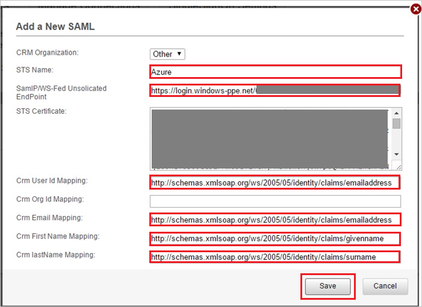

<properties 
    pageTitle="Tutorial: Azure Active Directory integration with InsideView | Microsoft Azure" 
    description="Learn how to use InsideView with Azure Active Directory to enable single sign-on, automated provisioning, and more!" 
    services="active-directory" 
    authors="jeevansd"  
    documentationCenter="na" 
	manager="femila"/>
<tags 
    ms.service="active-directory" 
    ms.devlang="na" 
    ms.topic="article" 
    ms.tgt_pltfrm="na" 
    ms.workload="identity" 
    ms.date="07/09/2016" 
    ms.author="jeedes" />

#Tutorial: Azure Active Directory integration with InsideView
  
The objective of this tutorial is to show the integration of Azure and InsideView.  
The scenario outlined in this tutorial assumes that you already have the following items:

-   A valid Azure subscription
-   A InsideView tenant
  
After completing this tutorial, the Azure AD users you have assigned to InsideView will be able to single sign into the application at your InsideView company site (service provider initiated sign on), or using the [Introduction to the Access Panel](active-directory-saas-access-panel-introduction.md).
  
The scenario outlined in this tutorial consists of the following building blocks:

1.  Enabling the application integration for InsideView
2.  Configuring single sign-on
3.  Configuring user provisioning
4.  Assigning users

##Enabling the application integration for InsideView
  
The objective of this section is to outline how to enable the application integration for InsideView.

###To enable the application integration for InsideView, perform the following steps:

1.  In the Azure classic portal, on the left navigation pane, click **Active Directory**.

    

2.  From the **Directory** list, select the directory for which you want to enable directory integration.

3.  To open the applications view, in the directory view, click **Applications** in the top menu.

    

4.  Click **Add** at the bottom of the page.

    

5.  On the **What do you want to do** dialog, click **Add an application from the gallery**.

    

6.  In the **search box**, type **InsideView**.

    

7.  In the results pane, select **InsideView**, and then click **Complete** to add the application.

    
##Configuring single sign-on
  
The objective of this section is to outline how to enable users to authenticate to InsideView with their account in Azure AD using federation based on the SAML protocol.  
As part of this procedure, you are required to create a base-64 encoded certificate file.  
If you are not familiar with this procedure, see [How to convert a binary certificate into a text file](http://youtu.be/PlgrzUZ-Y1o).

###To configure single sign-on, perform the following steps:

1.  In the Azure classic portal, on the **InsideView** application integration page, click **Configure single sign-on** to open the **Configure Single Sign On ** dialog.

    

2.  On the **How would you like users to sign on to InsideView** page, select **Microsoft Azure AD Single Sign-On**, and then click **Next**.

    

3.  On the **Configure App URL** page, in the **InsideView Reply URL** textbox, type your InsideView SSO URL (e.g.: `https://my.insideview.com/iv/<STS Name>/login.iv`), and then click **Next**.

    

4.  On the **Configure single sign-on at InsideView** page, to download your certificate, click **Download certificate**, and then save the certificate file on your computer.

    

5.  In a different web browser window, log into your InsideView company site as an administrator.

6.  In the toolbar on the top, click **Admin**, **SingleSignOn Settings**, and then click **Add SAML**.

    

7.  In the **Add a New SAML** section, perform the following steps:

    

    1.  In the **STS Name** textbox, type a name for your configuration.
    2.  In the Azure classic portal, on the **Configure single sign-on at InsideView** dialog page, copy the **Service Provider (SP) Initiated Endpoint** value, and then paste it into the **SamlP/WS-Fed Unsolicated EndPoint** textbox.
    3.  Create a **base-64 encoded** file from your downloaded certificate.
        
		>[AZURE.TIP]For more details, see [How to convert a binary certificate into a text file](http://youtu.be/PlgrzUZ-Y1o)

    4.  Open your base-64 encoded certificate in notepad, copy the content of it into your clipboard, and then paste it to the **STS Certificate** textbox
    5.  In the **Crm User Id Mapping** textbox, type **http://schemas.xmlsoap.org/ws/2005/05/identity/claims/emailaddress**.
    6.  In the **Crm Email Mapping** textbox, type **http://schemas.xmlsoap.org/ws/2005/05/identity/claims/emailaddress**.
    7.  In the **Crm First Name Mapping** textbox, type **http://schemas.xmlsoap.org/ws/2005/05/identity/claims/givenname**.
    8.  In the **Crm lastName Mapping** textbox, type **http://schemas.xmlsoap.org/ws/2005/05/identity/claims/surname**.
    9.  Click **Save**.

8.  On the Azure classic portal, select the single sign-on configuration confirmation, and then click **Complete** to close the **Configure Single Sign On** dialog.

    
##Configuring user provisioning
  
In order to enable Azure AD users to log into InsideView, they must be provisioned into InsideView.  
In the case of InsideView, provisioning is a manual task.
  
To get users or contacts created in InsideView, contact your customer success manager or send email to **support@insideview.com**

>[AZURE.NOTE] You can use any other InsideView user account creation tools or APIs provided by InsideView to provision Azure AD user accounts.

##Assigning users
  
To test your configuration, you need to grant the Azure AD users you want to allow using your application access to it by assigning them.

###To assign users to InsideView, perform the following steps:

1.  In the Azure classic portal, create a test account.

2.  On the **InsideView **application integration page, click **Assign users**.

    

3.  Select your test user, click **Assign**, and then click **Yes** to confirm your assignment.

    
  
If you want to test your single sign-on settings, open the Access Panel. For more details about the Access Panel, see [Introduction to the Access Panel](active-directory-saas-access-panel-introduction.md).