# Tutorial: Azure Active Directory integration with Intacct

In this tutorial, you learn how to integrate Intacct with Azure Active Directory (Azure AD).

Integrating Intacct with Azure AD provides you with the following benefits:

- You can control in Azure AD who has access to Intacct
- You can set up your users to automatically get signed in to Intacct (single sign-on) with their Azure AD accounts
- You can manage your accounts in one central location: the Azure portal

If you want more details about software as a service (SaaS) app integration with Azure AD, see [What is application access and single sign-on with Azure Active Directory](active-directory-appssoaccess-whatis.md).

## Prerequisites

To configure Azure AD integration with Intacct, you need the following items:

- An Azure AD subscription
- An Intacct subscription with single sign-on turned on

> [!NOTE]
> To test the steps in this tutorial, we don't recommend using a production environment.

To test the steps in this tutorial, you should follow these recommendations:

- Don't use your production environment unless it's necessary.
- If you don't have an Azure AD trial environment, you can get a [one-month free trial](https://azure.microsoft.com/pricing/free-trial/).

## Scenario description
In this tutorial, you test Azure AD single sign-on in a test environment.
The scenario outlined in this tutorial consists of two main building blocks:

1. Add Intacct from the gallery
2. Configure and test Azure AD single sign-on

## Add Intacct from the gallery
To configure the integration of Intacct into Azure AD, you need to add Intacct from the gallery to your list of managed SaaS apps.

**To add Intacct from the gallery, perform the following steps:**

1. In the [Azure portal](https://portal.azure.com), on the left navigation panel, click the Azure AD icon.

	![Active Directory][1]

2. Go to **Enterprise applications**, and then go to **All applications**.

	![Applications][2]

3. Click the **Add** button on the top of the dialog box.

	![Applications][3]

4. In the search box, enter **Intacct**.

	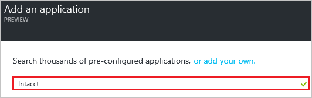

5. In the results panel, select **Intacct**, and then click the **Add** button to add the application.

	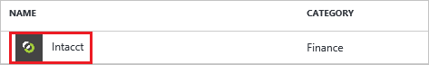

##  Configure and test Azure AD single sign-on
In this section, you configure and test Azure AD single sign-on with Intacct that is based on a test user called "Britta Simon."

For single sign-on to work, Azure AD needs to know what the counterpart user in Intacct is to a user in Azure AD. In other words, a link relationship between an Azure AD user and the related user in Intacct needs to be established.

This link relationship is established by assigning the value of the **user name** in Azure AD as the value of the **Username** in Intacct.

To configure and test Azure AD single sign-on with Intacct, you need to complete the following building blocks:

1. **[Configure Azure AD single sign-on](#configure-azure-ad-single-sign-on):** To enable your users to use this feature.
2. **[Create an Azure AD test user](#create-an-azure-ad-test-user):** To test Azure AD single sign-on with Britta Simon.
3. **[Create an Intacct test user](#create-an-intacct-test-user):** To have a counterpart of Britta Simon in Intacct that is linked to Britta's Azure AD representation.
4. **[Assign the Azure AD test user](#assign-the-azure-ad-test-user):** To enable Britta Simon to use Azure AD single sign-on.
5. **[Test single sign-on](#test-single-sign-on):** To verify whether the configuration works.

### Configure Azure AD single sign-on

In this section, you enable Azure AD single sign-on in the Azure portal and configure single sign-on in your Intacct application.

**To configure Azure AD single sign-on with Intacct, perform the following steps:**

1. In the Azure portal, on the **Intacct** application integration page, click **Single sign-on**.

	![Configure single sign-on][4]

2. On the **Single sign-on** dialog box, as **Mode** select **SAML-based Sign-on** to enable single sign-on.

	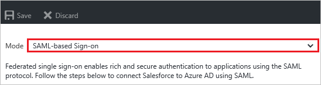

3. On the **Intacct Domain and URLs** section, perform the following steps:

	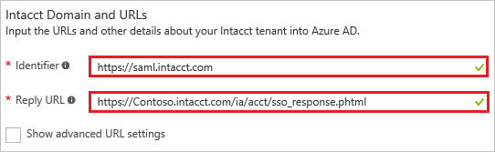

    a. In the **Identifier** textbox, enter: `https://saml.intacct.com`

	b. In the **Reply URL** textbox, enter a URL using the following pattern: `https://<company name>.intacct.com/ia/acct/sso_response.phtml`

	> [!NOTE]
	> Update the previous values with the actual **Identifier** and **Reply URL** value. We suggest that you use the unique value of the URL as the **Identifier**. Contact [Intacct support team](mailto:info@intacct.com) to get these values.

4. On the **SAML Signing Certificate** section, click **Create new certificate**.

	 	

5. On the **Create New Certificate** dialog box, click the calendar icon and select an **expiry date**. Then click **Save** button.

	

6. On the **SAML Signing Certificate** section, select **Make new certificate active** and click **Save** button.

	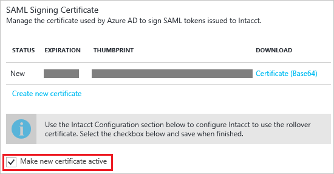

7. On the pop-up **Rollover certificate** window, click **OK**.

	

8. On the **SAML Signing Certificate** section, click **Certificate (Base64)** and then save the certificate file on your computer.

	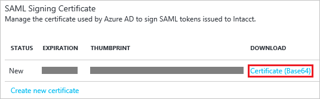

9. On the **Intacct Configuration** section, click **Configure Intacct** to open **Configure sign-on** window.

	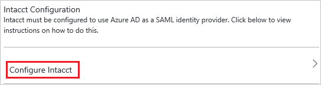

	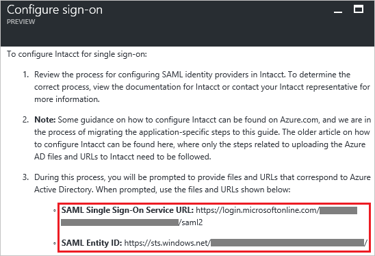

10. In a different web browser window, sign in to your Intacct company site as an administrator.

11. Click the **Company** tab, and then click **Company Info**.

	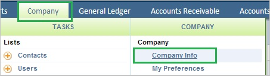

12. Click the **Security** tab, and then click **Edit**.

	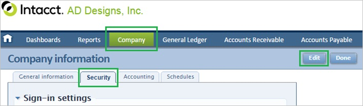

13. In the **Single sign on (SSO)** section, perform the following steps:

	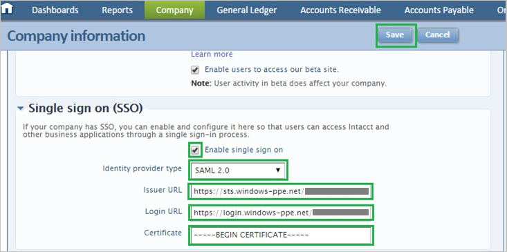

	a. Select **Enable single sign on**.

	b. As **Identity provider type**, select **SAML 2.0**.

	c. In the **Issuer URL** textbox, put the value of **SAML Entity ID**  from Azure AD application configuration window.

	d. In the **Login URL** textbox, put the value of **SAML single sign-on Service URL** from Azure AD application configuration window.

	e. Open your downloaded certificate in notepad, copy the content of it into your clipboard, and then paste it to the **Certificate** textbox

	f. Click **Save**.

### Create an Azure AD test user
The objective of this section is to create a test user in the Azure portal called Britta Simon.

![Create Azure AD User][100]

**To create a test user in Azure AD, perform the following steps:**

1. In the **Azure portal**, on the left navigation pane, click **Azure Active Directory** icon.

	

2. Go to **Users and groups** and click **All users** to display the list of users.

	

3. At the top of the dialog box, click **Add** to open the **User** dialog box.

	

4. On the **User** dialog box, perform the following steps:

	

    a. In the **Name** textbox, enter **BrittaSimon**.

    b. In the **User name** textbox, enter the **email address** of BrittaSimon.

	c. Select **Show Password** and write down the value of the **Password**.

    d. Click **Create**.

### Create an Intacct test user

To enable Azure AD users to sign in to Intacct, they must be provisioned into Intacct.  
In the case of Intacct, provisioning is a manual task.

### To provision a user account, perform the following steps:

1. Sign in to your Intacct company site as an administrator.

2. Click the **Company** tab, and then click **Users**.

    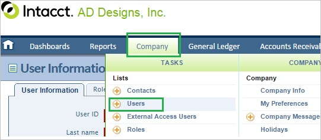

3. Click the **Add** tab.

	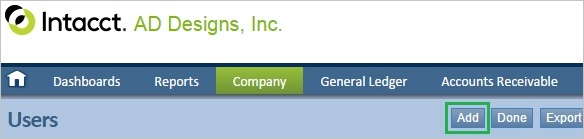

4. In the **User Information** section, perform the following steps:

	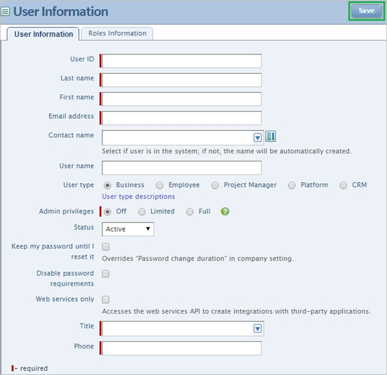

	a. In the **User ID** textbox, enter User ID of Britta Simon account.

	b. In the **Last Name** textbox, enter **Simon**.

	c. In the **First Name** textbox, enter **Britta**.  

	d. In the **Email address** textbox, enter the email address of Britta Simon account.

	e. Select the **Admin privileges** of Britta Simon account you want to provision.

	f. In the **Title** textbox, enter the title of Britta Simon account.

	g. In the **Phone** textbox, enter the phone number of Britta Simon account.

	h. Click **Save**.

	> [!NOTE]
    > The Azure Active Directory account holder receives an email and follows a link to confirm their account before it becomes active. You can use any other Intacct user account creation tools or APIs provided by Intacct to provision AAD user accounts.

### Assign the Azure AD test user

In this section, you enable Britta Simon to use Azure single sign-on by granting Britta access to Intacct.

![Assign User][200]

**To assign Britta Simon to Intacct, perform the following steps:**

1. In the Azure portal, open the applications view, and then go to the directory view and go to **Enterprise applications** then click **All applications**.

	![Assign User][201]

2. In the applications list, select **Intacct**.

	

3. In the menu on the left, click **Users and groups**.

	![Assign User][202]

4. Click **Add** button. Then select **Users and groups** on the **Add Assignment** dialog box.

	![Assign User][203]

5. On the **Users and groups** dialog box, select **Britta Simon** in the Users list.

6. Click **Select** button on the **Users and groups** dialog box.

7. Click the **Assign** button on the **Add Assignment** dialog box.

### Test single sign-on

In this section, you test your Azure AD single sign-on configuration using the Access Panel.

When you click the Intacct tile in the Access Panel, you should get automatically signed-on to your Intacct application.

## Additional resources

* [List of Tutorials on How to Integrate SaaS Apps with Azure Active Directory](active-directory-saas-tutorial-list.md)
* [What is application access and single sign-on with Azure Active Directory?](active-directory-appssoaccess-whatis.md)

<!--Image references-->

[1]: ./media/active-directory-saas-intacct-tutorial/tutorial_general_01.png
[2]: ./media/active-directory-saas-intacct-tutorial/tutorial_general_02.png
[3]: ./media/active-directory-saas-intacct-tutorial/tutorial_general_03.png
[4]: ./media/active-directory-saas-intacct-tutorial/tutorial_general_04.png

[100]: ./media/active-directory-saas-intacct-tutorial/tutorial_general_100.png

[200]: ./media/active-directory-saas-intacct-tutorial/tutorial_general_200.png
[201]: ./media/active-directory-saas-intacct-tutorial/tutorial_general_201.png
[202]: ./media/active-directory-saas-intacct-tutorial/tutorial_general_202.png
[203]: ./media/active-directory-saas-intacct-tutorial/tutorial_general_203.png
