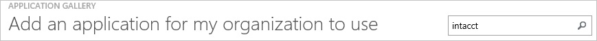
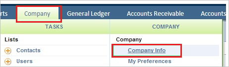
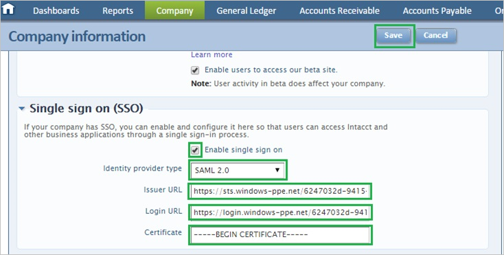
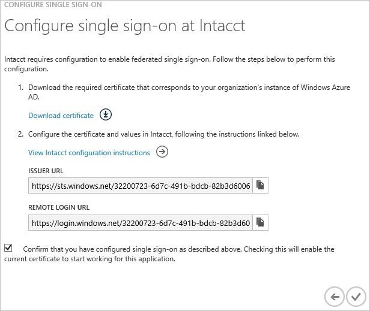
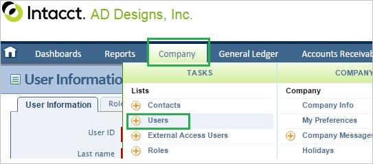
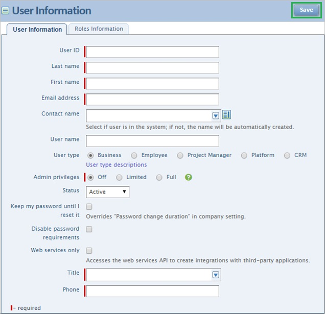

<properties 
    pageTitle="Tutorial: Azure Active Directory integration with Intacct | Microsoft Azure" 
    description="Learn how to use Intacct with Azure Active Directory to enable single sign-on, automated provisioning, and more!" 
    services="active-directory" 
    authors="jeevansd"  
    documentationCenter="na" 
    manager="femila"/>
<tags 
    ms.service="active-directory" 
    ms.devlang="na" 
    ms.topic="article" 
    ms.tgt_pltfrm="na" 
    ms.workload="identity" 
    ms.date="07/09/2016" 
    ms.author="jeedes" />

#Tutorial: Azure Active Directory integration with Intacct
  
The objective of this tutorial is to show the integration of Azure and Intacct.  
The scenario outlined in this tutorial assumes that you already have the following items:

-   A valid Azure subscription
-   A Intacct tenant
  
After completing this tutorial, the Azure AD users you have assigned to Intacct will be able to single sign into the application at your Intacct company site (service provider initiated sign on), or using the [Introduction to the Access Panel](active-directory-saas-access-panel-introduction.md).
  
The scenario outlined in this tutorial consists of the following building blocks:

1.  Enabling the application integration for Intacct
2.  Configuring single sign-on
3.  Configuring user provisioning
4.  Assigning users

##Enabling the application integration for Intacct
  
The objective of this section is to outline how to enable the application integration for Intacct.

###To enable the application integration for Intacct, perform the following steps:

1.  In the Azure classic portal, on the left navigation pane, click **Active Directory**.

    

2.  From the **Directory** list, select the directory for which you want to enable directory integration.

3.  To open the applications view, in the directory view, click **Applications** in the top menu.

    

4.  Click **Add** at the bottom of the page.

    

5.  On the **What do you want to do** dialog, click **Add an application from the gallery**.

    

6.  In the **search box**, type **Intacct**.

    

7.  In the results pane, select **Intacct**, and then click **Complete** to add the application.

    
##Configuring single sign-on
  
The objective of this section is to outline how to enable users to authenticate to Intacct with their account in Azure AD using federation based on the SAML protocol.  
As part of this procedure, you are required to create a base-64 encoded certificate file.  
If you are not familiar with this procedure, see [How to convert a binary certificate into a text file](http://youtu.be/PlgrzUZ-Y1o).

###To configure single sign-on, perform the following steps:

1.  In the Azure classic portal, on the **Intacct** application integration page, click **Configure single sign-on** to open the **Configure Single Sign On ** dialog.

    

2.  On the **How would you like users to sign on to Intacct** page, select **Microsoft Azure AD Single Sign-On**, and then click **Next**.

    

3.  On the **Configure App URL** page, in the **Intacct Sign On URL** textbox, type your URL using the following pattern "*https://Intacct.com/company*", and then click **Next**.

    

4.  On the **Configure single sign-on at Intacct** page, click **Download certificate**, and then save the certificate file on your computer.

    

5.  In a different web browser window, log into your Intacct company site as an administrator.

6.  Click the **Company** tab, and then click **Company Info**.

    

7.  Click the **Security** tab, and then click **Edit**.

    

8.  In the **Single sign on (SSO)** section, perform the following steps:

    

    1.  Select **Enable single sign on**.
    2.  As **Identity provider type**, select **SAML 2.0**.
    3.  In the Azure classic portal, on the **Configure single sign-on at Intacct** dialog page, copy the **Issuer URL** value, and then paste it into the **Issuer URL** textbox.
    4.  In the Azure classic portal, on the **Configure single sign-on at Intacct** dialog page, copy the **Remote Login URL** value, and then paste it into the **Login URL** textbox.
    5.  Create a **base-64 encoded** file from your downloaded certificate.
        
		>[AZURE.TIP]For more details, see [How to convert a binary certificate into a text file](http://youtu.be/PlgrzUZ-Y1o)

    6.  Open your base-64 encoded certificate in notepad, copy the content of it into your clipboard, and then paste it to the **Certificate** textbox
    7.  Click **Save**.

9.  On the Azure classic portal, select the single sign-on configuration confirmation, and then click **Complete** to close the **Configure Single Sign On** dialog.

    
##Configuring user provisioning
  
In order to enable Azure AD users to log into Intacct, they must be provisioned into Intacct.  
In the case of Intacct, provisioning is a manual task.

###To provision a user accounts, perform the following steps:

1.  Log in to your **Intacct** tenant.

2.  Click the **Company** tab, and then click **Users**.

    

3.  Click the **Add** tab

    

4.  In the **User Information** section, perform the following steps:

    

    1.  Type the **User ID**, the **Last name**, **First name**, the **Email address**, the **Title** and the **Phone** of an Azure AD account you want to provision into the related textboxes.
    2.  Select the **Admin privileges** of an Azure AD account you want to provision.
    3.  Click **Save**.
        
		>[AZURE.NOTE] The AAD account holder will receive an email and follow a link to confirm their account before it becomes active.

>[AZURE.NOTE] You can use any other Intacct user account creation tools or APIs provided by Intacct to provision AAD user accounts.

##Assigning users
  
To test your configuration, you need to grant the Azure AD users you want to allow using your application access to it by assigning them.

###To assign users to Intacct, perform the following steps:

1.  In the Azure classic portal, create a test account.

2.  On the **Intacct **application integration page, click **Assign users**.

    

3.  Select your test user, click **Assign**, and then click **Yes** to confirm your assignment.

    
  
If you want to test your single sign-on settings, open the Access Panel. For more details about the Access Panel, see [Introduction to the Access Panel](active-directory-saas-access-panel-introduction.md).