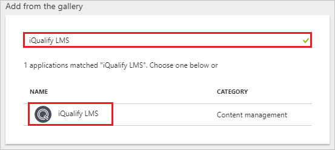
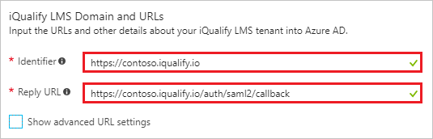
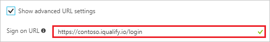
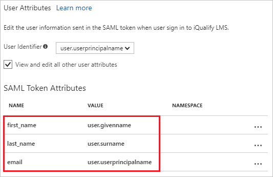
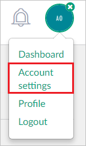
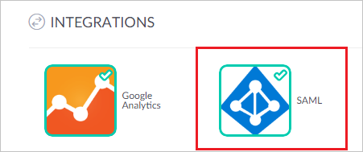
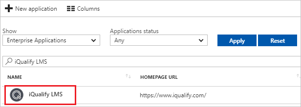

# Tutorial: Azure Active Directory integration with iQualify LMS

In this tutorial, you learn how to integrate iQualify LMS with Azure Active Directory (Azure AD).

Integrating iQualify LMS with Azure AD provides you with the following benefits:

- You can control in Azure AD who has access to iQualify LMS.
- You can enable your users to automatically get signed-on to iQualify LMS (Single Sign-On) with their Azure AD accounts.
- You can manage your accounts in one central location - the Azure portal.

If you want to know more details about SaaS app integration with Azure AD, see [what is application access and single sign-on with Azure Active Directory](active-directory-appssoaccess-whatis.md).

## Prerequisites

To configure Azure AD integration with iQualify LMS, you need the following items:

- An Azure AD subscription
- An iQualify LMS single sign-on enabled subscription

> [!NOTE]
> To test the steps in this tutorial, we do not recommend using a production environment.

To test the steps in this tutorial, you should follow these recommendations:

- Do not use your production environment, unless it is necessary.
- If you don't have an Azure AD trial environment, you can [get a one-month trial](https://azure.microsoft.com/pricing/free-trial/).

## Scenario description
In this tutorial, you test Azure AD single sign-on in a test environment. 
The scenario outlined in this tutorial consists of two main building blocks:

1. Adding iQualify LMS from the gallery
2. Configuring and testing Azure AD single sign-on

## Adding iQualify LMS from the gallery
To configure the integration of iQualify LMS into Azure AD, you need to add iQualify LMS from the gallery to your list of managed SaaS apps.

**To add iQualify LMS from the gallery, perform the following steps:**

1. In the **[Azure portal](https://portal.azure.com)**, on the left navigation panel, click **Azure Active Directory** icon. 

	![The Azure Active Directory button][1]

2. Navigate to **Enterprise applications**. Then go to **All applications**.

	![The Enterprise applications blade][2]
	
3. To add new application, click **New application** button on the top of dialog.

	![The New application button][3]

4. In the search box, type **iQualify LMS**, select **iQualify LMS** from result panel then click **Add** button to add the application.

	

## Configure and test Azure AD single sign-on

In this section, you configure and test Azure AD single sign-on with iQualify LMS based on a test user called "Britta Simon."

For single sign-on to work, Azure AD needs to know what the counterpart user in iQualify LMS is to a user in Azure AD. In other words, a link relationship between an Azure AD user and the related user in iQualify LMS needs to be established.

In iQualify LMS, assign the value of the **user name** in Azure AD as the value of the **Username** to establish the link relationship.

To configure and test Azure AD single sign-on with iQualify LMS, you need to complete the following building blocks:

1. **[Configure Azure AD Single Sign-On](#configure-azure-ad-single-sign-on)** - to enable your users to use this feature.
2. **[Create an Azure AD test user](#create-an-azure-ad-test-user)** - to test Azure AD single sign-on with Britta Simon.
3. **[Create an iQualify LMS test user](#create-an-iqualify-lms-test-user)** - to have a counterpart of Britta Simon in iQualify LMS that is linked to the Azure AD representation of user.
4. **[Assign the Azure AD test user](#assign-the-azure-ad-test-user)** - to enable Britta Simon to use Azure AD single sign-on.
5. **[Test single sign-on](#test-single-sign-on)** - to verify whether the configuration works.

### Configure Azure AD single sign-on

In this section, you enable Azure AD single sign-on in the Azure portal and configure single sign-on in your iQualify LMS application.

**To configure Azure AD single sign-on with iQualify LMS, perform the following steps:**

1. In the Azure portal, on the **iQualify LMS** application integration page, click **Single sign-on**.

	![Configure single sign-on link][4]

2. On the **Single sign-on** dialog, select **Mode** as	**SAML-based Sign-on** to enable single sign-on.
 
	

3. On the **iQualify LMS Domain and URLs** section, perform the following steps if you wish to configure the application in IDP initiated mode:

	

    a. In the **Identifier** textbox, type a URL using the following pattern: 
	| |
	|--|--|
	| Production Environment: `https://<yourorg>.iqualify.com/`|
	| Test Environment: `https://<yourorg>.iqualify.io`|
	
	b. In the **Reply URL** textbox, type a URL using the following pattern: 
	| |
	|--|--|
	| Production Environment: `https://<yourorg>.iqualify.com/auth/saml2/callback` |
	| Test Environment: `https://<yourorg>.iqualify.io/auth/saml2/callback` |

4. Check **Show advanced URL settings** and perform the following step if you wish to configure the application in **SP** initiated mode:

	

    In the **Sign-on URL** textbox, type a URL using the following pattern:
	| |
	|--|--|
	| Production Environment: `https://<yourorg>.iqualify.com/login` |
	| Test Environment: `https://<yourorg>.iqualify.io/login` |
	 
	> [!NOTE] 
	> These values are not real. Update these values with the actual Identifier, Reply URL, and Sign-On URL. Contact [iQualify LMS Client support team](https://www.iqualify.com) to get these values. 

5. The iQualify LMS application expects the Security Assertion Markup Language (SAML) assertions to be displayed in a specific format. Configure the claims and manage the values of the attributes in the **User Attributes** section of the iQualify application integration page, as shown in the following screenshot:
	
	

6. In the **User Attributes** section on the **Single sign-on** dialog  perform the following steps for each row shown in the table below:
    
	| Attribute Name | Attribute Value |
	| --- | --- |    
	| email | user.userprincipalname |
	| first_name | user.givenname |
	| last_name | user.surname |
	| person_id | "your attribute" | 

	a. Click **Add attribute** to open the **Add Attribute** dialog.

	

	
	
	b. In the **Name** textbox, type the attribute name shown for that row.
	
	c. From the **Value** list, type the attribute value shown for that row.
	
	d. Click **Ok**

	e. Repeat steps "a" through "d" for the next table rows. 

	> [!Note]
	> Repeating steps "a" through "d" for the **person_id** attribute is **Optional**

7. On the **SAML Signing Certificate** section, click **Certificate (Base 64)** and then save the certificate file on your computer.

	 

8. Click **Save** button.

	
	
9. On the **iQualify LMS Configuration** section, click **Configure iQualify LMS** to open **Configure sign-on** window. Copy the **Sign-Out URL, and SAML Single Sign-On Service URL** from the **Quick Reference section.**

	 

10.  Open a new browser window, and then sign in to your iQualify environment as an administrator.

11. Once you are logged in, click on your avatar at the top right, then click on **"Account settings."**

	 
12. In the account settings area, click on the ribbon menu on the left and click on **"INTEGRATIONS."**
	
	

13. Under INTEGRATIONS, click on the **SAML** icon.

	

14. In the **SAML Authentication Settings** dialog box, perform the following steps:

    

	a. In the **SAML SINGLE SIGN-ON SERVICE URL** box, paste the **SAML Single Sign‑On Service URL** value copied from the Azure AD application configuration window.
	
	b. In the **SAML LOGOUT URL** box, paste the **Sign‑Out URL** value copied from the Azure AD application configuration window.
	
	c. Open the downloaded certificate file in notepad, copy the content, and then paste it in the **PUBLIC CERTIFICATE** box.
	
	d. In **LOGIN BUTTON LABEL** enter the name for the button to be displayed on login page.
	
	e. Click **SAVE**.

	f. Click **UPDATE**.

> [!TIP]
> You can now read a concise version of these instructions inside the [Azure portal](https://portal.azure.com), while you are setting up the app!  After adding this app from the **Active Directory > Enterprise Applications** section, simply click the **Single Sign-On** tab and access the embedded documentation through the **Configuration** section at the bottom. You can read more about the embedded documentation feature here: [Azure AD embedded documentation]( https://go.microsoft.com/fwlink/?linkid=845985)

### Create an Azure AD test user

The objective of this section is to create a test user in the Azure portal called Britta Simon.

   ![Create an Azure AD test user][100]

**To create a test user in Azure AD, perform the following steps:**

1. In the Azure portal, in the left pane, click the **Azure Active Directory** button.

    

2. To display the list of users, go to **Users and groups**, and then click **All users**.

    

3. To open the **User** dialog box, click **Add** at the top of the **All Users** dialog box.

    

4. In the **User** dialog box, perform the following steps:

    

    a. In the **Name** box, type **BrittaSimon**.

    b. In the **User name** box, type the email address of user Britta Simon.

    c. Select the **Show Password** check box, and then write down the value that's displayed in the **Password** box.

    d. Click **Create**.
 
### Create an iQualify LMS test user

In this section, a user called Britta Simon is created in iQualify. iQualify LMS supports just‑in‑time user provisioning, which is enabled by default.

There is no action item for you in this section. If a user doesn't already exist in iQualify, a new one is created when you attempt to access iQualify LMS.

### Assign the Azure AD test user

In this section, you enable Britta Simon to use Azure single sign-on by granting access to iQualify LMS.

![Assign the user role][200] 

**To assign Britta Simon to iQualify LMS, perform the following steps:**

1. In the Azure portal, open the applications view, and then navigate to the directory view and go to **Enterprise applications** then click **All applications**.

	![Assign User][201] 

2. In the applications list, select **iQualify LMS**.

	  

3. In the menu on the left, click **Users and groups**.

	![The "Users and groups" link][202]

4. Click **Add** button. Then select **Users and groups** on **Add Assignment** dialog.

	![The Add Assignment pane][203]

5. On **Users and groups** dialog, select **Britta Simon** in the Users list.

6. Click **Select** button on **Users and groups** dialog.

7. Click **Assign** button on **Add Assignment** dialog.
	
### Test single sign-on

In this section, you test your Azure AD single sign-on configuration using the Access Panel.

When you click the iQualify LMS tile in the Access Panel, you should get login page of your iQualify LMS application. 

    

Click **Sign in with Azure AD** button and you should get automatically signed-on to your iQualify LMS application.

For more information about the Access Panel, see [Introduction to the Access Panel](active-directory-saas-access-panel-introduction.md). 

## Additional resources

* [List of Tutorials on How to Integrate SaaS Apps with Azure Active Directory](active-directory-saas-tutorial-list.md)
* [What is application access and single sign-on with Azure Active Directory?](active-directory-appssoaccess-whatis.md)

<!--Image references-->

[1]: ./media/active-directory-saas-iqualify-tutorial/tutorial_general_01.png
[2]: ./media/active-directory-saas-iqualify-tutorial/tutorial_general_02.png
[3]: ./media/active-directory-saas-iqualify-tutorial/tutorial_general_03.png
[4]: ./media/active-directory-saas-iqualify-tutorial/tutorial_general_04.png

[100]: ./media/active-directory-saas-iqualify-tutorial/tutorial_general_100.png

[200]: ./media/active-directory-saas-iqualify-tutorial/tutorial_general_200.png
[201]: ./media/active-directory-saas-iqualify-tutorial/tutorial_general_201.png
[202]: ./media/active-directory-saas-iqualify-tutorial/tutorial_general_202.png
[203]: ./media/active-directory-saas-iqualify-tutorial/tutorial_general_203.png

