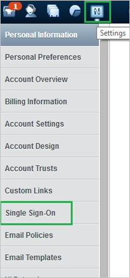
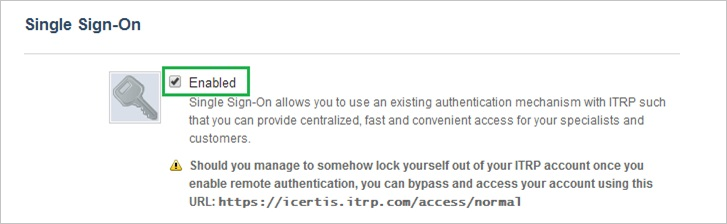
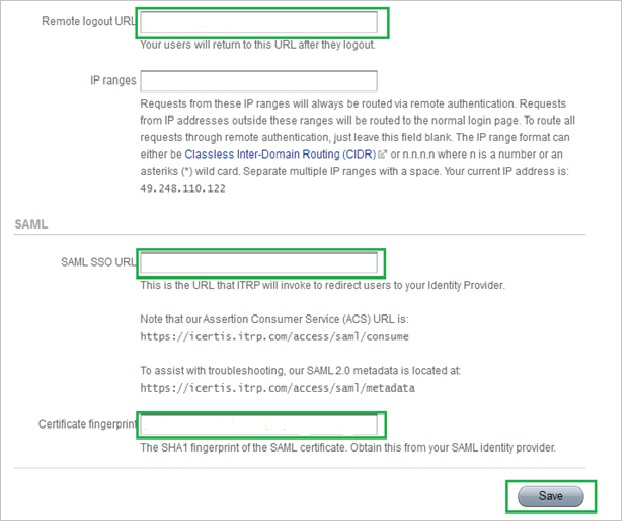
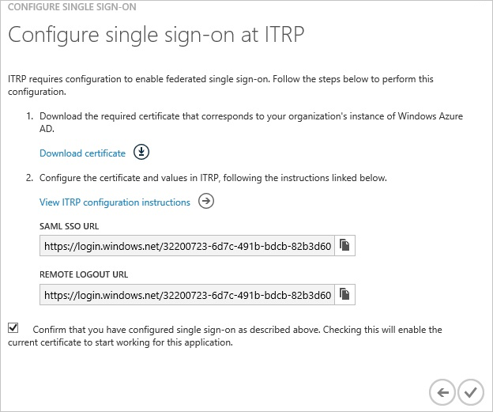
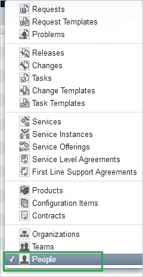
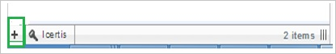
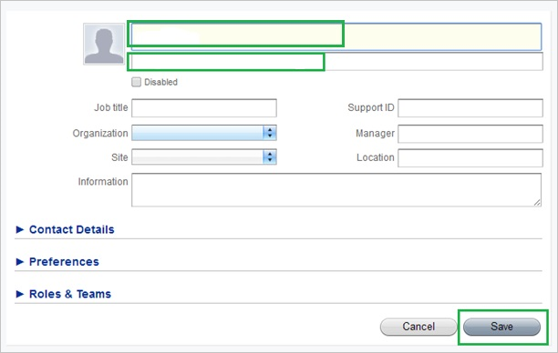
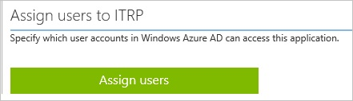

<properties
    pageTitle="Tutorial: Azure Active Directory Integration with ITRP | Microsoft Azure" 
    description="Learn how to use ITRP with Azure Active Directory to enable single sign-on, automated provisioning, and more!" 
    services="active-directory" 
    authors="jeevansd"  
    documentationCenter="na" 
    manager="femila"/>
<tags 
    ms.service="active-directory" 
    ms.devlang="na" 
    ms.topic="article" 
    ms.tgt_pltfrm="na" 
    ms.workload="identity" 
    ms.date="06/17/2016" 
    ms.author="jeedes" />

#Tutorial: Azure Active Directory Integration with ITRP
  
The objective of this tutorial is to show the integration of Azure and ITRP.  
The scenario outlined in this tutorial assumes that you already have the following items:

-   A valid Azure subscription
-   A ITRP tenant
  
After completing this tutorial, the Azure AD users you have assigned to ITRP will be able to single sign into the application at your ITRP company site (service provider initiated sign on), or using the [Introduction to the Access Panel](active-directory-saas-access-panel-introduction.md).
  
The scenario outlined in this tutorial consists of the following building blocks:

1.  Enabling the application integration for ITRP
2.  Configuring single sign-on
3.  Configuring user provisioning
4.  Assigning users

##Enabling the application integration for ITRP
  
The objective of this section is to outline how to enable the application integration for ITRP.

###To enable the application integration for ITRP, perform the following steps:

1.  In the Azure classic portal, on the left navigation pane, click **Active Directory**.

    

2.  From the **Directory** list, select the directory for which you want to enable directory integration.

3.  To open the applications view, in the directory view, click **Applications** in the top menu.

    

4.  Click **Add** at the bottom of the page.

    

5.  On the **What do you want to do** dialog, click **Add an application from the gallery**.

    

6.  In the **search box**, type **ITRP**.

    

7.  In the results pane, select **ITRP**, and then click **Complete** to add the application.

    
##Configuring single sign-on
  
The objective of this section is to outline how to enable users to authenticate to ITRP with their account in Azure AD using federation based on the SAML protocol.  
Configuring single sign-on for ITRP requires you to retrieve a thumbprint value from a certificate.  
If you are not familiar with this procedure, see [How to retrieve a certificate's thumbprint value](http://youtu.be/YKQF266SAxI).

###To configure single sign-on, perform the following steps:

1.  In the Azure classic portal, on the **ITRP** application integration page, click **Configure single sign-on** to open the **Configure Single Sign On ** dialog.

    

2.  On the **How would you like users to sign on to ITRP** page, select **Microsoft Azure AD Single Sign-On**, and then click **Next**.

    

3.  On the **Configure App URL** page, in the **ITRP Sign In URL** textbox, type your URL using the following pattern "*https://\<tenant-name\>.ITRP.com*", and then click **Next**.

    

4.  On the **Configure single sign-on at ITRP** page, to download your certificate, click **Download certificate**, and then save the certificate file locally as **c:\\ITRP.cer**.

    

5.  In a different web browser window, log into your ITRP company site as an administrator.

6.  In the toolbar on the top, click **Settings**.

    

7.  In the left navigation pane, select **Single Sign-On**.

    

8.  In the Single Sign-On configuration section, perform the following steps:

    

    

    1.  Click **Enable**.
    2.  In the Azure classic portal, on the **Configure single sign-on at ITRP** dialog page, copy the **Remote Logout URL** value, and then paste it into the **Remote Logout URL** textbox.
    3.  In the Azure classic portal, on the **Configure single sign-on at ITRP** dialog page, copy the **SAML SSO URL** value, and then paste it into the **SAML SSO URL** textbox.
    4.  Copy the **Thumbprint** value from the exported certificate, and then paste it into the **Certificate Fingerprint** textbox.
        
		>[AZURE.TIP]For more details, see [How to retrieve a certificate's thumbprint value](http://youtu.be/YKQF266SAxI)

    5.  Click **Save**.

9.  On the Azure classic portal, select the single sign-on configuration confirmation, and then click **Complete** to close the **Configure Single Sign On** dialog.

    
##Configuring user provisioning
  
In order to enable Azure AD users to log into ITRP, they must be provisioned into ITRP.  
In the case of ITRP, provisioning is a manual task.

###To provision a user accounts, perform the following steps:

1.  Log in to your **ITRP** tenant.

2.  In the toolbar on the top, click **Records**.

    

3.  From the popup menu, select **People**.

    

4.  Click **Add New Person** (“+”).

    

5.  On the Add New Person dialog, perform the following steps:

    

    1.  Type the **Name**, **Email** of a valid AAD account you want to provision.
    2.  Click **Save**.

>[AZURE.NOTE] You can use any other ITRP user account creation tools or APIs provided by ITRP to provision AAD user accounts.

##Assigning users
  
To test your configuration, you need to grant the Azure AD users you want to allow using your application access to it by assigning them.

###To assign users to ITRP, perform the following steps:

1.  In the Azure AD portal, create a test account.

2.  On the **ITRP **application integration page, click **Assign users**.

    

3.  Select your test user, click **Assign**, and then click **Yes** to confirm your assignment.

    
  
If you want to test your single sign-on settings, open the Access Panel. For more details about the Access Panel, see [Introduction to the Access Panel](active-directory-saas-access-panel-introduction.md).