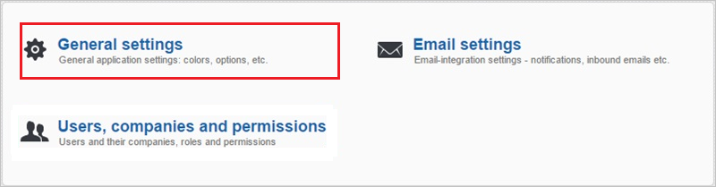
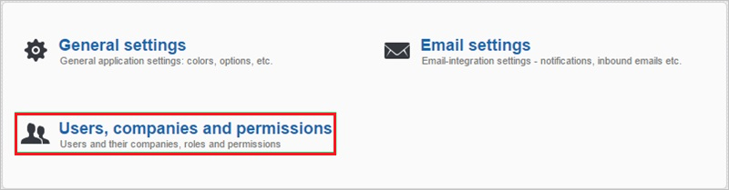
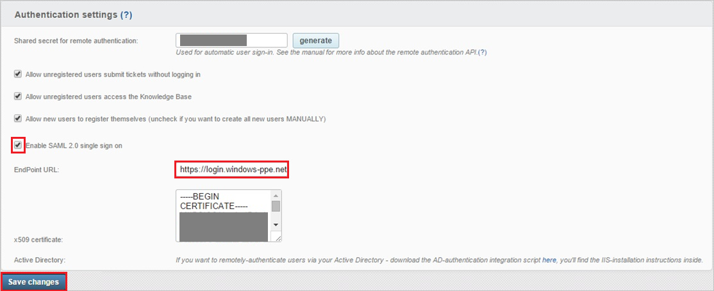
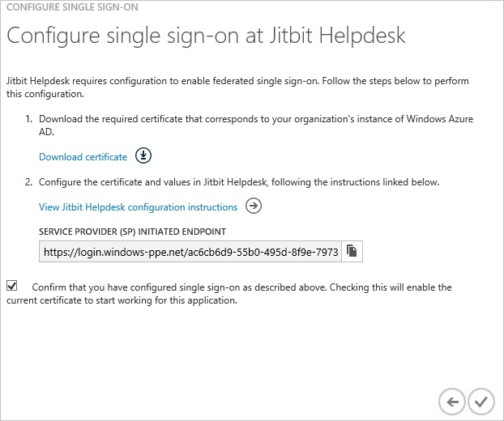
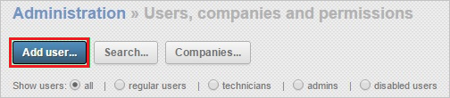
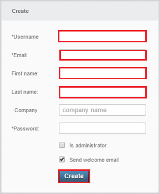

<properties 
    pageTitle="Tutorial: Azure Active Directory integration with Jitbit Helpdesk | Microsoft Azure" 
    description="Learn how to use Jitbit Helpdesk with Azure Active Directory to enable single sign-on, automated provisioning, and more!" 
    services="active-directory" 
    authors="jeevansd"  
    documentationCenter="na" 
    manager="femila"/>
<tags 
    ms.service="active-directory" 
    ms.devlang="na" 
    ms.topic="article" 
    ms.tgt_pltfrm="na" 
    ms.workload="identity" 
    ms.date="07/09/2016" 
    ms.author="jeedes" />

#Tutorial: Azure Active Directory integration with Jitbit Helpdesk
  
The objective of this tutorial is to show the integration of Azure and Jitbit Helpdesk.  
The scenario outlined in this tutorial assumes that you already have the following items:

-   A valid Azure subscription
-   A Jitbit Helpdesk tenant
  
After completing this tutorial, the Azure AD users you have assigned to Jitbit Helpdesk will be able to single sign into the application at your Jitbit Helpdesk company site (service provider initiated sign on), or using the [Introduction to the Access Panel](active-directory-saas-access-panel-introduction.md).
  
The scenario outlined in this tutorial consists of the following building blocks:

1.  Enabling the application integration for Jitbit Helpdesk
2.  Configuring single sign-on
3.  Configuring user provisioning
4.  Assigning users

##Enabling the application integration for Jitbit Helpdesk
  
The objective of this section is to outline how to enable the application integration for Jitbit Helpdesk.

###To enable the application integration for Jitbit Helpdesk, perform the following steps:

1.  In the Azure classic portal, on the left navigation pane, click **Active Directory**.

    

2.  From the **Directory** list, select the directory for which you want to enable directory integration.

3.  To open the applications view, in the directory view, click **Applications** in the top menu.

    

4.  Click **Add** at the bottom of the page.

    

5.  On the **What do you want to do** dialog, click **Add an application from the gallery**.

    

6.  In the **search box**, type **Jitbit Helpdesk**.

    

7.  In the results pane, select **Jitbit Helpdesk**, and then click **Complete** to add the application.

    
##Configuring single sign-on
  
The objective of this section is to outline how to enable users to authenticate to Jitbit Helpdesk with their account in Azure AD using federation based on the SAML protocol. .  
As part of this procedure, you are required to create a base-64 encoded certificate file.  
If you are not familiar with this procedure, see [How to convert a binary certificate into a text file](http://youtu.be/PlgrzUZ-Y1o).

>[AZURE.IMPORTANT] In order to be able to configure single sign-on on your Jitbit Helpdesk tenant, you need to contact first the Jitbit Helpdesk technical support to get this feature enabled.

###To configure single sign-on, perform the following steps:

1.  In the Azure classic portal, on the **Jitbit Helpdesk** application integration page, click **Configure single sign-on** to open the **Configure Single Sign On ** dialog.

    

2.  On the **How would you like users to sign on to Jitbit Helpdesk** page, select **Microsoft Azure AD Single Sign-On**, and then click **Next**.

    

3.  On the **Configure App URL** page, in the **Jitbit Helpdesk Sign In URL** textbox, type your URL using the following pattern "*https://\<tenant-name\>.Jitbit.com*", and then click **Next**.

    

4.  On the **Configure single sign-on at Jitbit Helpdesk** page, to download your certificate, click **Download certificate**, and then save the certificate file locally as **c:\\Jitbit Helpdesk.cer**.

    

5.  In a different web browser window, log into your Jitbit Helpdesk company site as an administrator.

6.  In the toolbar on the top, click **Administration**.

    

7.  Click **General settings**.

    

8.  In the **Authentication settings** configuration section, perform the following steps:

    

    1.  Select **Enable SAML 2.0 single sign on** sign-in using Single Sign-On (SSO) with **OneLogin**.
    2.  In the Azure classic portal, on the **Configure single sign-on at Jitbit Helpdesk** dialogue page, copy the **Service Provider (SP) initiated endpoint** value, and then paste it into the **EndPoint URL** textbox.
    3.  Create a **base-64 encoded** file from your downloaded certificate.
        
		>[AZURE.TIP]For more details, see [How to convert a binary certificate into a text file](http://youtu.be/PlgrzUZ-Y1o)

    4.  Open your base-64 encoded certificate, copy the content of it into your clipboard, and then paste it to the **X.509 Certificate** textbox
    5.  Click **Save changes**.

9.  On the Azure classic portal, select the single sign-on configuration confirmation, and then click **Complete** to close the **Configure Single Sign On** dialog.

    
##Configuring user provisioning
  
In order to enable Azure AD users to log into Jitbit Helpdesk, they must be provisioned into Jitbit Helpdesk.  
In the case of Jitbit Helpdesk, provisioning is a manual task.

###To provision a user accounts, perform the following steps:

1.  Log in to your **Jitbit Helpdesk** tenant.

2.  In the menu on the top, click **Administration**.

    

3.  Click **Users, companies and permissions**.

    

4.  Click **Add user**.

    

5.  In the Create section, type the data of the Azure AD account you want to provision into the following textboxes: **Username**, **Email**, **First Name**, **Last Name**

    

6.  Click **Create**.

>[AZURE.NOTE] You can use any other Jitbit Helpdesk user account creation tools or APIs provided by Jitbit Helpdesk to provision AAD user accounts.

##Assigning users
  
To test your configuration, you need to grant the Azure AD users you want to allow using your application access to it by assigning them.

###To assign users to Jitbit Helpdesk, perform the following steps:

1.  In the Azure classic portal, create a test account.

2.  On the **Jitbit Helpdesk **application integration page, click **Assign users**.

    

3.  Select your test user, click **Assign**, and then click **Yes** to confirm your assignment.

    
  
If you want to test your single sign-on settings, open the Access Panel. For more details about the Access Panel, see [Introduction to the Access Panel](active-directory-saas-access-panel-introduction.md).