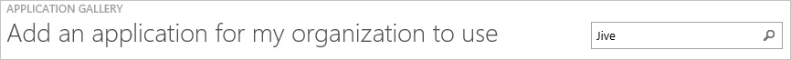
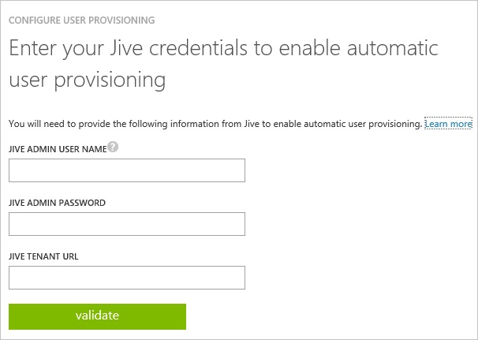

<properties 
    pageTitle="Tutorial: Azure Active Directory integration with Jive | Microsoft Azure" 
    description="Learn how to use Jive with Azure Active Directory to enable single sign-on, automated provisioning, and more!" 
    services="active-directory" 
    authors="jeevansd"  
    documentationCenter="na" 
    manager="femila"/>
<tags 
    ms.service="active-directory" 
    ms.devlang="na" 
    ms.topic="article" 
    ms.tgt_pltfrm="na" 
    ms.workload="identity" 
    ms.date="07/09/2016" 
    ms.author="jeedes" />

#Tutorial: Azure Active Directory integration with Jive

  
The objective of this tutorial is to show the integration of Azure and Jive.  
The scenario outlined in this tutorial assumes that you already have the following items:

-   A valid Azure subscription
-   A tenant in Jive
  
The scenario outlined in this tutorial consists of the following building blocks:

1.  Enabling the application integration for Jive
2.  Configuring user provisioning

##Enabling the application integration for Jive
  
The objective of this section is to outline how to enable the application integration for Jive.

###To enable the application integration for Jive, perform the following steps:

1.  In the Azure classic portal, on the left navigation pane, click **Active Directory**.

    

2.  From the **Directory** list, select the directory for which you want to enable directory integration.

3.  To open the applications view, in the directory view, click **Applications** in the top menu.

    

4.  To open the **Application Gallery**, click **Add An App**, and then click **Add an application for my organization to use**.

    

5.  In the **search box**, type **Jive**.

    

6.  In the results pane, select **Jive**, and then click **Complete** to add the application.

    
##Configuring user provisioning
  
The objective of this section is to outline how to enable user provisioning of Active Directory user accounts to Jive.  
As part of this procedure, you are required to provide a user security token you need to request from Jive.com.
  
The following screenshot shows an example of the related dialog in Azure AD:

###To configure user provisioning, perform the following steps:

1.  In the Azure classic portal, on the **Jive** application integration page, click **Configure user provisioning** to open the **Configure User Provisioning** dialog.

2.  On the **Enter your Jive credentials to enable automatic user provisioning** page, provide the following configuration settings:

    1.  In the **Jive Admin User Name** textbox, type a Jive account name that has the **System Administrator** profile in Jive.com assigned.

    2.  In the **Jive Admin Password** textbox, type the password for this account.

    3.  In the **Jive Tenant URL** textbox, type the Jive tenant URL.

        >[AZURE.NOTE] The Jive tenant URL is URL that is used by your organization to log into Jive.  
        Typically, the URL has the following format: **www.\<organization\>.jive.com**.

    4.  Click **validate** to verify your configuration.

    5.  Click the **Next** button to open the **Confirmation** page.

3.  On the **Confirmation** page, click the checkmark to save your configuration.
  
You can now create a test account, wait for 10 minutes and verify that the account has been synchronized to Jive.com.

