<properties 
    pageTitle="Tutorial: Azure Active Directory integration with Jobscience | Microsoft Azure" 
    description="Learn how to use Jobscience with Azure Active Directory to enable single sign-on, automated provisioning, and more!" 
    services="active-directory" 
    authors="jeevansd"  
    documentationCenter="na" 
    manager="femila"/>
<tags 
    ms.service="active-directory" 
    ms.devlang="na" 
    ms.topic="article" 
    ms.tgt_pltfrm="na" 
    ms.workload="identity" 
    ms.date="07/09/2016" 
    ms.author="jeedes" />

#Tutorial: Azure Active Directory integration with Jobscience
  
The objective of this tutorial is to show the integration of Azure and Jobscience.  
The scenario outlined in this tutorial assumes that you already have the following items:

-   A valid Azure subscription
-   A Jobscience Single Sign-On enabled subscription
  
After completing this tutorial, the Azure AD users you have assigned to Jobscience will be able to single sign into the application at your Jobscience company site (service provider initiated sign on), or using the [Introduction to the Access Panel](active-directory-saas-access-panel-introduction.md).
  
The scenario outlined in this tutorial consists of the following building blocks:

1.  Enabling the application integration for Jobscience
2.  Configuring single sign-on
3.  Configuring user provisioning
4.  Assigning users

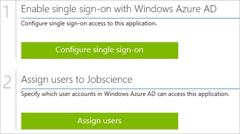
##Enabling the application integration for Jobscience
  
The objective of this section is to outline how to enable the application integration for Jobscience.

###To enable the application integration for Jobscience, perform the following steps:

1.  In the Azure classic portal, on the left navigation pane, click **Active Directory**.

    

2.  From the **Directory** list, select the directory for which you want to enable directory integration.

3.  To open the applications view, in the directory view, click **Applications** in the top menu.

    

4.  Click **Add** at the bottom of the page.

    

5.  On the **What do you want to do** dialog, click **Add an application from the gallery**.

    

6.  In the **search box**, type **jobscience**.

    

7.  In the results pane, select **Jobscience**, and then click **Complete** to add the application.

    
##Configuring single sign-on
  
The objective of this section is to outline how to enable users to authenticate to Jobscience with their account in Azure AD using federation based on the SAML protocol.  
Configuring single sign-on for Jobscience requires you to retrieve a thumbprint value from a certificate.  
If you are not familiar with this procedure, see [How to retrieve a certificate's thumbprint value](http://youtu.be/YKQF266SAxI).

###To configure single sign-on, perform the following steps:

1.  Log in to your Jobscience company site as an administrator.

2.  Go to **Setup**.

    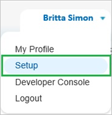

3.  On the left navigation pane, in the **Administer** section, click **Domain Management** to expand the related section, and then click **My Domain** to open the **My Domain** page. 

    

4.  To verify that your domain has been setup correctly, make sure that it is in “**Step 4 Deployed to Users**” and review your “**My Domain Settings**”.

    

5.  In a different web browser window, log in to your Azure classic portal.

6.  On the **Jobscience** application integration page, click **Configure single sign-on** to open the **Configure Single Sign On ** dialog.

    

7.  On the **How would you like users to sign on to Jobscience** page, select **Microsoft Azure AD Single Sign-On**, and then click **Next**.

    

8.  On the **Configure App URL** page, in the **Jobscience Sign In URL** textbox, type your URL using the following pattern "*http://company.my.salesforce.com*", and then click **Next**.

    

9.  On the **Configure single sign-on at Jobscience** page, to download your certificate, click **Download certificate**, and then save the certificate file locally on your computer.

    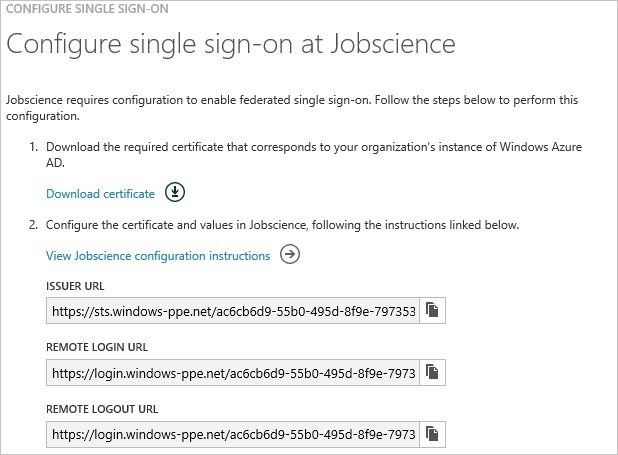

10. On the Jobscience company site, click **Security Controls**, and then click **Single Sign-On Settings**.

    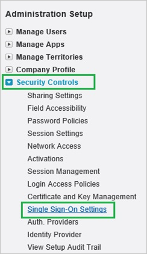

11. In the **Single Sign-On Settings** section, perform the following steps:

    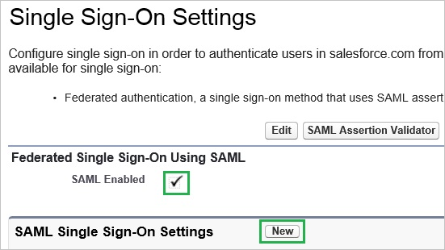

    1.  Select **SAML Enabled**.
    2.  Click **New**.

12. On the **SAML Single Sign-On Setting Edit** dialog, perform the following steps:

    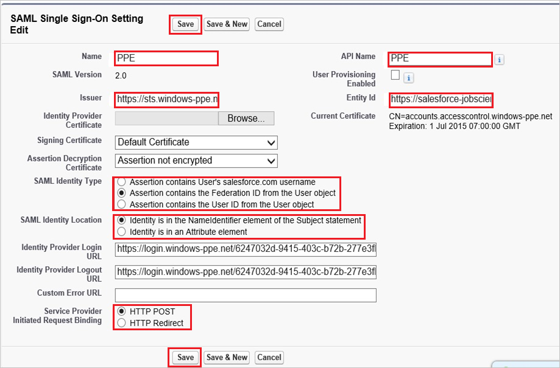

    1.  In the **Name** textbox, type a name for your configuration.
    2.  In the Azure classic portal, on the **Configure single sign-on at Jobscience** dialogue page, copy the **Issuer URL** value, and then paste it into the **Issuer** textbox
    3.  In the **Entity Id** textbox, type **https://salesforce-jobscience.com**
    4.  Click **Browse** to upload your Azure AD certificate.
    5.  As **SAML Identity Type**, select **Assertion contains the Federation ID from the User object**.
    6.  As **SAML Identity Location**, select **Identity is in the NameIdentfier element of the Subject statement**.
    7.  In the Azure classic portal, on the **Configure single sign-on at Jobscience** dialogue page, copy the **Remote Login URL** value, and then paste it into the **Identity Provider Login URL** textbox
    8.  In the Azure classic portal, on the **Configure single sign-on at Jobscience** dialogue page, copy the **Remote Logout URL** value, and then paste it into the **Identity Provider Logout URL** textbox
    9.  Click **Save**.

13. On the left navigation pane, in the **Administer** section, click **Domain Management** to expand the related section, and then click **My Domain** to open the **My Domain** page. 

    

14. On the **My Domain** page, in the **Login Page Branding** section, click **Edit**.

    

15. On the **Login Page Branding** page, in the **Authentication Service** section, the name of your **SAML SSO Settings** is displayed. Select it, and then click **Save**.

    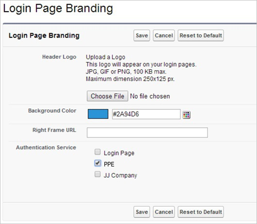

16. On the Azure classic portal, select the single sign-on configuration confirmation, and then click **Complete** to close the **Configure Single Sign On** dialog.

    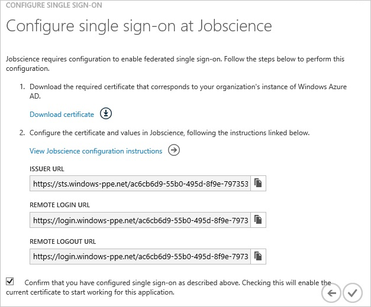
  
To get the SP initiated Single Sign on Login URL click on the **Single Sign On settings** in the **Security Controls** menu section.

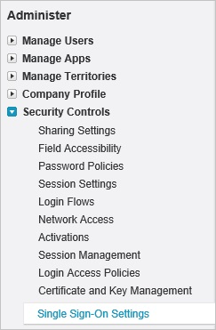
  
Click the SSO profile you have created in the step above.  
This page shows the Single Sign on URL for your company (e.g. *https://companyname.my.salesforce.com?so=companyid*).
##Configuring user provisioning
  
In order to enable Azure AD users to log into Jobscience, they must be provisioned into Jobscience.  
In the case of Jobscience, provisioning is a manual task.

###To configure user provisioning, perform the following steps:

1.  Log in to your **Jobscience** company site as administrator.

2.  Go to Setup

    

3.  Go to **Manage Users \> Users**.

    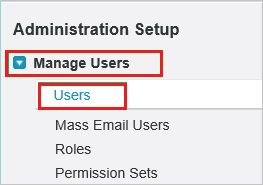

4.  Click **New User**.

    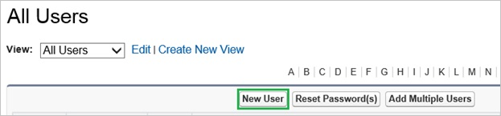

5.  On the **Edit User** dialog, perform the following steps:

    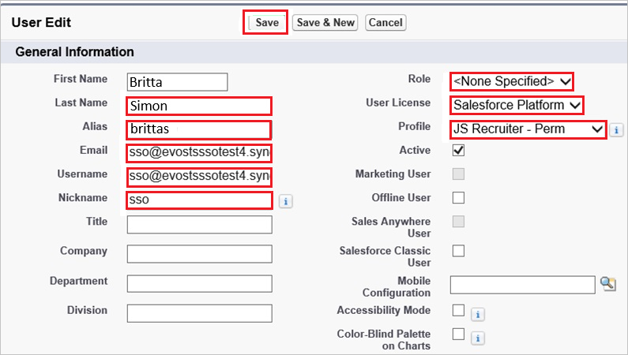

    1.  Type the first name, last name, alias, email, user name and nickname properties of the Azure AD user you want to provision into the related textboxes.
    2.  Click **Save**.

    >[AZURE.NOTE] The Azure AD account holder will get an email that includes a link to confirm the account before it is activated.

>[AZURE.NOTE] You can use any other Jobscience user account creation tools or APIs provided by Jobscience to provision AAD user accounts.

##Assigning users
  
To test your configuration, you need to grant the Azure AD users you want to allow using your application access to it by assigning them.

###To assign users to Jobscience, perform the following steps:

1.  In the Azure classic portal, create a test account.

2.  On the **Jobscience **application integration page, click **Assign users**.

    

3.  Select your test user, click **Assign**, and then click **Yes** to confirm your assignment.

    
  
If you want to test your single sign-on settings, open the Access Panel. For more details about the Access Panel, see [Introduction to the Access Panel](active-directory-saas-access-panel-introduction.md).