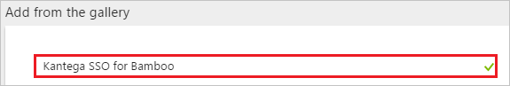
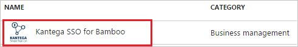
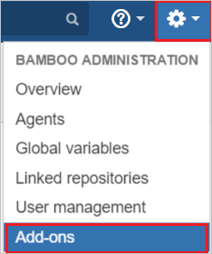
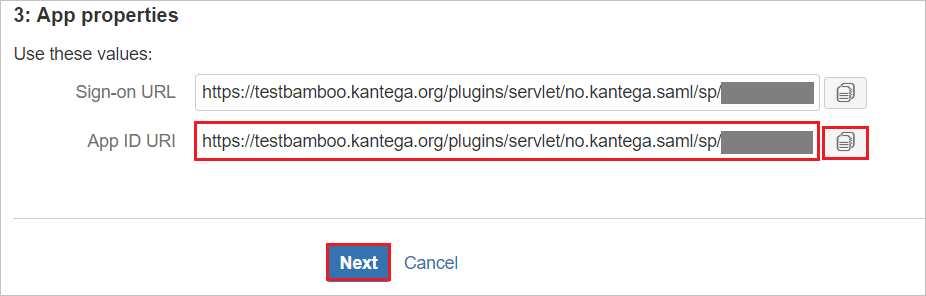
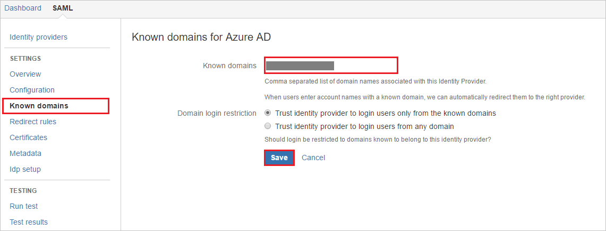
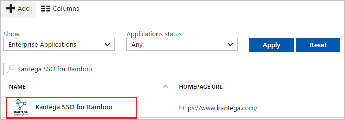

# Tutorial: Azure Active Directory integration with Kantega SSO for Bamboo

In this tutorial, you learn how to integrate Kantega SSO for Bamboo with Azure Active Directory (Azure AD).

Integrating Kantega SSO for Bamboo with Azure AD provides you with the following benefits:

- You can control in Azure AD who has access to Kantega SSO for Bamboo
- You can enable your users to automatically get signed-on to Kantega SSO for Bamboo (Single Sign-On) with their Azure AD accounts
- You can manage your accounts in one central location - the Azure portal

If you want to know more details about SaaS app integration with Azure AD, see [what is application access and single sign-on with Azure Active Directory](active-directory-appssoaccess-whatis.md).

## Prerequisites

To configure Azure AD integration with Kantega SSO for Bamboo, you need the following items:

- An Azure AD subscription
- A Kantega SSO for Bamboo single sign-on enabled subscription

> [!NOTE]
> To test the steps in this tutorial, we do not recommend using a production environment.

To test the steps in this tutorial, you should follow these recommendations:

- Do not use your production environment, unless it is necessary.
- If you don't have an Azure AD trial environment, you can get a one-month trial [here](https://azure.microsoft.com/pricing/free-trial/).

## Scenario description
In this tutorial, you test Azure AD single sign-on in a test environment. 
The scenario outlined in this tutorial consists of two main building blocks:

1. Adding Kantega SSO for Bamboo from the gallery
2. Configuring and testing Azure AD single sign-on

## Adding Kantega SSO for Bamboo from the gallery
To configure the integration of Kantega SSO for Bamboo into Azure AD, you need to add Kantega SSO for Bamboo from the gallery to your list of managed SaaS apps.

**To add Kantega SSO for Bamboo from the gallery, perform the following steps:**

1. In the **[Azure portal](https://portal.azure.com)**, on the left navigation panel, click **Azure Active Directory** icon. 

	![Active Directory][1]

2. Navigate to **Enterprise applications**. Then go to **All applications**.

	![Applications][2]
	
3. To add new application, click **New application** button on the top of dialog.

	![Applications][3]

4. In the search box, type **Kantega SSO for Bamboo**.

	

5. In the results panel, select **Kantega SSO for Bamboo**, and then click **Add** button to add the application.

	

##  Configuring and testing Azure AD single sign-on
In this section, you configure and test Azure AD single sign-on with Kantega SSO for Bamboo based on a test user called "Britta Simon".

For single sign-on to work, Azure AD needs to know what the counterpart user in Kantega SSO for Bamboo is to a user in Azure AD. In other words, a link relationship between an Azure AD user and the related user in Kantega SSO for Bamboo needs to be established.

In Kantega SSO for Bamboo, assign the value of the **user name** in Azure AD as the value of the **Username** to establish the link relationship.

To configure and test Azure AD single sign-on with Kantega SSO for Bamboo, you need to complete the following building blocks:

1. **[Configuring Azure AD Single Sign-On](#configuring-azure-ad-single-sign-on)** - to enable your users to use this feature.
2. **[Creating an Azure AD test user](#creating-an-azure-ad-test-user)** - to test Azure AD single sign-on with Britta Simon.
3. **[Creating a Kantega SSO for Bamboo test user](#creating-a-kantega-sso-for-bamboo-test-user)** - to have a counterpart of Britta Simon in Kantega SSO for Bamboo that is linked to the Azure AD representation of user.
4. **[Assigning the Azure AD test user](#assigning-the-azure-ad-test-user)** - to enable Britta Simon to use Azure AD single sign-on.
5. **[Testing Single Sign-On](#testing-single-sign-on)** - to verify whether the configuration works.

### Configuring Azure AD single sign-on

In this section, you enable Azure AD single sign-on in the Azure portal and configure single sign-on in your Kantega SSO for Bamboo application.

**To configure Azure AD single sign-on with Kantega SSO for Bamboo, perform the following steps:**

1. In the Azure portal, on the **Kantega SSO for Bamboo** application integration page, click **Single sign-on**.

	![Configure Single Sign-On][4]

2. On the **Single sign-on** dialog, select **Mode** as	**SAML-based Sign-on** to enable single sign-on.
 
	

3. In **IDP** initiated mode, on the **Kantega SSO for Bamboo Domain and URLs** section perform the following step :

	
	
	a. In the **Identifier** textbox, type a URL using the following pattern: `https://<server-base-url>/plugins/servlet/no.kantega.saml/sp/<uniqueid>/login`

	b. In the **Reply URL** textbox, type a URL using the following pattern: `https://<server-base-url>/plugins/servlet/no.kantega.saml/sp/<uniqueid>/login`

4. In **SP** initiated mode, check **Show advanced URL settings** and  perform the following step :

	
	
	In the **Sign-on URL** textbox, type a URL using the following pattern: `https://<server-base-url>/plugins/servlet/no.kantega.saml/sp/<uniqueid>/login`
	 
	> [!NOTE] 
	> These values are not real. Update these values with the actual Identifier, Reply URL, and Sign-On URL. These values are recieved during the configuration of Bamboo plugin which is explained later in the tutorial.

5. On the **SAML Signing Certificate** section, click **Metadata XML** and then save the metadata file on your computer.

	 

6. Click **Save** button.

	
	
7. In a different web browser window, log in to your Kantega SSO for Bamboo admin portal as an administrator.

8. Hover on cog and click the **Add-ons**.

	

9. Under Add-ons tab section, click **Find new add-ons**. Search **Kantega SSO for Bamboo (SAML & Kerberos)** and click **Install** button to install the new SAML plugin.

	

10. The plugin installation will start.

	

11. Once the installation is complete. Click **Close**.

	

12.	Click **Manage**.

	
	
13. Click **Configure** to configure the new plugin.	

	

14. In the **SAML** section. Select **Azure Active Directory (Azure AD)** from the **Add identity provide** dropdown.

	

15. Select subscription level as **Basic**.

	

16. On the **App properties** section, perform following steps:

	

	a. Copy the **App ID URI** value and use it as **Identifier, Reply URL, and Sign-On URL** on the **Kantega SSO for Bamboo Domain and URLs** section in Azure portal.

	b. Click **Next**.

17. On the **Metadata import** section, perform following steps:

	

	a. Select **Metadata file on my computer**, and upload metadata file, which you have downloaded from Azure portal.

	b. Click **Next**.

18. On the **Name and SSO location** section, perform following steps:

	

	a. Add Name of the Identity Provider in **Identity provider name** textbox (e.g Azure AD).

	b. Click **Next**.

19. Verify the Signing certificate and click **Next**.	

	

20. On the **Bamboo user accounts** section, perform following steps:

	

	a. Select **Create users in Bamboo's internal Directory if needed** and enter the appropriate name of the group for users (can be multiple no. of groups separated by comma).

	b. Click **Next**.

21. Click **Finish**.

	

22. On the **Known domains for Azure AD** section, perform following steps:	

	

	a. Select **Known domains** from the left panel of the page.

	b. Enter domain name in the **Known domains** textbox.

	c. Click **Save**.

> [!TIP]
> You can now read a concise version of these instructions inside the [Azure portal](https://portal.azure.com), while you are setting up the app!  After adding this app from the **Active Directory > Enterprise Applications** section, simply click the **Single Sign-On** tab and access the embedded documentation through the **Configuration** section at the bottom. You can read more about the embedded documentation feature here: [Azure AD embedded documentation]( https://go.microsoft.com/fwlink/?linkid=845985)

### Creating an Azure AD test user
The objective of this section is to create a test user in the Azure portal called Britta Simon.

![Create Azure AD User][100]

**To create a test user in Azure AD, perform the following steps:**

1. In the **Azure portal**, on the left navigation pane, click **Azure Active Directory** icon.

	 

2. To display the list of users, go to **Users and groups** and click **All users**.
	
	 

3. To open the **User** dialog, click **Add** on the top of the dialog.
 
	 

4. On the **User** dialog page, perform the following steps:
 
	 

    a. In the **Name** textbox, type **BrittaSimon**.

    b. In the **User name** textbox, type the **email address** of BrittaSimon.

	c. Select **Show Password** and write down the value of the **Password**.

    d. Click **Create**.
 
### Creating a Kantega SSO for Bamboo test user

To enable Azure AD users to log in to Kantega SSO for Bamboo, they must be provisioned into Kantega SSO for Bamboo. In Kantega SSO for Bamboo, provisioning is a manual task.

**To provision a user account, perform the following steps:**

1. Log in to your Kantega SSO for Bamboo company site as an administrator.

2. Hover on cog and click the **User management**.

     

3. Click **Users**. Under the **Add user** section, Perform follwing steps:

	 

	a. In the **Username** textbox, type the email of user like Brittasimon@contoso.com.
	
	b. In the **Password** textbox, type the password of user.

	c. In the **Confirm Password** textbox, reenter the password of user.
	
	d. In the **Full Name** textbox, type full name of the user like Britta Simon.
	
	e. In the **Email** textbox, type the email address of user like Brittasimon@contoso.com.
	
	f. Click **Save**.

### Assigning the Azure AD test user

In this section, you enable Britta Simon to use Azure single sign-on by granting access to Kantega SSO for Bamboo.

![Assign User][200] 

**To assign Britta Simon to Kantega SSO for Bamboo, perform the following steps:**

1. In the Azure portal, open the applications view, and then navigate to the directory view and go to **Enterprise applications** then click **All applications**.

	![Assign User][201] 

2. In the applications list, select **Kantega SSO for Bamboo**.

	 

3. In the menu on the left, click **Users and groups**.

	![Assign User][202] 

4. Click **Add** button. Then select **Users and groups** on **Add Assignment** dialog.

	![Assign User][203]

5. On **Users and groups** dialog, select **Britta Simon** in the Users list.

6. Click **Select** button on **Users and groups** dialog.

7. Click **Assign** button on **Add Assignment** dialog.
	
### Testing single sign-on

In this section, you test your Azure AD single sign-on configuration using the Access Panel.

When you click the Kantega SSO for Bamboo tile in the Access Panel, you should get automatically signed-on to your Kantega SSO for Bamboo application.
For more information about the Access Panel, see [Introduction to the Access Panel](active-directory-saas-access-panel-introduction.md). 

## Additional resources

* [List of Tutorials on How to Integrate SaaS Apps with Azure Active Directory](active-directory-saas-tutorial-list.md)
* [What is application access and single sign-on with Azure Active Directory?](active-directory-appssoaccess-whatis.md)

<!--Image references-->

[1]: ./media/active-directory-saas-kantegassoforbamboo-tutorial/tutorial_general_01.png
[2]: ./media/active-directory-saas-kantegassoforbamboo-tutorial/tutorial_general_02.png
[3]: ./media/active-directory-saas-kantegassoforbamboo-tutorial/tutorial_general_03.png
[4]: ./media/active-directory-saas-kantegassoforbamboo-tutorial/tutorial_general_04.png

[100]: ./media/active-directory-saas-kantegassoforbamboo-tutorial/tutorial_general_100.png

[200]: ./media/active-directory-saas-kantegassoforbamboo-tutorial/tutorial_general_200.png
[201]: ./media/active-directory-saas-kantegassoforbamboo-tutorial/tutorial_general_201.png
[202]: ./media/active-directory-saas-kantegassoforbamboo-tutorial/tutorial_general_202.png
[203]: ./media/active-directory-saas-kantegassoforbamboo-tutorial/tutorial_general_203.png

