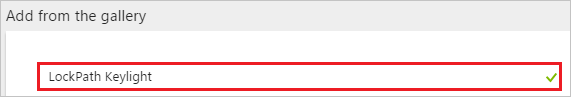
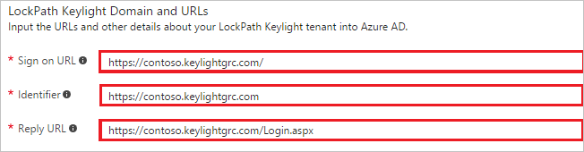
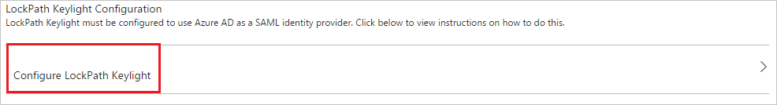
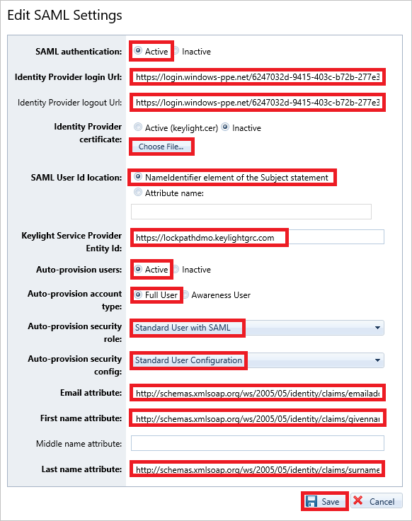

# Tutorial: Azure Active Directory integration with LockPath Keylight

In this tutorial, you learn how to integrate LockPath Keylight with Azure Active Directory (Azure AD).

Integrating LockPath Keylight with Azure AD provides you with the following benefits:

- You can control in Azure AD who has access to LockPath Keylight
- You can enable your users to automatically get signed-on to LockPath Keylight (Single Sign-On) with their Azure AD accounts
- You can manage your accounts in one central location - the Azure portal

If you want to know more details about SaaS app integration with Azure AD, see [what is application access and single sign-on with Azure Active Directory](active-directory-appssoaccess-whatis.md).

## Prerequisites

To configure Azure AD integration with LockPath Keylight, you need the following items:

- An Azure AD subscription
- A LockPath Keylight single-sign on enabled subscription

> [!NOTE]
> To test the steps in this tutorial, we do not recommend using a production environment.

To test the steps in this tutorial, you should follow these recommendations:

- Do not use your production environment, unless it is necessary.
- If you don't have an Azure AD trial environment, you can get a one-month trial [here](https://azure.microsoft.com/pricing/free-trial/).

## Scenario description
In this tutorial, you test Azure AD single sign-on in a test environment. 
The scenario outlined in this tutorial consists of two main building blocks:

1. Adding LockPath Keylight from the gallery
2. Configuring and testing Azure AD single sign-on

## Adding LockPath Keylight from the gallery
To configure the integration of LockPath Keylight into Azure AD, you need to add LockPath Keylight from the gallery to your list of managed SaaS apps.

**To add LockPath Keylight from the gallery, perform the following steps:**

1. In the **[Azure portal](https://portal.azure.com)**, on the left navigation panel, click **Azure Active Directory** icon. 

	![Active Directory][1]

2. Navigate to **Enterprise applications**. Then go to **All applications**.

	![Applications][2]
	
3. To add new application, click **New application** button on the top of dialog.

	![Applications][3]

4. In the search box, type **LockPath Keylight**.

	

5. In the results panel, select **LockPath Keylight**, and then click **Add** button to add the application.

	

##  Configuring and testing Azure AD single sign-on
In this section, you configure and test Azure AD single sign-on with LockPath Keylight based on a test user called "Britta Simon."

For single sign-on to work, Azure AD needs to know what the counterpart user in LockPath Keylight is to a user in Azure AD. In other words, a link relationship between an Azure AD user and the related user in LockPath Keylight needs to be established.

In LockPath Keylight, assign the value of the **user name** in Azure AD as the value of the **Username** to establish the link relationship.

To configure and test Azure AD single sign-on with LockPath Keylight, you need to complete the following building blocks:

1. **[Configuring Azure AD Single Sign-On](#configuring-azure-ad-single-sign-on)** - to enable your users to use this feature.
2. **[Creating an Azure AD test user](#creating-an-azure-ad-test-user)** - to test Azure AD single sign-on with Britta Simon.
3. **[Creating a LockPath Keylight test user](#creating-a-lockpath-keylight-test-user)** - to have a counterpart of Britta Simon in LockPath Keylight that is linked to the Azure AD representation of user.
4. **[Assigning the Azure AD test user](#assigning-the-azure-ad-test-user)** - to enable Britta Simon to use Azure AD single sign-on.
5. **[Testing Single Sign-On](#testing-single-sign-on)** - to verify whether the configuration works.

### Configuring Azure AD single sign-on

In this section, you enable Azure AD single sign-on in the Azure portal and configure single sign-on in your LockPath Keylight application.

**To configure Azure AD single sign-on with LockPath Keylight, perform the following steps:**

1. In the Azure portal, on the **LockPath Keylight** application integration page, click **Single sign-on**.

	![Configure Single Sign-On][4]

2. On the **Single sign-on** dialog, select **Mode** as	**SAML-based Sign-on** to enable single sign-on.
 
	

3. On the **LockPath Keylight Domain and URLs** section, perform the following steps::

	

    a. In the **Sign-on URL** textbox, type a URL using the following pattern: `https://<company name>.keylightgrc.com/`

	b. In the **Identifier** textbox, type a URL using the following pattern: `https://<company name>.keylightgrc.com`

	c. In the **Reply URL** textbox, type a URL using the following pattern: `https://<company name>.keylightgrc.com/Login.aspx`
    
	> [!NOTE] 
	> These values are not real. Update these values with the actual Identifier, Reply URL, and Sign-On URL. Contact [LockPath Keylight Client support team](https://www.lockpath.com/contact/) to get these values. 

4. On the **SAML Signing Certificate** section, click **Certificate(Raw)** and then save the certificate file on your computer.

	 

5. Click **Save** button.

	
	
6. On the **LockPath Keylight Configuration** section, click **Configure LockPath Keylight** to open **Configure sign-on** window. Copy the **Sign-Out URL and SAML Single Sign-On Service URL** from the **Quick Reference section.**

	 

7. To enable SSO in LockPath Keylight, perform the following steps:
   
    a. Sign-on to your LockPath Keylight account as administrator.
    
    b. In the menu on the top, click **Person**, and select **Keylight Setup**.
   
     

    c. In the treeview on the left, click **SAML**.
   
     

    d. On the **SAML Settings** dialog, click **Edit**.
   
     

8. On the **Edit SAML Settings** dialog page, perform the following steps:
   
     
   
    a. Set **SAML authentication** to **Active**.

    b. Paste the **SAML Single Sign-On Service URL** value which you have copied from the Azure portal into the **Identity Provider Login URL** textbox.

    c. Paste the **Single Sign-Out Service URL** value which you have copied from the Azure portal into the **Identity Provider Logout URL** textbox.

    d. Click **Choose File** to select your downloaded LockPath Keylight certificate, and then click **Open** to upload the certificate.

    e. Set **SAML User Id location** to **NameIdentifier element of the subject statement**.
    
    f. Provide the **Keylight Service Provider** using the following pattern: **https://&lt;CompanyName&gt;.keylightgrc.com**.
    
    g. Set **Auto-provision users** to **Active**.

    h. Set **Auto-provision account type** to **Full User**.

    i. Set **Auto-provision security role**, select **Standard User with SAML**.
    
    j. Set **Auto-provision security config**, select **Standard User Configuration**.
     
    k. In the **Email attribute** textbox, type `http://schemas.xmlsoap.org/ws/2005/05/identity/claims/emailaddress`.
    
    l. In the **First name attribute** textbox, type `http://schemas.xmlsoap.org/ws/2005/05/identity/claims/givenname`.
    
    m. In the **Last name attribute** textbox, type `http://schemas.xmlsoap.org/ws/2005/05/identity/claims/surname`.
    
    n. Click **Save**.

> [!TIP]
> You can now read a concise version of these instructions inside the [Azure portal](https://portal.azure.com), while you are setting up the app!  After adding this app from the **Active Directory > Enterprise Applications** section, simply click the **Single Sign-On** tab and access the embedded documentation through the **Configuration** section at the bottom. You can read more about the embedded documentation feature here: [Azure AD embedded documentation]( https://go.microsoft.com/fwlink/?linkid=845985)

### Creating an Azure AD test user
The objective of this section is to create a test user in the Azure portal called Britta Simon.

![Create Azure AD User][100]

**To create a test user in Azure AD, perform the following steps:**

1. In the **Azure portal**, on the left navigation pane, click **Azure Active Directory** icon.

	 

2. To display the list of users, go to **Users and groups** and click **All users**.
	
	 

3. To open the **User** dialog, click **Add** on the top of the dialog.
 
	 

4. On the **User** dialog page, perform the following steps:
 
	 

    a. In the **Name** textbox, type **BrittaSimon**.

    b. In the **User name** textbox, type the **email address** of BrittaSimon.

	c. Select **Show Password** and write down the value of the **Password**.

    d. Click **Create**.
 
### Creating a LockPath Keylight test user

In this section, you create a user called Britta Simon in LockPath Keylight. LockPath Keylight supports just-in-time provisioning, which is enabled by default.

There is no action item for you in this section. A new user is created when accessing LockPath Keylight if the user doesn't exist yet. 

>[!NOTE]
>If you need to create a user manually, you need to contact the [LockPath Keylight Client support team](https://www.lockpath.com/contact/). 

### Assigning the Azure AD test user

In this section, you enable Britta Simon to use Azure single sign-on by granting access to LockPath Keylight.

![Assign User][200] 

**To assign Britta Simon to LockPath Keylight, perform the following steps:**

1. In the Azure portal, open the applications view, and then navigate to the directory view and go to **Enterprise applications** then click **All applications**.

	![Assign User][201] 

2. In the applications list, select **LockPath Keylight**.

	 

3. In the menu on the left, click **Users and groups**.

	![Assign User][202] 

4. Click **Add** button. Then select **Users and groups** on **Add Assignment** dialog.

	![Assign User][203]

5. On **Users and groups** dialog, select **Britta Simon** in the Users list.

6. Click **Select** button on **Users and groups** dialog.

7. Click **Assign** button on **Add Assignment** dialog.
	
### Testing single sign-on

In this section, you test your Azure AD single sign-on configuration using the Access Panel.

When you click the LockPath Keylight tile in the Access Panel, you should get automatically signed-on to your LockPath Keylight application. 

## Additional resources

* [List of Tutorials on How to Integrate SaaS Apps with Azure Active Directory](active-directory-saas-tutorial-list.md)
* [What is application access and single sign-on with Azure Active Directory?](active-directory-appssoaccess-whatis.md)

<!--Image references-->

[1]: ./media/active-directory-saas-keylight-tutorial/tutorial_general_01.png
[2]: ./media/active-directory-saas-keylight-tutorial/tutorial_general_02.png
[3]: ./media/active-directory-saas-keylight-tutorial/tutorial_general_03.png
[4]: ./media/active-directory-saas-keylight-tutorial/tutorial_general_04.png

[100]: ./media/active-directory-saas-keylight-tutorial/tutorial_general_100.png

[200]: ./media/active-directory-saas-keylight-tutorial/tutorial_general_200.png
[201]: ./media/active-directory-saas-keylight-tutorial/tutorial_general_201.png
[202]: ./media/active-directory-saas-keylight-tutorial/tutorial_general_202.png
[203]: ./media/active-directory-saas-keylight-tutorial/tutorial_general_203.png

