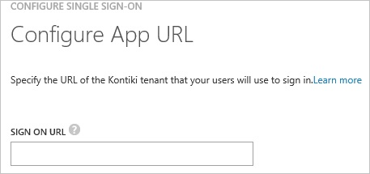
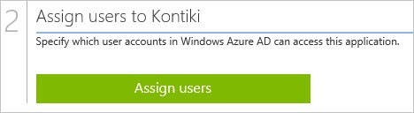

<properties 
    pageTitle="Tutorial: Azure Active Directory integration with Kontiki | Microsoft Azure" 
    description="Learn how to use Kontiki with Azure Active Directory to enable single sign-on, automated provisioning, and more!" 
    services="active-directory" 
    authors="jeevansd"  
    documentationCenter="na" 
    manager="femila"/>
<tags 
    ms.service="active-directory" 
    ms.devlang="na" 
    ms.topic="article" 
    ms.tgt_pltfrm="na" 
    ms.workload="identity" 
    ms.date="07/08/2016" 
    ms.author="jeedes" />

#Tutorial: Azure Active Directory integration with Kontiki
  
The objective of this tutorial is to show the integration of Azure and Kontiki.  
The scenario outlined in this tutorial assumes that you already have the following items:

-   A valid Azure subscription
-   A Kontiki single sign-on enabled subscription
  
After completing this tutorial, the Azure AD users you have assigned to Kontiki will be able to single sign into the application at your Kontiki company site (service provider initiated sign on), or using the [Introduction to the Access Panel](active-directory-saas-access-panel-introduction.md).
  
The scenario outlined in this tutorial consists of the following building blocks:

1.  Enabling the application integration for Kontiki
2.  Configuring single sign-on
3.  Configuring user provisioning
4.  Assigning users

##Enabling the application integration for Kontiki
  
The objective of this section is to outline how to enable the application integration for Kontiki.

###To enable the application integration for Kontiki, perform the following steps:

1.  In the Azure classic portal, on the left navigation pane, click **Active Directory**.

    

2.  From the **Directory** list, select the directory for which you want to enable directory integration.

3.  To open the applications view, in the directory view, click **Applications** in the top menu.

    

4.  Click **Add** at the bottom of the page.

    

5.  On the **What do you want to do** dialog, click **Add an application from the gallery**.

    

6.  In the **search box**, type **Kontiki**.

    

7.  In the results pane, select **Kontiki**, and then click **Complete** to add the application.

    
##Configuring single sign-on
  
The objective of this section is to outline how to enable users to authenticate to Kontiki with their account in Azure AD using federation based on the SAML protocol.

###To configure single sign-on, perform the following steps:

1.  In the Azure classic portal, on the **Kontiki** application integration page, click **Configure single sign-on** to open the **Configure Single Sign On ** dialog.

    

2.  On the **How would you like users to sign on to Kontiki** page, select **Microsoft Azure AD Single Sign-On**, and then click **Next**.

    

3.  On the **Configure App URL** page, in the **Kontiki Sign On URL** textbox, type the URL used by your users to sign on to Kontiki (e.g.: “*https://company.mc.eval.kontiki.com/*"), and then click **Next**.

    

4.  On the **Configure single sign-on at Kontiki** page, click **Download metadata**, and then save the metadata file on your computer.

    

5.  Send the metadatafile to the Kontiki support team.

    >[AZURE.NOTE] The single sign-on configuration has to be performed by the Kontiki support team. You will get a notification as soon as the configuration has been completed.

6.  On the Azure classic portal, select the single sign-on configuration confirmation, and then click **Complete** to close the **Configure Single Sign On** dialog.

    
##Configuring user provisioning
  
There is no action item for you to configure user provisioning to Kontiki.  
When an assigned user tries to log into Kontiki using the access panel, Kontiki checks whether the user exists.  
If there is no user account available yet, it is automatically created by Kontiki.
##Assigning users
  
To test your configuration, you need to grant the Azure AD users you want to allow using your application access to it by assigning them.

###To assign users to Kontiki, perform the following steps:

1.  In the Azure classic portal, create a test account.

2.  On the **Kontiki **application integration page, click **Assign users**.

    

3.  Select your test user, click **Assign**, and then click **Yes** to confirm your assignment.

    
  
If you want to test your single sign-on settings, open the Access Panel. For more details about the Access Panel, see [Introduction to the Access Panel](active-directory-saas-access-panel-introduction.md).