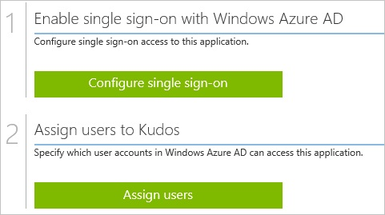
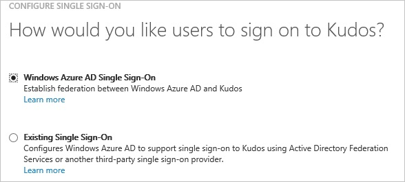
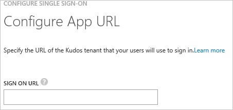
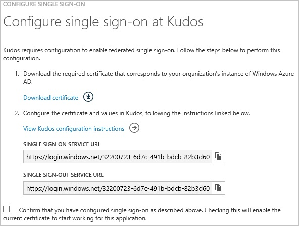
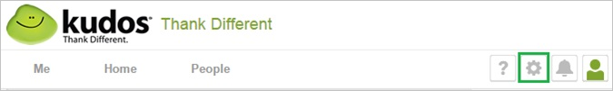
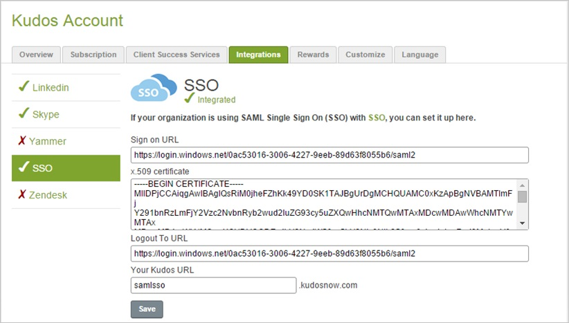
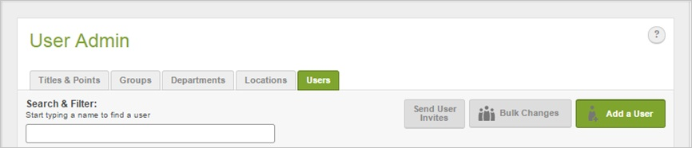
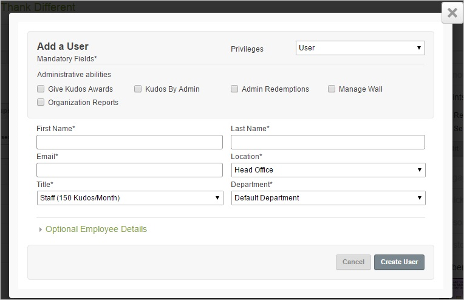

<properties 
    pageTitle="Tutorial: Azure Active Directory integration with Kudos | Microsoft Azure" 
    description="Learn how to use Kudos with Azure Active Directory to enable single sign-on, automated provisioning, and more!" 
    services="active-directory" 
    authors="jeevansd"  
    documentationCenter="na" 
    manager="femila"/>
<tags 
    ms.service="active-directory" 
    ms.devlang="na" 
    ms.topic="article" 
    ms.tgt_pltfrm="na" 
    ms.workload="identity" 
    ms.date="07/08/2016" 
    ms.author="jeedes" />

#Tutorial: Azure Active Directory integration with Kudos
  
The objective of this tutorial is to show the integration of Azure and Kudos.  
The scenario outlined in this tutorial assumes that you already have the following items:

-   A valid Azure subscription
-   A Kudos tenant
  
After completing this tutorial, the Azure AD users you have assigned to Kudos will be able to single sign into the application at your Kudos company site (service provider initiated sign on), or using the [Introduction to the Access Panel](active-directory-saas-access-panel-introduction.md).
  
The scenario outlined in this tutorial consists of the following building blocks:

1.  Enabling the application integration for Kudos
2.  Configuring single sign-on
3.  Configuring user provisioning
4.  Assigning users

##Enabling the application integration for Kudos
  
The objective of this section is to outline how to enable the application integration for Kudos.

###To enable the application integration for Kudos, perform the following steps:

1.  In the Azure classic portal, on the left navigation pane, click **Active Directory**.

    

2.  From the **Directory** list, select the directory for which you want to enable directory integration.

3.  To open the applications view, in the directory view, click **Applications** in the top menu.

    

4.  Click **Add** at the bottom of the page.

    

5.  On the **What do you want to do** dialog, click **Add an application from the gallery**.

    

6.  In the **search box**, type **Kudos**.

    

7.  In the results pane, select **Kudos**, and then click **Complete** to add the application.

    
##Configuring single sign-on
  
The objective of this section is to outline how to enable users to authenticate to Kudos with their account in Azure AD using federation based on the SAML protocol.  
As part of this procedure, you are required to create a base-64 encoded certificate file.  
If you are not familiar with this procedure, see [How to convert a binary certificate into a text file](http://youtu.be/PlgrzUZ-Y1o).

###To configure single sign-on, perform the following steps:

1.  In the Azure classic portal, on the **Kudos** application integration page, click **Configure single sign-on** to open the **Configure Single Sign On ** dialog.

    

2.  On the **How would you like users to sign on to Kudos** page, select **Microsoft Azure AD Single Sign-On**, and then click **Next**.

    

3.  On the **Configure App URL** page, in the **Kudos Sign On URL** textbox, type your URL using the following pattern "*https://company.kudosnow.com*", and then click **Next**.

    

4.  On the **Configure single sign-on at Kudos** page, click **Download certificate**, and then save the certificate file on your computer.

    

5.  In a different web browser window, log into your Kudos company site as an administrator.

6.  In the menu on the top, click **Settings**.

    

7.  Click **Integrations \> SSO**.

8.  In the **SSO** section, perform the following steps:

    

    1.  In the Azure classic portal, on the **Configure single sign-on at Kudos** dialog page, copy the **Single Sign-On Service URL** value, and then paste it into the **Sign on URL ** textbox.
    2.  Create a **base-64 encoded** file from your downloaded certificate.  

        >[AZURE.TIP]
        For more details, see [How to convert a binary certificate into a text file](http://youtu.be/PlgrzUZ-Y1o)

    3.  Open your base-64 encoded certificate in notepad, copy the content of it into your clipboard, and then paste it to the **X.509 certificate** textbox
    4.  In the Azure classic portal, on the **Configure single sign-on at Kudos** dialog page, copy the **Single Sign-Out Service URL** value, and then paste it into the **Logout To URL ** textbox.
    5.  In the **Your Kudos URL** textbox, type your company name.
    6.  Click **Save**.

9.  On the Azure classic portal, select the single sign-on configuration confirmation, and then click **Complete** to close the **Configure Single Sign On** dialog.

    
##Configuring user provisioning
  
In order to enable Azure AD users to log into Kudos, they must be provisioned into Kudos.  
In the case of Kudos, provisioning is a manual task.

###To provision a user accounts, perform the following steps:

1.  Log in to your **Kudos** company site as administrator.

2.  In the menu on the top, click **Settings**.

    

3.  Click **User Admin**.

4.  Click the **Users** tab, and then click **Add a user**.

    

5.  In the **Add a User** section, perform the following steps:

    

    1.  Type the **First Name**, **Last Name**, **Email** and other details of a valid Azure Active Directory account you want to provision into the related textboxes.
    2.  Click **Create User**.

>[AZURE.NOTE]You can use any other Kudos user account creation tools or APIs provided by Kudos to provision AAD user accounts.

##Assigning users
  
To test your configuration, you need to grant the Azure AD users you want to allow using your application access to it by assigning them.

###To assign users to Kudos, perform the following steps:

1.  In the Azure classic portal, create a test account.

2.  On the **Kudos **application integration page, click **Assign users**.

    

3.  Select your test user, click **Assign**, and then click **Yes** to confirm your assignment.

    
  
If you want to test your single sign-on settings, open the Access Panel. For more details about the Access Panel, see [Introduction to the Access Panel](active-directory-saas-access-panel-introduction.md).