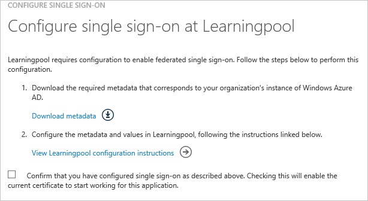

<properties 
    pageTitle="Tutorial: Azure Active Directory integration with Learningpool | Microsoft Azure" 
    description="Learn how to use Learningpool with Azure Active Directory to enable single sign-on, automated provisioning, and more!" 
    services="active-directory" 
    authors="jeevansd"  
    documentationCenter="na" 
    manager="femila"/>
<tags 
    ms.service="active-directory" 
    ms.devlang="na" 
    ms.topic="article" 
    ms.tgt_pltfrm="na" 
    ms.workload="identity" 
    ms.date="07/08/2016" 
    ms.author="jeedes" />

#Tutorial: Azure Active Directory integration with Learningpool
  
The objective of this tutorial is to show the integration of Azure and Learningpool.  
The scenario outlined in this tutorial assumes that you already have the following items:

-   A valid Azure subscription
-   A Learningpool single sign-on enabled subscription
  
After completing this tutorial, the Azure AD users you have assigned to Learningpool will be able to single sign into the application at your Learningpool company site (service provider initiated sign on), or using the [Introduction to the Access Panel](active-directory-saas-access-panel-introduction.md).
  
The scenario outlined in this tutorial consists of the following building blocks:

1.  Enabling the application integration for Learningpool
2.  Configuring single sign-on
3.  Configuring user provisioning
4.  Assigning users

##Enabling the application integration for Learningpool
  
The objective of this section is to outline how to enable the application integration for Learningpool.

###To enable the application integration for Learningpool, perform the following steps:

1.  In the Azure classic portal, on the left navigation pane, click **Active Directory**.

    

2.  From the **Directory** list, select the directory for which you want to enable directory integration.

3.  To open the applications view, in the directory view, click **Applications** in the top menu.

    

4.  Click **Add** at the bottom of the page.

    

5.  On the **What do you want to do** dialog, click **Add an application from the gallery**.

    

6.  In the **search box**, type **Learningpool**.

    

7.  In the results pane, select **Learningpool**, and then click **Complete** to add the application.

    
##Configuring single sign-on
  
The objective of this section is to outline how to enable users to authenticate to Learningpool with their account in Azure AD using federation based on the SAML protocol.
  
Your Learningpool application expects the SAML assertions in a specific format, which requires you to add custom attribute mappings to your **saml token attributes** configuration.  
The following screenshot shows an example for this.

###To configure single sign-on, perform the following steps:

1.  In the Azure classic portal, on the **Learningpool** application integration page, in the menu on the top, click **Attributes** to open the **SAML Token Attributes** dialog.

    

2.  To add the required attribute mappings, perform the following steps:

    ###  

    |Attribute Name                |Attribute Value            |
	|------------------------------|---------------------------|

     urn:oid:1.2.840.113556.1.4.221 | User.userprincipalname
	|-------------------------------|--------------------------|  
	 urn:oid:2.5.4.42|User.givenname   
    |urn:oid:0.9.2342.19200300.100.1.3|User.mail
    |urn:oid:2.5.4.4|User.surname

    1.  For each data row in the table above, click **add user attribute**.
    2.  In the **Attribute Name** textbox, type the attribute name shown for that row.
    3.  From the **Attribute Value** list, select the attribute value shown for that row.
    4.  Click **Complete**.

3.  Click **Apply Changes**.

4.  In your browser, click **Back** to open the **Quick Start** dialog again.

5.  Click **Configure single sign-on** to open the **Configure Single Sign On ** dialog.

    

6.  On the **How would you like users to sign on to Learningpool** page, select **Microsoft Azure AD Single Sign-On**, and then click **Next**.

    

7.  On the **Configure App URL** page, in the **Learningpool Sign On URL** textbox, type the URL used by your users to sign on to your Learningpool application ( e.g.: 
https://parliament.preview.learningpool.com/auth/shibboleth/index.php), and then click **Next**.

    

8.  On the **Configure single sign-on at Learningpool** page, to download your metadata, click **Download metadata**, and then save the certificate file locally on your computer.

    

9.  Forward that Metadata file to your Learningpool Support team.

    >[AZURE.NOTE]Single sign-on has to be enabled by the Learningpool support team.

10. On the Azure classic portal, select the single sign-on configuration confirmation, and then click **Complete** to close the **Configure Single Sign On** dialog.

    
##Configuring user provisioning
  
In order to enable Azure AD users to log into Learningpool, they must be provisioned into Learningpool.
  
There is no action item for you to configure user provisioning to Learningpool.  
Users need to be created by your Learningpool support team.

>[AZURE.NOTE]You can use any other Learningpool user account creation tools or APIs provided by Learningpool to provision AAD user accounts.

##Assigning users
  
To test your configuration, you need to grant the Azure AD users you want to allow using your application access to it by assigning them.

###To assign users to Learningpool, perform the following steps:

1.  In the Azure classic portal, create a test account.

2.  On the **Learningpool **application integration page, click **Assign users**.

    

3.  Select your test user, click **Assign**, and then click **Yes** to confirm your assignment.

    
  
If you want to test your single sign-on settings, open the Access Panel. For more details about the Access Panel, see [Introduction to the Access Panel](active-directory-saas-access-panel-introduction.md).