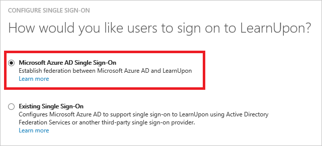
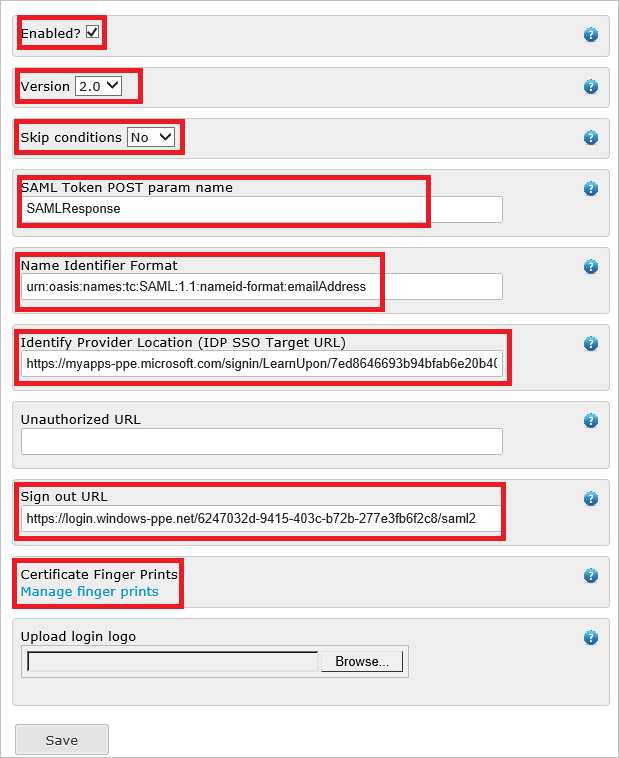
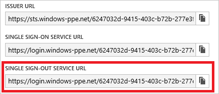
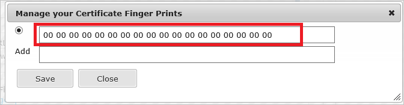
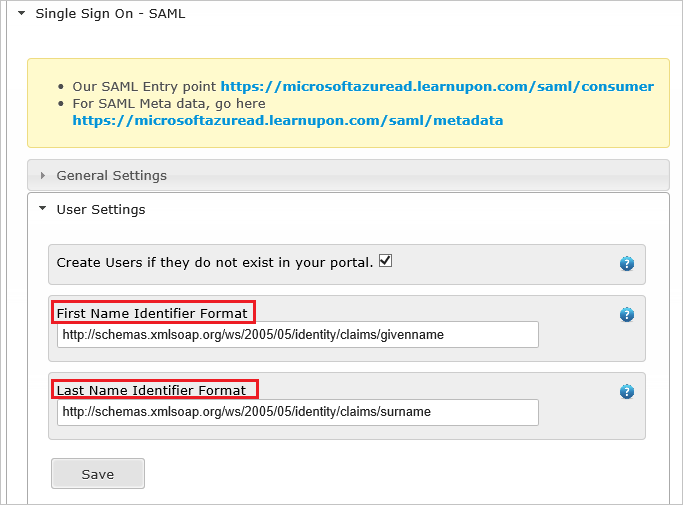

<properties
	pageTitle="Tutorial: Azure Active Directory integration with Novatus | Microsoft Azure"
	description="Learn how to configure single sign-on between Azure Active Directory and LearnUpon."
	services="active-directory"
	documentationCenter=""
	authors="jeevansd"
	manager="stevenpo"
	editor=""/>

<tags
	ms.service="active-directory"
	ms.workload="identity"
	ms.tgt_pltfrm="na"
	ms.devlang="na"
	ms.topic="article"
	ms.date="05/16/2016"
	ms.author="jeedes"/>

# Tutorial: Azure Active Directory integration with LearnUpon

The objective of this tutorial is to show you how to integrate LearnUpon with Azure Active Directory (Azure AD). Integrating LearnUpon with Azure AD provides you with the following benefits:

- You can control in Azure AD who has access to LearnUpon
- You can enable your users to automatically get signed-on to LearnUpon (Single Sign-On) with their Azure AD accounts
- You can manage your accounts in one central location - the Azure Active Directory classic 
- 

If you want to know more details about SaaS app integration with Azure AD, see [What is application access and single sign-on with Azure Active Directory](active-directory-appssoaccess-whatis.md).

## Prerequisites

To configure Azure AD integration with LearnUpon, you need the following items:

- An Azure AD subscription
- A LearnUpon single-sign on enabled subscription

> [AZURE.NOTE] To test the steps in this tutorial, we do not recommend using a production environment.

To test the steps in this tutorial, you should follow these recommendations:

- You should not use your production environment, unless this is necessary.
- If you don't have an Azure AD trial environment, you can get a one-month trial [here](https://azure.microsoft.com/pricing/free-trial/).

## Scenario Description
The objective of this tutorial is to enable you to test Azure AD single sign-on in a test environment.  
The scenario outlined in this tutorial consists of two main building blocks:

1. Adding LearnUpon from the gallery
2. Configuring and testing Azure AD single sign-on

## Adding LearnUpon from the gallery
To configure the integration of LearnUpon into Azure AD, you need to add LearnUpon from the gallery to your list of managed SaaS apps.

**To add LearnUpon from the gallery, perform the following steps:**

1. In the **Azure classic portal**, on the left navigation pane, click **Active Directory**.   
![Active Directory][1] 

2. From the **Directory** list, select the directory for which you want to enable directory integration.

3. To open the applications view, in the directory view, click **Applications** in the top menu.  
![Applications][2] 
4. Click **Add** at the bottom of the page.  
![Applications][3] 
5. On the **What do you want to do** dialog, click **Add an application from the gallery**.  
![Applications][4] 
6. In the search box, type **LearnUpon**.  
 
7. In the results pane, select **LearnUpon**, and then click **Complete** to add the application.
  
 
##  Configuring and testing Azure AD single sign-on
The objective of this section is to show you how to configure and test Azure AD single sign-on with LearnUpon based on a test user called "Britta Simon".

For single sign-on to work, Azure AD needs to know what the counterpart user in LearnUpon to an user in Azure AD is. In other words, a link relationship between an Azure AD user and the related user in LearnUpon needs to be established. 
This link relationship is established by assigning the value of the **user name** in Azure AD as the value of the **Username** in LearnUpon.

To configure and test Azure AD single sign-on with LearnUpon, you need to complete the following building blocks:

1. **[Configuring Azure AD Single Sign-On](#configuring-azure-ad-single-single-sign-on)** - to enable your users to use this feature.
2. **[Creating an Azure AD test user](#creating-an-azure-ad-test-user)** - to test Azure AD single sign-on with Britta Simon.
4. **[Creating a LearnUpon test user](#creating-a-learnupon-test-user)** - to have a counterpart of Britta Simon in LearnUpon that is linked to the Azure AD representation of her.
5. **[Assigning the Azure AD test user](#assigning-the-azure-ad-test-user)** - to enable Britta Simon to use Azure AD single sign-on.
5. **[Testing Single Sign-On](#testing-single-sign-on)** - to verify whether the configuration works.

### Configuring Azure AD Single Sign-On

The objective of this section is to enable Azure AD single sign-on in the Azure AD portal and to configure single sign-on in your LearnUpon application.

**To configure Azure AD single sign-on with LearnUpon, perform the following steps:**

1. In the Azure AD portal, on the **LearnUpon** application integration page, click **Configure single sign-on** to open the **Configure Single Sign-On**  dialog.
   ![Configure Single Sign-On][6]  

2. On the **How would you like users to sign on to LearnUpon** page, select **Azure AD Single Sign-On**, and then click **Next**.
     

3. On the **Configure App Settings** dialog page, perform the following steps:.
    

    a. In the Reply URL textbox, type the Assertion Consumer Service URL using the following pattern: **“https://\<companyname\>.learnupon.com/saml/consumer”**. 

4. On the **Configure single sign-on at LearnUpon** page, perform the following steps:
    

    a. Click **Download certificate**, and then save the file on your computer. We will need this certificate and Metadata URLs (Entity ID, SSO Sign In URL and Sign Out URL) to set up SSO on LearnUpon side.

    b. Click **Next**.

5. Open another browser instance login into LearnUpon instance with admin user to set **SAML SSO** on LearnUpon side. When logged into LearnUpon you will see a screen similar to this.
    

	a. Click on the tab of **settings** to open the settings window. 
	b. Click **Single Sign On - SAML** 
	c. Click **General Settings** to configure SAML settings.
    
	d. Fill out the form of **General Settings** as below:
    
		d1. Select the checkbox of **Enabled** to enable SAML on this portal 
		d2. Choose **version 2.0** 
		d3. Choose **No Skip conditions** 
		d4. **SAML Token POST param name** is the name of request post parameter to the SAML 	consumer URL indicated above, that contains the SAML Assertion to be verified and 	authenticated. e.g.**SAMLResponse**  
		d5. **Name Identifier Format** tells us where in your SAML Assertion the users 	identifier (Email address) resides, e.g.**urn:oasis:names:tc:SAML:1.1:nameid-	format:emailAddress**. 
		d6. **Identify Provider Location** is where we will send users if they click on your uploaded icon from your portal login screen. 
		d7. Copy **Single Sign-Out Service URL** from Azure Configuration Screen to **Sign out 	URL**.
		   
		d8. Click the link **Manage finger prints** of Certificate Finger Print to upload the 	Finger Print of certificate.
		   
		d9. Click the Save button
	e. Click **User Settings** to configure SAML User settings.
	    
		e1. **First Name Identifier Format** tells us where in your SAML Assertion the users 	firstname resides, e.g. **http://schemas.xmlsoap.org/ws/2005/05/identity/claims/	givenname**.
		e2. **Last Name Identifier Format** tells us where in your SAML Assertion the users 	lastname resides, e.g. **http://schemas.xmlsoap.org/ws/2005/05/identity/claims/	surname**

6. In the Azure AD portal, select the single sign-on configuration confirmation, and then click **Next**.
  ![Azure AD Single Sign-On][10] 

7. On the **Single sign-on confirmation** page, click **Complete**.  
   ![Azure AD Single Sign-On][11]

### Creating an Azure AD test user
The objective of this section is to create a test user in the Azure classic portal called Britta Simon. 
In the Users list, select **Britta Simon**.  ![Create Azure AD User][20] 

**To create a test user in Azure AD, perform the following steps:**

1. In the **Azure classic portal**, on the left navigation pane, click **Active Directory**.
    

2. From the **Directory** list, select the directory for which you want to enable directory integration.

3. To display the list of users, in the menu on the top, click **Users**.
     

4. To open the **Add User** dialog, in the toolbar on the bottom, click **Add User**.
     

5. On the **Tell us about this user** dialog page, perform the following steps:
     

    a. As Type Of User, select New user in your organization.

    b. In the User Name **textbox**, type **BrittaSimon**.

    c. Click **Next**.

6.  On the **User Profile** dialog page, perform the following steps:
    

    a. In the **First Name** textbox, type **Britta**.  

    b. In the **Last Name** textbox, type, **Simon**.

    c. In the **Display Name** textbox, type **Britta Simon**.

    d. In the **Role** list, select **User**.

    e. Click **Next**.

7. On the **Get temporary password** dialog page, click **create**.
     

8. On the **Get temporary password** dialog page, perform the following steps:
    

    a. Write down the value of the **New Password**.

    b. Click **Complete**.   

### Creating a LearnUpon test user

The objective of this section is to create a user called Britta Simon in LearnUpon. LearnUpon supports just-in-time provisioning, which is by default enabled.

There is no action item for you in this section. A new user will be created during an attempt to access LearnUpon if it doesn't exist yet. [Configuring Azure AD Single Sign-On](#configuring-azure-ad-single-single-sign-on).

> [AZURE.NOTE] If you need to create an user manually, you need to contact the LearnUpon support team.

### Assigning the Azure AD test user

The objective of this section is to enabling Britta Simon to use Azure single sign-on by granting her access to LearnUpon.
  ![Assign User][200]  

**To assign Britta Simon to LearnUpon, perform the following steps:**

1. On the Azure classic portal, to open the applications view, in the directory view, click **Applications** in the top menu.
  ![Assign User][201]  

2. In the applications list, select **LearnUpon**.
    

1. In the menu on the top, click **Users**.
  ![Assign User][203]  

1. In the Users list, select **Britta Simon**.

2. In the toolbar on the bottom, click **Assign**.
  ![Assign User][205]

### Testing Single Sign-On

The objective of this section is to test your Azure AD single sign-on configuration using the Access Panel. 
When you click the LearnUpon tile in the Access Panel, you should get automatically signed-on to your LearnUpon application.

## Additional Resources

* [List of Tutorials on How to Integrate SaaS Apps with Azure Active Directory](active-directory-saas-tutorial-list.md)
* [What is application access and single sign-on with Azure Active Directory?](active-directory-appssoaccess-whatis.md)

<!--Image references-->

[1]: ./media/active-directory-saas-learnupon-tutorial/tutorial_general_01.png
[2]: ./media/active-directory-saas-learnupon-tutorial/tutorial_general_02.png
[3]: ./media/active-directory-saas-learnupon-tutorial/tutorial_general_03.png
[4]: ./media/active-directory-saas-learnupon-tutorial/tutorial_general_04.png

[6]: ./media/active-directory-saas-learnupon-tutorial/tutorial_general_05.png
[10]: ./media/active-directory-saas-learnupon-tutorial/tutorial_general_06.png
[11]: ./media/active-directory-saas-learnupon-tutorial/tutorial_general_07.png
[20]: ./media/active-directory-saas-learnupon-tutorial/tutorial_general_100.png

[200]: ./media/active-directory-saas-learnupon-tutorial/tutorial_general_200.png
[201]: ./media/active-directory-saas-learnupon-tutorial/tutorial_general_201.png
[203]: ./media/active-directory-saas-learnupon-tutorial/tutorial_general_203.png
[204]: ./media/active-directory-saas-learnupon-tutorial/tutorial_general_204.png
[205]: ./media/active-directory-saas-learnupon-tutorial/tutorial_general_205.png
