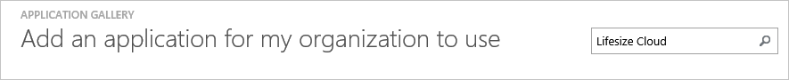
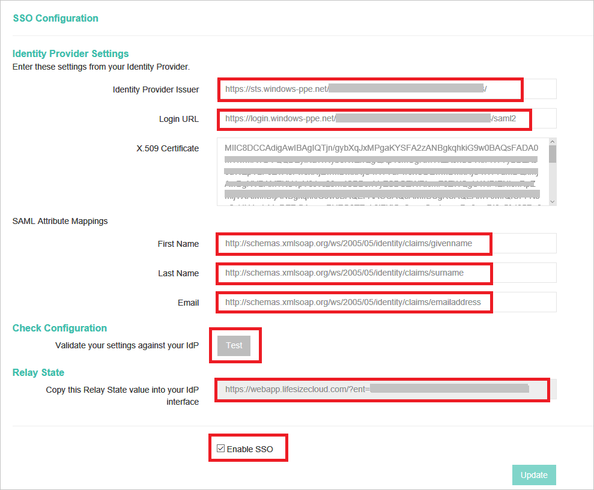
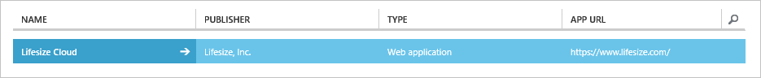

# Tutorial: Azure Active Directory integration with Lifesize Cloud
In this tutorial, you learn how to integrate Lifesize Cloud with Azure Active Directory (Azure AD).

Integrating Lifesize Cloud with Azure AD provides you with the following benefits:

* You can control in Azure AD who has access to Lifesize Cloud
* You can enable your users to automatically get signed-on to Lifesize Cloud single sign-on (SSO) with their Azure AD accounts
* You can manage your accounts in one central location - the Azure classic portal

If you want to know more details about SaaS app integration with Azure AD, see [What is application access and single sign-on with Azure Active Directory](active-directory-appssoaccess-whatis.md).

## Prerequisites
To configure Azure AD integration with Lifesize Cloud, you need the following items:

* An Azure AD subscription
* A Lifesize Cloud single-sign on (SSO) enabled subscription

>[!NOTE]
>To test the steps in this tutorial, we do not recommend using a production environment. 
> 

To test the steps in this tutorial, you should follow these recommendations:

* You should not use your production environment, unless this is necessary.
* If you don't have an Azure AD trial environment, you can get a one-month trial [here](https://azure.microsoft.com/pricing/free-trial/).

## Scenario description
In this tutorial, you test Azure AD single sign-on in a test environment.

The scenario outlined in this tutorial consists of two main building blocks:

* Adding Lifesize Cloud from the gallery
* Configuring and testing Azure AD SSO

## Add Lifesize Cloud from the gallery
To configure the integration of Lifesize Cloud into Azure AD, you need to add Lifesize Cloud from the gallery to your list of managed SaaS apps.

**To add Lifesize Cloud from the gallery, perform the following steps:**

1. In the **Azure classic portal**, on the left navigation pane, click **Active Directory**.
   
    ![Active Directory][1]
2. From the **Directory** list, select the directory for which you want to enable directory integration.
3. To open the applications view, in the directory view, click **Applications** in the top menu.
   
    ![Applications][2]
4. Click **Add** at the bottom of the page.
   
    ![Applications][3]
5. On the **What do you want to do** dialog, click **Add an application from the gallery**.
   
    ![Applications][4]
6. In the search box, type **Lifesize Cloud**.
   
    
7. In the results pane, select **Lifesize Cloud**, and then click **Complete** to add the application.
   
    

## Configure and test Azure AD single sign-on
In this section, you configure and test Azure AD single sign-on with Lifesize Cloud based on a test user called "Britta Simon".

For single sign-on to work, Azure AD needs to know what the counterpart user in Lifesize Cloud is to a user in Azure AD. In other words, a link relationship between an Azure AD user and the related user in Lifesize Cloud needs to be established.

This link relationship is established by assigning the value of the **user name** in Azure AD as the value of the **Username** in Lifesize Cloud.

To configure and test Azure AD single sign-on with Lifesize Cloud, you need to complete the following building blocks:

1. **[Configuring Azure AD single sign-on](#configuring-azure-ad-single-sign-on)** - to enable your users to use this feature.
2. **[Creating an Azure AD test user](#creating-an-azure-ad-test-user)** - to test Azure AD single sign-on with Britta Simon.
3. **[Creating a Lifesize Cloud test user](#creating-a-lifesize-cloud-test-user)** - to have a counterpart of Britta Simon in Lifesize Cloud that is linked to the Azure AD representation of her.
4. **[Assigning the Azure AD test user](#assigning-the-azure-ad-test-user)** - to enable Britta Simon to use Azure AD single sign-on.
5. **[Testing single sign-on](#testing-single-sign-on)** - to verify whether the configuration works.

### Configure Azure AD single sign-on
In this section, you enable Azure AD SSO in the classic portal and configure single sign-on in your Lifesize Cloud application.

**To configure Azure AD single sign-on with Lifesize Cloud, perform the following steps:**

1. In the classic portal, on the **Lifesize Cloud** application integration page, click **Configure single sign-on** to open the **Configure Single Sign-On**  dialog.
   
    ![Configure Single Sign-On][6] 
2. On the **How would you like users to sign on to Lifesize Cloud** page, select **Azure AD Single Sign-On**, and then click **Next**.
   
     
3. On the **Configure App Settings** dialog page, perform the following steps:
   
      
  1. In the **Sign On URL** textbox, type the URL used by your users to sign-on to your Lifesize Cloud application using the following pattern: **https://login.lifesizecloud.com/ls/?acs**.
  2. click **Next**.
4. On the **Configure single sign-on at Lifesize Cloud** page, perform the following steps:
   
   
   1. Click **Download certificate**, and then save the file on your computer.
   2. Click **Next**.
5. To get SSO configured for your application, login into the Lifesize Cloud application with Admin privileges.
6. In the top right corner click on your name and then click on the **Advance Settings**.
   
    
7. In the Advance Settings now click on the **SSO Configuration** link. This will open the SSO Configuration page for your instance.
   
    
8. Now configure the following values in the SSO configuration UI.    
   
    
  1. Copy the value of Issuer URL from Azure AD and paste that in **Identity Provider Issuer** textbox. 
  2. Copy the value of Remote Login URL from Azure AD and paste that in **Login URL** textbox.   
  3. Open the downloaded certificate in notepad and copy the content of certificate, excluding the Begin Certificate and End Certificate lines, paste this in the **X.509 Certificate** textbox.
  4. In the SAML Attribute mapping for the **First Name** text box enter the value as **http://schemas.xmlsoap.org/ws/2005/05/identity/claims/givenname**
  5. In the SAML Attribute mapping for the **Last Name** text box enter the value as **http://schemas.xmlsoap.org/ws/2005/05/identity/claims/surname**
  6. In the SAML Attribute mapping for the **Email** text box enter the value as **http://schemas.xmlsoap.org/ws/2005/05/identity/claims/emailaddress**
9. To check the configuration you can click on the **Test** button.
   
   >[!NOTE]
   >For successful testing you need to complete the configuration wizard in Azure AD and also provide access to users or groups who can perform the test.
   >  
10. Enable the SSO by checking on the **Enable SSO** button.
11. Now click on the **Update** button so that all the settings are saved. This will generate the RelayState value. Copy the RelayState value which is generated in the text box. We will need this value in the next steps.
12. In the classic portal, select the single sign-on configuration confirmation, and then click **Next**.
    
   ![Azure AD Single Sign-On][10]
13. On the **Single sign-on confirmation** page, click **Complete**.  
    
    ![Azure AD Single Sign-On][11]
    
**To login to the Azure Management Portal:**

1. Login into **https://portal.azure.com** using admin credentials.
2. Click on **More Services** link in the left navigation pane.
    
    
3. Search for Azure Active Directory and Click on the **Azure Active Directory** Link.
    
    
4. You will find all your SaaS applications under the **Enterprise Applications** button.
    
    
5. Now click on **All Applications** link in the next blade.
    
    
6. Search for Lifesize application for which you want to setup the RelayState. 
    
    
7. Now Click **Single sign-on** link in the blade.
    
    
8. You will see the **Show advanced URL settings** check box. Click the check box.
    
    
9. Now configure the RelayState for the application, which you see in the Lifesize application SSO configuration page. 
    
    
10. Save the settings.

### Create an Azure AD test user
In this section, you create a test user in the classic portal called Britta Simon.

![Create Azure AD User][20]

**To create a test user in Azure AD, perform the following steps:**

1. In the **Azure classic portal**, on the left navigation pane, click **Active Directory**.
   
     
2. From the **Directory** list, select the directory for which you want to enable directory integration.
3. To display the list of users, in the menu on the top, click **Users**.
   
     
4. To open the **Add User** dialog, in the toolbar on the bottom, click **Add User**.
   
     
5. On the **Tell us about this user** dialog page, perform the following steps:

     
   1. As Type Of User, select New user in your organization.
   2. In the User Name **textbox**, type **BrittaSimon**.
   3. Click **Next**.
6. On the **User Profile** dialog page, perform the following steps:

    
   1. In the **First Name** textbox, type **Britta**.   
   2. In the **Last Name** textbox, type, **Simon**.
   3. In the **Display Name** textbox, type **Britta Simon**.
   4. In the **Role** list, select **User**.
   5. Click **Next**.
7. On the **Get temporary password** dialog page, click **create**.
   
     
8. On the **Get temporary password** dialog page, perform the following steps:
   
     
    1. Write down the value of the **New Password**.
    2. Click **Complete**.   

### Create an Lifesize Cloud test user
In this section, you create a user called Britta Simon in Lifesize Cloud. Lifesize cloud does support automatic user provisioning. After successful authentication at Azure AD, the user will be automatically provisioned in the application. 

### Assign the Azure AD test user
In this section, you enable Britta Simon to use Azure single sign-on by granting her access to Lifesize Cloud.

![Assign User][200] 

**To assign Britta Simon to Lifesize Cloud, perform the following steps:**

1. On the classic portal, to open the applications view, in the directory view, click **Applications** in the top menu.
   
    ![Assign User][201] 
2. In the applications list, select **Lifesize Cloud**.
   
     
3. In the menu on the top, click **Users**.
   
    ![Assign User][203]
4. In the Users list, select **Britta Simon**.
5. In the toolbar on the bottom, click **Assign**.
   
    ![Assign User][205]

### Test single sign-on
In this section, you test your Azure AD SSO configuration using the Access Panel.

When you click the Lifesize Cloud tile in the Access Panel, you should get automatically signed-on to your Lifesize Cloud application.

## Additional resources
* [List of Tutorials on How to Integrate SaaS Apps with Azure Active Directory](active-directory-saas-tutorial-list.md)
* [What is application access and single sign-on with Azure Active Directory?](active-directory-appssoaccess-whatis.md)

<!--Image references-->

[1]: ./media/active-directory-saas-lifesize-cloud-tutorial/tutorial_general_01.png
[2]: ./media/active-directory-saas-lifesize-cloud-tutorial/tutorial_general_02.png
[3]: ./media/active-directory-saas-lifesize-cloud-tutorial/tutorial_general_03.png
[4]: ./media/active-directory-saas-lifesize-cloud-tutorial/tutorial_general_04.png

[6]: ./media/active-directory-saas-lifesize-cloud-tutorial/tutorial_general_05.png
[10]: ./media/active-directory-saas-lifesize-cloud-tutorial/tutorial_general_06.png
[11]: ./media/active-directory-saas-lifesize-cloud-tutorial/tutorial_general_07.png
[20]: ./media/active-directory-saas-lifesize-cloud-tutorial/tutorial_general_100.png

[200]: ./media/active-directory-saas-lifesize-cloud-tutorial/tutorial_general_200.png
[201]: ./media/active-directory-saas-lifesize-cloud-tutorial/tutorial_general_201.png
[203]: ./media/active-directory-saas-lifesize-cloud-tutorial/tutorial_general_203.png
[204]: ./media/active-directory-saas-lifesize-cloud-tutorial/tutorial_general_204.png
[205]: ./media/active-directory-saas-lifesize-cloud-tutorial/tutorial_general_205.png
