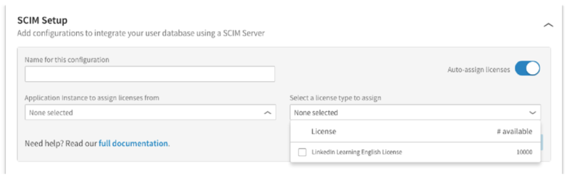

# Tutorial: Configuring LinkedIn Learning for Automatic User Provisioning

The objective of this tutorial is to show you the steps you need to perform in LinkedIn Learning and Azure AD to automatically provision and de-provision user accounts from Azure AD to LinkedIn Learning. 

## Prerequisites

The scenario outlined in this tutorial assumes that you already have the following items:

*   An Azure Active Directory tenant
*   A LinkedIn Learning tenant 
*   An administrator account in LinkedIn Learning with access to the LinkedIn Account Center

> [!NOTE]
> Azure Active Directory integrates with LinkedIn Learning using the [SCIM](http://www.simplecloud.info/) protocol.

## Assigning users to LinkedIn Learning

Azure Active Directory uses a concept called "assignments" to determine which users should receive access to selected apps. In the context of automatic user account provisioning, only the users and groups that have been "assigned" to an application in Azure AD will be synchronized. 

Before configuring and enabling the provisioning service, you will need to decide what users and/or groups in Azure AD represent the users who need access to LinkedIn Learning. Once decided, you can assign these users to LinkedIn Learning by following the instructions here:

[Assign a user or group to an enterprise app](active-directory-coreapps-assign-user-azure-portal.md)

### Important tips for assigning users to LinkedIn Learning

*	It is recommended that a single Azure AD user be assigned to LinkedIn Learning to test the provisioning configuration. Additional users and/or groups may be assigned later.

*	When assigning a user to LinkedIn Learning, you must select the **User** role in the assignment dialog. The "Default Access" role does not work for provisioning.

## Configuring user provisioning to LinkedIn Learning

This section guides you through connecting your Azure AD to LinkedIn Learning's SCIM user account provisioning API, and configuring the provisioning service to create, update and disable assigned user accounts in LinkedIn Learning based on user and group assignment in Azure AD.

> [!TIP]
> You may also choose to enabled SAML-based Single Sign-On for LinkedIn Learning, following the instructions provided in [Azure portal](https://portal.azure.com). Single sign-on can be configured independently of automatic provisioning, though these two features complement each other.

### To configure automatic user account provisioning to LinkedIn Learning in Azure AD:

The first step is to retrieve your LinkedIn access token. If you are an Enterprise administrator, you can self-provision an
    access token. In your account center, go to **Settings &gt; Global Settings** and open the **SCIM Setup** panel.

> [!NOTE]
> If you are accessing the account center directly rather than through a link, you can reach it using the following steps.

1)  Sign in to Account Center.

2)  Select **Admin &gt; Admin Settings** .

3)  Click **Advanced Integrations** on the left sidebar. You are
    directed to the account center.

4)  Click **+ Add new SCIM configuration** and follow the procedure by
    filling in each field.

> When auto­assign licenses is not enabled, it means that only user
> data is synced.

> When auto­license assignment is enabled, you need to note the
> application instance and license type. Licenses are assigned on a
> first come, first serve basis until all the licenses are taken.

5)  Click **Generate token**. You should see your access token display
    under the **Access token** field.

6)  Save your access token to your clipboard or computer before leaving
    the page.

7) Next, sign in to the [Azure portal](https://portal.azure.com), and browse to the **Azure Active Directory > Enterprise Apps > All applications**  section.

8) If you have already configured LinkedIn Learning for single sign-on, search for your instance of LinkedIn Learning using the search field. Otherwise, select **Add** and search for **LinkedIn Learning** in the application gallery. Select LinkedIn Learning from the search results, and add it to your list of applications.

9)	Select your instance of LinkedIn Learning, then select the **Provisioning** tab.

10)	Set the **Provisioning Mode** to **Automatic**.

11)  Fill in the following fields under **Admin Credentials** :

* In the **Tenant URL** field, enter https://api.linkedin.com.

* In the **Secret Token** field, enter the access token you generated in step 1 and click **Test Connection** .

* You should see a success notification on the upper­right side of
    your portal.

12) Enter the email address of a person or group who should receive provisioning error notifications in the **Notification Email** field, and check the checkbox below.

13) Click **Save**. 

14) In the **Attribute Mappings** section, review the user and group attributes that will be synchronized from Azure AD to LinkedIn Learning. Note that the attributes selected as **Matching** properties will be used to match the user accounts and groups in LinkedIn Learning for update operations. Select the Save button to commit any changes.

15) To enable the Azure AD provisioning service for LinkedIn Learning, change the **Provisioning Status** to **On** in the **Settings** section

16) Click **Save**. 

This will start the initial synchronization of any users and/or groups assigned to LinkedIn Learning in the Users and Groups section. Note that the initial sync will take longer to perform than subsequent syncs, which occur approximately every 20 minutes as long as the service is running. You can use the **Synchronization Details** section to monitor progress and follow links to provisioning activity reports, which describe all actions performed by the provisioning service on your LinkedIn Learning app.

## Additional Resources

* [Managing user account provisioning for Enterprise Apps](active-directory-enterprise-apps-manage-provisioning.md)
* [What is application access and single sign-on with Azure Active Directory?](active-directory-appssoaccess-whatis.md)
