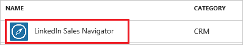
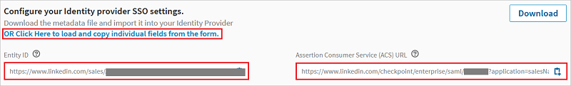
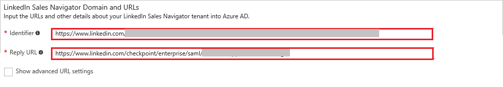
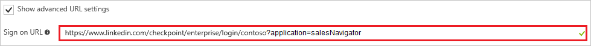
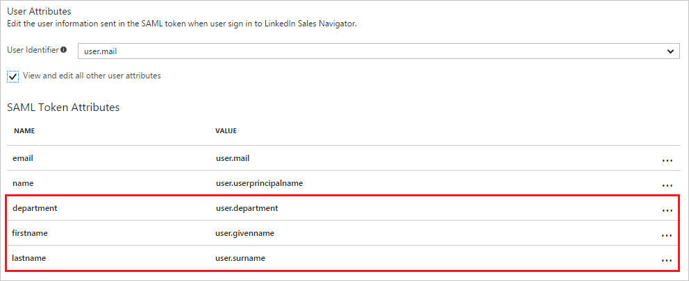
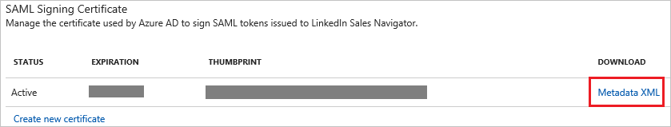

# Tutorial: Azure Active Directory integration with LinkedIn Sales Navigator

In this tutorial, you learn how to integrate LinkedIn Sales Navigator with Azure Active Directory (Azure AD).

Integrating LinkedIn Sales Navigator with Azure AD provides you with the following benefits:

- You can control in Azure AD who has access to LinkedIn Sales Navigator
- You can enable your users to automatically get signed-on to LinkedIn Sales Navigator (Single Sign-On) with their Azure AD accounts
- You can manage your accounts in one central location - the Azure portal

If you want to know more details about SaaS app integration with Azure AD, browse [what is application access and single sign-on with Azure Active Directory](active-directory-appssoaccess-whatis.md).

## Prerequisites

To configure Azure AD integration with LinkedIn Sales Navigator, you need the following items:

- An Azure AD subscription
- A LinkedIn Sales Navigator single-sign on enabled subscription

> [!NOTE]
> To test the steps in this tutorial, we do not recommend using a production environment.

To test the steps in this tutorial, you should follow these recommendations:

- Avoid using your production environment, unless it is necessary.
- If you don't have an Azure AD trial environment, you can get a one-month trial [here](https://azure.microsoft.com/pricing/free-trial/).

## Scenario description
In this tutorial, you test Azure AD single sign-on in a test environment. 
The scenario outlined in this tutorial consists of two main building blocks:

1. Adding LinkedIn Sales Navigator from the gallery
2. Configuring and testing Azure AD single sign-on

## Adding LinkedIn Sales Navigator from the gallery
To configure the integration of LinkedIn Sales Navigator into Azure AD, you need to add LinkedIn Sales Navigator from the gallery to your list of managed SaaS apps.

**To add LinkedIn Sales Navigator from the gallery, perform the following steps:**

1. In the **[Azure portal](https://portal.azure.com)**, on the left navigation panel, click **Azure Active Directory** icon. 

	![Active Directory][1]

2. Navigate to **Enterprise applications**. Then go to **All applications**.

	![Applications][2]
	
3. Click **New application** button on the top of the dialog.

	![Applications][3]

4. In the search box, type **LinkedIn Sales Navigator**.

	

5. In the results panel, select **LinkedIn Sales Navigator**, and then click **Add** button to add the application.

	

##  Configuring and testing Azure AD single sign-on
In this section, you configure and test Azure AD single sign-on with LinkedIn Sales Navigator based on a test user called "Britta Simon".

For single sign-on to work, Azure AD needs to know what the counterpart user in LinkedIn Sales Navigator is to a user in Azure AD. In other words, a link relationship between an Azure AD user and the related user in LinkedIn Sales Navigator needs to be established.

This link relationship is established by assigning the value of the **user name** in Azure AD as the value of the **Username** in LinkedIn Sales Navigator.

To configure and test Azure AD single sign-on with LinkedIn Sales Navigator, you need to complete the following building blocks:

1. **[Configuring Azure AD Single Sign-On](#configuring-azure-ad-single-sign-on)** - to enable your users to use this feature.
2. **[Creating an Azure AD test user](#creating-an-azure-ad-test-user)** - to test Azure AD single sign-on with Britta Simon.
3. **[Creating a LinkedIn Sales Navigator test user](#creating-a-linkedin-sales-navigator-test-user)** - to have a counterpart of Britta Simon in LinkedIn Sales Navigator that is linked to the Azure AD representation of the user.
4. **[Assigning the Azure AD test user](#assigning-the-azure-ad-test-user)** - to enable Britta Simon to use Azure AD single sign-on.
5. **[Testing Single Sign-On](#testing-single-sign-on)** - to verify whether the configuration works.

### Configuring Azure AD single sign-on

In this section, you enable Azure AD single sign-on in the Azure portal and configure single sign-on in your LinkedIn Sales Navigator application.

**To configure Azure AD single sign-on with LinkedIn Sales Navigator, perform the following steps:**

1. In the Azure portal, on the **LinkedIn Sales Navigator** application integration page, click **Single sign-on**.

	![Configure Single Sign-On][4]

2. On the **Single sign-on** dialog, in **Mode** select **SAML-based Sign-on** to enable single sign-on.
 
	

3. In a different web browser window, sign-on to your **LinkedIn Sales Navigator** website as an administrator.

4. In **Account Center**, click **Global Settings** under **Settings**. Also, select **Sales Navigator** from the dropdown list.

	

5. Click **OR Click Here to load and copy individual fields from the form** and copy **Entity Id** and **Assertion Consumer Access (ACS) Url**.

	

6. On Azure portal, under **LinkedIn Sales Navigator Domain and URLs** section, perform the following steps if you wish to configure the application in **IDP** initiated mode.

	

    a. In the **Identifier** textbox, enter the **Entity ID** copied from LinkedIn Portal 

	b. In the **Reply URL** textbox, enter the **Assertion Consumer Access (ACS) Url** copied from LinkedIn Portal

7. Check **Show advanced URL settings**, if you wish to configure the application in **SP** initiated mode.

	

    In the **Sign-on URL** textbox, type the value using the following pattern: `https://www.linkedin.com/checkpoint/enterprise/login/<account id>?application=salesNavigator`

8. Your **LinkedIn Sales Navigator** application expects the SAML assertions in a specific format, which requires you to add custom attribute mappings to your SAML token attributes configuration. The following screenshot shows an example. The default value of **User Identifier** is **user.userprincipalname** but LinkedIn Sales Navigator expects it to be mapped with the user's email address. You can use **user.mail** attribute from the list or use the appropriate attribute value based on your organization configuration. 

	
	
9. In **User Attributes** section, click **View and edit all other user attributes** and set the attributes. The user needs to add four claims named **email**, **department**, **firstname**, and **lastname** and the value is to be mapped with **user.mail**, **user.department**, **user.givenname**, and **user.surname** respectively

	| Attribute Name | Attribute Value |
	| --- | --- |    
	| email| user.mail |
	| department| user.department |
	| firstname| user.givenname |
	| lastname| user.surname |
	
	
	
	a. Click on **Add Attribute** to open the attribute dialog.
	
	
	
	
   
	b. In the **Name** textbox, type the attribute name shown for that row.
	
	c. From the **Value** list, type the attribute value shown for that row.
	
	d. Click **Ok**

10. Perform the following steps on the **name** attribute-

	a. Click on the attribute to open the **Edit Attribute** window.

	

	b. Delete the URL value from the **namespace**.
	
	c. Click **Ok** to save the setting.

11. On the **SAML Signing Certificate** section, click **Metadata XML** and then save the XML file on your computer.

	 

12. Click **Save** button.

	

13. Go to **LinkedIn Admin Settings** section. Click **Upload XML file** to upload the Metadata XML file that you have downloaded from the Azure portal.

	

14. Click **On** to enable SSO. SSO status changes from **Not Connected** to **Connected**

	

> [!TIP]
> You can now read a concise version of these instructions inside the [Azure portal](https://portal.azure.com), while you are setting up the app!  After adding this app from the **Active Directory > Enterprise Applications** section, simply click the **Single Sign-On** tab and access the embedded documentation through the **Configuration** section at the bottom. You can read more about the embedded documentation feature here: [Azure AD embedded documentation]( https://go.microsoft.com/fwlink/?linkid=845985)
> 

### Creating an Azure AD test user
The objective of this section is to create a test user in the Azure portal called Britta Simon.

![Create Azure AD User][100]

**To create a test user in Azure AD, perform the following steps:**

1. In the **Azure  portal**, on the left navigation pane, click **Azure Active Directory** icon.

	 

2. Go to **Users and groups** and click **All users**.
	
	 

3. At the top of the dialog click **Add** to open the **User** dialog.
 
	 

4. On the **User** dialog page, perform the following steps:
 
	 

    a. In the **Name** textbox, type **BrittaSimon**.

    b. In the **User name** textbox, type the **email address** of BrittaSimon.

	c. Select **Show Password** and write down the value of the **Password**.

    d. Click **Create**.
 
### Creating a LinkedIn Sales Navigator test user

Linked Sales Navigator Application supports Just in Time (JIT) user provisioning and after authentication users are created in the application automatically. Activate **Automatically assign licenses** to assign a license to the user.
   
   

### Assigning the Azure AD test user

In this section, you enable Britta Simon to use Azure single sign-on by granting access to LinkedIn Sales Navigator.

![Assign User][200] 

**To assign Britta Simon to LinkedIn Sales Navigator, perform the following steps:**

1. In the Azure portal, open the applications view, and then navigate to the directory view and go to **Enterprise applications** then click **All applications**.

	![Assign User][201] 

2. In the applications list, select **LinkedIn Sales Navigator**.

	 

3. In the menu on the left, click **Users and groups**.

	![Assign User][202] 

4. Click **Add** button. Then select **Users and groups** on **Add Assignment** dialog.

	![Assign User][203]

5. On **Users and groups** dialog, select **Britta Simon** in the Users list.

6. Click **Select** button on **Users and groups** dialog.

7. Click **Assign** button on **Add Assignment** dialog.
	
### Testing single sign-on

In this section, you test your Azure AD single sign-on configuration using the Access Panel.

When you click the LinkedIn Sales Navigator tile in the Access Panel, you should be redirected to Organizational page where you have to provide your personal LinkedIn account details. It links your personal account with your LinkedIn business account. For more information about the Access Panel, see [Introduction to the Access Panel](https://msdn.microsoft.com/library/dn308586). 

## Additional resources

* [List of Tutorials on How to Integrate SaaS Apps with Azure Active Directory](active-directory-saas-tutorial-list.md)
* [What is application access and single sign-on with Azure Active Directory?](active-directory-appssoaccess-whatis.md)

<!--Image references-->

[1]: ./media/active-directory-saas-linkedinsalesnavigator-tutorial/tutorial_general_01.png
[2]: ./media/active-directory-saas-linkedinsalesnavigator-tutorial/tutorial_general_02.png
[3]: ./media/active-directory-saas-linkedinsalesnavigator-tutorial/tutorial_general_03.png
[4]: ./media/active-directory-saas-linkedinsalesnavigator-tutorial/tutorial_general_04.png

[100]: ./media/active-directory-saas-linkedinsalesnavigator-tutorial/tutorial_general_100.png

[200]: ./media/active-directory-saas-linkedinsalesnavigator-tutorial/tutorial_general_200.png
[201]: ./media/active-directory-saas-linkedinsalesnavigator-tutorial/tutorial_general_201.png
[202]: ./media/active-directory-saas-linkedinsalesnavigator-tutorial/tutorial_general_202.png
[203]: ./media/active-directory-saas-linkedinsalesnavigator-tutorial/tutorial_general_203.png

