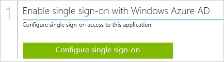
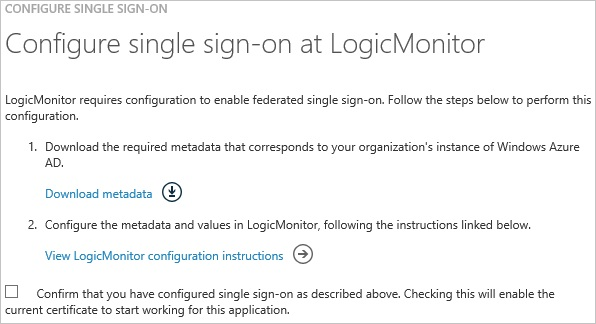
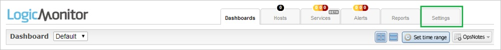
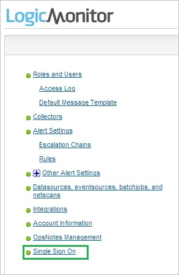
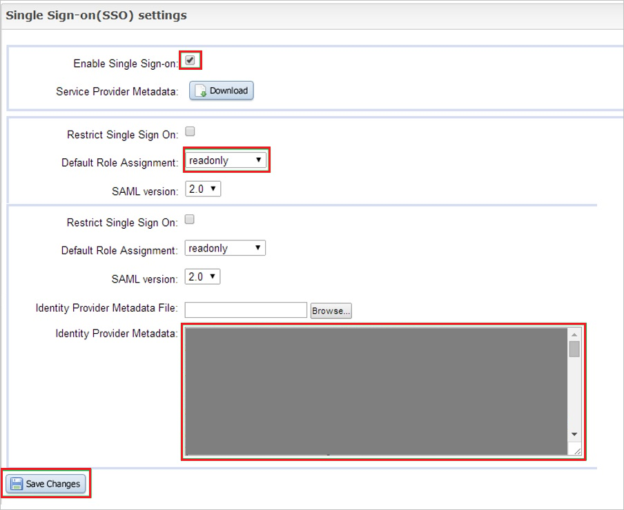
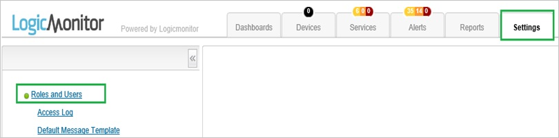
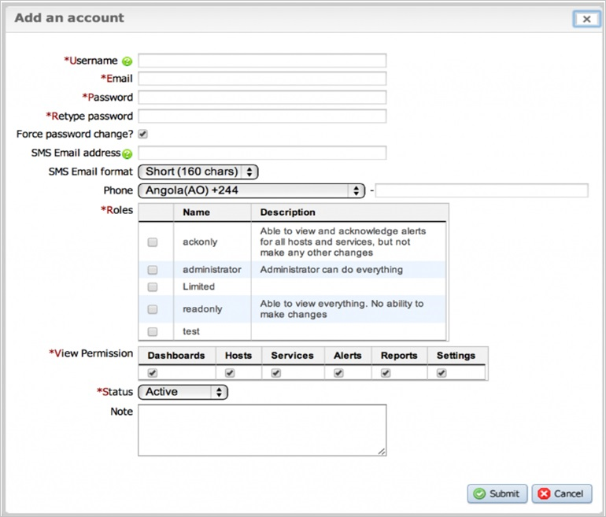

<properties 
    pageTitle="Tutorial: Azure Active Directory integration with LogicMonitor | Microsoft Azure" 
    description="Learn how to use LogicMonitor with Azure Active Directory to enable single sign-on, automated provisioning, and more!" 
    services="active-directory" 
    authors="jeevansd"  
    documentationCenter="na" 
    manager="femila"/>
<tags 
    ms.service="active-directory" 
    ms.devlang="na" 
    ms.topic="article" 
    ms.tgt_pltfrm="na" 
    ms.workload="identity" 
    ms.date="07/08/2016" 
    ms.author="jeedes" />

#Tutorial: Azure Active Directory integration with LogicMonitor
  
The objective of this tutorial is to show the integration of Azure and LogicMonitor.  
The scenario outlined in this tutorial assumes that you already have the following items:

-   A valid Azure subscription
-   A LogicMonitor tenant
  
The scenario outlined in this tutorial consists of the following building blocks:

1.  Enabling the application integration for LogicMonitor
2.  Configuring single sign-on
3.  Configuring user provisioning
4.  Assigning users

##Enabling the application integration for LogicMonitor
  
The objective of this section is to outline how to enable the application integration for LogicMonitor.

###To enable the application integration for LogicMonitor, perform the following steps:

1.  In the Azure classic portal, on the left navigation pane, click **Active Directory**.

    

2.  From the **Directory** list, select the directory for which you want to enable directory integration.

3.  To open the applications view, in the directory view, click **Applications** in the top menu.

    

4.  Click **Add** at the bottom of the page.

    

5.  On the **What do you want to do** dialog, click **Add an application from the gallery**.

    

6.  In the **search box**, type **logicmonitor**.

    

7.  In the results pane, select **LogicMonitor**, and then click **Complete** to add the application.

    
##Configuring single sign-on
  
The objective of this section is to outline how to enable users to authenticate to LogicMonitor with their account in Azure AD using federation based on the SAML protocol.

###To configure single sign-on, perform the following steps:

1.  In the Azure classic portal, on the **LogicMonitor **application integration page, click **Configure single sign-on** to open the **Configure Single Sign On ** dialog.

    

2.  On the **How would you like users to sign on to LogicMonitor** page, select **Microsoft Azure AD Single Sign-On**, and then click **Next**.

    

3.  On the **Configure App URL** page, in the **Sign On URL** textbox, type your URL used by your users to sign on to LogicMonitor \(e,g,: "*http://company.logicmonitor.com*"\), and then click **Next**.

    

4.  On the **Configure single sign-on at LogicMonitor** page, click **Download metadata**, and then save it on your computer.

    

5.  Log in to your **LogicMonitor** company site as an administrator.

6.  In the menu on the top, click **Settings**.

    

7.  In the navigation bat on the left side, click **Single Sign On**

    

8.  In the **Single Sign-on (SSO) settings** section, perform the following steps:

    

    1.  Select **Enable Single Sign-on**.
    2.  As **Default Role Assignment**, select **readonly**.
    3.  Open the downloaded metadata file in notepad, and then paste content of the file into the **Identity Provider Metadata** textbox.
    4.  Click **Save Changes**.

9.  On the Azure classic portal, select the single sign-on configuration confirmation, and then click **Complete** to close the **Configure Single Sign On** dialog.

    
##Configuring user provisioning
  
For AAD users to be able to sign in, they must be provisioned to the LogicMonitor application using their Azure Active Directory user names.

###To configure user provisioning, perform the following steps:

1.  Log in to your LogicMonitor company site as an administrator.

2.  In the menu on the top, click **Settings**, and then click **Roles and Users**.

    

3.  Click **Add**.

4.  In the **Add an account** section, perform the following steps:

    

    1.  Type the **Username**, **Email**, **Password** and **Retype password** values of the Azure Active Directory user you want to provision into the related textboxes.
    2.  Select **Roles**, **View Permissions** and the **Status**.
    3.  Click **Submit**.

>[AZURE.NOTE]You can use any other LogicMonitor user account creation tools or APIs provided by LogicMonitor to provision Azure Active Directory user accounts.

##Assigning users
  
To test your configuration, you need to grant the Azure AD users you want to allow using your application access to it by assigning them.

###To assign users to LogicMonitor, perform the following steps:

1.  In the Azure classic portal, create a test account.

2.  On the **LogicMonitor** application integration page, click **Assign users**.

    

3.  Select your test user, click **Assign**, and then click **Yes** to confirm your assignment.

    
  
If you want to test your single sign-on settings, open the Access Panel. For more details about the Access Panel, see [Introduction to the Access Panel](active-directory-saas-access-panel-introduction.md).

