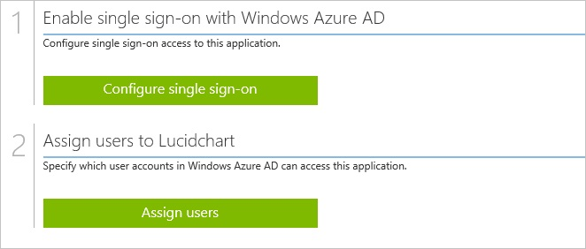
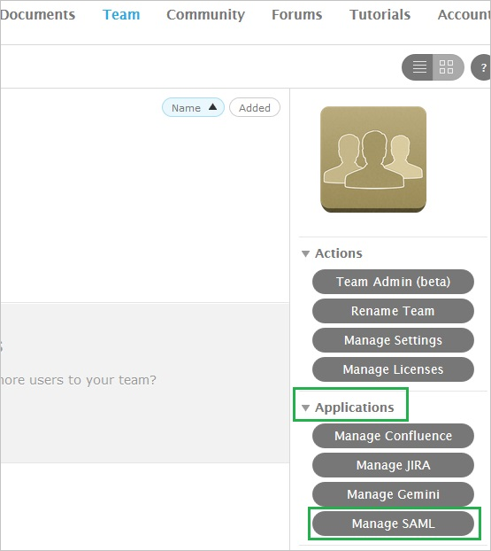
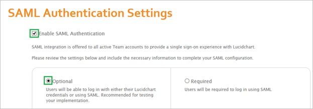
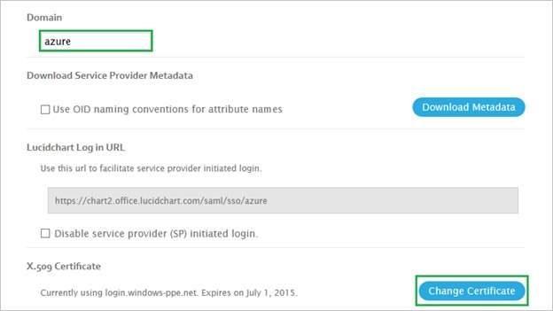
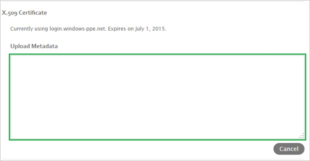
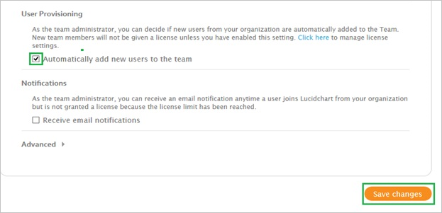
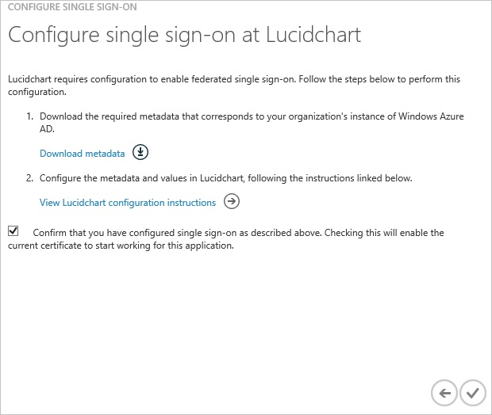
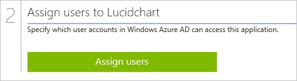

<properties 
    pageTitle="Tutorial: Azure Active Directory integration with Lucidchart | Microsoft Azure" 
    description="Learn how to use Lucidchart with Azure Active Directory to enable single sign-on, automated provisioning, and more!" 
    services="active-directory" 
    authors="jeevansd"  
    documentationCenter="na" 
	manager="femila"/>
<tags 
    ms.service="active-directory" 
    ms.devlang="na" 
    ms.topic="article" 
    ms.tgt_pltfrm="na" 
    ms.workload="identity" 
    ms.date="07/08/2016" 
    ms.author="jeedes" />

#Tutorial: Azure Active Directory integration with Lucidchart
  
The objective of this tutorial is to show the integration of Azure and Lucidchart.  
The scenario outlined in this tutorial assumes that you already have the following items:

-   A valid Azure subscription
-   A Lucidchart single sign-on enabled subscription
  
After completing this tutorial, the Azure AD users you have assigned to Lucidchart will be able to single sign into the application at your Lucidchart company site (service provider initiated sign on), or using the [Introduction to the Access Panel](active-directory-saas-access-panel-introduction.md).
  
The scenario outlined in this tutorial consists of the following building blocks:

1.  Enabling the application integration for Lucidchart
2.  Configuring single sign-on
3.  Configuring user provisioning
4.  Assigning users

##Enabling the application integration for Lucidchart
  
The objective of this section is to outline how to enable the application integration for Lucidchart.

###To enable the application integration for Lucidchart, perform the following steps:

1.  In the Azure classic portal, on the left navigation pane, click **Active Directory**.

    

2.  From the **Directory** list, select the directory for which you want to enable directory integration.

3.  To open the applications view, in the directory view, click **Applications** in the top menu.

    

4.  Click **Add** at the bottom of the page.

    

5.  On the **What do you want to do** dialog, click **Add an application from the gallery**.

    

6.  In the **search box**, type **Lucidchart**.

    

7.  In the results pane, select **Lucidchart**, and then click **Complete** to add the application.

    
##Configuring single sign-on
  
The objective of this section is to outline how to enable users to authenticate to Lucidchart with their account in Azure AD using federation based on the SAML protocol.

###To configure single sign-on, perform the following steps:

1.  In the Azure classic portal, on the **Lucidchart** application integration page, click **Configure single sign-on** to open the **Configure Single Sign On ** dialog.

    

2.  On the **How would you like users to sign on to Lucidchart** page, select **Microsoft Azure AD Single Sign-On**, and then click **Next**.

    

3.  On the **Configure App URL** page, in the **Lucidchart Sign On URL** textbox, type the URL used by your users to sign on to your Lucidchart application (e.g.: "*https://chart2.office.lucidchart.com/saml/sso/azure*"), and then click **Next**.

    

4.  On the **Configure single sign-on at Lucidchart** page, to download your metadata, click **Download metadata**, and then save the data file locally on your computer.

    

5.  In a different web browser window, log into your Lucidchart company site as an administrator.

6.  In the menu on the top, click **Team**.

    

7.  Click **Application \> Manage SAML**.

    

8.  On the **SAML Authentication Settings** dialog page, perform the following steps:

    1.  Select **Enable SAML Authentication**, and then click **Optional**.
        
    2.  In the **Domain** textbox, type your domain, and then click **Change Certificate**.
        
    3.  Open your downloaded metadata file, copy the content, and then paste it into the **Upload Metadata** textbox.
        
    4.  Select **Automatically Add new user to the team**, and then click **Save changes**.
        

9.  Select the single sign-on configuration confirmation, and then click **Complete** to close the **Configure Single Sign On** dialog.

    
##Configuring user provisioning
  
There is no action item for you to configure user provisioning to Lucidchart.  
When an assigned user tries to log into Lucidchart using the access panel, Lucidchart checks whether the user exists.  
If there is no user account available yet, it is automatically created by Lucidchart.
##Assigning users
  
To test your configuration, you need to grant the Azure AD users you want to allow using your application access to it by assigning them.

###To assign users to Lucidchart, perform the following steps:

1.  In the Azure classic portal, create a test account.

2.  On the **Lucidchart **application integration page, click **Assign users**.

    

3.  Select your test user, click **Assign**, and then click **Yes** to confirm your assignment.

    
  
If you want to test your single sign-on settings, open the Access Panel. For more details about the Access Panel, see [Introduction to the Access Panel](active-directory-saas-access-panel-introduction.md).