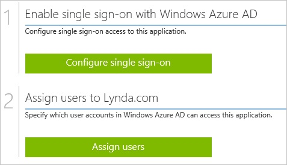
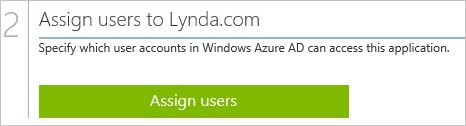

<properties 
    pageTitle="Tutorial: Azure Active Directory integration with Lynda.com | Microsoft Azure" 
    description="Learn how to use Lynda.com with Azure Active Directory to enable single sign-on, automated provisioning, and more!" 
    services="active-directory" 
    authors="jeevansd"  
    documentationCenter="na" 
    manager="femila"/>
<tags 
    ms.service="active-directory" 
    ms.devlang="na" 
    ms.topic="article" 
    ms.tgt_pltfrm="na" 
    ms.workload="identity" 
    ms.date="07/08/2016" 
    ms.author="jeedes" />

#Tutorial: Azure Active Directory integration with Lynda.com
  
The objective of this tutorial is to show the integration of Azure and Lynda.com.  
The scenario outlined in this tutorial assumes that you already have the following items:

-   A valid Azure subscription
-   A Lynda.com tenant
  
After completing this tutorial, the Azure AD users you have assigned to Lynda.com will be able to single sign into the application at your Lynda.com company site (service provider initiated sign on), or using the [Introduction to the Access Panel](active-directory-saas-access-panel-introduction.md).
  
The scenario outlined in this tutorial consists of the following building blocks:

1.  Enabling the application integration for Lynda.com
2.  Configuring single sign-on
3.  Configuring user provisioning
4.  Assigning users

##Enabling the application integration for Lynda.com
  
The objective of this section is to outline how to enable the application integration for Lynda.com.

###To enable the application integration for Lynda.com, perform the following steps:

1.  In the Azure classic portal, on the left navigation pane, click **Active Directory**.

    

2.  From the **Directory** list, select the directory for which you want to enable directory integration.

3.  To open the applications view, in the directory view, click **Applications** in the top menu.

    

4.  Click **Add** at the bottom of the page.

    

5.  On the **What do you want to do** dialog, click **Add an application from the gallery**.

    

6.  In the **search box**, type **Lynda.com**.

    

7.  In the results pane, select **Lynda.com**, and then click **Complete** to add the application.

    
##Configuring single sign-on
  
The objective of this section is to outline how to enable users to authenticate to Lynda.com with their account in Azure AD using federation based on the SAML protocol.

>[AZURE.IMPORTANT]In order to be able to configure single sign-on on your Lynda.com tenant, you need to contact first the Lynda.com technical support to get this feature enabled.

###To configure single sign-on, perform the following steps:

1.  In the Azure classic portal, on the **Lynda.com** application integration page, click **Configure single sign-on** to open the **Configure Single Sign On ** dialog.

    

2.  On the **How would you like users to sign on to Lynda.com** page, select **Microsoft Azure AD Single Sign-On**, and then click **Next**.

    

3.  On the **Configure App URL** page, in the **Lynda.com Sign In URL** textbox, type your Lynda.com tenant URL (e.g.: *https://shib.lynda.com/Shibboleth.sso/InCommon?providerId=https://sts.windows-ppe.net/6247032d-9415-403c-b72b-277e3fb6f2c8/&target=https://shib.lynda.com/InCommon*), and then click **Next**.

    

4.  On the **Configure single sign-on at Lynda.com** page, to download your metadata, click **Download metadata**, and then save the certificate file locally on your computer.

    

5.  Send the downloaded metadata file to the Lynda.com support team. The Lynda.com support team does the Single Sign On configuration for you.

6.  On the Azure classic portal, select the single sign-on configuration confirmation, and then click **Complete** to close the **Configure Single Sign On** dialog.

    
##Configuring user provisioning
  
There is no action item for you to configure user provisioning to Lynda.com.  
When an assigned user tries to log into Lynda.com using the access panel, Lynda.com checks whether the user exists.  
If there is no user account available yet, it is automatically created by Lynda.com.

>[AZURE.NOTE]You can use any other Lynda.com user account creation tools or APIs provided by Lynda.com to provision AAD user accounts.

##Assigning users
  
To test your configuration, you need to grant the Azure AD users you want to allow using your application access to it by assigning them.

###To assign users to Lynda.com, perform the following steps:

1.  In the Azure classic portal, create a test account.

2.  On the **Lynda.com **application integration page, click **Assign users**.

    

3.  Select your test user, click **Assign**, and then click **Yes** to confirm your assignment.

    
  
If you want to test your single sign-on settings, open the Access Panel. For more details about the Access Panel, see [Introduction to the Access Panel](active-directory-saas-access-panel-introduction.md).