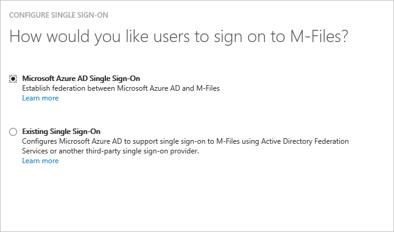
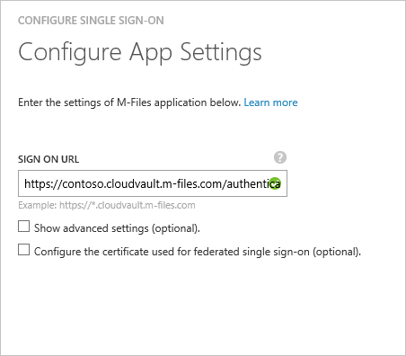
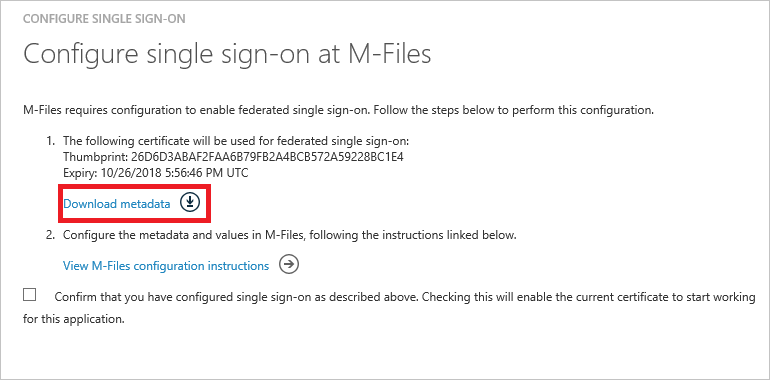
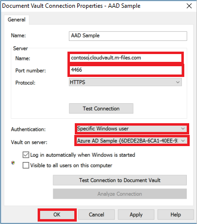

# Tutorial: Azure Active Directory integration with M-Files
In this tutorial, you learn how to integrate M-Files with Azure Active Directory (Azure AD).

Integrating M-Files with Azure AD provides you with the following benefits:

* You can control in Azure AD who has access to M-Files
* You can enable your users to automatically get signed-on to M-Files single sign-on (SSO)) with their Azure AD accounts
* You can manage your accounts in one central location - the Azure classic portal

If you want to know more details about SaaS app integration with Azure AD, see [What is application access and single sign-on with Azure Active Directory](active-directory-appssoaccess-whatis.md).

## Prerequisites
To configure Azure AD integration with M-Files, you need the following items:

* An Azure AD subscription
* A **M-Files** SSO enabled subscription

>[!NOTE]
>To test the steps in this tutorial, we do not recommend using a production environment. 
> 

To test the steps in this tutorial, you should follow these recommendations:

* You should not use your production environment, unless this is necessary.
* If you don't have an Azure AD trial environment, you can get a one-month trial [here](https://azure.microsoft.com/pricing/free-trial/).

## Scenario description
In this tutorial, you test Azure AD single sign-on in a test environment. 
The scenario outlined in this tutorial consists of two main building blocks:

1. Adding M-Files from the gallery
2. Configuring and testing Azure AD SSO

## Adding M-Files from the gallery
To configure the integration of M-Files into Azure AD, you need to add M-Files from the gallery to your list of managed SaaS apps.

**To add M-Files from the gallery, perform the following steps:**

1. In the **Azure classic portal**, on the left navigation pane, click **Active Directory**. 
   
    ![Active Directory][1]
2. From the **Directory** list, select the directory for which you want to enable directory integration.
3. To open the applications view, in the directory view, click **Applications** in the top menu.
   
    ![Applications][2]
4. Click **Add** at the bottom of the page.
   
    ![Applications][3]
5. On the **What do you want to do** dialog, click **Add an application from the gallery**.
   
    ![Applications][4]
6. In the search box, type **M-Files**.
   
    
7. In the results pane, select **M-Files**, and then click **Complete** to add the application.
   
    

## Configure and test Azure AD SSO
In this section, you configure and test Azure AD SSO with M-Files based on a test user called "Britta Simon".

For SSO to work, Azure AD needs to know what the counterpart user in M-Files is to a user in Azure AD. In other words, a link relationship between an Azure AD user and the related user in M-Files needs to be established.

This link relationship is established by assigning the value of the **user name** in Azure AD as the value of the **Username** in M-Files. To configure and test Azure AD single sign-on with M-Files, you need to complete the following building blocks:

1. **[Configuring Azure AD single sign-on](#configuring-azure-ad-single-single-sign-on)** - to enable your users to use this feature.
2. **[Creating an Azure AD test user](#creating-an-azure-ad-test-user)** - to test Azure AD single sign-on with Britta Simon.
3. **[Creating a M-Files test user](#creating-a-m-file-test-user)** - to have a counterpart of Britta Simon in M-Files that is linked to the Azure AD representation of her.
4. **[Assigning the Azure AD test user](#assigning-the-azure-ad-test-user)** - to enable Britta Simon to use Azure AD single sign-on.
5. **[Testing single sign-on](#testing-single-sign-on)** - to verify whether the configuration works.

### Configuring Azure AD SSO
The objective of this section is to enable Azure AD SSO in the Azure classic portal and to configure SSO in your M-Files application.

**To configure Azure AD SSO with M-Files, perform the following steps:**

1. In the classic portal, on the **M-Files** application integration page, click **Configure single sign-on** to open the **Configure Single Sign-On**  dialog.
   
    ![Configure Single Sign-On][7] 
2. On the **How would you like users to sign on to M-Files** page, select **Azure AD Single Sign-On**, and then click **Next**.
   
    
3. On the **Configure App Settings** dialog page, perform the following steps:
   
    
  1. In the Sign On URL textbox, type a URL using the following pattern: `https://<tenant-name>.cloudvault.m-files.com/authentication/MFiles.AuthenticationProviders.Core/sso`
  2. Click **Next**.
4. On the **Configure single sign-on at M-Files** page, Click **Download metadata**, and then save the file on your computer.
   
    
5. To get SSO configured for your application, contact M-files support team via <mailto:support@m-files.com> and provide them with the the downloaded Metadata.
   
   >[!NOTE]
   >Follow the next steps if you want to configure SSO for you M-File desktop application. No extra steps are required if you only want to configure SSO for M-Files web version.  
   > 
6. Follow the next steps to configure the M-File desktop application to enable SSO with Azure AD. To download M-Files, go to [M-Files download](https://www.m-files.com/en/download-latest-version) page.
7. Open the **M-Files Desktop Settings** window. Then, click on **Add**.
   
    
8. On the **Document Vault Connection Properties** window, perform the following steps:
   
    
    Under the **Server** section type the values as follow:  
 1. For **Name**, type `<tenant-name>.cloudvault.m-files.com`.  
 2. For **Port Number**, type **4466**. 
 3. For **Protocol**, select **HTTPS**. 
 4. In the **Authentication** field, select **Specific Windows user**. Then, you will be prompted with a signing page. Please insert your Azure AD credentials. 
 5. For the **Vault on Server**,  select the corresponding vault on server. 
 6. Click **OK**.

### Create an Azure AD test user
In this section, you create a test user in the classic portal called Britta Simon.

![Create Azure AD User][20]

**To create a test user in Azure AD, perform the following steps:**

1. In the **Azure classic portal**, on the left navigation pane, click **Active Directory**.
   
     
2. From the **Directory** list, select the directory for which you want to enable directory integration.
3. To display the list of users, in the menu on the top, click **Users**.
   
     
4. To open the **Add User** dialog, in the toolbar on the bottom, click **Add User**.
   
     
5. On the **Tell us about this user** dialog page, perform the following steps:
   
     
 1. As Type Of User, select New user in your organization.  
 2. In the User Name **textbox**, type **BrittaSimon**. 
 3. Click **Next**.
6. On the **User Profile** dialog page, perform the following steps:
   
     
 1. In the **First Name** textbox, type **Britta**.   
 2. In the **Last Name** textbox, type, **Simon**. 
 3. In the **Display Name** textbox, type **Britta Simon**. 
 4. In the **Role** list, select **User**. 
 5. Click **Next**.
7. On the **Get temporary password** dialog page, click **create**.
   
     
8. On the **Get temporary password** dialog page, perform the following steps:
   
      
 1. Write down the value of the **New Password**. 
 2. Click **Complete**.   

### Create a M-Files test user
In this section, you create a user called Britta Simon in M-Files. If you don't know how to create a user in M-Files, please contact M-Files support at <mailto:support@m-files.com>.

### Assign the Azure AD test user
In this section, you enable Britta Simon to use Azure SSO by granting her access to M-Files.

![Assign User][200]

**To assign Britta Simon to M-Files, perform the following steps:**

1. On the classic portal, to open the applications view, in the directory view, click **Applications** in the top menu.
   
    ![Assign User][201] 
2. In the applications list, select **M-Files**.
   
    
3. In the menu on the top, click **Users**.
   
    ![Assign User][203] 
4. In the All Users list, select **Britta Simon**.
5. In the toolbar on the bottom, click **Assign**.
   
    ![Assign User][205]

### Test single sign-on
The objective of this section is to test your Azure AD SSO configuration using the Access Panel.

When you click the M-Files tile in the Access Panel, you should get automatically signed-on to your M-Files application.

## Additional resources
* [List of Tutorials on How to Integrate SaaS Apps with Azure Active Directory](active-directory-saas-tutorial-list.md)
* [What is application access and single sign-on with Azure Active Directory?](active-directory-appssoaccess-whatis.md)

<!--Image references-->

[1]: ./media/active-directory-saas-m-files-tutorial/tutorial_general_01.png
[2]: ./media/active-directory-saas-m-files-tutorial/tutorial_general_02.png
[3]: ./media/active-directory-saas-m-files-tutorial/tutorial_general_03.png
[4]: ./media/active-directory-saas-m-files-tutorial/tutorial_general_04.png

[5]: ./media/active-directory-saas-m-files-tutorial/tutorial_general_05.png
[6]: ./media/active-directory-saas-m-files-tutorial/tutorial_general_06.png
[7]:  ./media/active-directory-saas-m-files-tutorial/tutorial_general_050.png
[10]: ./media/active-directory-saas-m-files-tutorial/tutorial_general_060.png
[11]: ./media/active-directory-saas-m-files-tutorial/tutorial_general_070.png
[20]: ./media/active-directory-saas-m-files-tutorial/tutorial_general_100.png

[200]: ./media/active-directory-saas-m-files-tutorial/tutorial_general_200.png
[201]: ./media/active-directory-saas-m-files-tutorial/tutorial_general_201.png
[203]: ./media/active-directory-saas-m-files-tutorial/tutorial_general_203.png
[204]: ./media/active-directory-saas-m-files-tutorial/tutorial_general_204.png
[205]: ./media/active-directory-saas-m-files-tutorial/tutorial_general_205.png
