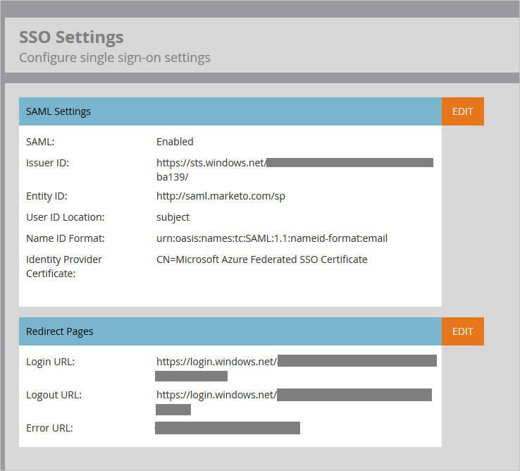
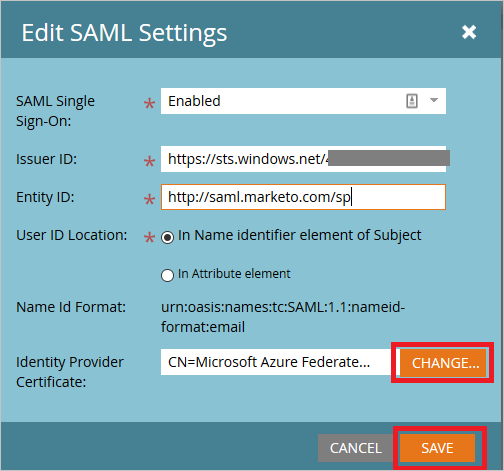
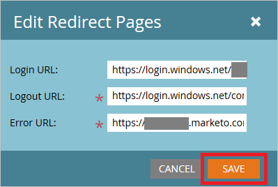
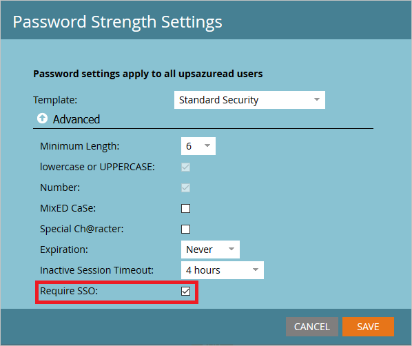
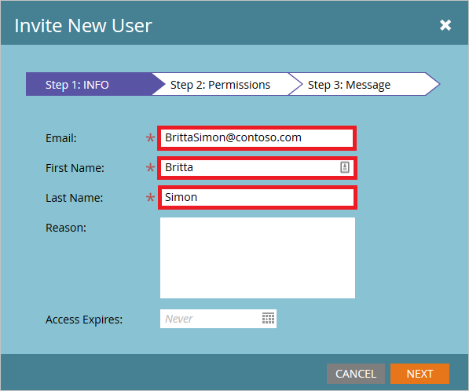
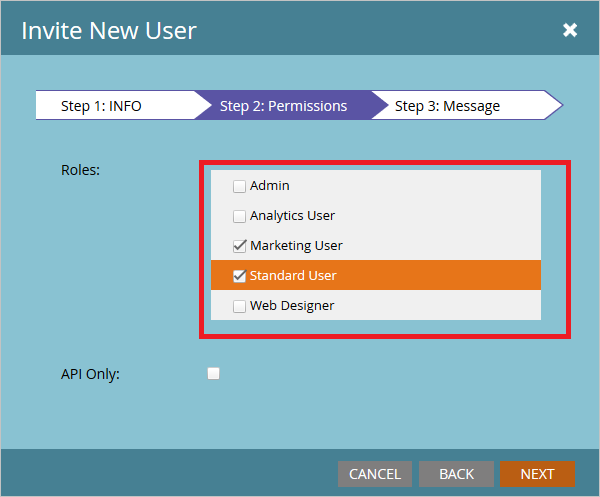
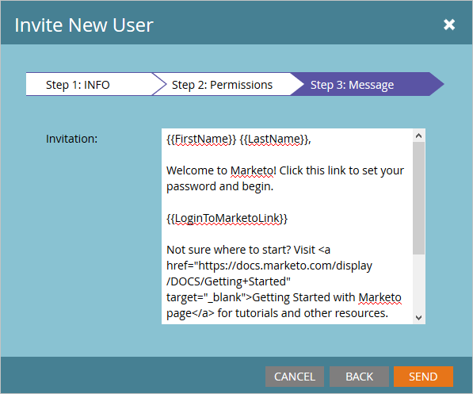

# Tutorial: Azure Active Directory integration with Marketo
In this tutorial, you learn how to integrate Marketo with Azure Active Directory (Azure AD).

Integrating Marketo with Azure AD provides you with the following benefits:

* You can control in Azure AD who has access to Marketo
* You can enable your users to automatically get signed-on to Marketo (Single Sign-On) with their Azure AD accounts
* You can manage your accounts in one central location - the Azure classic portal

If you want to know more details about SaaS app integration with Azure AD, see [What is application access and single sign-on with Azure Active Directory](active-directory-appssoaccess-whatis.md).

## Prerequisites
To configure Azure AD integration with Marketo, you need the following items:

* An Azure AD subscription
* A Marketo single-sign on enabled subscription

> [!NOTE]
> To test the steps in this tutorial, we do not recommend using a production environment.
> 
> 

To test the steps in this tutorial, you should follow these recommendations:

* You should not use your production environment, unless this is necessary.
* If you don't have an Azure AD trial environment, you can get a one-month trial [here](https://azure.microsoft.com/pricing/free-trial/).

## Scenario description
In this tutorial, you test Azure AD single sign-on in a test environment.

The scenario outlined in this tutorial consists of two main building blocks:

1. Adding Marketo from the gallery
2. Configuring and testing Azure AD single sign-on

## Adding Marketo from the gallery
To configure the integration of Marketo into Azure AD, you need to add Marketo from the gallery to your list of managed SaaS apps.

**To add Marketo from the gallery, perform the following steps:**

1. In the **Azure classic portal**, on the left navigation pane, click **Active Directory**.
   
    ![Active Directory][1]
2. From the **Directory** list, select the directory for which you want to enable directory integration.
3. To open the applications view, in the directory view, click **Applications** in the top menu.
   
    ![Applications][2]
4. Click **Add** at the bottom of the page.
   
    ![Applications][3]
5. On the **What do you want to do** dialog, click **Add an application from the gallery**.
   
    ![Applications][4]
6. In the search box, type **Marketo**.
   
    
7. In the results pane, select **Marketo**, and then click **Complete** to add the application.
   
    

## Configuring and testing Azure AD single sign-on
In this section, you configure and test Azure AD single sign-on with Marketo based on a test user called "Britta Simon".

For single sign-on to work, Azure AD needs to know what the counterpart user in Marketo is to a user in Azure AD. In other words, a link relationship between an Azure AD user and the related user in Marketo needs to be established.

This link relationship is established by assigning the value of the **user name** in Azure AD as the value of the **Username** in Marketo.

To configure and test Azure AD single sign-on with Marketo, you need to complete the following building blocks:

1. **[Configuring Azure AD Single Sign-On](#configuring-azure-ad-single-sign-on)** - to enable your users to use this feature.
2. **[Creating an Azure AD test user](#creating-an-azure-ad-test-user)** - to test Azure AD single sign-on with Britta Simon.
3. **[Creating a Marketo test user](#creating-a-predictix-price-reporting-test-user)** - to have a counterpart of Britta Simon in Marketo that is linked to the Azure AD representation of her.
4. **[Assigning the Azure AD test user](#assigning-the-azure-ad-test-user)** - to enable Britta Simon to use Azure AD single sign-on.
5. **[Testing Single Sign-On](#testing-single-sign-on)** - to verify whether the configuration works.

### Configuring Azure AD single sign-on
In this section, you enable Azure AD single sign-on in the classic portal and configure single sign-on in your Marketo application.

**To configure Azure AD single sign-on with Marketo, perform the following steps:**

1. In the classic portal, on the **Marketo** application integration page, click **Configure single sign-on** to open the **Configure Single Sign-On**  dialog.
   
    ![Configure Single Sign-On][6] 
2. On the **How would you like users to sign on to Marketo** page, select **Azure AD Single Sign-On**, and then click **Next**.
   
     
3. On the **Configure App Settings** dialog page, perform the following steps:
   
     
   
    a. In the **Identifier** textbox, type the URL using the following pattern: `https://saml.marketo.com/sp`
   
    b. In the **Reply URL** textbox, type the URL using the following pattern: `https://login.marketo.com/saml/assertion/\<munchkinid\>`
   
    c. click **Next**
4. On the **Configure single sign-on at Marketo** page, perform the following steps:
   
    
   
    a. Click **Download certificate**, and then save the file on your computer.
   
    b. Click **Next**.
5. To get Munchkin Id of your application, log in to Marketo using admin credentials and perform following actions:
   
    a. Login to Marketo app using admin credentials.
   
    b. Click on the Admin button on the top navigation pane.
   
     
   
    c. Navigate to the Integration menu and click on the Munchkin link
   
    
   
    d. Copy the Munchkin Id shown on the screen and complete your Reply URL in the Azure AD configuration wizard.
   
    
6. To configure the SSO in the application, please follow the below steps:
   
    a. Login to Marketo app using admin credentials.
   
    b. Click on the Admin button on the top navigation pane.
   
     
   
    c. Navigate to the Integration menu and click on Single Sign On
   
     
   
    d. To enable the SAML Settings click on Edit button
   
     
   
    e. **Enable** Single Sign-On settings
   
    f. Enter the Issuer ID, whihc you have copied from Azure AD configuration wizard.
   
    g. In the Entity ID textbox enter the URL as **http://saml.marketo.com/sp**
   
    h. Select the User ID Location as **Name Identifier element**
   
    
   
    > [!NOTE]
    > If your User Identifier is not UPN value then change the value in the Attribute tab.
    > 
    > 
   
    i. Upload the certificate which you have downloaded from Azure AD configuration wizard. Save the settings.
   
    j. Edit the Redirect Pages settings
   
    k. Copy the Login URL from Azure AD configuration wizard in the **Login URL** textbox.
   
    l. Copy the Logout URL from Azure AD configuration wizard in the **Logout URL** textbox.
   
    m. In the Error URL copy your Marketo instance URL and click on Save button to save settings.
   
    

7. To enable the SSO for users, complete the following actions:
   
    a. Login to Marketo app using admin credentials.
   
    b. Click on the **Admin** button on the top navigation pane.
   
     
   
    c. Navigate to the **Security** menu and click on **Login Settings** 
   
    
   
    d. Check the **Require SSO** option and Save the settings.
   
    
8. In the classic portal, select the single sign-on configuration confirmation, and then click **Next**.
   
    ![Azure AD Single Sign-On][10]
9. On the **Single sign-on confirmation** page, click **Complete**.  
   
    ![Azure AD Single Sign-On][11]

### Creating an Azure AD test user
In this section, you create a test user in the classic portal called Britta Simon.

![Create Azure AD User][20]

**To create a test user in Azure AD, perform the following steps:**

1. In the **Azure classic portal**, on the left navigation pane, click **Active Directory**.
   
     
2. From the **Directory** list, select the directory for which you want to enable directory integration.
3. To display the list of users, in the menu on the top, click **Users**.
   
     
4. To open the **Add User** dialog, in the toolbar on the bottom, click **Add User**.
   
     
5. On the **Tell us about this user** dialog page, perform the following steps:
     
   
    a. As Type Of User, select New user in your organization.
   
    b. In the User Name **textbox**, type **BrittaSimon**.
   
    c. Click **Next**.
6. On the **User Profile** dialog page, perform the following steps:
     
   
    a. In the **First Name** textbox, type **Britta**.  
   
    b. In the **Last Name** textbox, type, **Simon**.
   
    c. In the **Display Name** textbox, type **Britta Simon**.
   
    d. In the **Role** list, select **User**.
   
    e. Click **Next**.

7. On the **Get temporary password** dialog page, click **create**.
   
     
8. On the **Get temporary password** dialog page, perform the following steps:
   
     
   
    a. Write down the value of the **New Password**.
   
    b. Click **Complete**.   

### Creating an Marketo test user
In this section, you create a user called Britta Simon in Marketo. Please follow these steps to create a user in Marketo platform.

1. Login to Marketo app using admin credentials.
2. Click on the **Admin** button on the top navigation pane.
   
     
3. Navigate to the **Security** menu and click on **Users & Roles**
   
      
4. Click on the **Invite New User** link on the Users tab
   
     
5. In the Invite New User wizard fill the following information
   
    a. Enter the user **Email** address in the textbox
   
    
   
    b. Enter the **First Name** in the textbox
   
    c. Enter the **Last Name**  in the textbox
   
    d. Click on Next
6. In the **Permissions** tab select the user Roles and click Next
   
    
7. Click on the Send button to send the user invitation
   
    
8. User will receive the email notification and has to click on the link and change the password to activate the account. 

### Assigning the Azure AD test user
In this section, you enable Britta Simon to use Azure single sign-on by granting her access to Marketo.

![Assign User][200] 

**To assign Britta Simon to Marketo, perform the following steps:**

1. On the classic portal, to open the applications view, in the directory view, click **Applications** in the top menu.
   
    ![Assign User][201] 
2. In the applications list, select **Marketo**.
   
     
3. In the menu on the top, click **Users**.
   
    ![Assign User][203]
4. In the Users list, select **Britta Simon**.
5. In the toolbar on the bottom, click **Assign**.
   
    ![Assign User][205]

### Testing Single Sign-On
In this section, you test your Azure AD single sign-on configuration using the Access Panel.

When you click the Marketo tile in the Access Panel, you should get automatically signed-on to your Marketo application.

## Additional resources
* [List of Tutorials on How to Integrate SaaS Apps with Azure Active Directory](active-directory-saas-tutorial-list.md)
* [What is application access and single sign-on with Azure Active Directory?](active-directory-appssoaccess-whatis.md)

<!--Image references-->

[1]: ./media/active-directory-saas-marketo-tutorial/tutorial_general_01.png
[2]: ./media/active-directory-saas-marketo-tutorial/tutorial_general_02.png
[3]: ./media/active-directory-saas-marketo-tutorial/tutorial_general_03.png
[4]: ./media/active-directory-saas-marketo-tutorial/tutorial_general_04.png

[6]: ./media/active-directory-saas-marketo-tutorial/tutorial_general_05.png
[10]: ./media/active-directory-saas-marketo-tutorial/tutorial_general_06.png
[11]: ./media/active-directory-saas-marketo-tutorial/tutorial_general_07.png
[20]: ./media/active-directory-saas-marketo-tutorial/tutorial_general_100.png

[200]: ./media/active-directory-saas-marketo-tutorial/tutorial_general_200.png
[201]: ./media/active-directory-saas-marketo-tutorial/tutorial_general_201.png
[203]: ./media/active-directory-saas-marketo-tutorial/tutorial_general_203.png
[204]: ./media/active-directory-saas-marketo-tutorial/tutorial_general_204.png
[205]: ./media/active-directory-saas-marketo-tutorial/tutorial_general_205.png
