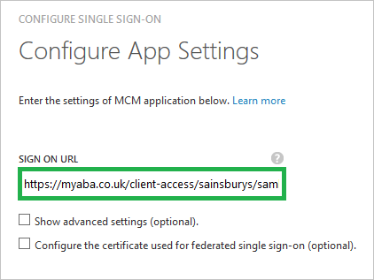
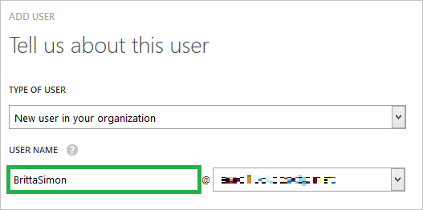

# Tutorial: Azure Active Directory integration with MCM
The objective of this tutorial is to show you how to integrate MCM with Azure Active Directory (Azure AD).

Integrating MCM with Azure AD provides you with the following benefits:

* You can control in Azure AD who has access to MCM
* You can enable your users to automatically get signed-on to MCM (Single Sign-On) with their Azure AD accounts
* You can manage your accounts in one central location - the Azure classic portal

If you want to know more details about SaaS app integration with Azure AD, see [What is application access and single sign-on with Azure Active Directory](active-directory-appssoaccess-whatis.md).

## Prerequisites
To configure Azure AD integration with MCM, you need the following items:

* A valid Azure subscription
* A MCM single-sign on enabled subscription

> [!NOTE]
> To test the steps in this tutorial, we do not recommend using a production environment.
> 
> 

To test the steps in this tutorial, you should follow these recommendations:

* You should not use your production environment, unless this is necessary.
* If you don't have an Azure AD trial environment, you can get a one-month trial [here](https://azure.microsoft.com/pricing/free-trial/).

## Scenario description
The objective of this tutorial is to enable you to test Azure AD single sign-on in a test environment.

The scenario outlined in this tutorial consists of two main building blocks:

1. Adding MCM from the gallery
2. Configuring and testing Azure AD single sign-on

## Adding MCM from the gallery
To configure the integration of MCM into Azure AD, you need to add MCM from the gallery to your list of managed SaaS apps.

**To add MCM from the gallery, perform the following steps:**

1. In the Azure classic portal, on the left navigation pane, click **Active Directory**.
   
	

2. From the **Directory** list, select the directory for which you want to enable directory integration.
3. To open the applications view, in the directory view, click **Applications** in the top menu.
   
	

4. Click **Add** at the bottom of the page.
   
	

5. On the **What do you want to do** dialog, click **Add an application from the gallery**.
   
	

6. In the **search box**, type **MCM**.
   
	

7. In the results pane, select **MCM**, and then click **Complete** to add the application.
   
	

## Configuring and testing Azure AD single sign-on
The objective of this section is to show you how to configure and test Azure AD single sign-on with MCM based on a test user called "Britta Simon".

For single sign-on to work, Azure AD needs to know what the counterpart user in MCM to an user in Azure AD is. In other words, a link relationship between an Azure AD user and the related user in MCM needs to be established.

This link relationship is established by assigning the value of the **user name** in Azure AD as the value of the **Username** in MCM.

To configure and test Azure AD single sign-on with MCM, you need to complete the following building blocks:

1. **[Configuring Azure AD Single Sign-On](#configuring-azure-ad-single-single-sign-on)** - to enable your users to use this feature.
2. **[Creating an Azure AD test user](#creating-an-azure-ad-test-user)** - to test Azure AD single sign-on with Britta Simon.
3. **[Creating a MCM test user](#creating-a-mcm-test-user)** - to have a counterpart of Britta Simon in MCM that is linked to the Azure AD representation of her.
4. **[Assigning the Azure AD test user](#assigning-the-azure-ad-test-user)** - to enable Britta Simon to use Azure AD single sign-on.
5. **[Testing Single Sign-On](#testing-single-sign-on)** - to verify whether the configuration works.

### Configuring Azure AD single sign-on
In this section, you enable Azure AD single sign-on in the classic portal and configure single sign-on in your MCM application.

**To configure Azure AD single sign-on with MCM, perform the following steps:**

1. In the Azure classic portal, on the **MCM** application integration page, click **Configure single sign-on** to open the **Configure Single Sign On** dialog.
   
	

2. On the **How would you like users to sign on to MCM** page, select **Microsoft Azure AD Single Sign-On**, and then click **Next**.
   
	

3. On the Configure App Settings dialog page, perform the following steps:
   
	
   
	a. In the **Sign On URL** textbox, type: `https://myaba.co.uk/client-access/<company name>/saml.php`.
   
	b. click **Next**

4. On the **Configure single sign-on at MCM** page, click **Download metadata**, and then save the certificate file on your computer.
   
	

5. To get SSO configured for your application, contact your MCM support team. Attach the downloaded metadata file and share it with MCM team to set up SSO on their side.

6. In the classic portal, select the single sign-on configuration confirmation, and then click **Next**.
   
	

7. On the **Single sign-on confirmation** page, click **Complete**.
   
    

### Creating an Azure AD test user
The objective of this section is to create a test user in the classic portal called Britta Simon.

**To create a test user in Azure AD, perform the following steps:**

1. In the **Azure classic Portal**, on the left navigation pane, click **Active Directory**.
   
    

2. From the **Directory** list, select the directory for which you want to enable directory integration.

3. To display the list of users, in the menu on the top, click **Users**.
   
    

4. To open the **Add User** dialog, in the toolbar on the bottom, click **Add User**.
   
    

5. On the **Tell us about this user** dialog page, perform the following steps:
   
    
   
    a. As Type Of User, select New user in your organization.
   
    b. In the User Name **textbox**, type **BrittaSimon**.
   
    c. Click **Next**.

6. On the **User Profile** dialog page, perform the following steps:
   
	
   
    a. In the **First Name** textbox, type **Britta**.  
   
    b. In the **Last Name** textbox, type, **Simon**.
   
    c. In the **Display Name** textbox, type **Britta Simon**.
   
    d. In the **Role** list, select **User**.
   
    e. Click **Next**.

7. On the **Get temporary password** dialog page, click **create**.
   
    

8. On the **Get temporary password** dialog page, perform the following steps:
   
    
   
    a. Write down the value of the **New Password**.
   
    b. Click **Complete**.   

### Creating a MCM test user
In this section, you create a user called Britta Simon in MCM. Please work with MCM support team to add the users in the MCM platform.

> [!NOTE]
> You can use any other MCM user account creation tools or APIs provided by MCM to provision AAD user accounts.
> 
> 

### Assigning the Azure AD test user
The objective of this section is to enabling Britta Simon to use Azure single sign-on by granting her access to MCM.

**To assign Britta Simon to MCM, perform the following steps:**

1. On the classic portal, to open the applications view, in the directory view, click **Applications** in the top menu.
   
    

2. In the applications list, select **MCM**.
   
    

3. In the menu on the top, click **Users**.
   
    

4. In the Users list, select **Britta Simon**.

5. In the toolbar on the bottom, click **Assign**.
   
    

### Testing single sign-on
The objective of this section is to test your Azure AD single sign-on configuration using the Access Panel.

When you click the MCM tile in the Access Panel, you should get automatically signed-on to your MCM application.

## Additional resources
* [List of Tutorials on How to Integrate SaaS Apps with Azure Active Directory](active-directory-saas-tutorial-list.md)
* [What is application access and single sign-on with Azure Active Directory?](active-directory-appssoaccess-whatis.md)

