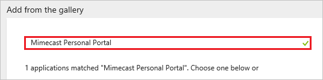
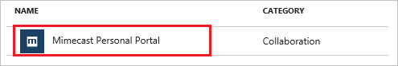
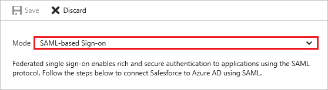
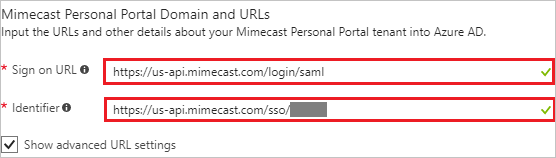
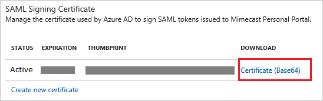
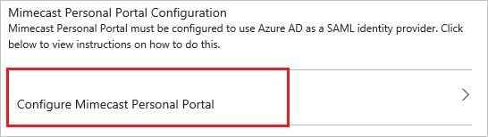

# Tutorial: Azure Active Directory integration with Mimecast Personal Portal

In this tutorial, you learn how to integrate Mimecast Personal Portal with Azure Active Directory (Azure AD).

Integrating Mimecast Personal Portal with Azure AD provides you with the following benefits:

- You can control in Azure AD who has access to Mimecast Personal Portal
- You can enable your users to automatically get signed-on to Mimecast Personal Portal (Single Sign-On) with their Azure AD accounts
- You can manage your accounts in one central location - the Azure portal

If you want to know more details about SaaS app integration with Azure AD, see [what is application access and single sign-on with Azure Active Directory](active-directory-appssoaccess-whatis.md).

## Prerequisites

To configure Azure AD integration with Mimecast Personal Portal, you need the following items:

- An Azure AD subscription
- A Mimecast Personal Portal single sign-on enabled subscription

> [!NOTE]
> To test the steps in this tutorial, we do not recommend using a production environment.

To test the steps in this tutorial, you should follow these recommendations:

- Do not use your production environment, unless it is necessary.
- If you don't have an Azure AD trial environment, you can get a one-month trial [here](https://azure.microsoft.com/pricing/free-trial/).

## Scenario description
In this tutorial, you test Azure AD single sign-on in a test environment. 
The scenario outlined in this tutorial consists of two main building blocks:

1. Adding Mimecast Personal Portal from the gallery
2. Configuring and testing Azure AD single sign-on

## Adding Mimecast Personal Portal from the gallery
To configure the integration of Mimecast Personal Portal into Azure AD, you need to add Mimecast Personal Portal from the gallery to your list of managed SaaS apps.

**To add Mimecast Personal Portal from the gallery, perform the following steps:**

1. In the **[Azure portal](https://portal.azure.com)**, on the left navigation panel, click **Azure Active Directory** icon. 

	![Active Directory][1]

2. Navigate to **Enterprise applications**. Then go to **All applications**.

	![Applications][2]
	
3. To add new application, click **New application** button on the top of dialog.

	![Applications][3]

4. In the search box, type **Mimecast Personal Portal**.

	

5. In the results panel, select **Mimecast Personal Portal**, and then click **Add** button to add the application.

	

##  Configuring and testing Azure AD single sign-on
In this section, you configure and test Azure AD single sign-on with Mimecast Personal Portal based on a test user called "Britta Simon".

For single sign-on to work, Azure AD needs to know what the counterpart user in Mimecast Personal Portal is to a user in Azure AD. In other words, a link relationship between an Azure AD user and the related user in Mimecast Personal Portal needs to be established.

In Mimecast Personal Portal, assign the value of the **user name** in Azure AD as the value of the **Username** to establish the link relationship.

To configure and test Azure AD single sign-on with Mimecast Personal Portal, you need to complete the following building blocks:

1. **[Configuring Azure AD Single Sign-On](#configuring-azure-ad-single-sign-on)** - to enable your users to use this feature.
2. **[Creating an Azure AD test user](#creating-an-azure-ad-test-user)** - to test Azure AD single sign-on with Britta Simon.
3. **[Creating a Mimecast Personal Portal test user](#creating-a-mimecast-personal-portal-test-user)** - to have a counterpart of Britta Simon in Mimecast Personal Portal that is linked to the Azure AD representation of user.
4. **[Assigning the Azure AD test user](#assigning-the-azure-ad-test-user)** - to enable Britta Simon to use Azure AD single sign-on.
5. **[Testing Single Sign-On](#testing-single-sign-on)** - to verify whether the configuration works.

### Configuring Azure AD single sign-on

In this section, you enable Azure AD single sign-on in the Azure portal and configure single sign-on in your Mimecast Personal Portal application.

**To configure Azure AD single sign-on with Mimecast Personal Portal, perform the following steps:**

1. In the Azure portal, on the **Mimecast Personal Portal** application integration page, click **Single sign-on**.

	![Configure Single Sign-On][4]

2. On the **Single sign-on** dialog, select **Mode** as	**SAML-based Sign-on** to enable single sign-on.
 
	

3. On the **Mimecast Personal Portal Domain and URLs** section, perform the following steps:

	

    a. In the **Sign-on URL** textbox, type a URL using the following pattern: 
   	| |     
    | ----------------------------------------|
	| `https://webmail-uk.mimecast.com`|
	| `https://webmail-us.mimecast.com`|
    | |
   
	b. In the **Identifier** textbox, type a URL using the following pattern:

    | |     
    | --- |
	| `https://webmail-us.mimecast.com/sso/<companyname>`|
	| `https://webmail-uk.mimecast.com/sso/<companyname>`|    
	| `https://webmail-za.mimecast.com/sso/<companyname>`|
	| `https://webmail-us.mimecast.com/sso/<companyname>`|
    ||                                                 
    
	> [!NOTE] 
	> These values are not real. Update these values with the actual Sign-On URL and Identifier. Contact [Mimecast Personal Portal Client support team](https://www.mimecast.com/customer-success/technical-support/) to get these values. 
 

4. On the **SAML Signing Certificate** section, click **Certificate(Base64)** and then save the certificate file on your computer.

	 

5. Click **Save** button.

	

6. On the **Mimecast Personal Portal Configuration** section, click **Configure Mimecast Personal Portal** to open **Configure sign-on** window. Copy the **Sign-Out URL, SAML Entity ID, and SAML Single Sign-On Service URL** from the **Quick Reference section.**

	 

7. In a different web browser window, log into your Mimecast Personal Portal as an administrator.

8. Go to **Services \> Application**.
   
    

9. Click **Authentication Profiles**.
   
    

10. Click **New Authentication Profile**.
   
    

11. In the **Authentication Profile** section, perform the following steps:
   
    
   
    a. In the **Description** textbox, type a name for your configuration.
   
    b. Select **Enforce SAML Authentication for Mimecast Personal Portal**.
   
    c. As **Provider**, select **Azure Active Directory**.
   
    d. In **Issuer URL** textbox, paste the value of **SAML Entity ID** which you have copied from Azure portal.
   
    e. In **Login URL** textbox, paste the value of **SAML Single Sign-On Service URL** which you have copied from Azure portal.
   
    f. In **Logout URL** textbox, paste the value of **Sign-Out URL** which you have copied from Azure portal.
   
    >[!NOTE]
    >The Login URL value and the Logout URL value are for the -on at Mimecast Personal Portal the same.
   
	g. Open your **base-64** encoded certificate in notepad downloaded from Azure portal, copy the content of it into your clipboard, and then paste it to the **Identity Provider Certificate (Metadata)** textbox.

    h. Select **Allow Single Sign On**.
   
    i. Click **Save**.

> [!TIP]
> You can now read a concise version of these instructions inside the [Azure portal](https://portal.azure.com), while you are setting up the app!  After adding this app from the **Active Directory > Enterprise Applications** section, simply click the **Single Sign-On** tab and access the embedded documentation through the **Configuration** section at the bottom. You can read more about the embedded documentation feature here: [Azure AD embedded documentation]( https://go.microsoft.com/fwlink/?linkid=845985)
> 

### Creating an Azure AD test user
The objective of this section is to create a test user in the Azure portal called Britta Simon.

![Create Azure AD User][100]

**To create a test user in Azure AD, perform the following steps:**

1. In the **Azure portal**, on the left navigation pane, click **Azure Active Directory** icon.

	 

2. To display the list of users, go to **Users and groups** and click **All users**.
	
	 

3. To open the **User** dialog, click **Add** on the top of the dialog.
 
	 

4. On the **User** dialog page, perform the following steps:
 
	 

    a. In the **Name** textbox, type **BrittaSimon**.

    b. In the **User name** textbox, type the **email address** of BrittaSimon.

	c. Select **Show Password** and write down the value of the **Password**.

    d. Click **Create**.
 
### Creating a Mimecast Personal Portal test user

In order to enable Azure AD users to log into Mimecast Personal Portal, they must be provisioned into Mimecast Personal Portal. In the case of Mimecast Personal Portal, provisioning is a manual task.

You need to register a domain before you can create users.

**To configure user provisioning, perform the following steps:**

1. Sign on to your **Mimecast Personal Portal** as administrator.

2. Go to **Directories \> Internal**.
   
    

3. Click **Register New Domain**.
   
    

4. After your new domain has been created, click **New Address**.
   
    

5. In the new address dialog, perform the following steps of a valid Azure AD account you want to provision:
   
    
   
    a. In the **Email Address** textbox, type **Email Address** of the user as **BrittaSimon@contoso.com**.
	
	b. In the **Global Name** textbox, type the **username** as **BrittaSimon**.

	c. In the **Password**, and **Confirm Password** textboxes, type the **Password** of the user.
   
    b. Click **Save**.

>[!NOTE]
>You can use any other Mimecast Personal Portal user account creation tools or APIs provided by Mimecast Personal Portal to provision Azure AD user accounts. 

### Assigning the Azure AD test user

In this section, you enable Britta Simon to use Azure single sign-on by granting access to Mimecast Personal Portal.

![Assign User][200] 

**To assign Britta Simon to Mimecast Personal Portal, perform the following steps:**

1. In the Azure portal, open the applications view, and then navigate to the directory view and go to **Enterprise applications** then click **All applications**.

	![Assign User][201] 

2. In the applications list, select **Mimecast Personal Portal**.

	 

3. In the menu on the left, click **Users and groups**.

	![Assign User][202] 

4. Click **Add** button. Then select **Users and groups** on **Add Assignment** dialog.

	![Assign User][203]

5. On **Users and groups** dialog, select **Britta Simon** in the Users list.

6. Click **Select** button on **Users and groups** dialog.

7. Click **Assign** button on **Add Assignment** dialog.
	
### Testing single sign-on

In this section, you test your Azure AD single sign-on configuration using the Access Panel.

When you click the Mimecast Personal Portal tile in the Access Panel, you should get login page of Mimecast Personal Portal application.
For more information about the Access Panel, see [Introduction to the Access Panel](active-directory-saas-access-panel-introduction.md).

## Additional resources

* [List of Tutorials on How to Integrate SaaS Apps with Azure Active Directory](active-directory-saas-tutorial-list.md)
* [What is application access and single sign-on with Azure Active Directory?](active-directory-appssoaccess-whatis.md)

<!--Image references-->

[1]: ./media/active-directory-saas-mimecast-personal-portal-tutorial/tutorial_general_01.png
[2]: ./media/active-directory-saas-mimecast-personal-portal-tutorial/tutorial_general_02.png
[3]: ./media/active-directory-saas-mimecast-personal-portal-tutorial/tutorial_general_03.png
[4]: ./media/active-directory-saas-mimecast-personal-portal-tutorial/tutorial_general_04.png

[100]: ./media/active-directory-saas-mimecast-personal-portal-tutorial/tutorial_general_100.png

[200]: ./media/active-directory-saas-mimecast-personal-portal-tutorial/tutorial_general_200.png
[201]: ./media/active-directory-saas-mimecast-personal-portal-tutorial/tutorial_general_201.png
[202]: ./media/active-directory-saas-mimecast-personal-portal-tutorial/tutorial_general_202.png
[203]: ./media/active-directory-saas-mimecast-personal-portal-tutorial/tutorial_general_203.png

