<properties 
    pageTitle="Tutorial: Azure Active Directory Integration with Mimecast Personal Portal | Microsoft Azure" 
    description="Learn how to use Mimecast Personal Portal with Azure Active Directory to enable single sign-on, automated provisioning, and more!" 
    services="active-directory" 
    authors="jeevansd"  
    documentationCenter="na" 
    manager="femila"/>
<tags 
    ms.service="active-directory" 
    ms.devlang="na" 
    ms.topic="article" 
    ms.tgt_pltfrm="na" 
    ms.workload="identity" 
    ms.date="07/08/2016" 
    ms.author="jeedes" />

#Tutorial: Azure Active Directory Integration with Mimecast Personal Portal
  
The objective of this tutorial is to show the integration of Azure and Mimecast Personal Portal.  
The scenario outlined in this tutorial assumes that you already have the following items:

-   A valid Azure subscription
-   A Mimecast Personal Portal single sign-on enabled subscription
  
After completing this tutorial, the Azure AD users you have assigned to Mimecast Personal Portal will be able to single sign into the application at your Mimecast Personal Portal company site (service provider initiated sign on), or using the [Introduction to the Access Panel](active-directory-saas-access-panel-introduction.md).
  
The scenario outlined in this tutorial consists of the following building blocks:

1.  Enabling the application integration for Mimecast Personal Portal
2.  Configuring single sign-on
3.  Configuring user provisioning
4.  Assigning users

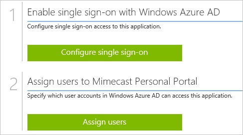
##Enabling the application integration for Mimecast Personal Portal
  
The objective of this section is to outline how to enable the application integration for Mimecast Personal Portal.

###To enable the application integration for Mimecast Personal Portal, perform the following steps:

1.  In the Azure classic portal, on the left navigation pane, click **Active Directory**.

    

2.  From the **Directory** list, select the directory for which you want to enable directory integration.

3.  To open the applications view, in the directory view, click **Applications** in the top menu.

    

4.  Click **Add** at the bottom of the page.

    

5.  On the **What do you want to do** dialog, click **Add an application from the gallery**.

    

6.  In the **search box**, type **Mimecast Personal Portal**.

    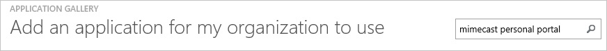

7.  In the results pane, select **Mimecast Personal Portal**, and then click **Complete** to add the application.

    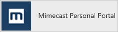
##Configuring single sign-on
  
The objective of this section is to outline how to enable users to authenticate to Mimecast Personal Portal with their account in Azure AD using federation based on the SAML protocol.  
As part of this procedure, you are required to create a base-64 encoded certificate file.  
If you are not familiar with this procedure, see [How to convert a binary certificate into a text file](http://youtu.be/PlgrzUZ-Y1o).

###To configure single sign-on, perform the following steps:

1.  In the Azure classic portal, on the **Mimecast Personal Portal** application integration page, click **Configure single sign-on** to open the **Configure Single Sign On ** dialog.

    

2.  On the **How would you like users to sign on to Mimecast Personal Portal** page, select **Microsoft Azure AD Single Sign-On**, and then click **Next**.

    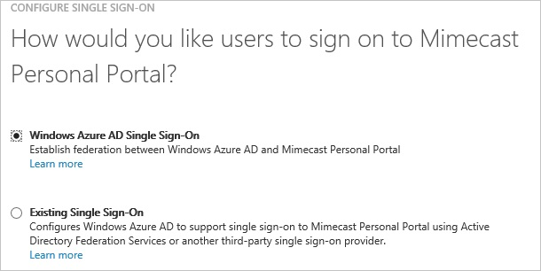

3.  On the **Configure App URL** page, in the **Mimecast Personal Portal Sign On URL** textbox, type the URL used by your users to sign on to your Mimecast Personal Portal application (e.g.: “https://webmail-uk.mimecast.com” or “https://webmail-us.mimecast.com”), and then click **Next**.

    >[AZURE.NOTE] The sign on URL is region specific.

    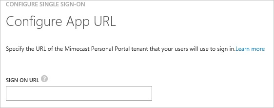

4.  On the **Configure single sign-on at Mimecast Personal Portal** page, to download your certificate, click **Download certificate**, and then save the certificate file locally on your computer.

    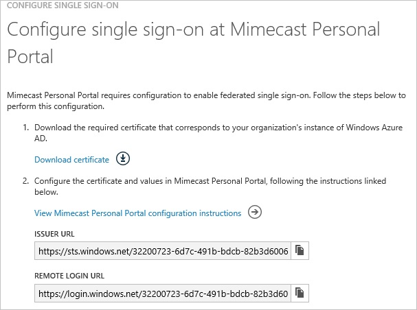

5.  In a different web browser window, log into your Mimecast Personal Portal as an administrator.

6.  Go to **Services \> Application**.

    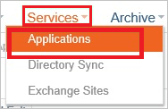

7.  Click **Authentication Profiles**.

    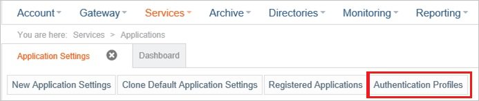

8.  Click **New Authentication Profile**.

    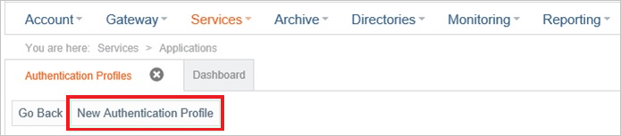

9.  In the **Authentication Profile** section, perform the following steps:

    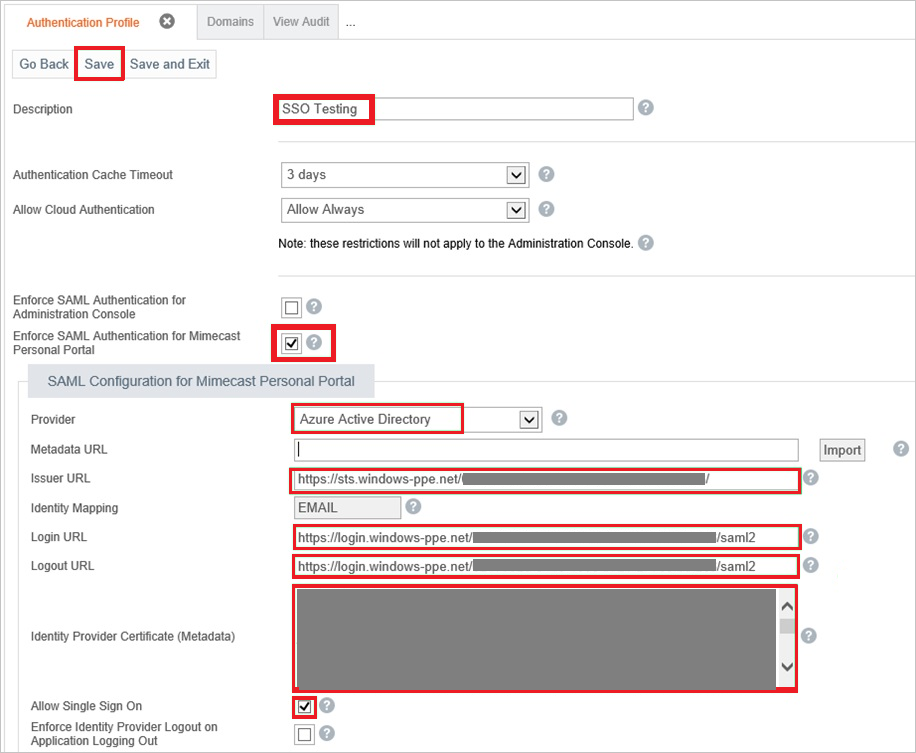

    1.  In the **Description** textbox, type a name for your configuration.
    2.  Select **Enforce SAML Authentication for Mimecast Personal Portal**.
    3.  As **Provider**, select **Azure Active Directory**.
    4.  In the Azure classic portal, on the **Configure single sign-on at Mimecast Personal Portal** dialog page, copy the **Issuer URL** value, and then paste it into the **Issuer URL** textbox.
    5.  In the Azure classic portal, on the **Configure single sign-on at Mimecast Personal Portal** dialog page, copy the **Remote Login URL** value, and then paste it into the **Login URL** textbox.
    6.  In the Azure classic portal, on the **Configure single sign-on at Mimecast Personal Portal** dialog page, copy the **Remote Login URL** value, and then paste it into the **Logout URL** textbox.  

        >[AZURE.NOTE] The Login URL value and the Logout URL value are for the -on at Mimecast Personal Portal the same.

    7.  Create a **base-64 encoded** file from your downloaded certificate.  

        >[AZURE.TIP]For more details, see [How to convert a binary certificate into a text file](http://youtu.be/PlgrzUZ-Y1o).

    8.  Open your base-64 encoded certificate in notepad, remove the first line (“*--*“) and the last line (“*--*“), copy the remaining content of it into your clipboard, and then paste it to the **Identity Provider Certificate (Metadata)** textbox.
    9.  Select **Allow Single Sign On**.
    10. Click **Save**.

10. On the Azure classic portal, select the single sign-on configuration confirmation, and then click **Complete** to close the **Configure Single Sign On** dialog.

    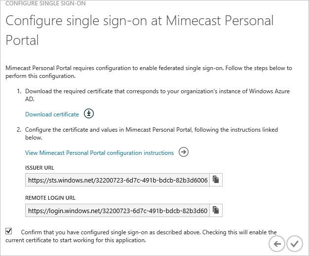
##Configuring user provisioning
  
In order to enable Azure AD users to log into Mimecast Personal Portal, they must be provisioned into Mimecast Personal Portal.  
In the case of Mimecast Personal Portal, provisioning is a manual task.
  
You need to register a domain before you can create users.

###To configure user provisioning, perform the following steps:

1.  Sign on to your **Mimecast Personal Portal** as administrator.

2.  Go to **Directories \> Internal**.

    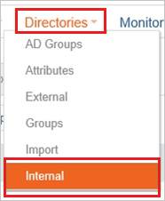

3.  Click **Register New Domain**.

    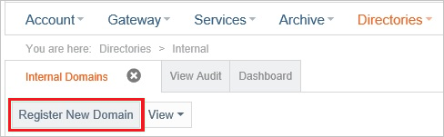

4.  After your new domain has been created, click **New Address**.

    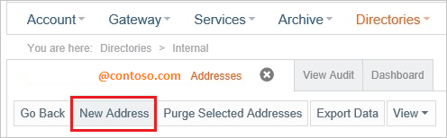

5.  In the new address dialog, perform the following steps:

    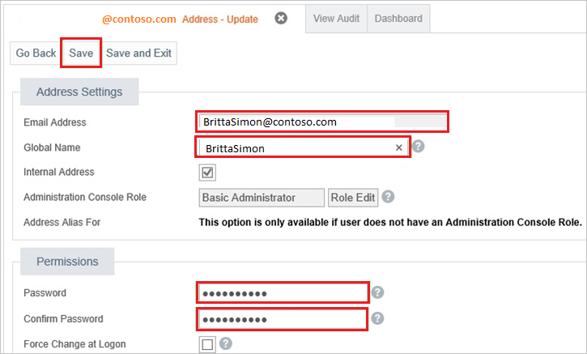

    1.  Type the **Email Address**, **Global Name**, **Password** and **Confirm Password** attributes of a valid AAD account you want to provision into the related textboxes.
    2.  Click **Save**.

>[AZURE.NOTE]You can use any other Mimecast Personal Portal user account creation tools or APIs provided by Mimecast Personal Portal to provision AAD user accounts.

##Assigning users

To test your configuration, you need to grant the Azure AD users you want to allow using your application access to it by assigning them.

###To assign users to Mimecast Personal Portal, perform the following steps:

1.  In the Azure classic portal, create a test account.

2.  On the **Mimecast Personal Portal **application integration page, click **Assign users**.

    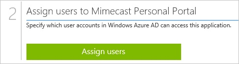

3.  Select your test user, click **Assign**, and then click **Yes** to confirm your assignment.

    
  
If you want to test your single sign-on settings, open the Access Panel. For more details about the Access Panel, see [Introduction to the Access Panel](active-directory-saas-access-panel-introduction.md).