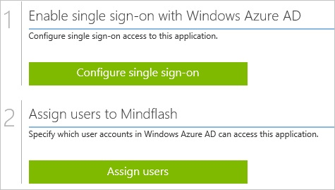
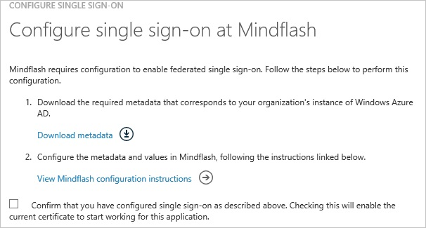
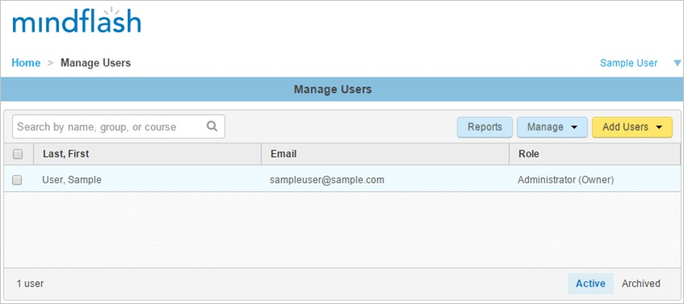
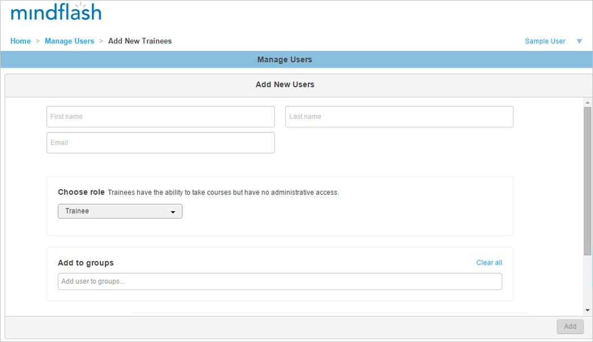

<properties 
    pageTitle="Tutorial: Azure Active Directory integration with Mindflash | Microsoft Azure" 
    description="Learn how to use Mindflash with Azure Active Directory to enable single sign-on, automated provisioning, and more!" 
    services="active-directory" 
    authors="jeevansd"  
    documentationCenter="na" 
    manager="femila"/>
<tags 
    ms.service="active-directory" 
    ms.devlang="na" 
    ms.topic="article" 
    ms.tgt_pltfrm="na" 
    ms.workload="identity" 
    ms.date="07/08/2016" 
    ms.author="jeedes" />

#Tutorial: Azure Active Directory integration with Mindflash
  
The objective of this tutorial is to show the integration of Azure and Mindflash.  
The scenario outlined in this tutorial assumes that you already have the following items:

-   A valid Azure subscription
-   A Mindflash single sign-on enabled subscription
  
After completing this tutorial, the Azure AD users you have assigned to Mindflash will be able to single sign into the application at your Mindflash company site (service provider initiated sign on), or using the [Introduction to the Access Panel](active-directory-saas-access-panel-introduction.md).
  
The scenario outlined in this tutorial consists of the following building blocks:

1.  Enabling the application integration for Mindflash
2.  Configuring single sign-on
3.  Configuring user provisioning
4.  Assigning users

##Enabling the application integration for Mindflash
  
The objective of this section is to outline how to enable the application integration for Mindflash.

###To enable the application integration for Mindflash, perform the following steps:

1.  In the Azure classic portal, on the left navigation pane, click **Active Directory**.

    

2.  From the **Directory** list, select the directory for which you want to enable directory integration.

3.  To open the applications view, in the directory view, click **Applications** in the top menu.

    

4.  Click **Add** at the bottom of the page.

    

5.  On the **What do you want to do** dialog, click **Add an application from the gallery**.

    

6.  In the **search box**, type **Mindflash**.

    

7.  In the results pane, select **Mindflash**, and then click **Complete** to add the application.

    
##Configuring single sign-on
  
The objective of this section is to outline how to enable users to authenticate to Mindflash with their account in Azure AD using federation based on the SAML protocol.

###To configure single sign-on, perform the following steps:

1.  In the Azure classic portal, on the **Mindflash** application integration page, click **Configure single sign-on** to open the **Configure Single Sign On ** dialog.

    

2.  On the **How would you like users to sign on to Mindflash** page, select **Microsoft Azure AD Single Sign-On**, and then click **Next**.

    

3.  On the **Configure App URL** page, in the **Sign On URL** textbox, type your URL using the following pattern "*http://company.mindflash.com*", and then click **Next**.

    

4.  On the **Configure single sign-on at Mindflash** page, click **Download metadata**, and then save the metadata file on your computer.

    

5.  Send the metadatafile to the Mindflash support team.

    >[AZURE.NOTE] The single sign-on configuration has to be performed by the Mindflash support team. You will get a notification as soon as the configuration has been completed.

6.  On the Azure classic portal, select the single sign-on configuration confirmation, and then click **Complete** to close the **Configure Single Sign On** dialog.

    
##Configuring user provisioning
  
In order to enable Azure AD users to log into Mindflash, they must be provisioned into Mindflash.  
In the case of Mindflash, provisioning is a manual task.

###To provision a user accounts, perform the following steps:

1.  Log in to your **Mindflash** company site as an administrator.

2.  Go to **Manage Users**.

    

3.  Click the **Add Users**, and then click **New**.

4.  In the **Add New Users** section, perform the following steps:

    

    1.  Type the **First name**, **Last name** and **Email** of a valid AAD account you want to provision into the related textboxes.
    2.  Click **Add**.

>[AZURE.NOTE]You can use any other Mindflash user account creation tools or APIs provided by Mindflash to provision AAD user accounts.

##Assigning users
  
To test your configuration, you need to grant the Azure AD users you want to allow using your application access to it by assigning them.

###To assign users to Mindflash, perform the following steps:

1.  In the Azure classic portal, create a test account.

2.  On the **Mindflash **application integration page, click **Assign users**.

    

3.  Select your test user, click **Assign**, and then click **Yes** to confirm your assignment.

    
  
If you want to test your single sign-on settings, open the Access Panel. For more details about the Access Panel, see [Introduction to the Access Panel](active-directory-saas-access-panel-introduction.md).