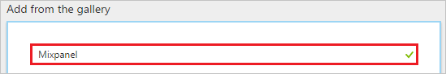
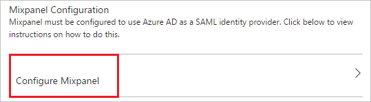
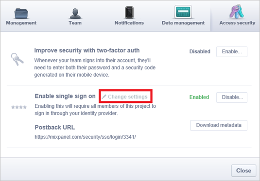
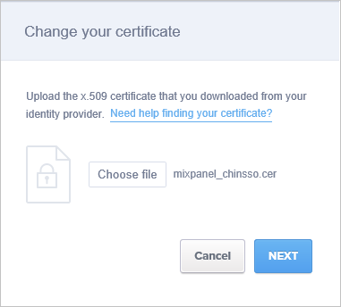
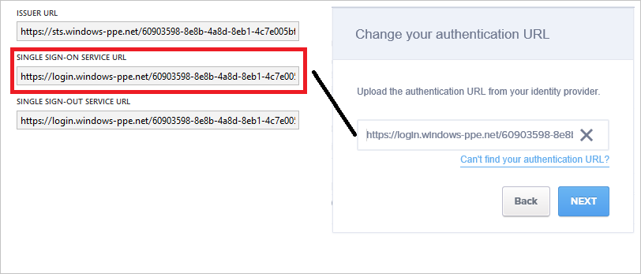
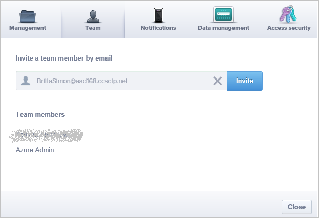

# Tutorial: Azure Active Directory integration with Mixpanel

In this tutorial, you learn how to integrate Mixpanel with Azure Active Directory (Azure AD).

Integrating Mixpanel with Azure AD provides you with the following benefits:

- You can control in Azure AD who has access to Mixpanel
- You can enable your users to automatically get signed-on to Mixpanel (Single Sign-On) with their Azure AD accounts
- You can manage your accounts in one central location - the Azure portal

If you want to know more details about SaaS app integration with Azure AD, see [what is application access and single sign-on with Azure Active Directory](active-directory-appssoaccess-whatis.md).

## Prerequisites

To configure Azure AD integration with Mixpanel, you need the following items:

- An Azure AD subscription
- A Mixpanel single sign-on enabled subscription

> [!NOTE]
> To test the steps in this tutorial, we do not recommend using a production environment.

To test the steps in this tutorial, you should follow these recommendations:

- Do not use your production environment, unless it is necessary.
- If you don't have an Azure AD trial environment, you can get a one-month trial [here](https://azure.microsoft.com/pricing/free-trial/).

## Scenario description
In this tutorial, you test Azure AD single sign-on in a test environment. 
The scenario outlined in this tutorial consists of two main building blocks:

1. Adding Mixpanel from the gallery
2. Configuring and testing Azure AD single sign-on

## Adding Mixpanel from the gallery
To configure the integration of Mixpanel into Azure AD, you need to add Mixpanel from the gallery to your list of managed SaaS apps.

**To add Mixpanel from the gallery, perform the following steps:**

1. In the **[Azure portal](https://portal.azure.com)**, on the left navigation panel, click **Azure Active Directory** icon. 

	![Active Directory][1]

2. Navigate to **Enterprise applications**. Then go to **All applications**.

	![Applications][2]
	
3. To add new application, click **New application** button on the top of dialog.

	![Applications][3]

4. In the search box, type **Mixpanel**.

	

5. In the results panel, select **Mixpanel**, and then click **Add** button to add the application.

	

##  Configuring and testing Azure AD single sign-on
In this section, you configure and test Azure AD single sign-on with Mixpanel based on a test user called "Britta Simon".

For single sign-on to work, Azure AD needs to know what the counterpart user in Mixpanel is to a user in Azure AD. In other words, a link relationship between an Azure AD user and the related user in Mixpanel needs to be established.

In Mixpanel, assign the value of the **user name** in Azure AD as the value of the **Username** to establish the link relationship.

To configure and test Azure AD single sign-on with Mixpanel, you need to complete the following building blocks:

1. **[Configuring Azure AD Single Sign-On](#configuring-azure-ad-single-sign-on)** - to enable your users to use this feature.
2. **[Creating an Azure AD test user](#creating-an-azure-ad-test-user)** - to test Azure AD single sign-on with Britta Simon.
3. **[Creating a Mixpanel test user](#creating-a-mixpanel-test-user)** - to have a counterpart of Britta Simon in Mixpanel that is linked to the Azure AD representation of user.
4. **[Assigning the Azure AD test user](#assigning-the-azure-ad-test-user)** - to enable Britta Simon to use Azure AD single sign-on.
5. **[Testing Single Sign-On](#testing-single-sign-on)** - to verify whether the configuration works.

### Configuring Azure AD single sign-on

In this section, you enable Azure AD single sign-on in the Azure portal and configure single sign-on in your Mixpanel application.

**To configure Azure AD single sign-on with Mixpanel, perform the following steps:**

1. In the Azure portal, on the **Mixpanel** application integration page, click **Single sign-on**.

	![Configure Single Sign-On][4]

2. On the **Single sign-on** dialog, select **Mode** as	**SAML-based Sign-on** to enable single sign-on.
 
	

3. On the **Mixpanel Domain and URLs** section, perform the following steps:

	

     In the **Sign-on URL** textbox, type a URL as: `https://mixpanel.com/login/`

	> [!NOTE] 
	> Please register at [https://mixpanel.com/register/](https://mixpanel.com/register/) to set up your login credentials and  contact the [Mixpanel support team](mailto:support@mixpanel.com) to enable SSO settings for your tenant. You can also get your Sign On URL value if necessary from your Mixpanel support team. 
 
4. On the **SAML Signing Certificate** section, click **Certificate(Base64)** and then save the certificate file on your computer.

	 

5. Click **Save** button.

	

6. On the **Mixpanel Configuration** section, click **Configure Mixpanel** to open **Configure sign-on** window. Copy the **SAML Single Sign-On Service URL** from the **Quick Reference section.**

	 

7. In a different browser window, sign-on to your Mixpanel application as an administrator.

8. On bottom of the page, click the little **gear** icon in the left corner. 
   
     

9. Click the **Access security** tab, and then click **Change settings**.
   
     

10. On the **Change your certificate** dialog page, click **Choose file** to upload your downloaded certificate, and then click **NEXT**.
   
     

11.  In the authentication URL textbox on the **Change your authentication  URL** dialog page, paste the value of **SAML Single Sign-On Service URL** which you have copied from Azure portal, and then click **NEXT**.
   
    

12. Click **Done**.

> [!TIP]
> You can now read a concise version of these instructions inside the [Azure portal](https://portal.azure.com), while you are setting up the app!  After adding this app from the **Active Directory > Enterprise Applications** section, simply click the **Single Sign-On** tab and access the embedded documentation through the **Configuration** section at the bottom. You can read more about the embedded documentation feature here: [Azure AD embedded documentation]( https://go.microsoft.com/fwlink/?linkid=845985)

### Creating an Azure AD test user
The objective of this section is to create a test user in the Azure portal called Britta Simon.

![Create Azure AD User][100]

**To create a test user in Azure AD, perform the following steps:**

1. In the **Azure portal**, on the left navigation pane, click **Azure Active Directory** icon.

	 

2. To display the list of users, go to **Users and groups** and click **All users**.
	
	 

3. To open the **User** dialog, click **Add** on the top of the dialog.
 
	 

4. On the **User** dialog page, perform the following steps:
 
	 

    a. In the **Name** textbox, type **BrittaSimon**.

    b. In the **User name** textbox, type the **email address** of BrittaSimon.

	c. Select **Show Password** and write down the value of the **Password**.

    d. Click **Create**.
 
### Creating a Mixpanel test user

The objective of this section is to create a user called Britta Simon in Mixpanel. 

1. Sign on to your Mixpanel company site as an administrator.

2. On the bottom of the page, click the little gear button on the left corner to open the **Settings** window.

3. Click the **Team** tab.

4. In the **team member** textbox, type Britta's email address in the Azure.
   
     

5. Click **Invite**. 

> [!Note]
> The user will get an email to set up the profile.

### Assigning the Azure AD test user

In this section, you enable Britta Simon to use Azure single sign-on by granting access to Mixpanel.

![Assign User][200] 

**To assign Britta Simon to Mixpanel, perform the following steps:**

1. In the Azure portal, open the applications view, and then navigate to the directory view and go to **Enterprise applications** then click **All applications**.

	![Assign User][201] 

2. In the applications list, select **Mixpanel**.

	 

3. In the menu on the left, click **Users and groups**.

	![Assign User][202] 

4. Click **Add** button. Then select **Users and groups** on **Add Assignment** dialog.

	![Assign User][203]

5. On **Users and groups** dialog, select **Britta Simon** in the Users list.

6. Click **Select** button on **Users and groups** dialog.

7. Click **Assign** button on **Add Assignment** dialog.
	
### Testing single sign-on

In this section, you test your Azure AD single sign-on configuration using the Access Panel.

When you click the Mixpanel tile in the Access Panel, you should get automatically signed-on to your Mixpanel application.
For more information about the Access Panel, see [Introduction to the Access Panel](active-directory-saas-access-panel-introduction.md).

## Additional resources

* [List of Tutorials on How to Integrate SaaS Apps with Azure Active Directory](active-directory-saas-tutorial-list.md)
* [What is application access and single sign-on with Azure Active Directory?](active-directory-appssoaccess-whatis.md)

<!--Image references-->

[1]: ./media/active-directory-saas-mixpanel-tutorial/tutorial_general_01.png
[2]: ./media/active-directory-saas-mixpanel-tutorial/tutorial_general_02.png
[3]: ./media/active-directory-saas-mixpanel-tutorial/tutorial_general_03.png
[4]: ./media/active-directory-saas-mixpanel-tutorial/tutorial_general_04.png

[100]: ./media/active-directory-saas-mixpanel-tutorial/tutorial_general_100.png

[200]: ./media/active-directory-saas-mixpanel-tutorial/tutorial_general_200.png
[201]: ./media/active-directory-saas-mixpanel-tutorial/tutorial_general_201.png
[202]: ./media/active-directory-saas-mixpanel-tutorial/tutorial_general_202.png
[203]: ./media/active-directory-saas-mixpanel-tutorial/tutorial_general_203.png

