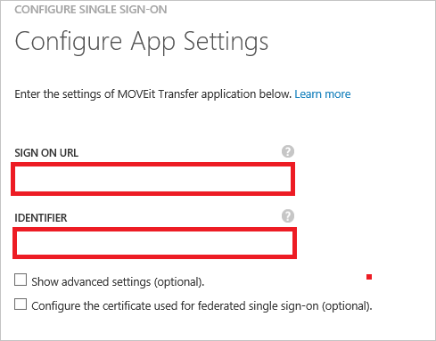
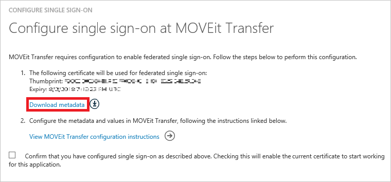
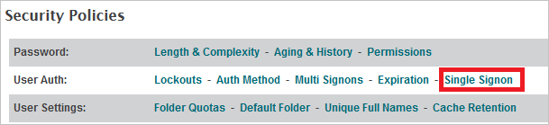
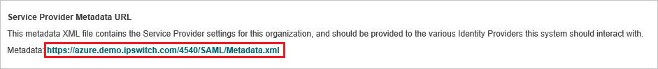
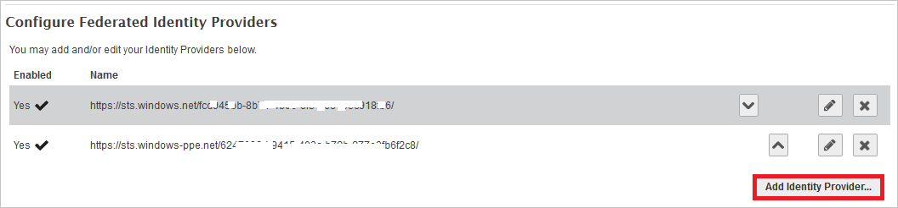
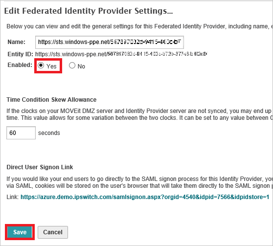
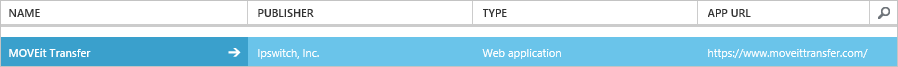

<properties
	pageTitle="Tutorial: Azure Active Directory integration with MOVEit Transfer | Microsoft Azure"
	description="Learn how to configure single sign-on between Azure Active Directory and MOVEit Transfer."
	services="active-directory"
	documentationCenter=""
	authors="jeevansd"
	manager="femila"
	editor=""/>

<tags
	ms.service="active-directory"
	ms.workload="identity"
	ms.tgt_pltfrm="na"
	ms.devlang="na"
	ms.topic="article"
	ms.date="08/10/2016"
	ms.author="jeedes"/>

# Tutorial: Azure Active Directory integration with MOVEit Transfer

The objective of this tutorial is to show you how to integrate MOVEit Transfer with Azure Active Directory (Azure AD).

Integrating MOVEit Transfer with Azure AD provides you with the following benefits:

- You can control in Azure AD who has access to MOVEit Transfer
- You can enable your users to automatically get signed-on to MOVEit Transfer (Single Sign-On) with their Azure AD accounts
- You can manage your accounts in one central location - the Azure classic portal

If you want to know more details about SaaS app integration with Azure AD, see [What is application access and single sign-on with Azure Active Directory](active-directory-appssoaccess-whatis.md).

## Prerequisites

To configure Azure AD integration with MOVEit Transfer, you need the following items:

- An Azure AD subscription
- A MOVEit Transfer single-sign on enabled subscription

> [AZURE.NOTE] To test the steps in this tutorial, we do not recommend using a production environment.

To test the steps in this tutorial, you should follow these recommendations:

- You should not use your production environment, unless this is necessary.
- If you don't have an Azure AD trial environment, you can get a one-month trial [here](https://azure.microsoft.com/pricing/free-trial/).

## Scenario description
The objective of this tutorial is to enable you to test Azure AD single sign-on in a test environment.

The scenario outlined in this tutorial consists of two main building blocks:

1. Adding MOVEit Transfer from the gallery
2. Configuring and testing Azure AD single sign-on

## Adding MOVEit Transfer from the gallery
To configure the integration of MOVEit Transfer into Azure AD, you need to add MOVEit Transfer from the gallery to your list of managed SaaS apps.

**To add MOVEit Transfer from the gallery, perform the following steps:**

1. In the **Azure classic Portal**, on the left navigation pane, click **Active Directory**. 

	![Active Directory][1]

2. From the **Directory** list, select the directory for which you want to enable directory integration.

3. To open the applications view, in the directory view, click **Applications** in the top menu.
	
	![Applications][2]

4. Click **Add** at the bottom of the page.
	
	![Applications][3]

5. On the **What do you want to do** dialog, click **Add an application from the gallery**.

	![Applications][4]

6. In the search box, type **MOVEit Transfer**.

	

7. In the results panel, select **MOVEit Transfer**, and then click **Complete** to add the application.

	

##  Configuring and testing Azure AD single sign-on
The objective of this section is to show you how to configure and test Azure AD single sign-on with MOVEit Transfer based on a test user called "Britta Simon".

For single sign-on to work, Azure AD needs to know what the counterpart user in MOVEit Transfer to an user in Azure AD is. In other words, a link relationship between an Azure AD user and the related user in MOVEit Transfer needs to be established.

This link relationship is established by assigning the value of the **user name** in Azure AD as the value of the **Username** in MOVEit Transfer.

To configure and test Azure AD single sign-on with MOVEit Transfer, you need to complete the following building blocks:

1. **[Configuring Azure AD Single Sign-On](#configuring-azure-ad-single-single-sign-on)** - to enable your users to use this feature.
2. **[Creating an Azure AD test user](#creating-an-azure-ad-test-user)** - to test Azure AD single sign-on with Britta Simon.
3. **[Creating a MOVEit Transfer test user](#creating-a-moveit-transfer-test-user)** - to have a counterpart of Britta Simon in MOVEit Transfer that is linked to the Azure AD representation of her.
4. **[Assigning the Azure AD test user](#assigning-the-azure-ad-test-user)** - to enable Britta Simon to use Azure AD single sign-on.
5. **[Testing Single Sign-On](#testing-single-sign-on)** - to verify whether the configuration works.

### Configuring Azure AD single sign-on

In this section, you enable Azure AD single sign-on in the classic portal and configure single sign-on in your MOVEit Transfer application.

**To configure Azure AD single sign-on with MOVEit Transfer, perform the following steps:**

1. In the classic portal, on the **MOVEit Transfer** application integration page, click **Configure single sign-on** to open the **Configure Single Sign-On**  dialog.
	 
	![Configure Single Sign-On][6] 

2. On the **How would you like users to sign on to MOVEit Transfer** page, select **Azure AD Single Sign-On**, and then click **Next**.
    
	

3. On the **Configure App Settings** dialog page, perform the following steps and click **Next**:

    

	a. In the **Sign On URL** textbox, type sign in URL with your own domain.

    b. In the **Identifier** textbox, type a enebled Assertion Consumer Interface URL.

	c. Click **Next**

	> [AZURE.NOTE] Please note that you have to update these values with the actual Sign On URL and Identifier. To get these values, you can refer step 8 for more details or contact [MOVEit Transfer](https://www.ipswitch.com/support/technical-support).

4. On the **Configure single sign-on at MOVEit Transfer** page, perform the following steps and click **Next**:

	

    a. Click **Download metadata**, and then save the file on your computer.

    b. Click **Next**.

5. Sign-on to your MOVEit Transfer tenant as an administrator.

6. Go to the **Settings page** in the sidebar (**Settings**).

	

7. Click **Single Signon** link which is under **Security Policies -> User Auth**.

	

8. Click the Metadata URL link to confirm the Identifier URL match your configuration in step 3.

	

9. Click **Add Identity Provider** button to add a new Federated Identity Provider.

	

10. Click **Browse...** to select the metadata file which you downloaded in step 4. Then click **Add Identity Provider** to upload the downloaded file. 

	

11. Select "**Yes**" as **Enabled** in the **Edit Federated Identity Provider Settings...** page and click **Save**.

	 

12. In the **Edit Federated Identity Provider User Settings** page perform the following actions and click **Save**.

	a. Select **SAML NameID** as **Login name**.

	b. Select **Other** as **Full name** and in the **Attribute name** textbox put the value: http://schemas.microsoft.com/identity/claims/displayname.

	c. Select **Other** as **Email** and in the **Attribute name** textbox put the value: http://schemas.xmlsoap.org/ws/2005/05/identity/claims/emailaddress.

	d. Select **Yes** as **Auto-create account on signon**.

	e. Click **Save** button.

	

13. In the classic portal, select the single sign-on configuration confirmation, and then click **Next**.
    
	![Azure AD Single Sign-On][10]

14. On the **Single sign-on confirmation** page, click **Complete**.  
    
	![Azure AD Single Sign-On][11]

### Creating an Azure AD test user
The objective of this section is to create a test user in the classic portal called Britta Simon.

![Create Azure AD User][20]

**To create a test user in Azure AD, perform the following steps:**

1. In the **Azure classic Portal**, on the left navigation pane, click **Active Directory**.

    

2. From the **Directory** list, select the directory for which you want to enable directory integration.

3. To display the list of users, in the menu on the top, click **Users**.
    
	

4. To open the **Add User** dialog, in the toolbar on the bottom, click **Add User**.

    

5. On the **Tell us about this user** dialog page, perform the following steps:

    

    a. As Type Of User, select New user in your organization.

    b. In the User Name **textbox**, type **BrittaSimon**.

    c. Click **Next**.

6.  On the **User Profile** dialog page, perform the following steps:
    
	

    a. In the **First Name** textbox, type **Britta**.  

    b. In the **Last Name** textbox, type, **Simon**.

    c. In the **Display Name** textbox, type **Britta Simon**.

    d. In the **Role** list, select **User**.

    e. Click **Next**.

7. On the **Get temporary password** dialog page, click **create**.
    
	

8. On the **Get temporary password** dialog page, perform the following steps:
    
	

    a. Write down the value of the **New Password**.

    b. Click **Complete**.   

### Creating a MOVEit Transfer test user

The objective of this section is to create a user called Britta Simon in MOVEit Transfer. MOVEit Transfer supports just-in-time provisioning, which you have enabled.

There is no action item for you in this section. A new user will be created during an attempt to access MOVEit Transfer if it doesn't exist yet.

> [AZURE.NOTE] If you need to create an user manually, you need to contact the MOVEit Transfer support team.

### Assigning the Azure AD test user

The objective of this section is to enabling Britta Simon to use Azure single sign-on by granting her access to MOVEit Transfer.
	
![Assign User][200]

**To assign Britta Simon to MOVEit Transfer, perform the following steps:**

1. On the classic portal, to open the applications view, in the directory view, click **Applications** in the top menu.
    
	![Assign User][201]

2. In the applications list, select **MOVEit Transfer**.
    
	

1. In the menu on the top, click **Users**.
    
	![Assign User][203]

1. In the Users list, select **Britta Simon**.

2. In the toolbar on the bottom, click **Assign**.
    
	![Assign User][205]

### Testing single sign-on

The objective of this section is to test your Azure AD single sign-on configuration using the Access Panel.
 
When you click the MOVEit Transfer tile in the Access Panel, you should get automatically signed-on to your MOVEit Transfer application.

## Additional resources

* [List of Tutorials on How to Integrate SaaS Apps with Azure Active Directory](active-directory-saas-tutorial-list.md)
* [What is application access and single sign-on with Azure Active Directory?](active-directory-appssoaccess-whatis.md)

<!--Image references-->

[1]: ./media/active-directory-saas-moveittransfer-tutorial/tutorial_general_01.png
[2]: ./media/active-directory-saas-moveittransfer-tutorial/tutorial_general_02.png
[3]: ./media/active-directory-saas-moveittransfer-tutorial/tutorial_general_03.png
[4]: ./media/active-directory-saas-moveittransfer-tutorial/tutorial_general_04.png

[6]: ./media/active-directory-saas-moveittransfer-tutorial/tutorial_general_05.png
[10]: ./media/active-directory-saas-moveittransfer-tutorial/tutorial_general_06.png
[11]: ./media/active-directory-saas-moveittransfer-tutorial/tutorial_general_07.png
[20]: ./media/active-directory-saas-moveittransfer-tutorial/tutorial_general_100.png

[200]: ./media/active-directory-saas-moveittransfer-tutorial/tutorial_general_200.png
[201]: ./media/active-directory-saas-moveittransfer-tutorial/tutorial_general_201.png
[203]: ./media/active-directory-saas-moveittransfer-tutorial/tutorial_general_203.png
[204]: ./media/active-directory-saas-moveittransfer-tutorial/tutorial_general_204.png
[205]: ./media/active-directory-saas-moveittransfer-tutorial/tutorial_general_205.png
