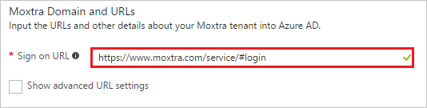
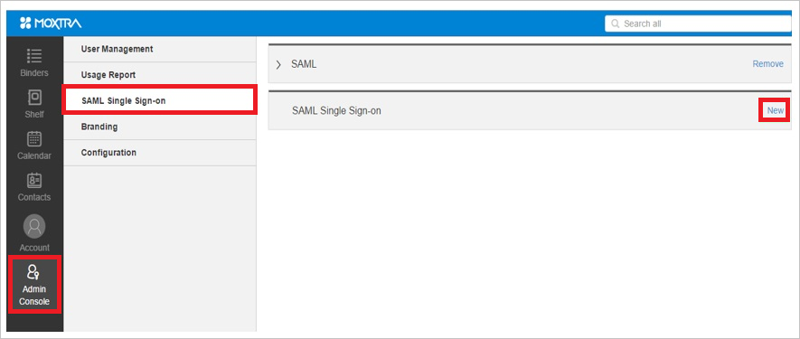
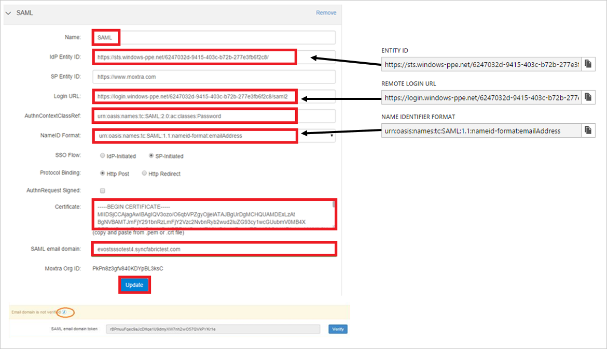
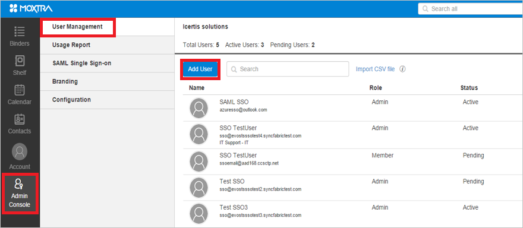

# Tutorial: Azure Active Directory integration with Moxtra

In this tutorial, you learn how to integrate Moxtra with Azure Active Directory (Azure AD).

Integrating Moxtra with Azure AD provides you with the following benefits:

- You can control in Azure AD who has access to Moxtra
- You can enable your users to automatically get signed-on to Moxtra (Single Sign-On) with their Azure AD accounts
- You can manage your accounts in one central location - the Azure portal

If you want to know more details about SaaS app integration with Azure AD, see [what is application access and single sign-on with Azure Active Directory](active-directory-appssoaccess-whatis.md).

## Prerequisites

To configure Azure AD integration with Moxtra, you need the following items:

- An Azure AD subscription
- A Moxtra single sign-on enabled subscription

> [!NOTE]
> To test the steps in this tutorial, we do not recommend using a production environment.

To test the steps in this tutorial, you should follow these recommendations:

- Do not use your production environment, unless it is necessary.
- If you don't have an Azure AD trial environment, you can get a one-month trial [here](https://azure.microsoft.com/pricing/free-trial/).

## Scenario description
In this tutorial, you test Azure AD single sign-on in a test environment. 
The scenario outlined in this tutorial consists of two main building blocks:

1. Adding Moxtra from the gallery
2. Configuring and testing Azure AD single sign-on

## Adding Moxtra from the gallery
To configure the integration of Moxtra into Azure AD, you need to add Moxtra from the gallery to your list of managed SaaS apps.

**To add Moxtra from the gallery, perform the following steps:**

1. In the **[Azure portal](https://portal.azure.com)**, on the left navigation panel, click **Azure Active Directory** icon. 

	![Active Directory][1]

2. Navigate to **Enterprise applications**. Then go to **All applications**.

	![Applications][2]
	
3. To add new application, click **New application** button on the top of dialog.

	![Applications][3]

4. In the search box, type **Moxtra**.

	

5. In the results panel, select **Moxtra**, and then click **Add** button to add the application.

	

##  Configuring and testing Azure AD single sign-on
In this section, you configure and test Azure AD single sign-on with Moxtra based on a test user called "Britta Simon".

For single sign-on to work, Azure AD needs to know what the counterpart user in Moxtra is to a user in Azure AD. In other words, a link relationship between an Azure AD user and the related user in Moxtra needs to be established.

In Moxtra, assign the value of the **user name** in Azure AD as the value of the **Username** to establish the link relationship.

To configure and test Azure AD single sign-on with Moxtra, you need to complete the following building blocks:

1. **[Configuring Azure AD Single Sign-On](#configuring-azure-ad-single-sign-on)** - to enable your users to use this feature.
2. **[Creating an Azure AD test user](#creating-an-azure-ad-test-user)** - to test Azure AD single sign-on with Britta Simon.
3. **[Creating a Moxtra test user](#creating-a-moxtra-test-user)** - to have a counterpart of Britta Simon in Moxtra that is linked to the Azure AD representation of user.
4. **[Assigning the Azure AD test user](#assigning-the-azure-ad-test-user)** - to enable Britta Simon to use Azure AD single sign-on.
5. **[Testing Single Sign-On](#testing-single-sign-on)** - to verify whether the configuration works.

### Configuring Azure AD single sign-on

In this section, you enable Azure AD single sign-on in the Azure portal and configure single sign-on in your Moxtra application.

**To configure Azure AD single sign-on with Moxtra, perform the following steps:**

1. In the Azure portal, on the **Moxtra** application integration page, click **Single sign-on**.

	![Configure Single Sign-On][4]

2. On the **Single sign-on** dialog, select **Mode** as	**SAML-based Sign-on** to enable single sign-on.
 
	

3. On the **Moxtra Domain and URLs** section, perform the following step:

	

    In the **Sign-on URL** textbox, type a URL as: `https://www.moxtra.com/service/#login`

4. Moxtra application expects the SAML assertions in a specific format. Configure the following claims for this application. You can manage the values of these attributes from the "**User Attributes**" section on application integration page. The following screenshot shows an example for this configuration. 

    
    
5. In the **User Attributes** section on the **Single sign-on** dialog, configure SAML token attribute as shown in the image and perform the following steps:
	
	| Attribute Name | Attribute Value |
	| ------------------- | -------------------- |    
	| firstname | user.givenname |
	| lastname | user.surname |
	| idpid    | < SAML Entity ID > 

	> [!Note]
	> The value of **idpid** attribute is not real. You can get the actual value from **Quick reference** section under **Moxtra Configuration**.
	
	a. Click **Add attribute** to open the **Add Attribute** dialog.

	

	b. In the **Name** textbox, type the attribute name shown for that row.

	

	c. From the **Value** list, type the attribute value shown for that row.

	d. Click **Ok**.
    
5. On the **SAML Signing Certificate** section, click **Certificate(Base64)** and then save the certificate file on your computer.

	 

6. Click **Save** button.

	

7. On the **Moxtra Configuration** section, click **Configure Moxtra** to open **Configure sign-on** window. Copy the **SAML Entity ID, and SAML Single Sign-On Service URL** from the **Quick Reference section.**

	 

8. In another browser window, sign on to your Moxtra company site as an administrator.

9. In the toolbar on the left, click **Admin Console > SAML Single Sign-on**, and then click **New**.
   
     

10. On the **SAML** page, perform the following steps:
   
       
 
    a. In the **Name** textbox, type a name for your configuration (e.g.: *SAML*). 
  
    b. In the **IdP Entity ID** textbox, paste the value of **SAML Entity ID** which you have copied from Azure portal. 
 
    c. In **Login URL** textbox, paste the value of **SAML Single Sign-On Service URL** which you have copied from Azure portal. 
 
    d. In the **AuthnContextClassRef** textbox, type **urn:oasis:names:tc:SAML:2.0:ac:classes:Password**. 
 
    e. In the **NameID Format** textbox, type **urn:oasis:names:tc:SAML:1.1:nameid-format:emailAddress**. 
 
    f. Open certificate which you have downloaded from Azure portal in notepad, copy the content, and then paste it into the **Certificate** textbox.    
 
    g. In the SAML email domain textbox, type your SAML email domain.    
  
    >[!NOTE]
    >To see the steps to verify the domain, click the "**i**" below.

    h. Click **Update**.

> [!TIP]
> You can now read a concise version of these instructions inside the [Azure portal](https://portal.azure.com), while you are setting up the app!  After adding this app from the **Active Directory > Enterprise Applications** section, simply click the **Single Sign-On** tab and access the embedded documentation through the **Configuration** section at the bottom. You can read more about the embedded documentation feature here: [Azure AD embedded documentation]( https://go.microsoft.com/fwlink/?linkid=845985)

### Creating an Azure AD test user
The objective of this section is to create a test user in the Azure portal called Britta Simon.

![Create Azure AD User][100]

**To create a test user in Azure AD, perform the following steps:**

1. In the **Azure portal**, on the left navigation pane, click **Azure Active Directory** icon.

	 

2. To display the list of users, go to **Users and groups** and click **All users**.
	
	 

3. To open the **User** dialog, click **Add** on the top of the dialog.
 
	 

4. On the **User** dialog page, perform the following steps:
 
	 

    a. In the **Name** textbox, type **BrittaSimon**.

    b. In the **User name** textbox, type the **email address** of BrittaSimon.

	c. Select **Show Password** and write down the value of the **Password**.

    d. Click **Create**.
 
### Creating a Moxtra test user

The objective of this section is to create a user called Britta Simon in Moxtra.

**To create a user called Britta Simon in Moxtra, perform the following steps:**

1. Sign on to your Moxtra company site as an administrator.

2. In the toolbar on the left, click **Admin Console > User Management**, and then **Add User**.
   
     

3. On the **Add User** dialog, perform the following steps:
  
    a. In the **First Name** textbox, type **Britta**.
  
    b. In the **Last Name** textbox, type **Simon**.
  
    c. In the **Email** textbox, type Britta's email address same as on Azure portal.
  
    d. In the **Division** textbox, type **Dev**.
  
    e. In the **Department** textbox, type **IT**.
  
    f. Select **Administrator**.
  
    g. Click **Add**.

### Assigning the Azure AD test user

In this section, you enable Britta Simon to use Azure single sign-on by granting access to Moxtra.

![Assign User][200] 

**To assign Britta Simon to Moxtra, perform the following steps:**

1. In the Azure portal, open the applications view, and then navigate to the directory view and go to **Enterprise applications** then click **All applications**.

	![Assign User][201] 

2. In the applications list, select **Moxtra**.

	 

3. In the menu on the left, click **Users and groups**.

	![Assign User][202] 

4. Click **Add** button. Then select **Users and groups** on **Add Assignment** dialog.

	![Assign User][203]

5. On **Users and groups** dialog, select **Britta Simon** in the Users list.

6. Click **Select** button on **Users and groups** dialog.

7. Click **Assign** button on **Add Assignment** dialog.
	
### Testing single sign-on

In this section, you test your Azure AD single sign-on configuration using the Access Panel.

When you click the Moxtra tile in the Access Panel, you should get automatically signed-on to your Moxtra application.
For more information about the Access Panel, see [Introduction to the Access Panel](active-directory-saas-access-panel-introduction.md).

## Additional resources

* [List of Tutorials on How to Integrate SaaS Apps with Azure Active Directory](active-directory-saas-tutorial-list.md)
* [What is application access and single sign-on with Azure Active Directory?](active-directory-appssoaccess-whatis.md)

<!--Image references-->

[1]: ./media/active-directory-saas-moxtra-tutorial/tutorial_general_01.png
[2]: ./media/active-directory-saas-moxtra-tutorial/tutorial_general_02.png
[3]: ./media/active-directory-saas-moxtra-tutorial/tutorial_general_03.png
[4]: ./media/active-directory-saas-moxtra-tutorial/tutorial_general_04.png

[100]: ./media/active-directory-saas-moxtra-tutorial/tutorial_general_100.png

[200]: ./media/active-directory-saas-moxtra-tutorial/tutorial_general_200.png
[201]: ./media/active-directory-saas-moxtra-tutorial/tutorial_general_201.png
[202]: ./media/active-directory-saas-moxtra-tutorial/tutorial_general_202.png
[203]: ./media/active-directory-saas-moxtra-tutorial/tutorial_general_203.png

