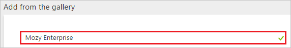
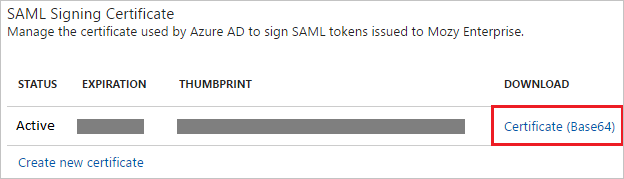

# Tutorial: Azure Active Directory integration with Mozy Enterprise

In this tutorial, you learn how to integrate Mozy Enterprise with Azure Active Directory (Azure AD).

Integrating Mozy Enterprise with Azure AD provides you with the following benefits:

- You can control in Azure AD who has access to Mozy Enterprise
- You can enable your users to automatically get signed-on to Mozy Enterprise (Single Sign-On) with their Azure AD accounts
- You can manage your accounts in one central location - the Azure portal

If you want to know more details about SaaS app integration with Azure AD, see [what is application access and single sign-on with Azure Active Directory](active-directory-appssoaccess-whatis.md).

## Prerequisites

To configure Azure AD integration with Mozy Enterprise, you need the following items:

- An Azure AD subscription
- A Mozy Enterprise single sign-on enabled subscription

> [!NOTE]
> To test the steps in this tutorial, we do not recommend using a production environment.

To test the steps in this tutorial, you should follow these recommendations:

- Do not use your production environment, unless it is necessary.
- If you don't have an Azure AD trial environment, you can get a one-month trial [here](https://azure.microsoft.com/pricing/free-trial/).

## Scenario description
In this tutorial, you test Azure AD single sign-on in a test environment. 
The scenario outlined in this tutorial consists of two main building blocks:

1. Adding Mozy Enterprise from the gallery
2. Configuring and testing Azure AD single sign-on

## Adding Mozy Enterprise from the gallery
To configure the integration of Mozy Enterprise into Azure AD, you need to add Mozy Enterprise from the gallery to your list of managed SaaS apps.

**To add Mozy Enterprise from the gallery, perform the following steps:**

1. In the **[Azure portal](https://portal.azure.com)**, on the left navigation panel, click **Azure Active Directory** icon. 

	![Active Directory][1]

2. Navigate to **Enterprise applications**. Then go to **All applications**.

	![Applications][2]
	
3. To add new application, click **New application** button on the top of dialog.

	![Applications][3]

4. In the search box, type **Mozy Enterprise**.

	

5. In the results panel, select **Mozy Enterprise**, and then click **Add** button to add the application.

	

##  Configuring and testing Azure AD single sign-on
In this section, you configure and test Azure AD single sign-on with Mozy Enterprise based on a test user called "Britta Simon".

For single sign-on to work, Azure AD needs to know what the counterpart user in Mozy Enterprise is to a user in Azure AD. In other words, a link relationship between an Azure AD user and the related user in Mozy Enterprise needs to be established.

In Mozy Enterprise, assign the value of the **user name** in Azure AD as the value of the **Username** to establish the link relationship.

To configure and test Azure AD single sign-on with Mozy Enterprise, you need to complete the following building blocks:

1. **[Configuring Azure AD Single Sign-On](#configuring-azure-ad-single-sign-on)** - to enable your users to use this feature.
2. **[Creating an Azure AD test user](#creating-an-azure-ad-test-user)** - to test Azure AD single sign-on with Britta Simon.
3. **[Creating a Mozy Enterprise test user](#creating-a-mozy-enterprise-test-user)** - to have a counterpart of Britta Simon in Mozy Enterprise that is linked to the Azure AD representation of user.
4. **[Assigning the Azure AD test user](#assigning-the-azure-ad-test-user)** - to enable Britta Simon to use Azure AD single sign-on.
5. **[Testing Single Sign-On](#testing-single-sign-on)** - to verify whether the configuration works.

### Configuring Azure AD single sign-on

In this section, you enable Azure AD single sign-on in the Azure portal and configure single sign-on in your Mozy Enterprise application.

**To configure Azure AD single sign-on with Mozy Enterprise, perform the following steps:**

1. In the Azure portal, on the **Mozy Enterprise** application integration page, click **Single sign-on**.

	![Configure Single Sign-On][4]

2. On the **Single sign-on** dialog, select **Mode** as	**SAML-based Sign-on** to enable single sign-on.
 
	

3. On the **Mozy Enterprise Domain and URLs** section, perform the following steps:

	

    In the **Sign-on URL** textbox, type a URL using the following pattern: `https://<tenantname>.Mozyenterprise.com`

	> [!NOTE] 
	> This value is not real. Update this value with the actual Sign-On URL. Contact [Mozy Enterprise Client support team](http://support.mozy.com/) to get this value.

4. On the **SAML Signing Certificate** section, click **Certificate(Base64)** and then save the certificate file on your computer.

	 

5. Click **Save** button.

	

6. On the **Mozy Enterprise Configuration** section, click **Configure Mozy Enterprise** to open **Configure sign-on** window. Copy the **SAML Entity ID and SAML Single Sign-On Service URL** from the **Quick Reference section.**

	 

7. In a different web browser window, log into your Mozy Enterprise company site as an administrator.

8. In the **Configuration** section, click **Authentication Policy**.
   
   

9. On the **Authentication Policy** section, perform the following steps:
   
   
   
   a. Select **Directory Service** as **Provider**.
   
   b. Select **Use LDAP Push**.
   
   c. Click the **SAML Authentication** tab.
   
   d. Paste **SAML Single Sign-On Service URL**, which you have copied from the Azure portal into the **Authentication URL** textbox.
   
   e. Paste **SAML Entity ID**, which you have copied from the Azure portal into the **SAML Endpoint** textbox.
   
   f. Open your downloaded base-64 encoded certificate in notepad, copy the content of it into your clipboard, and then paste the entire Certificate into **SAML Certificate** textbox.
   
   g. Select **Enable SSO for Admins to log in with their network credentials**.
   
   h. Click **Save Changes**.

> [!TIP]
> You can now read a concise version of these instructions inside the [Azure portal](https://portal.azure.com), while you are setting up the app!  After adding this app from the **Active Directory > Enterprise Applications** section, simply click the **Single Sign-On** tab and access the embedded documentation through the **Configuration** section at the bottom. You can read more about the embedded documentation feature here: [Azure AD embedded documentation]( https://go.microsoft.com/fwlink/?linkid=845985)
> 

### Creating an Azure AD test user
The objective of this section is to create a test user in the Azure portal called Britta Simon.

![Create Azure AD User][100]

**To create a test user in Azure AD, perform the following steps:**

1. In the **Azure portal**, on the left navigation pane, click **Azure Active Directory** icon.

	 

2. To display the list of users, go to **Users and groups** and click **All users**.
	
	 

3. To open the **User** dialog, click **Add** on the top of the dialog.
 
	 

4. On the **User** dialog page, perform the following steps:
 
	 

    a. In the **Name** textbox, type **BrittaSimon**.

    b. In the **User name** textbox, type the **email address** of BrittaSimon.

	c. Select **Show Password** and write down the value of the **Password**.

    d. Click **Create**.
 
### Creating a Mozy Enterprise test user

In order to enable Azure AD users to log into Mozy Enterprise, they must be provisioned into Mozy Enterprise. In the case of Mozy Enterprise, provisioning is a manual task.

>[!NOTE]
>You can use any other Mozy Enterprise user account creation tools or APIs provided by Mozy Enterprise to provision AAD user accounts.

**To provision a user accounts, perform the following steps:**

1. Log in to your **Mozy Enterprise** tenant.

2. Click **Users**, and then click **Add New User**.
   
   
   
   >[!NOTE]
   >The **Add New User** option is only displayed only if **Mozy** is selected as the provider under **Authentication policy**. If SAML Authentication is configured, then the users are added automatically on their first login through Single sign on.
    
3. On the new user dialog, perform the following steps:
   
   
   
   a. From the **Choose a Group** list, select a group.
   
   b. From the **What type of user** list, select a type.
   
   c. In the **Username** textbox, type the name of the Azure AD user.
   
   d. In the **Email** textbox, type the email address of the Azure AD user.
   
   e. Select **Send user instruction email**.
   
   f. Click **Add User(s)**.

     >[!NOTE]
     > After creating the user, an email will be sent to the Azure AD user that includes a link to confirm the account before it becomes active.

### Assigning the Azure AD test user

In this section, you enable Britta Simon to use Azure single sign-on by granting access to Mozy Enterprise.

![Assign User][200] 

**To assign Britta Simon to Mozy Enterprise, perform the following steps:**

1. In the Azure portal, open the applications view, and then navigate to the directory view and go to **Enterprise applications** then click **All applications**.

	![Assign User][201] 

2. In the applications list, select **Mozy Enterprise**.

	 

3. In the menu on the left, click **Users and groups**.

	![Assign User][202] 

4. Click **Add** button. Then select **Users and groups** on **Add Assignment** dialog.

	![Assign User][203]

5. On **Users and groups** dialog, select **Britta Simon** in the Users list.

6. Click **Select** button on **Users and groups** dialog.

7. Click **Assign** button on **Add Assignment** dialog.
	
### Testing single sign-on

In this section, you test your Azure AD single sign-on configuration using the Access Panel.

When you click the Mozy Enterprise tile in the Access Panel, you should get login page of Mozy Enterprise application.
For more information about the Access Panel, see [Introduction to the Access Panel](active-directory-saas-access-panel-introduction.md).

## Additional resources

* [List of Tutorials on How to Integrate SaaS Apps with Azure Active Directory](active-directory-saas-tutorial-list.md)
* [What is application access and single sign-on with Azure Active Directory?](active-directory-appssoaccess-whatis.md)

<!--Image references-->

[1]: ./media/active-directory-saas-mozy-enterprise-tutorial/tutorial_general_01.png
[2]: ./media/active-directory-saas-mozy-enterprise-tutorial/tutorial_general_02.png
[3]: ./media/active-directory-saas-mozy-enterprise-tutorial/tutorial_general_03.png
[4]: ./media/active-directory-saas-mozy-enterprise-tutorial/tutorial_general_04.png

[100]: ./media/active-directory-saas-mozy-enterprise-tutorial/tutorial_general_100.png

[200]: ./media/active-directory-saas-mozy-enterprise-tutorial/tutorial_general_200.png
[201]: ./media/active-directory-saas-mozy-enterprise-tutorial/tutorial_general_201.png
[202]: ./media/active-directory-saas-mozy-enterprise-tutorial/tutorial_general_202.png
[203]: ./media/active-directory-saas-mozy-enterprise-tutorial/tutorial_general_203.png

