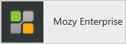
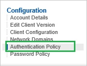
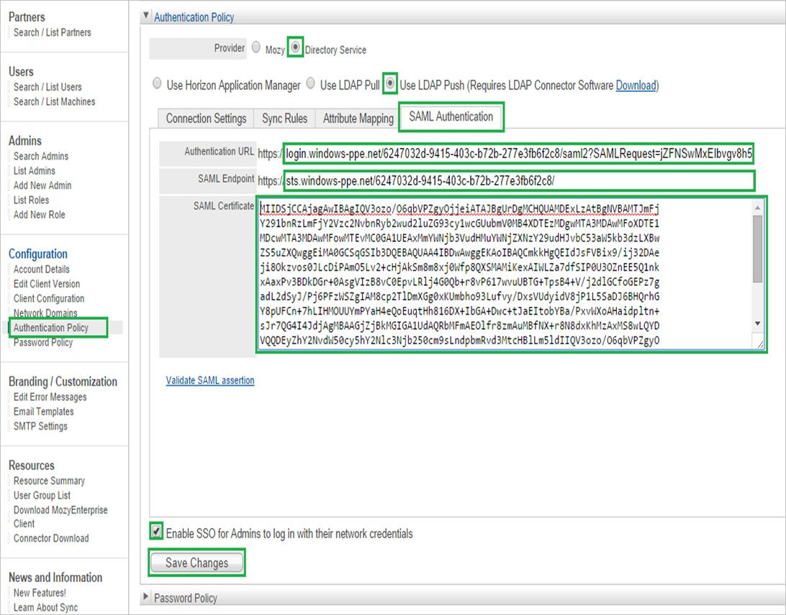
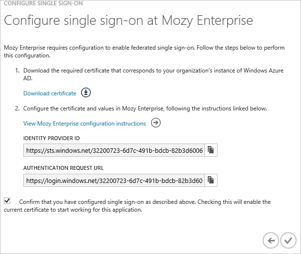
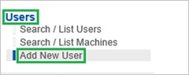
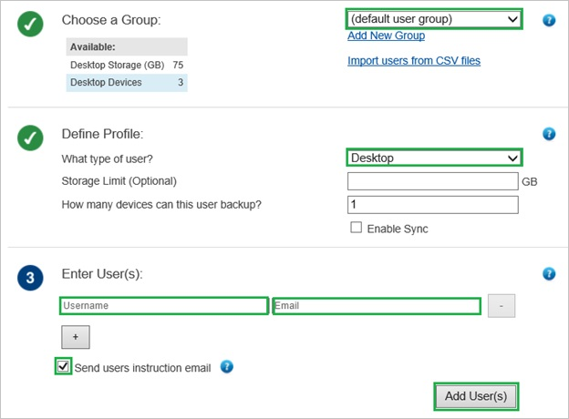
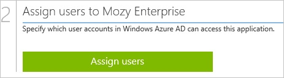

<properties 
    pageTitle="Tutorial: Azure Active Directory integration with Mozy Enterprise | Microsoft Azure" 
    description="Learn how to use Mozy Enterprise with Azure Active Directory to enable single sign-on, automated provisioning, and more!" 
    services="active-directory" 
    authors="jeevansd"  
    documentationCenter="na" 
    manager="femila"/>
<tags 
    ms.service="active-directory" 
    ms.devlang="na" 
    ms.topic="article" 
    ms.tgt_pltfrm="na" 
    ms.workload="identity" 
    ms.date="07/08/2016" 
    ms.author="jeedes" />

#Tutorial: Azure Active Directory integration with Mozy Enterprise
  
The objective of this tutorial is to show the integration of Azure and Mozy Enterprise.  
The scenario outlined in this tutorial assumes that you already have the following items:

-   A valid Azure subscription
-   A Mozy Enterprise tenant
  
After completing this tutorial, the Azure AD users you have assigned to Mozy Enterprise will be able to single sign into the application at your Mozy Enterprise company site (service provider initiated sign on), or using the [Introduction to the Access Panel](active-directory-saas-access-panel-introduction.md).
  
The scenario outlined in this tutorial consists of the following building blocks:

1.  Enabling the application integration for Mozy Enterprise
2.  Configuring single sign-on
3.  Configuring user provisioning
4.  Assigning users

##Enabling the application integration for Mozy Enterprise
  
The objective of this section is to outline how to enable the application integration for Mozy Enterprise.

###To enable the application integration for Mozy Enterprise, perform the following steps:

1.  In the Azure classic portal, on the left navigation pane, click **Active Directory**.

    

2.  From the **Directory** list, select the directory for which you want to enable directory integration.

3.  To open the applications view, in the directory view, click **Applications** in the top menu.

    

4.  Click **Add** at the bottom of the page.

    

5.  On the **What do you want to do** dialog, click **Add an application from the gallery**.

    

6.  In the **search box**, type **mozy enterprise**.

    

7.  In the results pane, select **Mozy Enterprise**, and then click **Complete** to add the application.

    
##Configuring single sign-on
  
The objective of this section is to outline how to enable users to authenticate to Mozy Enterprise with their account in Azure AD using federation based on the SAML protocol.  
As part of this procedure, you are required to upload a base-64 encoded certificate to your Mozy Enterprise tenant.  
If you are not familiar with this procedure, see [How to convert a binary certificate into a text file](http://youtu.be/PlgrzUZ-Y1o)

###To configure single sign-on, perform the following steps:

1.  In the Azure classic portal, on the **Mozy Enterprise** application integration page, click **Configure single sign-on** to open the **Configure Single Sign On ** dialog.

    

2.  On the **How would you like users to sign on to Mozy Enterprise** page, select **Microsoft Azure AD Single Sign-On**, and then click **Next**.

    

3.  On the **Configure App URL** page, in the **Mozy Enterprise Sign In URL** textbox, type your URL using the following pattern "*https://\<tenant-name\>.Mozyenterprise.com*", and then click **Next**.

    

4.  On the **Configure single sign-on at Mozy Enterprise** page, to download your certificate, click **Download certificate**, and then save the certificate file on your computer.

    

5.  In a different web browser window, log into your Mozy Enterprise company site as an administrator.

6.  In the **Configuration** section, click **Authentication Policy**.

    

7.  On the **Authentication Policy** section, perform the following steps:

    

    1.  Select **Directory Service** as **Provider**.
    2.  Select **Use LDAP Push**.
    3.  Click the **SAML Authentication** tab.
    4.  In the Azure classic portal, on the **Configure single sign-on at Mozy Enterprise** dialog page, copy the **Authentication Request URL** value, and then paste it into the **Authentication URL** textbox.
    5.  In the Azure classic portal, on the **Configure single sign-on at Mozy Enterprise** dialog page, copy the **Identity Provider ID** value, and then paste it into the **SAML Endpoint** textbox.
    6.  Create a **Base-64 encoded** file from your downloaded certificate.  

        >[AZURE.TIP]For more details, see [How to convert a binary certificate into a text file](http://youtu.be/PlgrzUZ-Y1o)

    7.  Open your base-64 encoded certificate in notepad, copy the content of it into your clipboard, and then paste the entire Certificate into **SAML Certificate** textbox.
    8.  Select **Enable SSO for Admins to log in with their network credentials**.
    9.  Click **Save Changes**.

8.  In the Azure classic portal, on the **Configure single sign-on at Mozy Enterprise** dialog page, select the single sign-on configuration confirmation, and then click **Complete**.

    
##Configuring user provisioning
  
In order to enable Azure AD users to log into Mozy Enterprise, they must be provisioned into Mozy Enterprise.  
In the case of Mozy Enterprise, provisioning is a manual task.

###To provision a user accounts, perform the following steps:

1.  Log in to your **Mozy Enterprise** tenant.

2.  Click **Users**, and then click **Add New User**.

    

    >[AZURE.NOTE]The **Add New User** option is only displayed only if **Mozy** is selected as the provider under **Authentication policy**. If SAML Authentication is configured then the users are added automatically on their first login through Single sign on.

3.  On the new user dialog, perform the following steps:

    

    1.  From the **Choose a Group** list, select a group.
    2.  From the **What type of user** list, select a type.
    3.  In the **Username** textbox, type the name of the Azure AD user.
    4.  In the **Email** textbox, type the email address of the Azure AD user.
    5.  Select **Send user instruction email**.
    6.  Click **Add User(s)**.

    >[AZURE.NOTE]After creating the user, an email will be sent to the Azure AD user that includes a link to confirm the account before it becomes active.

>[AZURE.NOTE]You can use any other Mozy Enterprise user account creation tools or APIs provided by Mozy Enterprise to provision AAD user accounts.

##Assigning users
 
To test your configuration, you need to grant the Azure AD users you want to allow using your application access to it by assigning them.

###To assign users to Mozy Enterprise, perform the following steps:

1.  In the Azure classic portal, create a test account.

2.  On the **Mozy Enterprise **application integration page, click **Assign users**.

    

3.  Select your test user, click **Assign**, and then click **Yes** to confirm your assignment.

    
  
If you want to test your single sign-on settings, open the Access Panel. For more details about the Access Panel, see [Introduction to the Access Panel](active-directory-saas-access-panel-introduction.md).