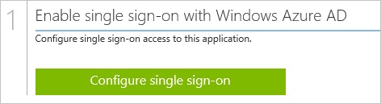
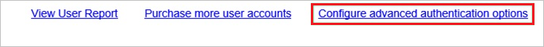
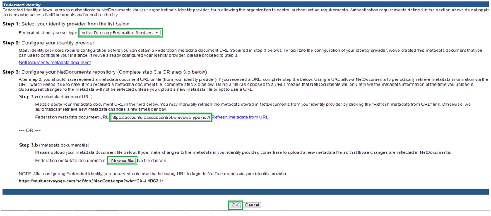
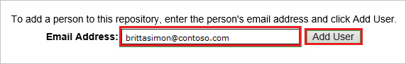

<properties 
    pageTitle="Tutorial: Azure Active Directory integration with NetDocuments | Microsoft Azure" 
    description="Learn how to use NetDocuments with Azure Active Directory to enable single sign-on, automated provisioning, and more!" 
    services="active-directory" 
    authors="jeevansd"  
    documentationCenter="na" 
    manager="femila"/>
<tags 
    ms.service="active-directory" 
    ms.devlang="na" 
    ms.topic="article" 
    ms.tgt_pltfrm="na" 
    ms.workload="identity" 
    ms.date="07/08/2016" 
    ms.author="jeedes" />

#Tutorial: Azure Active Directory integration with NetDocuments
  
The objective of this tutorial is to show the integration of Azure and NetDocuments.  
The scenario outlined in this tutorial assumes that you already have the following items:

-   A valid Azure subscription
-   A NetDocuments tenant
  
After completing this tutorial, the Azure AD users you have assigned to NetDocuments will be able to single sign into the application at your NetDocuments company site (service provider initiated sign on), or using the [Introduction to the Access Panel](active-directory-saas-access-panel-introduction.md).
  
The scenario outlined in this tutorial consists of the following building blocks:

1.  Enabling the application integration for NetDocuments
2.  Configuring single sign-on
3.  Configuring user provisioning
4.  Assigning users

##Enabling the application integration for NetDocuments
  
The objective of this section is to outline how to enable the application integration for NetDocuments.

###To enable the application integration for NetDocuments, perform the following steps:

1.  In the Azure classic portal, on the left navigation pane, click **Active Directory**.

    

2.  From the **Directory** list, select the directory for which you want to enable directory integration.

3.  To open the applications view, in the directory view, click **Applications** in the top menu.

    

4.  Click **Add** at the bottom of the page.

    

5.  On the **What do you want to do** dialog, click **Add an application from the gallery**.

    

6.  In the **search box**, type **NetDocuments**.

    

7.  In the results pane, select **NetDocuments**, and then click **Complete** to add the application.

    
##Configuring single sign-on
  
The objective of this section is to outline how to enable users to authenticate to NetDocuments with their account in Azure AD using federation based on the SAML protocol.  
Configuring single sign-on for NetDocuments requires you to retrieve a thumbprint value from a certificate.  
If you are not familiar with this procedure, see [How to retrieve a certificate's thumbprint value](http://youtu.be/YKQF266SAxI).

###To configure single sign-on, perform the following steps:

1.  In the Azure classic portal, on the **NetDocuments** application integration page, click **Configure single sign-on** to open the **Configure Single Sign On ** dialog.

    

2.  On the **How would you like users to sign on to NetDocuments** page, select **Microsoft Azure AD Single Sign-On**, and then click **Next**.

    

3.  On the **Configure App URL** page, perform the following steps:

    

    1.  In the **Sign On URL** textbox, type your URL used by your users to sign on to your NetDocuments application (e.g.: "*https://vault.netvoyage.com/neWeb2/docCent.aspx?whr=CA-JI1BG3H1*").
    2.  In the **NetDocuments Reply URL** textbox, type the same value you have typed into the the **Sign On URL** textbox.  

        >[AZURE.NOTE]You can find the correct value at the end of the **Federated Identity** dialog (See the screenshot for step 9).

    3.  Click **Next**

4.  On the **Configure single sign-on at NetDocuments** page, to download your certificate, click **Download certificate**, and then save the certificate file locally on your computer.

    

5.  In a different web browser window, log into your NetDocuments company site as an administrator.

6.  Go to **Admin**.

7.  Click **Add and remove users and groups**.

    

8.  Click **Configure advanced authentication options**.

    

9.  On **the Federated Identity** dialog, perform the following steps:

    

    1.  As **Federated identity server type**, select **Active Directory Federation Services**.
    2.  Click **Choose file**, to upload the downloaded metadata file.
    3.  Click **OK**.

10. On the Azure classic portal, select the single sign-on configuration confirmation, and then click **Complete** to close the **Configure Single Sign On** dialog.

    
##Configuring user provisioning
  
In order to enable Azure AD users to log into NetDocuments, they must be provisioned into NetDocuments.  
In the case of NetDocuments, provisioning is a manual task.

###To configure user provisioning, perform the following steps:

1.  Sing on to your **NetDocuments** company site as administrator.

2.  In the menu on the top, click **Admin**.

    

3.  Click **Add and remove users and groups**.

    

4.  In the **Email Address** textbox, type the email address of a valid Azure Active Directory account you want to provision, and then click **Add User**.

    

    >[AZURE.NOTE]The Azure Active Directory account holder will get an email that includes a link to confirm the account before it becomes active.

>[AZURE.NOTE]You can use any other NetDocuments user account creation tools or APIs provided by NetDocuments to provision AAD user accounts.

##Assigning users
  
To test your configuration, you need to grant the Azure AD users you want to allow using your application access to it by assigning them.

###To assign users to NetDocuments, perform the following steps:

1.  In the Azure classic portal, create a test account.

2.  On the **NetDocuments **application integration page, click **Assign users**.

    

3.  Select your test user, click **Assign**, and then click **Yes** to confirm your assignment.

    
  
If you want to test your single sign-on settings, open the Access Panel. For more details about the Access Panel, see [Introduction to the Access Panel](active-directory-saas-access-panel-introduction.md).