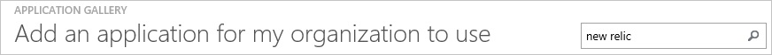
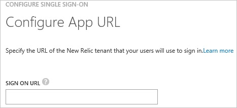
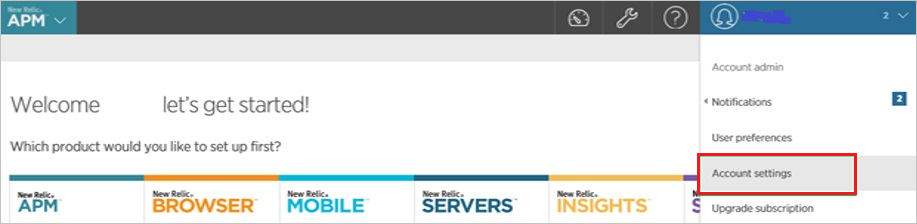
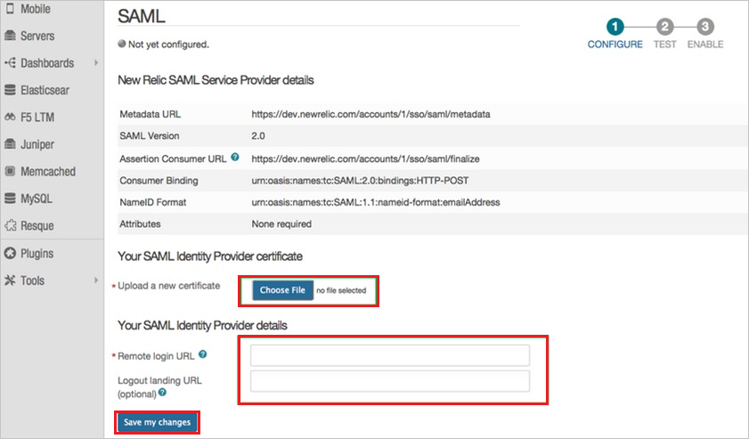
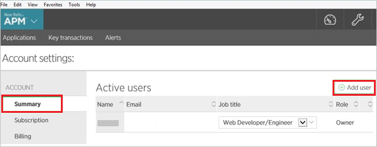
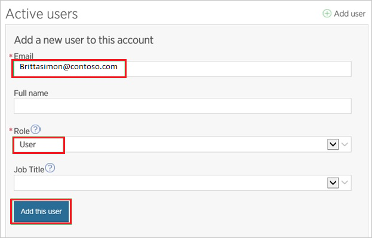
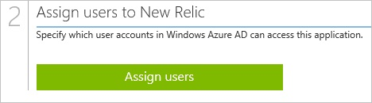

<properties 
    pageTitle="Tutorial: Azure Active Directory integration with New Relic | Microsoft Azure" 
    description="Learn how to use New Relic with Azure Active Directory to enable single sign-on, automated provisioning, and more!" 
    services="active-directory" 
    authors="jeevansd"  
    documentationCenter="na" 
    manager="femila"/>
<tags 
    ms.service="active-directory" 
    ms.devlang="na" 
    ms.topic="article" 
    ms.tgt_pltfrm="na" 
    ms.workload="identity" 
    ms.date="07/08/2016" 
    ms.author="jeedes" />

#Tutorial: Azure Active Directory integration with New Relic
  
The objective of this tutorial is to show how to set up single sign-on between Azure Active Directory and New Relic.
  
The scenario outlined in this tutorial assumes that you already have the following items:

-   A valid Azure subscription
-   A New Relic single sign-on enabled subscription
  
After completing this tutorial, the Azure Active Directory users you have assigned to New Relic will be able to single sign-on using the AAD Access Panel.

1.  Enabling the application integration for New Relic
2.  Configuring Single Sign-On
3.  Configuring user provisioning
4.  Assigning users

##Enabling the application integration for New Relic
  
The objective of this section is to outline how to enable the application integration for New Relic.

###To enable the application integration for New Relic, perform the following steps:

1.  In the Azure classic portal, on the left navigation pane, click **Active Directory**.

    

2.  From the **Directory** list, select the directory for which you want to enable directory integration.

3.  To open the applications view, in the directory view, click **Applications** in the top menu.

    

4.  Click **Add** at the bottom of the page.

    

5.  On the **What do you want to do** dialog, click **Add an application from the gallery**.

    

6.  In the **search box**, type **New Relic**.

    

7.  In the results pane, select **New Relic**, and then click **Complete** to add the application.

    
##Configuring Single Sign-On
  
This section outlines how to enable users to authenticate to New Relic with their account in Azure Active Directory, using federation based on the SAML protocol.

###To configure single sign-on, perform the following steps:

1.  In the Azure classic portal, on the **New Relic** application integration page, click **Configure single sign-on** to open the **Configure Single Sign On ** dialog.

    

2.  On the **How would you like users to sign on to New Relic** page, select **Microsoft Azure AD Single Sign-On**, and then click **Next**.

    

3.  On the **Configure App URL** page, in the **New Relic Sign On URL** textbox, type the URL used by your users to sign on to your New Relic application, and then click **Next**. 

    The app URL is your New Relic tenant URL (e.g.: *https://rpm.newrelic.com*):

    

4.  On the **Configure single sign-on at New Relic** page, to download your certificate, click **Download certificate**, and then save the certificate file locally to your computer.

    

5.  In a different web browser window, sign on to your **New Relic** company site as administrator.

6.  In the menu on the top, click **Account Settings**.

    

7.  Click the **Security and authentication** tab, and then click the **Single sign on** tab.

    

8.  On the SAML dialog page, perform the following steps:

    

    1.  Click **Choose File** to upload your downloaded Azure Active Directory certificate.
    2.  In the Azure classic portal, on the **Configure single sign-on at New Relic** page, copy the **Remote Login URL** value, and then paste it into the **Remote login URL** textbox.
    3.  In the Azure classic portal, on the **Configure single sign-on at New Relic** page, copy the **Remote Logout URL** value, and then paste it into the **Logout landing URL** textbox.
    4.  Click **Save my changes**.

9.  On the Azure classic portal, select the single sign-on configuration confirmation, and then click **Complete** to close the **Configure Single Sign On** dialog.

    
##Configuring user provisioning
  
In order to enable Azure Active Directory users to log into New Relic, they must be provisioned into New Relic.  
In the case of New Relic, provisioning is a manual task.

###To provision a user account to New Relic, perform the following steps:

1.  Log in to your **New Relic** company site as administrator.

2.  In the menu on the top, click **Account Settings**.

    

3.  In the **Account** pane on the left side, click **Summary**, and then click **Add user**.

    

4.  On the **Active users** dialog, perform the following steps:

    

    1.  In the **Email** textbox, type the email address of a valid Azure Active Directory user you want to provision.
    2.  As **Role** select **User**.
    3.  Click **Add this user**.

>[AZURE.NOTE]You can use any other New Relic user account creation tools or APIs provided by New Relic to provision AAD user accounts.

##Assigning users
  
To test your configuration, you need to grant the Azure AD users you want to allow using your application access to it by assigning them.

###To assign users to New Relic, perform the following steps:

1.  In the Azure classic portal, create a test account.

2.  On the **New Relic** application integration page, click **Assign users**.

    

3.  Select your test user, click **Assign**, and then click **Yes** to confirm your assignment.

    
  
If you want to test your single sign-on settings, open the Access Panel. For more details about the Access Panel, see [Introduction to the Access Panel](active-directory-saas-access-panel-introduction.md).

